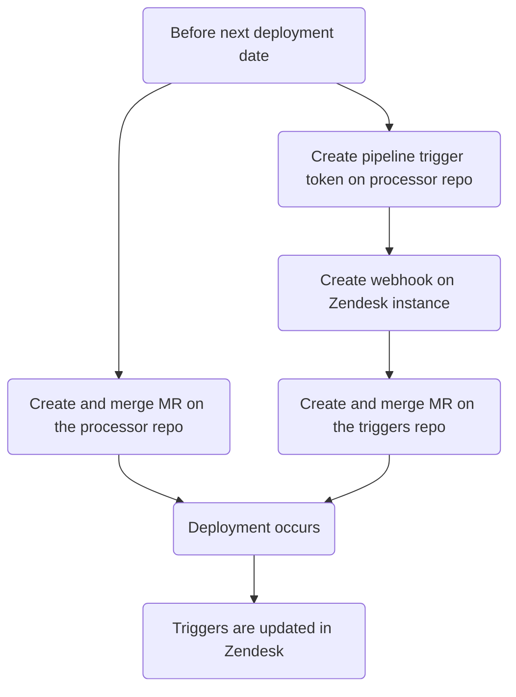
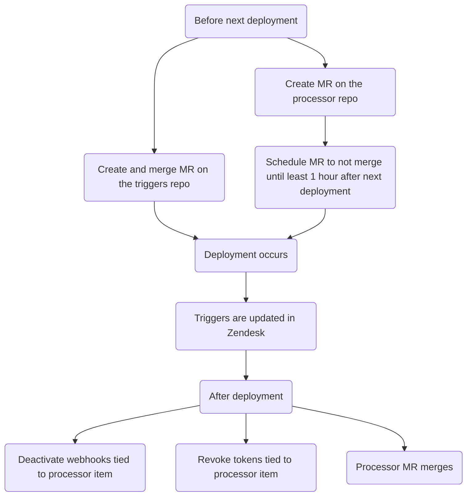

このガイドでは、特定のトリガーに基づいてチケットにカスタムアクションを実行する自動化システムである Zendesk のチケットプロセッサについて説明します。利用可能なプロセッサ種別と、プロセッサ項目の作成・変更・削除の方法をドキュメント化しています。

{}

- デプロイ種別: `Ad-hoc`
- 同期リポジトリ
  - [Zendesk Global](https://gitlab.com/gitlab-support-readiness/zendesk-global/tickets/processor)
  - [Zendesk US Government](https://gitlab.com/gitlab-support-readiness/zendesk-us-government/tickets/processor)

{}

## チケットプロセッサを理解する

### チケットプロセッサとは

チケットプロセッサは、gitlab.com に保存しているスクリプト群で、CI/CD パイプラインのトリガーを介して起動されます。これらはチケットに対してさまざまなカスタムアクションを実行できます。

### Zendesk Global のプロセッサ項目

#### 2FA Removal

[gitlab-com/support/support-team-meta#6663](https://gitlab.com/gitlab-com/support/support-team-meta/-/issues/6663) で導入

これは依頼自体をチェックして対象資格のステータスを判定します。判定結果に応じてチケットにタグを追加します（これにより対応する Zendesk トリガーが発火します）。

- 依頼が依頼者自身の 2FA を解除するものである場合:
  - ユーザーがその依頼に対する support entitlement を持っている場合、タグ `2fa_challenge_questions` が追加される（処理は終了する）
  - ユーザーがその依頼に対する support entitlement を持っていない場合、タグ `2fa_user_not_entitled` が追加される（処理は終了する）
- 依頼が別のユーザーの 2FA を解除するものである場合:
  - 次の条件をチェックする
    - 依頼者はその依頼に対する support entitlement を持っているか？
    - 依頼者のメールアドレスのドメインは、対象者のメールアドレスのドメインと完全に一致するか？
    - 依頼者は gitlab.com アカウントを持っているか？
    - 対象者は gitlab.com アカウントを持っているか？
    - 依頼者は最上位の有料 namespace の `Owner` か？
    - 対象者はその最上位の有料 namespace 配下のメンバーか？
  - すべてのチェックを通過した場合、タグ `2fa_snippet_verification` が追加される（処理は終了する）
  - いずれかのチェックに失敗した場合、タグ `2fa_owner_not_entitled` が追加される（処理は終了する）

#### Account blocked

[gitlab-com/support/support-ops/zendesk-global/trigger!264](https://gitlab.com/gitlab-com/support/support-ops/zendesk-global/triggers/-/merge_requests/264) で導入

これは gitlab.com ユーザーのアカウントステータスをチェックします。ステータスに応じて、さまざまなアクションが発生します。

- ユーザーが存在しない場合:
  - アカウントが存在しない旨を伝える公開返信がユーザーに送信される
  - `Ticket Stage` の値が `FRT` に設定される
  - チケットのステータスが `Pending` に設定される
- ユーザーが ban もブロックもされていない場合:
  - アカウントは実際にはブロックされていない旨を伝える公開返信がユーザーに送信される
  - `Ticket Stage` の値が `FRT` に設定される
  - チケットのステータスが `Pending` に設定される
- ユーザーが制裁措置によって ban またはブロックされている場合:
  - 制裁措置によりブロックされた旨を伝える公開返信がユーザーに送信される。あわせて、それを解決するための次のステップも伝える。
  - `Ticket Stage` の値が `FRT` に設定される
  - チケットのステータスが `Solved` に設定される
- ユーザーが Professional Services の移行によって ban またはブロックされている場合:
  - 依頼者の GitLab.com アカウントが、最上位の有料 namespace の `Owner` レベルのメンバーシップを持っているかチェックされる。
  - 次のアクションは、前のアクションの結果に応じて変わる:
    - 依頼者が GitLab.com アカウントを持っていない、または最上位の有料 namespace の owner ではない場合:
      - 対応できない旨を伝える公開返信がユーザーに送信される
      - `Ticket Stage` の値が `FRT` に設定される
      - チケットのステータスが `Solved` に設定される
    - 依頼者が最上位の有料 namespace の owner である場合:
      - 影響を受けたユーザーのブロックが解除される
      - 影響を受けたユーザーのブロックが解除された旨を伝える公開返信がユーザーに送信される
      - `Ticket Stage` の値が `FRT` に設定される
      - チケットのステータスが `Solved` に設定される
- ユーザーが T&S によって ban またはブロックされている場合（下記の注記を参照）:
  - [T&S account reinstatement project](https://gitlab.com/gitlab-com/gl-security/security-operations/trust-and-safety/TS_Operations/account-reinstatements) 内に Issue が作成される
  - SE に次に従うべきステップを示す内部返信がチケットに行われる
- その他の ban またはブロックの場合:
  - SE に次に従うべきステップを示す内部返信がチケットに行われる

{}

T&S による ban またはブロックは、ユーザーのカスタム属性をチェックすることで定義されます。次のいずれかの条件を満たす場合、T&S によるものと分類されます。

- カスタム属性に `key` が `omamori_mitigation_plan` のオブジェクトが含まれている
- カスタム属性に `key` が `omamori_mitigation_plan_executed_by` のオブジェクトが含まれている
- カスタム属性に `key` が `auto_banned_by` かつ `value` が `banned_phone_number` のオブジェクトが含まれている

{}

#### ASE update

[gitlab-com/gl-security/corp/cust-support-ops/issue-tracker#623](https://gitlab.com/gitlab-com/gl-security/corp/cust-support-ops/issue-tracker/-/issues/623) で導入

これは、組織への Assigned Support Engineer (ASE) の追加または削除を処理します（`bin/ase_update` スクリプトを使用）。

スクリプトは次のように動作します。

- 組織が存在する場合:
  - ASE の追加/変更でユーザー ID が有効な場合:
    - 組織の `assigned_se` 属性をそのユーザーの ID を使うように変更する
    - タスクが完了した旨をチケットにコメントする（そしてチケットをクローズする）
  - ASE の削除の場合:
    - 組織の `assigned_se` 属性を空の値に変更する
    - タスクが完了した旨をチケットにコメントする（そしてチケットをクローズする）
  - ASE の追加で、指定されたユーザー ID が無効な場合、その旨を依頼者に伝えるコメントをチケットに行う（そしてチケットをクローズする）
- 組織が存在しない場合、その旨を依頼者に伝えるコメントをチケットに行う（そしてチケットをクローズする）

#### Collaboration IDs

[gitlab-com/gl-security/corp/cust-support-ops/issue-tracker#623](https://gitlab.com/gitlab-com/gl-security/corp/cust-support-ops/issue-tracker/-/issues/623) で導入

これは、組織へのコラボレーションプロジェクト ID の追加または削除を処理します（`bin/collab_ids` スクリプトを使用）。

スクリプトは次のように動作します。

- 組織が存在する場合:
  - コラボレーションプロジェクトの追加/変更の場合:
    - 組織の `am_project_id` 属性をそのプロジェクトの ID を使うように変更する
    - タスクが完了した旨をチケットにコメントする（そしてチケットをクローズする）
  - コラボレーションプロジェクトの削除の場合:
    - 組織の `am_project_id` 属性を空の値に変更する
    - タスクが完了した旨をチケットにコメントする（そしてチケットをクローズする）
- 組織が存在しない場合、その旨を依頼者に伝えるコメントをチケットに行う（そしてチケットをクローズする）

#### Create macro

[gitlab-com/gl-security/corp/cust-support-ops/issue-tracker#705](https://gitlab.com/gitlab-com/gl-security/corp/cust-support-ops/issue-tracker/-/issues/705) で導入

これは、Zendesk インスタンスへの[シンプルマクロ](../macros/#simple-vs-advanced-macros)の追加を処理します（`bin/create_macro` スクリプトを使用）。

スクリプトは次のように動作します。

- マクロがコメントを行うものである場合、既存の managed content ファイルが存在するかをチェックする（存在しない場合は managed content ファイルを作成する）
- macros リポジトリに YAML ファイルを作成する（これにより Zendesk の同期がトリガーされ、マクロが作成される）
- タスクが完了したことを確認するコメントをチケットに行う（そしてチケットをクローズする）。

#### Create on behalf of

[gitlab-com/gl-security/corp/cust-support-ops/issue-tracker#706](https://gitlab.com/gitlab-com/gl-security/corp/cust-support-ops/issue-tracker/-/issues/706) で導入

これは、顧客や見込み客などの代理でチケットを作成する依頼を処理します（`bin/create_on_behalf` スクリプトを使用）。

スクリプトは次のように動作します。

- 依頼の情報を読み取り、ユーザーの代理で新しいチケットを作成する（`Support Internal Request` フォームを使用）
- 元の内部依頼チケットを、新しく作成されたエンドユーザーチケットにマージする（内部コメントとして）。これにより、内部依頼チケットの添付ファイルが、新しく作成されたエンドユーザーチケットに確実に添付される

#### Email Suppressions

[gitlab-com/support/support-ops/zendesk-global/trigger!264](https://gitlab.com/gitlab-com/support/support-ops/zendesk-global/triggers/-/merge_requests/264) で導入

これは、Mailgun 内にメールのサプレッションが存在するかをチェックします。チェックの結果に応じて、さまざまなアクションが発生します。

- サプレッションが存在する場合...
  - Mailgun 内で見つかったサプレッションが削除される
  - サプレッションが見つかり削除された旨を伝える内部返信がチケットに行われる。これには、当該サプレッションのコード、エラー、タイムスタンプが含まれる
  - サプレッションが見つかり削除されたこと、およびユーザーが取るべき次のステップを伝える公開返信がユーザーに送信される。
  - チケットのステータスが `Solved` に設定される
- サプレッションが存在しない場合...
  - サプレッションが見つからなかったこと、および取り得る次のステップを伝える公開返信がユーザーに送信される。あわせて、それを解決するための次のステップも伝える。
  - `Ticket Stage` の値が `FRT` に設定される
  - チケットのステータスが `Pending` に設定される

#### Link Tagger

Zendesk Global へは [gitlab-com/support/support-ops/support-ops-project#998](https://gitlab.com/gitlab-com/support/support-ops/support-ops-project/-/issues/998) で、Zendesk US Government へは [gitlab-com/gl-security/corp/cust-support-ops/issue-tracker#841](https://gitlab.com/gitlab-com/gl-security/corp/cust-support-ops/issue-tracker/-/work_items/841) で導入

これは、渡されたコメント（公開かつエージェントが作成したもの）をチェックし、チケットにタグ付けしたいさまざまな種類の項目を探します。現在の項目の種類（およびそれらに基づいて追加されるタグ）は次のとおりです。

- gitlab.com の Issue リンクを含む
  - `gitlab_issue_link` タグが追加される
  - `CUSTOMPATH_issues_IID` タグが追加される（Global のみ）
    - `CUSTOMPATH` はプロジェクトの slug、`IID` は Issue の ID
    - 例: プロジェクト jcolyer/most_amazing_project_ever の Issue 5 へのリンクは次のようになる: `jcolyer_most_amazing_project_ever_issues_5`
  - `issue~CUSTOMPATH_IID`
    - `CUSTOMPATH` はプロジェクトの slug、`IID` は Issue の ID
    - 例: プロジェクト jcolyer/most_amazing_project_ever の Issue 5 へのリンクは次のようになる: `issue~jcolyer_most_amazing_project_ever_issues_5`
  - `issue_PROJECTID_IID`（Global のみ）
    - `PROJECTID` はプロジェクトの ID、`IID` は Issue の ID
    - 例: プロジェクト jcolyer/most_amazing_project_ever（プロジェクト ID 123）の Issue 5 へのリンクは次のようになる: `issue_123_5`
- gitlab.com のマージリクエストリンクを含む
  - `gitlab_merge_request_link` タグが追加される
  - `CUSTOM_PATH_merge_requests_IID` タグが追加される（Global のみ）
    - `CUSTOMPATH` はプロジェクトの slug、`IID` はマージリクエストの ID
    - 例: プロジェクト jcolyer/most_amazing_project_ever のマージリクエスト 27 へのリンクは次のようになる: `jcolyer_most_amazing_project_ever_merge_requests_27`
  - `mergerequest~CUSTOMPATH_IID`
    - `CUSTOMPATH` はプロジェクトの slug、`IID` は Issue の ID
    - 例: プロジェクト jcolyer/most_amazing_project_ever のマージリクエスト 27 へのリンクは次のようになる: `mergerequest~jcolyer_most_amazing_project_ever_27`
  - `mergerequest_PROJECTID_IID`（Global のみ）
    - `PROJECTID` はプロジェクトの ID、`IID` はマージリクエストの ID
    - 例: プロジェクト jcolyer/most_amazing_project_ever（プロジェクト ID 123）のマージリクエスト 27 へのリンクは次のようになる: `mergerequest_123_27`
- gitlab.com のエピックリンクを含む
  - `gitlab_epic_link` タグが追加される
  - `CUSTOMPATH_epic_IID` タグが追加される（Global のみ）
    - `CUSTOMPATH` はプロジェクトの slug、`IID` はエピックの ID
    - 例: プロジェクト jcolyer/most_amazing_project_ever のエピック 10 へのリンクは次のようになる: `jcolyer_most_amazing_project_ever_epic_10`
  - `epic~CUSTOMPATH_IID`
    - `CUSTOMPATH` はプロジェクトの slug、`IID` はエピックの ID
    - 例: プロジェクト jcolyer/most_amazing_project_ever のエピック 10 へのリンクは次のようになる: `epic~jcolyer_most_amazing_project_ever_10`
  - `epic_PROJECTID_IID`（Global のみ）
    - `PROJECTID` はプロジェクトの ID、`IID` はエピックの ID
    - 例: プロジェクト jcolyer/most_amazing_project_ever（プロジェクト ID 123）のエピック 10 へのリンクは次のようになる: `epic_123_10`
- docs.gitlab.com のリンクを含む
  - `docs_link` タグが追加される
- handbook.gitlab.com のリンクを含む
  - `hb_link` タグが追加される
- KB 記事のリンクを含む
  - `kb_link` タグが追加される
- エージェントが通話を提案したことを示すテキストを含む
  - `agent_offered_call` タグが追加される
  - 使用される検索語句:
    - `calendly.com`
    - `gitlab.zoom.us`
    - `gitlabmtgs.webex.com`
    - `teams.microsoft.com`

#### Namespace availability

[gitlab-com/gl-security/corp/cust-support-ops/issue-tracker#578](https://gitlab.com/gitlab-com/gl-security/corp/cust-support-ops/issue-tracker/-/issues/578) で導入

これは、namespace が利用可能かをチェックする処理を行います（`bin/namespace_availability` スクリプトを介して）。本質的には、[Namesquatting](#namesquatting) プロセスをより簡略化した（かつ顧客に見えない）バージョンです。

スクリプトは次のように動作します。

- namespace が存在するかをチェックする
  - 存在しない場合、その旨をチケットにコメントし（そしてチケットをクローズし）、処理を停止する
- namespace が有料プランを使用しているかをチェックする
  - 使用している場合、namespace は利用できない旨をチケットにコメントし（そしてチケットをクローズし）、処理を停止する
- namespace の種別をチェックする
  - `user` namespace の場合:
    - ユーザーが confirmed であり、作成から 90 日未満であるかをチェックする
      - そうである場合、利用_できる可能性がある_旨をチケットにコメントし（そしてチケットをクローズし）、処理を停止する
    - 最終サインインが過去 2 年以内であるかをチェックする
      - そうである場合、namespace は利用できない旨をチケットにコメントし（そしてチケットをクローズし）、処理を停止する
    - その他すべての場合、利用_できる可能性がある_旨をチケットにコメントし（そしてチケットをクローズし）、処理を停止する
  - `group` namespace の場合:
    - グループ配下に過去 2 年以内に更新されたプロジェクトがあるかをチェックする
      - ある場合、利用_できる可能性がある_旨をチケットにコメントし（そしてチケットをクローズし）、処理を停止する
    - その他すべての場合、利用_できる可能性がある_旨をチケットにコメントし（そしてチケットをクローズし）、処理を停止する

#### Namesquatting

[gitlab-com/support/support-ops/zendesk-global/trigger!264](https://gitlab.com/gitlab-com/support/support-ops/zendesk-global/triggers/-/merge_requests/264) で導入

これは、指定された namespace が私たちのさまざまな基準に基づいてリリース対象として適格かをチェックします。チェックの結果によって、どのアクションが発生するかが決まります。

- 依頼者が free ユーザーの場合...
  - これらの依頼は有料顧客のみが対象である旨を伝える公開返信がユーザーに送信される。
  - `Ticket Stage` の値が `FRT` に設定される
- namespace が無効な場合...
  - 当該の namespace が見つからなかった旨を伝える公開返信がユーザーに送信される。
  - `Ticket Stage` の値が `FRT` に設定される
- namespace が適格でない場合...
  - 現時点では namespace はリリース対象として適格でない旨を伝える公開返信がユーザーに送信される。
  - `Ticket Stage` の値が `FRT` に設定される
- namespace が適格である_可能性がある_場合...
  - namespace は現在の owner に連絡した後にのみリリースできる旨を伝える内部返信がチケットに行われる。見つかった owner のメールアドレスが列挙される。
  - `Ticket Stage` の値が `FRT` に設定される
- namespace が**適格である**場合...
  - namespace が即時リリース対象として適格である旨を伝える内部返信がチケットに行われる。
  - `Ticket Stage` の値が `FRT` に設定される

#### Organization Notes

[gitlab-com/support/support-ops/zendesk-global/trigger!264](https://gitlab.com/gitlab-com/support/support-ops/zendesk-global/triggers/-/merge_requests/264) で導入

これは、チケットの依頼者が所属する組織から導き出した情報に基づいて、チケットに内部ノートを追加します。これは最大 3 種類の内部ノートを作成する可能性があります。

- 組織ノートから導き出されたもの。次を含み得る...
  - 組織がエスカレートされた状態にあることに関するメッセージ
  - パートナーのトラブルシューティング情報
  - 一般的な組織情報
  - その組織で最近提出された緊急チケット
  - 組織がコラボレーションプロジェクトを持っているか
  - 組織が contact management プロジェクトを使用しているか
  - Support Operations ノート（Zendesk 上の組織自体の Notes/Details フィールドから導出）
  - Support ノート（[Zendesk Global Organizations project](https://gitlab.com/gitlab-com/support/zendesk-global/organizations) から導出）
- 組織の support entitlement 情報を詳述するもの
  - 組織が期限切れ、または priority prospect である場合のみ
- 組織が GitLab Dedicated であることに関するもの

Support ノートのファイルが存在しない場合、この処理ではその組織用のファイルも作成します。

#### STAR

[gitlab-com/support/support-ops/support-ops-project#957](https://gitlab.com/gitlab-com/support/support-ops/support-ops-project/-/issues/957) で導入

これは、チケットタグ `star_submitted` をチケットに追加します。

### Zendesk US Government のプロセッサ項目

次の項目は Zendesk Global と同一に動作します。

- [ASE update](#ase-update)
- [Collaboration IDs](#collaboration-ids)
- [Create macro](#create-macro)
- [Link tagger](#link-tagger)

#### Organization Notes

[gitlab-support-readiness/zendesk-us-government/triggers@c573f55c](https://gitlab.com/gitlab-support-readiness/zendesk-us-government/triggers/-/commit/c573f55c1f4bc241c49567e56f409e7d593692cd) で導入

これは、チケットの依頼者が所属する組織から導き出した情報に基づいて、チケットに内部ノートを追加します。これは最大 3 種類の内部ノートを作成する可能性があります。

- 組織ノートから導き出されたもの。次を含み得る...
  - 一般的な組織情報
  - その組織で最近提出された緊急チケット
  - 組織がコラボレーションプロジェクトを持っているか
  - Support Operations ノート（Zendesk 上の組織自体の Notes/Details フィールドから導出）
- 組織の support entitlement および grace period 情報を詳述するもの
  - 組織が期限切れの場合のみ
- 組織が GitLab Dedicated であることに関するもの

## 管理者タスク

### 新しいプロセッサ項目の作成

{}

- これは、対応する依頼 Issue（Feature Request、Administrative、Bug など）がある場合にのみ行うべきです。存在しない場合は、まず作成してください（そして作業を始める前に標準のプロセスを経るようにしてください）。

{}

チケットプロセッサに項目を追加するには、複数のステップからなる処理を行う必要があります。

1. ticket processor リポジトリへの MR を作成する。この MR では:
   - 項目に紐づくスクリプトを作成する
   - `.gitlab-ci.yml` ファイルに項目のエントリを追加する
   - `README.md` ファイルに項目のエントリを追加する
   - `README.md` ファイルに表示されるファイルツリーを更新する
1. 項目用のパイプライントリガートークンを作成する（webhook で使用）
1. 対応する Zendesk インスタンスで、項目用の [webhook を作成する](/handbook/security/customer-support-operations/zendesk/webhooks/#creating-a-webhook)
1. 対応する Zendesk インスタンスの triggers リポジトリへの MR を作成する。この MR では:
   - プロセッサ項目に紐づくトリガーを作成する

したがって、全体的な流れは次のようになります。

#### サンドボックスを考慮する

Zendesk サンドボックスでテストを行う必要があるため、ステップ 4 に取り組む前にステップ 1 〜 3 を完了しておく必要があります。

### チケットプロセッサの変更

{}

- これは、対応する依頼 Issue（Feature Request、Administrative、Bug など）がある場合にのみ行うべきです。存在しない場合は、まず作成してください（そして作業を始める前に標準のプロセスを経るようにしてください）。

{}

プロセッサ項目を編集するには、同期リポジトリで MR を作成する必要があります。具体的な変更内容は、依頼自体によって異なります。

ピアがあなたの MR をレビューして承認したら、MR をマージできます。次のデプロイが行われると、Zendesk に同期されます。

### プロセッサ項目の削除

{}

- これは、対応する依頼 Issue（Feature Request、Administrative、Bug など）がある場合にのみ行うべきです。存在しない場合は、まず作成してください（そして作業を始める前に標準のプロセスを経るようにしてください）。

{}

チケットプロセッサから項目を削除するには、複数のステップからなる処理を行う必要があります。

1. ticket processor リポジトリへの MR を作成する。この MR では:
   - 項目に紐づくスクリプトを削除する
   - `.gitlab-ci.yml` ファイルから項目のエントリを削除する
   - `README.md` ファイルから項目のエントリを削除する
   - `README.md` ファイルに表示されるファイルツリーを更新する
1. 対応する Zendesk インスタンスの triggers リポジトリへの MR を作成する。この MR では:
   - プロセッサ項目に紐づくトリガーを無効化する
1. 対応する Zendesk インスタンスから、項目に紐づく [webhook を無効化する](/handbook/security/customer-support-operations/zendesk/webhooks/#deactivating-a-webhook)
1. 項目に紐づくパイプライントリガートークン（webhook で使用）を失効させる

プロセッサは `Ad-hoc` デプロイであるため、MR スケジューリングを使用する必要があります。したがって、全体的な流れは次のようになります。

## よくある問題とトラブルシューティング

このセクションは継続的に更新され、必要に応じて項目が追加されます。
