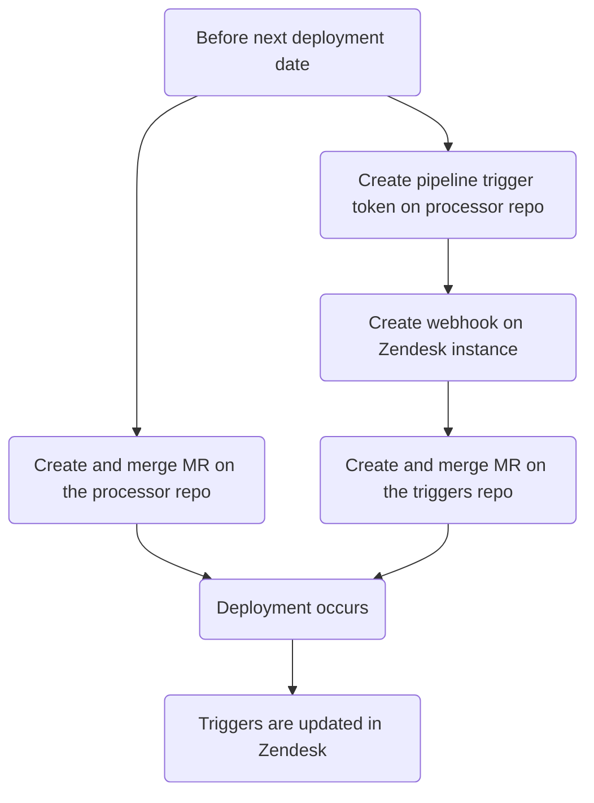
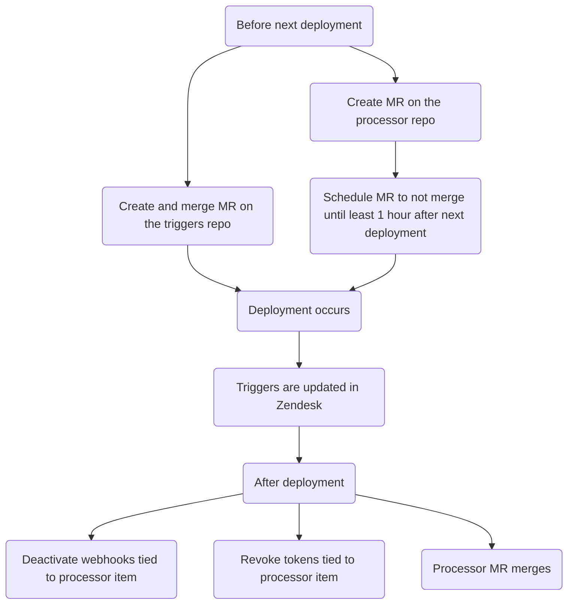

このガイドでは、特定のトリガーに基づいてチケットにカスタムアクションを実行する自動化システムである Zendesk チケットプロセッサについて説明します。利用可能なプロセッサのタイプと、プロセッサ項目の作成、変更、削除の方法を文書化しています。

{}

- デプロイタイプ: `Ad-hoc`
- 同期リポジトリ
  - [Zendesk Global](https://gitlab.com/gitlab-support-readiness/zendesk-global/tickets/processor)
  - [Zendesk US Government](https://gitlab.com/gitlab-support-readiness/zendesk-us-government/tickets/processor)

{}

## チケットプロセッサを理解する

### チケットプロセッサとは何か

チケットプロセッサは、gitlab.com に保存されている一連のスクリプトで、CI/CD パイプラインのトリガー経由で起動されます。チケットに対して各種のカスタムアクションを実行できます。

### Zendesk Global のプロセッサ項目

#### 2FA Removal

[gitlab-com/support/support-team-meta#6663](https://gitlab.com/gitlab-com/support/support-team-meta/-/issues/6663) 経由で導入

これはリクエスト自体をチェックして適格性ステータスを判定します。判定結果に応じて、チケットにタグを追加します（これが対応する Zendesk トリガーを発火させます）。

- リクエストがリクエスター自身の 2FA を削除するものである場合:
  - ユーザーがそのリクエストに対するサポートエンタイトルメントを持つ場合、タグ `2fa_challenge_questions` が追加されます（そしてプロセスが終了します）
  - ユーザーがそのリクエストに対するサポートエンタイトルメントを持たない場合、タグ `2fa_user_not_entitled` が追加されます（そしてプロセスが終了します）
- リクエストが別のユーザーの 2FA を削除するものである場合:
  - 次の基準をチェックします
    - リクエスターはそのリクエストに対するサポートエンタイトルメントを持っているか？
    - リクエスターのメールのドメインは、対象者のメールのドメインと完全に一致するか？
    - リクエスターは gitlab.com アカウントを持っているか？
    - 対象者は gitlab.com アカウントを持っているか？
    - リクエスターは最上位の有料ネームスペースの `Owner` か？
    - 対象者は最上位の有料ネームスペース配下のメンバーか？
  - すべてのチェックに合格した場合、タグ `2fa_snippet_verification` が追加されます（そしてプロセスが終了します）
  - いずれかのチェックに失敗した場合、タグ `2fa_owner_not_entitled` が追加されます（そしてプロセスが終了します）

#### Account blocked

[gitlab-com/support/support-ops/zendesk-global/trigger!264](https://gitlab.com/gitlab-com/support/support-ops/zendesk-global/triggers/-/merge_requests/264) 経由で導入

これは gitlab.com ユーザーのアカウントステータスをチェックします。ステータスに応じて、異なるアクションが発生します:

- ユーザーが存在しない場合...
  - アカウントが存在しないことを伝える公開返信がユーザーに送信されます
  - `Ticket Stage` の値が `FRT` に設定されます
  - チケットのステータスが `Pending` に設定されます
- ユーザーがブロックされていない場合...
  - アカウントが実際にはブロックされていないことを伝える公開返信がユーザーに送信されます
  - `Ticket Stage` の値が `FRT` に設定されます
  - チケットのステータスが `Pending` に設定されます
- ユーザーが禁輸ポリシーによりブロックされている場合...
  - 禁輸ポリシーによりブロックされたことを伝える公開返信がユーザーに送信されます。また、それを解決するための次のステップも伝えます。
  - `Ticket Stage` の値が `FRT` に設定されます
  - チケットのステータスが `Solved` に設定されます
- ユーザーがブロックされている場合（ただし禁輸ポリシーによるものではない場合）...
  - [T&S アカウント復元プロジェクト](https://gitlab.com/gitlab-com/gl-security/security-operations/trust-and-safety/TS_Operations/account-reinstatements)内に Issue が作成されます
  - SE に従うべき次のステップを示す内部返信がチケットに作成されます

#### ASE update

[gitlab-com/gl-security/corp/cust-support-ops/issue-tracker#623](https://gitlab.com/gitlab-com/gl-security/corp/cust-support-ops/issue-tracker/-/issues/623) 経由で導入

これは、オーガニゼーションへの Assigned Support Engineer（ASE）の追加または削除を処理します（`bin/ase_update` スクリプトを使用）。

スクリプトは次のように動作します:

- オーガニゼーションが存在する場合:
  - ASE の追加・変更で、かつユーザー ID が有効な場合:
    - オーガニゼーションの `assigned_se` 属性をそのユーザーの ID を使用するよう変更します
    - タスクが完了したことを伝えるコメントをチケットに付けます（そしてチケットをクローズします）
  - ASE の削除の場合:
    - オーガニゼーションの `assigned_se` 属性を空白の値に変更します
    - タスクが完了したことを伝えるコメントをチケットに付けます（そしてチケットをクローズします）
  - ASE の追加で、かつ指定されたユーザー ID が無効な場合、その旨をリクエスターに伝えるコメントをチケットに付けます（そしてチケットをクローズします）
- オーガニゼーションが存在しない場合、その旨をリクエスターに伝えるコメントをチケットに付けます（そしてチケットをクローズします）

#### Collaboration IDs

[gitlab-com/gl-security/corp/cust-support-ops/issue-tracker#623](https://gitlab.com/gitlab-com/gl-security/corp/cust-support-ops/issue-tracker/-/issues/623) 経由で導入

これは、オーガニゼーションへのコラボレーションプロジェクト ID の追加または削除を処理します（`bin/collab_ids` スクリプトを使用）。

スクリプトは次のように動作します:

- オーガニゼーションが存在する場合:
  - コラボレーションプロジェクトの追加・変更の場合:
    - オーガニゼーションの `am_project_id` 属性をそのプロジェクトの ID を使用するよう変更します
    - タスクが完了したことを伝えるコメントをチケットに付けます（そしてチケットをクローズします）
  - コラボレーションプロジェクトの削除の場合:
    - オーガニゼーションの `am_project_id` 属性を空白の値に変更します
    - タスクが完了したことを伝えるコメントをチケットに付けます（そしてチケットをクローズします）
- オーガニゼーションが存在しない場合、その旨をリクエスターに伝えるコメントをチケットに付けます（そしてチケットをクローズします）

#### Create macro

[gitlab-com/gl-security/corp/cust-support-ops/issue-tracker#705](https://gitlab.com/gitlab-com/gl-security/corp/cust-support-ops/issue-tracker/-/issues/705) 経由で導入

これは、Zendesk インスタンス向けの[シンプルマクロ](../macros/#simple-vs-advanced-macros)の追加を処理します（`bin/create_macro` スクリプトを使用）。

スクリプトは次のように動作します:

- マクロがコメントを作成する場合、既存の管理コンテンツファイルが存在するかをチェックします（存在しない場合は管理コンテンツファイルを作成します）
- マクロリポジトリに YAML ファイルを作成します（これが Zendesk 同期をトリガーし、マクロを作成します）
- タスクが完了したことを確認するコメントをチケットに付けます（そしてチケットをクローズします）。

#### Create on behalf of

[gitlab-com/gl-security/corp/cust-support-ops/issue-tracker#706](https://gitlab.com/gitlab-com/gl-security/corp/cust-support-ops/issue-tracker/-/issues/706) 経由で導入

これは、顧客や見込み客などの代理でチケットを作成するリクエストを処理します（`bin/create_on_behalf` スクリプトを使用）。

スクリプトは次のように動作します:

- リクエストの情報を読み取り、ユーザーの代理で新しいチケットを作成します（`Support Internal Request` フォームを使用）
- 元の内部リクエストチケットを、新しく作成されたエンドユーザーチケットに（内部コメントとして）マージし、内部リクエストチケットからの添付ファイルが新しく作成されたエンドユーザーチケットに添付されるようにします

#### Email Suppressions

[gitlab-com/support/support-ops/zendesk-global/trigger!264](https://gitlab.com/gitlab-com/support/support-ops/zendesk-global/triggers/-/merge_requests/264) 経由で導入

これは Mailgun 内にメール抑制が存在するかをチェックします。チェック結果に応じて、異なるアクションが発生します:

- 抑制が存在する場合...
  - Mailgun で見つかった抑制が削除されます
  - 抑制が見つかって削除されたことを伝える内部返信がチケットに作成されます。これには当該抑制のコード、エラー、タイムスタンプが含まれます
  - 抑制が見つかって削除されたこと、およびユーザーが取るべき次のステップを伝える公開返信がユーザーに送信されます。
  - チケットのステータスが `Solved` に設定されます
- 抑制が存在しない場合...
  - 抑制が見つからなかったこと、および取れる次のステップを伝える公開返信がユーザーに送信されます。また、それを解決するための次のステップも伝えます。
  - `Ticket Stage` の値が `FRT` に設定されます
  - チケットのステータスが `Pending` に設定されます

#### Link Tagger

Zendesk Global へは [gitlab-com/support/support-ops/support-ops-project#998](https://gitlab.com/gitlab-com/support/support-ops/support-ops-project/-/issues/998) 経由で、Zendesk US Government へは [gitlab-com/gl-security/corp/cust-support-ops/issue-tracker#841](https://gitlab.com/gitlab-com/gl-security/corp/cust-support-ops/issue-tracker/-/work_items/841) 経由で導入

これは、渡されたコメント（公開かつエージェントによるもの）を、チケットにタグ付けしたい各種の項目についてチェックします。現在の項目の種類（およびそれに基づいて追加されるタグ）は次のとおりです:

- gitlab.com の Issue リンクを含む
  - `gitlab_issue_link` タグが追加されます
  - `CUSTOMPATH_issues_IID` タグが追加されます（Global のみ）
    - `CUSTOMPATH` はプロジェクトのスラッグ、`IID` は Issue ID です
    - 例: プロジェクト jcolyer/most_amazing_project_ever の Issue 5 へのリンクは次のようになります: `jcolyer_most_amazing_project_ever_issues_5`
  - `issue~CUSTOMPATH_IID`
    - `CUSTOMPATH` はプロジェクトのスラッグ、`IID` は Issue ID です
    - 例: プロジェクト jcolyer/most_amazing_project_ever の Issue 5 へのリンクは次のようになります: `issue~jcolyer_most_amazing_project_ever_issues_5`
  - `issue_PROJECTID_IID`（Global のみ）
    - `PROJECTID` はプロジェクトの ID、`IID` は Issue ID です
    - 例: プロジェクト jcolyer/most_amazing_project_ever（プロジェクト ID 123）の Issue 5 へのリンクは次のようになります: `issue_123_5`
- gitlab.com のマージリクエストリンクを含む
  - `gitlab_merge_request_link` タグが追加されます
  - `CUSTOM_PATH_merge_requests_IID` タグが追加されます（Global のみ）
    - `CUSTOMPATH` はプロジェクトのスラッグ、`IID` はマージリクエスト ID です
    - 例: プロジェクト jcolyer/most_amazing_project_ever のマージリクエスト 27 へのリンクは次のようになります: `jcolyer_most_amazing_project_ever_merge_requests_27`
  - `mergerequest~CUSTOMPATH_IID`
    - `CUSTOMPATH` はプロジェクトのスラッグ、`IID` は Issue ID です
    - 例: プロジェクト jcolyer/most_amazing_project_ever のマージリクエスト 27 へのリンクは次のようになります: `mergerequest~jcolyer_most_amazing_project_ever_27`
  - `mergerequest_PROJECTID_IID`（Global のみ）
    - `PROJECTID` はプロジェクトの ID、`IID` はマージリクエスト ID です
    - 例: プロジェクト jcolyer/most_amazing_project_ever（プロジェクト ID 123）のマージリクエスト 27 へのリンクは次のようになります: `mergerequest_123_27`
- gitlab.com のエピックリンクを含む
  - `gitlab_epic_link` タグが追加されます
  - `CUSTOMPATH_epic_IID` タグが追加されます（Global のみ）
    - `CUSTOMPATH` はプロジェクトのスラッグ、`IID` はエピック ID です
    - 例: プロジェクト jcolyer/most_amazing_project_ever のエピック 10 へのリンクは次のようになります: `jcolyer_most_amazing_project_ever_epic_10`
  - `epic~CUSTOMPATH_IID`
    - `CUSTOMPATH` はプロジェクトのスラッグ、`IID` はエピック ID です
    - 例: プロジェクト jcolyer/most_amazing_project_ever のエピック 10 へのリンクは次のようになります: `epic~jcolyer_most_amazing_project_ever_10`
  - `epic_PROJECTID_IID`（Global のみ）
    - `PROJECTID` はプロジェクトの ID、`IID` はエピック ID です
    - 例: プロジェクト jcolyer/most_amazing_project_ever（プロジェクト ID 123）のエピック 10 へのリンクは次のようになります: `epic_123_10`
- docs.gitlab.com のリンクを含む
  - `docs_link` タグが追加されます
- handbook.gitlab.com のリンクを含む
  - `hb_link` タグが追加されます
- KB 記事のリンクを含む
  - `kb_link` タグが追加されます
- エージェントが通話を提案したことを示すテキストを含む
  - `agent_offered_call` タグが追加されます
  - 使用される検索語:
    - `calendly.com`
    - `gitlab.zoom.us`
    - `gitlabmtgs.webex.com`
    - `teams.microsoft.com`

#### Namespace availability

[gitlab-com/gl-security/corp/cust-support-ops/issue-tracker#578](https://gitlab.com/gitlab-com/gl-security/corp/cust-support-ops/issue-tracker/-/issues/578) 経由で導入

これは、ネームスペースが利用可能かどうかのチェックを処理します（`bin/namespace_availability` スクリプト経由）。本質的には、[Namesquatting](#namesquatting) プロセスの、より簡易な（かつ顧客には表示されない）バージョンです。

スクリプトは次のように動作します:

- ネームスペースが存在するかをチェックします
  - 存在しない場合、その旨を示すコメントをチケットに付け（そしてチケットをクローズし）、プロセスを停止します
- ネームスペースが有料プランを使用しているかをチェックします
  - 使用している場合、ネームスペースが利用不可であることを示すコメントをチケットに付け（そしてチケットをクローズし）、プロセスを停止します
- ネームスペースのタイプをチェックします
  - `user` ネームスペースの場合:
    - ユーザーが確認済みで、かつ 90 日未満前に作成されたかをチェックします
      - その場合、利用 _できる可能性がある_ ことを示すコメントをチケットに付け（そしてチケットをクローズし）、プロセスを停止します
    - 最後のサインインが過去 2 年以内であったかをチェックします
      - その場合、ネームスペースが利用不可であることを示すコメントをチケットに付け（そしてチケットをクローズし）、プロセスを停止します
    - それ以外のすべての場合、利用 _できる可能性がある_ ことを示すコメントをチケットに付け（そしてチケットをクローズし）、プロセスを停止します
  - `group` ネームスペースの場合:
    - グループに過去 2 年以内に更新されたプロジェクトがあるかをチェックします
      - その場合、利用 _できる可能性がある_ ことを示すコメントをチケットに付け（そしてチケットをクローズし）、プロセスを停止します
    - それ以外のすべての場合、利用 _できる可能性がある_ ことを示すコメントをチケットに付け（そしてチケットをクローズし）、プロセスを停止します

#### Namesquatting

[gitlab-com/support/support-ops/zendesk-global/trigger!264](https://gitlab.com/gitlab-com/support/support-ops/zendesk-global/triggers/-/merge_requests/264) 経由で導入

これは、特定のネームスペースが各種の基準に基づいて解放対象として適格かどうかをチェックします。チェックの結果によって、発生するアクションが決まります:

- リクエスターが無料ユーザーの場合...
  - これらのリクエストは有料顧客のみが対象であることを伝える公開返信がユーザーに送信されます。
  - `Ticket Stage` の値が `FRT` に設定されます
- ネームスペースが無効な場合...
  - 当該ネームスペースが見つからなかったことを伝える公開返信がユーザーに送信されます。
  - `Ticket Stage` の値が `FRT` に設定されます
- ネームスペースが適格でない場合...
  - ネームスペースが現時点では解放の対象でないことを伝える公開返信がユーザーに送信されます。
  - `Ticket Stage` の値が `FRT` に設定されます
- ネームスペースが適格 _かもしれない_ 場合...
  - ネームスペースは現在の所有者に連絡した後にのみ解放できることを伝える内部返信がチケットに作成されます。見つかった所有者のメールアドレスがリストされます。
  - `Ticket Stage` の値が `FRT` に設定されます
- ネームスペースが適格 **である** 場合...
  - ネームスペースが即時解放の対象であることを伝える内部返信がチケットに作成されます。
  - `Ticket Stage` の値が `FRT` に設定されます

#### Organization Notes

[gitlab-com/support/support-ops/zendesk-global/trigger!264](https://gitlab.com/gitlab-com/support/support-ops/zendesk-global/triggers/-/merge_requests/264) 経由で導入

これは、チケットのリクエスターが所属するオーガニゼーションから導出した情報に基づいて、チケットに内部メモを追加します。これは 3 つの異なる内部メモを作成する可能性があります:

- オーガニゼーションのメモから導出される、次のものを含み得るもの...
  - オーガニゼーションがエスカレーション状態にあることに関するメッセージ
  - パートナーのトラブルシューティング情報
  - 一般的なオーガニゼーション情報
  - そのオーガニゼーション配下で起票された最近の緊急チケット
  - オーガニゼーションがコラボレーションプロジェクトを持っているか
  - オーガニゼーションがコンタクト管理プロジェクトを使用しているか
  - Support Operations のメモ（Zendesk のオーガニゼーション自体の Notes/Details フィールドから導出）
  - サポートメモ（[Zendesk Global Organizations プロジェクト](https://gitlab.com/gitlab-com/support/zendesk-global/organizations)から導出）
- オーガニゼーションのサポートエンタイトルメント情報を詳述するもの
  - オーガニゼーションが期限切れ、または優先見込み客の場合のみ
- オーガニゼーションが GitLab Dedicated であることに関するもの

サポートメモのファイルが存在しない場合、これはオーガニゼーション用にも 1 つ作成します。

#### STAR

[gitlab-com/support/support-ops/support-ops-project#957](https://gitlab.com/gitlab-com/support/support-ops/support-ops-project/-/issues/957) 経由で導入

これは、チケットにチケットタグ `star_submitted` を追加します。

### Zendesk US Government のプロセッサ項目

次の項目は Zendesk Global と同一に動作します:

- [ASE update](#ase-update)
- [Collaboration IDs](#collaboration-ids)
- [Create macro](#create-macro)
- [Link tagger](#link-tagger)

#### Organization Notes

[gitlab-support-readiness/zendesk-us-government/triggers@c573f55c](https://gitlab.com/gitlab-support-readiness/zendesk-us-government/triggers/-/commit/c573f55c1f4bc241c49567e56f409e7d593692cd) 経由で導入

これは、チケットのリクエスターが所属するオーガニゼーションから導出した情報に基づいて、チケットに内部メモを追加します。これは 3 つの異なる内部メモを作成する可能性があります:

- オーガニゼーションのメモから導出される、次のものを含み得るもの...
  - 一般的なオーガニゼーション情報
  - そのオーガニゼーション配下で起票された最近の緊急チケット
  - オーガニゼーションがコラボレーションプロジェクトを持っているか
  - Support Operations のメモ（Zendesk のオーガニゼーション自体の Notes/Details フィールドから導出）
- オーガニゼーションのサポートエンタイトルメントおよび猶予期間の情報を詳述するもの
  - オーガニゼーションが期限切れの場合のみ
- オーガニゼーションが GitLab Dedicated であることに関するもの

## 管理者向けタスク

### 新しいプロセッサ項目の作成

{}

- これは、対応するリクエスト Issue（機能リクエスト、管理、バグなど）がある場合にのみ行うべきです。存在しない場合は、まずそれを作成してください（そして作業を行う前に標準プロセスを通過させてください）。

{}

チケットプロセッサに項目を追加するには、複数のステップからなるプロセスを実行する必要があります:

1. チケットプロセッサリポジトリへの MR を作成します。この MR では:
   - 項目に紐づくスクリプトを作成します
   - `.gitlab-ci.yml` ファイルに項目のエントリを追加します
   - `README.md` ファイルに項目のエントリを追加します
   - `README.md` ファイルに表示されるファイルツリーを更新します
1. 項目のパイプライントリガートークンを作成します（ウェブフックで使用）
1. 項目用に、対応する Zendesk インスタンスで[ウェブフックを作成](/handbook/security/customer-support-operations/zendesk/webhooks/#creating-a-webhook)します
1. 対応する Zendesk インスタンスのトリガーリポジトリへの MR を作成します。この MR では:
   - プロセッサ項目に紐づくトリガーを作成します

そのため、全体の流れは次のようになります:

#### サンドボックスを考慮する

Zendesk サンドボックスでテストを行う必要があるため、ステップ 4 に取り掛かる前にステップ 1〜3 を完了する必要があります。

### チケットプロセッサの変更

{}

- これは、対応するリクエスト Issue（機能リクエスト、管理、バグなど）がある場合にのみ行うべきです。存在しない場合は、まずそれを作成してください（そして作業を行う前に標準プロセスを通過させてください）。

{}

プロセッサ項目を編集するには、同期リポジトリで MR を作成する必要があります。具体的な変更内容はリクエスト自体によって異なります。

ピアが MR をレビューして承認した後、MR をマージできます。次回のデプロイが発生すると、Zendesk に同期されます。

### プロセッサ項目の削除

{}

- これは、対応するリクエスト Issue（機能リクエスト、管理、バグなど）がある場合にのみ行うべきです。存在しない場合は、まずそれを作成してください（そして作業を行う前に標準プロセスを通過させてください）。

{}

チケットプロセッサから項目を削除するには、複数のステップからなるプロセスを実行する必要があります:

1. チケットプロセッサリポジトリへの MR を作成します。この MR では:
   - 項目に紐づくスクリプトを削除します
   - `.gitlab-ci.yml` ファイルから項目のエントリを削除します
   - `README.md` ファイルから項目のエントリを削除します
   - `README.md` ファイルに表示されるファイルツリーを更新します
1. 対応する Zendesk インスタンスのトリガーリポジトリへの MR を作成します。この MR では:
   - プロセッサ項目に紐づくトリガーを無効化します
1. 項目に紐づく対応する Zendesk インスタンスの[ウェブフックを無効化](/handbook/security/customer-support-operations/zendesk/webhooks/#deactivating-a-webhook)します
1. 項目に紐づくパイプライントリガートークンを失効させます（ウェブフックで使用）

プロセッサは `Ad-hoc` デプロイであるため、MR スケジューリングを使用する必要があります。そのため、全体の流れは次のようになります:

## よくある問題とトラブルシューティング

これは、必要に応じて項目が追加されていく生きたセクションです。
