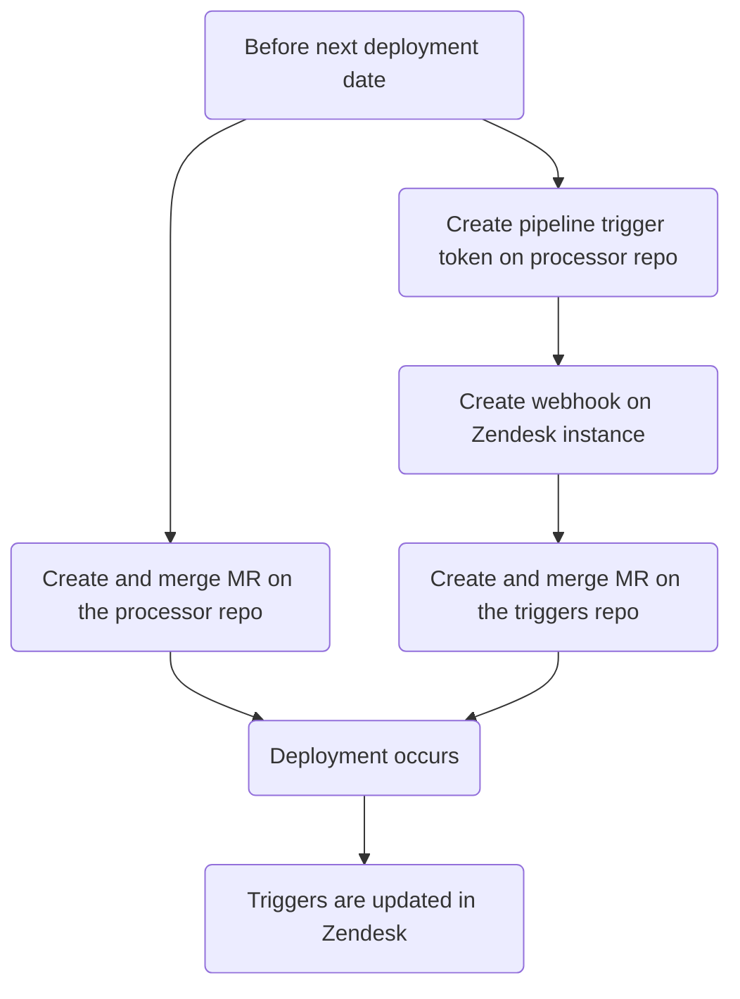
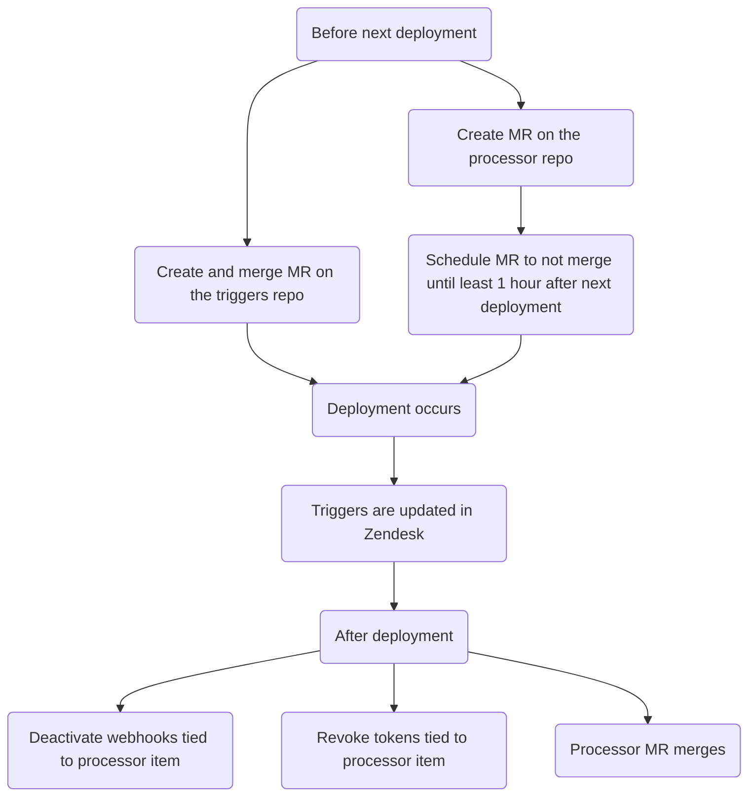

このガイドでは、Zendesk のチケットプロセッサ（特定のトリガーに基づいてチケットに対するカスタムアクションを実行する自動化システム）について説明します。利用可能なプロセッサタイプ、およびプロセッサ項目の作成、変更、削除方法をドキュメント化します。

{}

- デプロイタイプ: `Ad-hoc`
- 同期リポジトリ
  - [Zendesk Global](https://gitlab.com/gitlab-support-readiness/zendesk-global/tickets/processor)
  - [Zendesk US Government](https://gitlab.com/gitlab-support-readiness/zendesk-us-government/tickets/processor)

{}

## チケットプロセッサを理解する

### チケットプロセッサとは

チケットプロセッサは、CI/CD パイプライントリガーを介してアクティブ化される、gitlab.com に保存しているスクリプトのグループです。チケット上で各種カスタムアクションを実行できます。

### Zendesk Global プロセッサ項目

#### 2FA Removal

[gitlab-com/support/support-team-meta#6663](https://gitlab.com/gitlab-com/support/support-team-meta/-/issues/6663) で導入

これはリクエスト自体をチェックして適格性ステータスを決定します。決定結果に応じて、チケットにタグを追加します（対応する Zendesk トリガーが発火します）。

- リクエストが依頼者の 2FA を削除するものである場合:
  - ユーザーがリクエストに対するサポートエンタイトルメントを持っている場合、タグ `2fa_challenge_questions` が追加されます（プロセス終了）
  - ユーザーがリクエストに対するサポートエンタイトルメントを持たない場合、タグ `2fa_user_not_entitled` が追加されます（プロセス終了）
- リクエストが他のユーザーの 2FA を削除するものである場合:
  - 以下の基準をチェック
    - 依頼者はリクエストに対するサポートエンタイトルメントを持っているか?
    - 依頼者のメールのドメインが対象者のメールのドメインと完全に一致するか?
    - 依頼者は gitlab.com アカウントを持っているか?
    - 対象者は gitlab.com アカウントを持っているか?
    - 依頼者はトップレベルの有償ネームスペースの `Owner` か?
    - 対象者はトップレベルの有償ネームスペース下のメンバーか?
  - すべてのチェックを通過した場合、タグ `2fa_snippet_verification` が追加されます（プロセス終了）
  - いずれかのチェックに失敗した場合、タグ `2fa_owner_not_entitled` が追加されます（プロセス終了）

#### Account blocked

[gitlab-com/support/support-ops/zendesk-global/trigger!264](https://gitlab.com/gitlab-com/support/support-ops/zendesk-global/triggers/-/merge_requests/264) で導入

これは gitlab.com ユーザーのアカウントステータスをチェックします。ステータスに応じて、異なるアクションが発生する可能性があります。

- ユーザーが存在しない場合...
  - ユーザーにアカウントが存在しない旨のパブリック返信が送信されます
  - `Ticket Stage` の値が `FRT` に設定されます
  - チケットのステータスが `Pending` に設定されます
- ユーザーがブロックされていない場合...
  - ユーザーに実際にはアカウントがブロックされていない旨のパブリック返信が送信されます
  - `Ticket Stage` の値が `FRT` に設定されます
  - チケットのステータスが `Pending` に設定されます
- ユーザーが embargo ポリシーによりブロックされている場合...
  - ユーザーに embargo ポリシーによりブロックされた旨のパブリック返信が送信されます。それを解決するための次のステップも知らされます。
  - `Ticket Stage` の値が `FRT` に設定されます
  - チケットのステータスが `Solved` に設定されます
- ユーザーがブロックされている（ただし embargo ポリシーによるものではない）場合...
  - [T&S アカウント復活プロジェクト](https://gitlab.com/gitlab-com/gl-security/security-operations/trust-and-safety/TS_Operations/account-reinstatements)内で Issue が作成されます
  - 内部返信がチケットに作成され、SE に従うべき次のステップを示します

#### ASE update {#ase-update}

[gitlab-com/gl-security/corp/cust-support-ops/issue-tracker#623](https://gitlab.com/gitlab-com/gl-security/corp/cust-support-ops/issue-tracker/-/issues/623) で導入

これは組織への Assigned Support Engineer（ASE）の追加または削除を処理します（`bin/ase_update` スクリプトを使用）。

スクリプトは以下のように動作します。

- 組織が存在する場合:
  - ASE 追加/変更で、ユーザー ID が有効な場合:
    - 組織の `assigned_se` 属性をユーザーの ID を使用するように変更
    - チケットにタスク完了のコメント（チケットをクローズ）
  - ASE 削除の場合:
    - 組織の `assigned_se` 属性を空の値に変更
    - チケットにタスク完了のコメント（チケットをクローズ）
  - ASE 追加で、提供されたユーザー ID が無効な場合、その旨を依頼者に伝えるコメントをチケットに追加（チケットをクローズ）
- 組織が存在しない場合、その旨を依頼者に伝えるコメントをチケットに追加（チケットをクローズ）

#### Collaboration IDs {#collaboration-ids}

[gitlab-com/gl-security/corp/cust-support-ops/issue-tracker#623](https://gitlab.com/gitlab-com/gl-security/corp/cust-support-ops/issue-tracker/-/issues/623) で導入

これは組織へのコラボレーションプロジェクト ID の追加または削除を処理します（`bin/collab_ids` スクリプトを使用）。

スクリプトは以下のように動作します。

- 組織が存在する場合:
  - コラボレーションプロジェクト追加/変更の場合:
    - 組織の `am_project_id` 属性をプロジェクトの ID を使用するように変更
    - チケットにタスク完了のコメント（チケットをクローズ）
  - コラボレーションプロジェクト削除の場合:
    - 組織の `am_project_id` 属性を空の値に変更
    - チケットにタスク完了のコメント（チケットをクローズ）
- 組織が存在しない場合、その旨を依頼者に伝えるコメントをチケットに追加（チケットをクローズ）

#### Create macro {#create-macro}

[gitlab-com/gl-security/corp/cust-support-ops/issue-tracker#705](https://gitlab.com/gitlab-com/gl-security/corp/cust-support-ops/issue-tracker/-/issues/705) で導入

これは Zendesk インスタンス向けの[シンプルマクロ](../macros/#simple-vs-advanced-macros)の追加を処理します（`bin/create_macro` スクリプトを使用）。

スクリプトは以下のように動作します。

- マクロがコメントを作成するものである場合、既存のマネージドコンテンツファイルが存在するかチェックします（存在しない場合はマネージドコンテンツファイルを作成）
- マクロリポジトリに YAML ファイルを作成（これにより Zendesk 同期がトリガーされ、マクロが作成されます）
- チケットにタスク完了の確認コメントを追加（チケットをクローズ）

#### Create on behalf of

[gitlab-com/gl-security/corp/cust-support-ops/issue-tracker#706](https://gitlab.com/gitlab-com/gl-security/corp/cust-support-ops/issue-tracker/-/issues/706) で導入

これは顧客、見込み顧客などの代わりにチケットを作成するリクエストを処理します（`bin/create_on_behalf` スクリプトを使用）。

スクリプトは以下のように動作します。

- リクエストの情報を読み取り、ユーザーの代わりに新しいチケットを作成します（フォーム `Support Internal Request` を使用）
- 元の内部リクエストチケットを新しく作成したエンドユーザーチケットに（内部コメントとして）マージし、内部リクエストチケットに添付されたファイルが新しく作成したエンドユーザーチケットにも添付されるようにします

#### Email Suppressions

[gitlab-com/support/support-ops/zendesk-global/trigger!264](https://gitlab.com/gitlab-com/support/support-ops/zendesk-global/triggers/-/merge_requests/264) で導入

これは Mailgun 内でメール抑制が存在するかをチェックします。チェック結果に応じて、異なるアクションが発生する可能性があります。

- 抑制が存在する場合...
  - Mailgun で見つかった抑制が削除されます
  - 内部返信がチケットに作成され、抑制が見つかって削除された旨と、その抑制のコード、エラー、タイムスタンプを含めます
  - ユーザーに抑制が見つかって削除された旨と、ユーザーが取るべき次のステップを伝えるパブリック返信が送信されます
  - チケットのステータスが `Solved` に設定されます
- 抑制が存在しない場合...
  - ユーザーに抑制が見つからなかった旨と、取れる次のステップを伝えるパブリック返信が送信されます。それを解決するための次のステップも知らされます。
  - `Ticket Stage` の値が `FRT` に設定されます
  - チケットのステータスが `Pending` に設定されます

#### Link Tagger {#link-tagger}

Zendesk Global へは [gitlab-com/support/support-ops/support-ops-project#998](https://gitlab.com/gitlab-com/support/support-ops/support-ops-project/-/issues/998) で、Zendesk US Government へは [gitlab-com/gl-security/corp/cust-support-ops/issue-tracker#841](https://gitlab.com/gitlab-com/gl-security/corp/cust-support-ops/issue-tracker/-/work_items/841) で導入

これは渡されたコメント（パブリックでエージェントによって作成されたもの）を、チケット上にタグ付けしたい各種項目についてチェックします。現在の項目の種類（およびそれに基づいて追加されるタグ）は以下のとおりです。

- gitlab.com Issue リンクを含む
  - `gitlab_issue_link` タグが追加
  - `CUSTOMPATH_issues_IID` タグが追加（Global のみ）
    - `CUSTOMPATH` はプロジェクトのスラッグ、`IID` は Issue ID
    - 例: プロジェクト jcolyer/most_amazing_project_ever の Issue 5 へのリンクの場合: `jcolyer_most_amazing_project_ever_issues_5`
  - `issue~CUSTOMPATH_IID`
    - `CUSTOMPATH` はプロジェクトのスラッグ、`IID` は Issue ID
    - 例: プロジェクト jcolyer/most_amazing_project_ever の Issue 5 へのリンクの場合: `issue~jcolyer_most_amazing_project_ever_issues_5`
  - `issue_PROJECTID_IID`（Global のみ）
    - `PROJECTID` はプロジェクトの ID、`IID` は Issue ID
    - 例: プロジェクト jcolyer/most_amazing_project_ever（プロジェクト ID 123）の Issue 5 へのリンクの場合: `issue_123_5`
- gitlab.com マージリクエストリンクを含む
  - `gitlab_merge_request_link` タグが追加
  - `CUSTOM_PATH_merge_requests_IID` タグが追加（Global のみ）
    - `CUSTOMPATH` はプロジェクトのスラッグ、`IID` はマージリクエスト ID
    - 例: プロジェクト jcolyer/most_amazing_project_ever のマージリクエスト 27 へのリンクの場合: `jcolyer_most_amazing_project_ever_merge_requests_27`
  - `mergerequest~CUSTOMPATH_IID`
    - `CUSTOMPATH` はプロジェクトのスラッグ、`IID` は Issue ID
    - 例: プロジェクト jcolyer/most_amazing_project_ever のマージリクエスト 27 へのリンクの場合: `mergerequest~jcolyer_most_amazing_project_ever_27`
  - `mergerequest_PROJECTID_IID`（Global のみ）
    - `PROJECTID` はプロジェクトの ID、`IID` はマージリクエスト ID
    - 例: プロジェクト jcolyer/most_amazing_project_ever（プロジェクト ID 123）のマージリクエスト 27 へのリンクの場合: `mergerequest_123_27`
- gitlab.com epic リンクを含む
  - `gitlab_epic_link` タグが追加
  - `CUSTOMPATH_epic_IID` タグが追加（Global のみ）
    - `CUSTOMPATH` はプロジェクトのスラッグ、`IID` は epic ID
    - 例: プロジェクト jcolyer/most_amazing_project_ever の epic 10 へのリンクの場合: `jcolyer_most_amazing_project_ever_epic_10`
  - `epic~CUSTOMPATH_IID`
    - `CUSTOMPATH` はプロジェクトのスラッグ、`IID` は epic ID
    - 例: プロジェクト jcolyer/most_amazing_project_ever の epic 10 へのリンクの場合: `epic~jcolyer_most_amazing_project_ever_10`
  - `epic_PROJECTID_IID`（Global のみ）
    - `PROJECTID` はプロジェクトの ID、`IID` は epic ID
    - 例: プロジェクト jcolyer/most_amazing_project_ever（プロジェクト ID 123）の epic 10 へのリンクの場合: `epic_123_10`
- docs.gitlab.com リンクを含む
  - `docs_link` タグが追加
- handbook.gitlab.com リンクを含む
  - `hb_link` タグが追加
- KB 記事リンクを含む
  - `kb_link` タグが追加
- エージェントが通話を提案したことを示すテキストを含む
  - `agent_offered_call` タグが追加
  - 使用される検索ターム:
    - `calendly.com`
    - `gitlab.zoom.us`
    - `gitlabmtgs.webex.com`
    - `teams.microsoft.com`

#### Namespace availability

[gitlab-com/gl-security/corp/cust-support-ops/issue-tracker#578](https://gitlab.com/gitlab-com/gl-security/corp/cust-support-ops/issue-tracker/-/issues/578) で導入

これはネームスペースが利用可能かどうかをチェックします（`bin/namespace_availability` スクリプト経由）。本質的には、[Namesquatting](#namesquatting) プロセスのより簡略化された（顧客には見えない）バージョンです。

スクリプトは以下のように動作します。

- ネームスペースが存在するかチェック
  - 存在しない場合、その旨をコメントに追加（チケットをクローズ）し、プロセスを停止
- ネームスペースが有償プランを使用しているかチェック
  - 使用している場合、ネームスペースが利用不可能な旨をコメントに追加（チケットをクローズ）し、プロセスを停止
- ネームスペースのタイプをチェック
  - `user` ネームスペースの場合:
    - ユーザーが confirmed で 90 日未満前に作成されているかチェック
      - そうである場合、_利用可能かもしれない_ 旨をコメントに追加（チケットをクローズ）し、プロセスを停止
    - 最後のサインインが 2 年以内かチェック
      - そうである場合、ネームスペースが利用不可能な旨をコメントに追加（チケットをクローズ）し、プロセスを停止
    - その他のすべての場合、_利用可能かもしれない_ 旨をコメントに追加（チケットをクローズ）し、プロセスを停止
  - `group` ネームスペースの場合:
    - グループに 2 年以内に更新されたプロジェクトがあるかチェック
      - そうである場合、_利用可能かもしれない_ 旨をコメントに追加（チケットをクローズ）し、プロセスを停止
    - その他のすべての場合、_利用可能かもしれない_ 旨をコメントに追加（チケットをクローズ）し、プロセスを停止

#### Namesquatting {#namesquatting}

[gitlab-com/support/support-ops/zendesk-global/trigger!264](https://gitlab.com/gitlab-com/support/support-ops/zendesk-global/triggers/-/merge_requests/264) で導入

これは指定されたネームスペースが、私たちの各種基準に基づいて解放適格かどうかをチェックします。チェック結果が、どのアクションが発生するかを決定します。

- 依頼者がフリーユーザーの場合...
  - これらのリクエストは有償顧客のみが対象である旨のパブリック返信がユーザーに送信されます
  - `Ticket Stage` の値が `FRT` に設定されます
- ネームスペースが無効な場合...
  - 該当のネームスペースを特定できなかった旨のパブリック返信がユーザーに送信されます
  - `Ticket Stage` の値が `FRT` に設定されます
- ネームスペースが解放適格でない場合...
  - 現時点でネームスペースが解放適格でない旨のパブリック返信がユーザーに送信されます
  - `Ticket Stage` の値が `FRT` に設定されます
- ネームスペースが _適格かもしれない_ 場合...
  - ネームスペースの現在のオーナーに連絡を取った後にのみ解放できる旨の内部返信がチケットに作成されます。見つかったオーナーのメールアドレスがリストされます。
  - `Ticket Stage` の値が `FRT` に設定されます
- ネームスペースが **適格** な場合...
  - ネームスペースが即時解放適格である旨の内部返信がチケットに作成されます
  - `Ticket Stage` の値が `FRT` に設定されます

#### Organization Notes

[gitlab-com/support/support-ops/zendesk-global/trigger!264](https://gitlab.com/gitlab-com/support/support-ops/zendesk-global/triggers/-/merge_requests/264) で導入

これは、チケットの依頼者がメンバーである組織から導出される情報に基づいて、チケットに内部ノートを追加します。これは 3 つの異なる内部ノートを作成する可能性があります。

- 組織ノートから導出されるもので、以下を含むことができます...
  - 組織がエスカレーション状態にあるというメッセージ
  - パートナートラブルシューティング情報
  - 一般的な組織情報
  - 組織下で提出された最近の緊急チケット
  - 組織がコラボレーションプロジェクトを持っているか
  - 組織が連絡先管理プロジェクトを使用しているか
  - サポートオペレーションノート（Zendesk の組織自体の Notes/Details フィールドから導出）
  - サポートノート（[Zendesk Global Organizations プロジェクト](https://gitlab.com/gitlab-com/support/zendesk-global/organizations)から導出）
- 組織のサポートエンタイトルメント情報を詳述するもの
  - 組織が期限切れまたは優先見込み顧客の場合のみ
- 組織が GitLab Dedicated であるもの

サポートノートファイルが存在しない場合、これは組織用に 1 つも作成します。

#### STAR

[gitlab-com/support/support-ops/support-ops-project#957](https://gitlab.com/gitlab-com/support/support-ops/support-ops-project/-/issues/957) で導入

これは、チケット上にチケットタグ `star_submitted` を追加します。

### Zendesk US Government プロセッサ項目

以下の項目は Zendesk Global と同じように動作します。

- [ASE update](#ase-update)
- [Collaboration IDs](#collaboration-ids)
- [Create macro](#create-macro)
- [Link tagger](#link-tagger)

#### Organization Notes

[gitlab-support-readiness/zendesk-us-government/triggers@c573f55c](https://gitlab.com/gitlab-support-readiness/zendesk-us-government/triggers/-/commit/c573f55c1f4bc241c49567e56f409e7d593692cd) で導入

これは、チケットの依頼者がメンバーである組織から導出される情報に基づいて、チケットに内部ノートを追加します。これは 3 つの異なる内部ノートを作成する可能性があります。

- 組織ノートから導出されるもので、以下を含むことができます...
  - 一般的な組織情報
  - 組織下で提出された最近の緊急チケット
  - 組織がコラボレーションプロジェクトを持っているか
  - サポートオペレーションノート（Zendesk の組織自体の Notes/Details フィールドから導出）
- 組織のサポートエンタイトルメントおよび猶予期間情報を詳述するもの
  - 組織が期限切れの場合のみ
- 組織が GitLab Dedicated であるもの

## 管理者タスク

### 新しいプロセッサ項目を作成する

{}

- これは対応する依頼 Issue（Feature Request、Administrative、Bug など）が存在する場合にのみ実行してください。存在しない場合は、まず作成して標準プロセスを通してから対応してください。

{}

チケットプロセッサに項目を追加するには、複数ステップのプロセスを実行する必要があります。

1. チケットプロセッサリポジトリへ MR を作成し、以下を行います:
   - 項目に関連するスクリプトを作成
   - `.gitlab-ci.yml` ファイルから項目のエントリを追加
   - `README.md` ファイルから項目のエントリを追加
   - `README.md` ファイルに表示されているファイルツリーを更新
1. 項目用のパイプライントリガートークンを作成（ウェブフックで使用）
1. 対応する Zendesk インスタンスに、項目用の[ウェブフックを作成](/handbook/security/customer-support-operations/zendesk/webhooks/#creating-a-webhook)
1. 対応する Zendesk インスタンスのトリガーリポジトリへ MR を作成し、以下を行います:
   - プロセッサ項目に関連するトリガーを作成

そのため、全体的な流れは以下のようになります。

#### サンドボックスを考慮する

Zendesk のサンドボックスでテストを行う必要があるため、ステップ 4 に取り組む前にステップ 1〜3 を完了する必要があります。

### チケットプロセッサを変更する

{}

- これは対応する依頼 Issue（Feature Request、Administrative、Bug など）が存在する場合にのみ実行してください。存在しない場合は、まず作成して標準プロセスを通してから対応してください。

{}

プロセッサ項目を編集するには、同期リポジトリで MR を作成する必要があります。具体的な変更内容は依頼自体によって異なります。

ピアによるレビューと承認後、MR をマージできます。次のデプロイ時に、Zendesk に同期されます。

### プロセッサ項目を削除する

{}

- これは対応する依頼 Issue（Feature Request、Administrative、Bug など）が存在する場合にのみ実行してください。存在しない場合は、まず作成して標準プロセスを通してから対応してください。

{}

チケットプロセッサから項目を削除するには、複数ステップのプロセスを実行する必要があります。

1. チケットプロセッサリポジトリへ MR を作成し、以下を行います:
   - 項目に関連するスクリプトを削除
   - `.gitlab-ci.yml` ファイルから項目のエントリを削除
   - `README.md` ファイルから項目のエントリを削除
   - `README.md` ファイルに表示されているファイルツリーを更新
1. 対応する Zendesk インスタンスのトリガーリポジトリへ MR を作成し、以下を行います:
   - プロセッサ項目に関連するトリガーを非アクティブ化
1. 対応する Zendesk インスタンスから、項目に関連する[ウェブフックを非アクティブ化](/handbook/security/customer-support-operations/zendesk/webhooks/#deactivating-a-webhook)
1. 項目に関連するパイプライントリガートークンを失効（ウェブフックで使用）

プロセッサは `Ad-hoc` デプロイであるため、MR スケジューリングを使用する必要があります。そのため、全体的な流れは以下のようになります。

## よくある問題とトラブルシューティング

これは必要に応じて項目が追加されていく、生きたセクションです。
