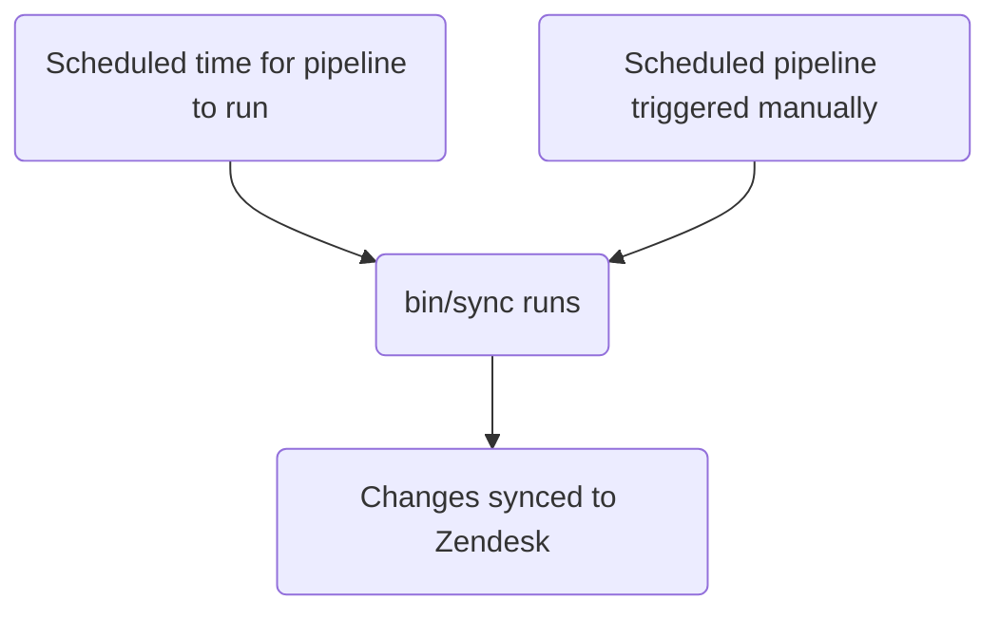

このガイドでは、GitLab における Zendesk のトリガーの作成、編集、管理方法について説明します。管理者は[管理者タスク](#administrator-tasks)セクションを確認してください。

エージェントが手動で適用する[マクロ](../macros/)とは異なり、トリガーはチケットに更新が発生したときに実行されます。

{}

- デプロイタイプ: `Standard`
- 同期リポジトリ
  - [Zendesk Global](https://gitlab.com/gitlab-support-readiness/zendesk-global/triggers)
  - [Zendesk US Government](https://gitlab.com/gitlab-support-readiness/zendesk-us-government/triggers)
- マネージドコンテンツリポジトリ
  - [Zendesk Global](https://gitlab.com/gitlab-com/support/zendesk-global/triggers)
  - [Zendesk US Government](https://gitlab.com/gitlab-com/support/zendesk-us-government/triggers)
- `CustSuppOps Zendesk Test Suite Generator` を有効化

{}

## トリガーを理解する

### トリガーとは

[Zendesk](https://support.zendesk.com/hc/en-us/articles/4408822236058-About-triggers-and-how-they-work) によると:

> トリガーは、チケットが作成または更新された直後に実行されるユーザー定義のビジネスルールです。例えば、チケットが開かれたときに顧客に通知するためにトリガーを使用できます。また、チケットが解決されたときに顧客に通知するためのトリガーを別途作成することもできます。

### Zendesk でトリガーが実行されるタイミング

Zendesk のトリガーは、チケットに更新が発生するたびに実行されます。これが発生すると、トリガーの完全なリストが（条件に基づいて適用されるものが）チケット上で実行されます。

### トリガーは position に基づいて実行される

トリガーの position は、上から下への流れ（つまり最低の position から最高へ）で実行されるため、極めて重要です。

例えば（条件に基づいて）チケットでトリガー 2、5、10 が実行される場合、実行順序は最初にトリガー 2、次にトリガー 5、最後にトリガー 10 となります。とはいえ、トリガー 5 がトリガー 10 のマッチを無効化するアクションを実行する場合、（トリガー 10 はもうマッチしないため）トリガー 2 と 5 のみが実行されます。

### トリガーは条件論理を使用する

トリガーは条件論理を使用します。

- `all`: 配列内のすべての条件が真である必要があります（AND 論理）
- `any`: 配列内の少なくとも 1 つの条件が真である必要があります（OR 論理）
- どちらか一方のセットのみ、または両方のセットを使用できます（少なくとも 1 セットを使用する必要があります）

### トリガーの管理方法

Zendesk は UI を通じてトリガーを完全に管理する方法を提供していますが、私たちはよりバージョン管理されたメソドロジーを採用しています。これにより、定められたレビュープロセスや、必要に応じてロールバックを行う能力などが得られます。

そのため、同期リポジトリとマネージドコンテンツリポジトリを利用しています。

### 同期リポジトリの仕組み

同期リポジトリのワークフローは以下のプロセスに従います。



#### 人間が読める形式の置換

{}

- これは YAML ファイル経由でトリガーを作成・編集する `administrators` にのみ適用されます

{}

現在、同期リポジトリは人間が読める形式から「Zendesk」相当のアイテムへ各種項目の置換を実行できます。これには以下が含まれます。

| 人間が読める形式の項目 | Zendesk フィールド項目 | 条件/アクション位置 | 備考 |
|---------------------|--------------------|-----------------|-------|
| `'Brand: XXX'` | `brand_id` | `value` | `XXX` をブランドの `name` に置き換える |
| `'Field: XXX'` | `custom_fields_xxx` | `field` | `XXX` をチケットフィールドの `title` に置き換える |
| `'Group: XXX'` | `group_id` | `value` | `XXX` をグループの `name` に置き換える |
| `'XXX'` | `role` | `value` | `XXX` をロールタイプの `name` または依頼者のメールアドレスに置き換える |
| `'Form: XXX'` | `ticket_form_id` | `value` | `XXX` をチケットフォームの `name` に置き換える |
| `'Schedule: XXX'` | `set_schedule` | `value` | `XXX` をスケジュールの `name` に置き換える |
| `'Schedule: XXX'` | `schedule_id` | `value` | `XXX` をスケジュールの `name` に置き換える |
| `'XXX'` | `organization_id` | `value` | `XXX` を組織の `salesforce_id` 属性に置き換える |
| `'XXX'` | `assignee_id` | `value` | `XXX` をエージェントのメールアドレスに置き換える |
| `'XXX'` | `satisfaction_reason_code` | `value` | `XXX` を満足度理由の `name` に置き換える |
| `'XXX'` | `via_id` | `value` | `XXX` via タイプの `name` に置き換える |
| `'XXX'` | `requester_role` | `value` | `XXX` を依頼者ロールタイプの `name` に置き換える |
| `'Target: XXX'` | `notification_target` | `value` | `XXX` をターゲットの `name` に置き換える |
| `'Webhook: XXX'` | `notification_webhook` | `value` | `XXX` をウェブフックの `name` に置き換える |

例えば、フィールド `Preferred Region for Support` の値を `AMER` に変更するトリガーが必要な場合、置換を使用するには次のように行います。

```yaml
- field: 'Field: Preferred Region for Support'
  value: 'AMER'
```

別の例として、チケットのフォームが `SaaS` フォームでないことを確認する条件が必要な場合、次のように行います。

```yaml
- field: 'ticket_form_id'
  operator: 'is_not'
  value: 'Form: SaaS'
```

#### 同期リポジトリで MR を作成する場合 {#when-creating-mrs-in-the-sync-repo}

同期リポジトリで MR が作成されると、（`bin/compare` スクリプト経由で）以下を行う比較アクションを実行します。

1. マネージドコンテンツリポジトリのクローンを実施
1. Zendesk インスタンスからすべてのブランド、グループ、満足度理由、スケジュール、ターゲット、チケットフィールド、チケットフォーム、トリガー、ウェブフックを取得
1. 同期リポジトリ内のすべての YAML ファイルをレビューしてトリガーオブジェクトを生成
   - また、同期リポジトリファイルに以下の問題が存在しないことを確認します:
     - タイトルが欠けている
     - `active` 属性が `false` のファイルが `active` フォルダに存在する
     - `active` 属性が `true` のファイルが `inactive` フォルダに存在する
     - `title` 属性の重複使用がある
     - `contains_managed_content` 属性が `true` のファイルに対応するマネージドコンテンツファイルがある
     - `contains_managed_webhook` 属性が `true` のファイルに対応するマネージドコンテンツファイルがある
1. YAML ファイルからのすべてのトリガーオブジェクトを、マッチする Zendesk アイテム（属性 `title` および `previous_title` の値をチェックして決定）と比較
   - 該当しない場合、後で使用するための作成オブジェクトを変数に保存
   - 該当するが属性値が異なる場合、後で使用するための更新オブジェクトを変数に保存
1. 比較レポートを出力

#### Zendesk への同期

同期リポジトリは、プロジェクトのスケジュールパイプラインが実行されたとき（適切なタイミングまたは手動で実行されたとき）に同期タスクを実施します。

いずれかのアクションが発生すると、同期は[比較アクション](#when-creating-mrs-in-the-sync-repo)を実施し、生成されたオブジェクトを使用して、必要な Zendesk エンドポイントへループでアクセスして必要な作成と更新を実施します。

- [作成](https://developer.zendesk.com/api-reference/ticketing/business-rules/triggers/#create-trigger)
- [更新](https://developer.zendesk.com/api-reference/ticketing/business-rules/triggers/#update-ticket-trigger)

#### 孤立したマネージドコンテンツファイルのレポート

2 月、5 月、8 月、11 月の 1 日に、[スケジュールパイプライン](https://docs.gitlab.com/ci/pipelines/schedules/)により、同期リポジトリがサポートリーダーシップチームに対して、孤立したマネージドコンテンツファイルをすべてレビューする Issue を作成します。

これは同期リポジトリ内の `bin/find_orphaned_files` スクリプトを介して行われ、以下を実施します。

1. マネージドコンテンツリポジトリのクローンを実施
1. マネージドコンテンツリポジトリの `active` および `inactive` フォルダ内のすべてのファイルをレビューして `state`（`active` または `inactive`）、`path`、`title` を判定
1. 同期リポジトリ自体の `active` および `inactive` フォルダ内のすべてのファイルをレビューして以下を判定:
   - ファイルがマネージドコンテンツファイルを使用しているか
   - マネージドコンテンツファイルが存在するか
1. 同期リポジトリファイルなしのマネージドコンテンツファイルを発見した場合、それをカスタマーサポートリーダーシップにレポートする Issue を作成

## 管理者ではない者がトリガーを作成する

トリガーの作成については、[Feature Request の Issue](https://gitlab.com/gitlab-com/gl-security/corp/cust-support-ops/issue-tracker/-/issues/new?description_template=Feature) を作成してください（カスタマーサポートオペレーションチームによる手動対応が必要となるため）。

## 管理者ではない者がトリガーを編集する

### トリガーで使用されているコメントの文言を変更する

トリガー内のコメント文言を編集するには、マネージドコンテンツリポジトリの該当ファイルを変更します。`master` ブランチへのマージ後、次のデプロイサイクルで取り込まれて Zendesk にデプロイされます。

### トリガーで使用されているペイロードを変更する

トリガー内のペイロード（マネージドウェブフックを使用しているもの）を編集するには、マネージドコンテンツリポジトリの該当ファイルを変更します。`master` ブランチへのマージ後、次のデプロイサイクルで取り込まれて Zendesk にデプロイされます。

### タイトル、コメント以外の文言アクションなどを変更する

トリガー内のその他のものを変更するには、[Feature Request の Issue](https://gitlab.com/gitlab-com/gl-security/corp/cust-support-ops/issue-tracker/-/issues/new?description_template=Feature) を作成してください（カスタマーサポートオペレーションチームによる手動対応が必要となるため）。

## 管理者ではない者がトリガーを非アクティブ化する

トリガーの非アクティブ化を依頼するには、[Feature Request の Issue](https://gitlab.com/gitlab-com/gl-security/corp/cust-support-ops/issue-tracker/-/issues/new?description_template=Feature) を作成してください（カスタマーサポートオペレーションチームによる手動対応が必要となるため）。

## 管理者タスク {#administrator-tasks}

{}

- このセクションのすべての項目は、Zendesk への `Administrator` レベルのアクセスが必要です。

{}

### トリガーの使用情報を確認する

トリガーの使用情報を確認するには:

1. Zendesk インスタンスの管理ダッシュボードに移動
   - [Zendesk Global (production)](https://gitlab.zendesk.com/admin/home)
   - [Zendesk Global (sandbox)](https://gitlab1707170878.zendesk.com/admin/home)
   - [Zendesk US Government (production)](https://gitlab-federal-support.zendesk.com/admin/home)
   - [Zendesk US Government (sandbox)](https://gitlabfederalsupport1585318082.zendesk.com/admin/home)
1. `Objects and rules > Business rules > Triggers` に移動
   - [Zendesk Global](https://gitlab.zendesk.com/admin/objects-rules/rules/triggers)
   - [Zendesk Global (sandbox)](https://gitlab1707170878.zendesk.com/admin/objects-rules/rules/triggers)
   - [Zendesk US Government](https://gitlab-federal-support.zendesk.com/admin/objects-rules/rules/triggers)
   - [Zendesk US Government (sandbox)](https://gitlabfederalsupport1585318082.zendesk.com/admin/objects-rules/rules/triggers)
1. トリガーリストの右端にあるアイコン（縦に並んだ 3 つの矩形のように見える）をクリック
1. 確認したい使用列をクリック

### トリガーを作成する

{}

- これは対応する依頼 Issue（Feature Request、Administrative、Bug など）が存在する場合にのみ実行してください。存在しない場合は、まず作成して標準プロセスを通してから対応してください。
- マネージドコンテンツファイルを使用するトリガーを作成する場合は、まずそのマネージドコンテンツファイルを作成する必要があります。

{}

トリガーを作成するには、同期リポジトリで MR を作成する必要があります。具体的な変更内容は依頼自体によって異なります。使用できる開始テンプレートは以下のとおりです。

```yaml
---
title: 'Your::Title::Here'
previous_title: 'Your::Title::Here'
description: 'Your description here'
active: true
position: 1 # Integer representing trigger position
actions:
- field: 'the_action_to_perform'
  value: 'the_value_to_use'
conditions:
  all:
  - field: 'the_action_to_perform'
    operator: 'the_operator_to_use'
    value: 'the_value_to_use'
  any:
  - field: 'the_action_to_perform'
    operator: 'the_operator_to_use'
    value: 'the_value_to_use'
category_id: 'Name of category'
contains_managed_content: false
contains_managed_email: false
contains_managed_webhook: false
```

ピアによるレビューと承認後、MR をマージできます。次のデプロイ時に、Zendesk に同期されます。

### トリガーを編集する

{}

- これは対応する依頼 Issue（Feature Request、Administrative、Bug など）が存在する場合にのみ実行してください。存在しない場合は、まず作成して標準プロセスを通してから対応してください。
- トリガーの `contains_managed_content` または `contains_managed_webhook` 属性を `false` から `true` に変更する場合は、まずそのマネージドコンテンツファイルを作成する必要があります。
- トリガーの `contains_managed_content` または `contains_managed_webhook` 属性を `true` から `false` に変更する場合は、対応するマネージドコンテンツファイルを削除するフォローアップ MR を作成してください。

{}

トリガーを編集するには、同期リポジトリで MR を作成する必要があります。具体的な変更内容は依頼自体によって異なります。

ピアによるレビューと承認後、MR をマージできます。次のデプロイ時に、Zendesk に同期されます。

#### トリガーのタイトルを変更する

トリガーのタイトルを変更する必要がある場合、現在の値を `previous_title` 属性にコピーしてから `title` 属性を変更します。これにより、同期は更新対象のトリガーを引き続き特定できます。

### トリガーを非アクティブ化する

{}

- これは対応する依頼 Issue（Feature Request、Administrative、Bug など）が存在する場合にのみ実行してください。存在しない場合は、まず作成して標準プロセスを通してから対応してください。
- トリガーがマネージドコンテンツファイルを使用していた場合（つまり YAML ファイル内の `contains_managed_content` または `contains_managed_webhook` 属性が以前 `true` に設定されていた場合）、マネージドコンテンツリポジトリでも対応するファイルを `active` から `inactive` の場所に移動する必要があると思われます。

{}

トリガーを非アクティブ化するには、同期リポジトリで MR を作成する必要があります。この MR では、対応するトリガーの YAML ファイルに対して以下を行います。

1. ファイルを `active` から `inactive` パスに移動
1. `active` 属性の値を `false` に変更
1. `actions` の値を以下に変更:
   - Zendesk Global の場合:

     ```yaml
     - field: 'brand_id'
       value: 'GitLab Support'
     ```

   - Zendesk US Government の場合:

     ```yaml
     - field: 'brand_id'
       value: 'GitLab'
     ```

1. `conditions` の値を以下に変更:
   - Zendesk Global の場合:

     ```yaml
     all:
       - field: 'brand_id'
         operator: 'is_not'
         value: 'GitLab Support'
       - field: 'brand_id'
         operator: 'is_not'
         value: 'GitLab - Internal'
     any: []
     ```

   - Zendesk US Government の場合:

     ```yaml
     all:
       - field: 'brand_id'
         operator: 'is_not'
         value: 'GitLab'
       - field: 'brand_id'
         operator: 'is_not'
         value: 'GitLab - Internal'
     any: []
     ```

1. `contains_managed_content` 属性の値を `false` に変更
1. `contains_managed_webhook` 属性の値を `false` に変更

ピアによるレビューと承認後、MR をマージできます。次のデプロイ時に、Zendesk に同期されます。

### トリガーを削除する

{}

- 非アクティブ化されているトリガーのみ削除できます。
- これは対応する依頼 Issue（Feature Request、Administrative、Bug など）が存在する場合にのみ実行してください。存在しない場合は、まず作成して標準プロセスを通してから対応してください。
- トリガーを削除する際、同期リポジトリおよびマネージドコンテンツリポジトリからもファイルを削除する必要があると思われます。

{}

同期リポジトリは削除を実行しないため、これは Zendesk 自体経由で行う必要があります。

トリガーを削除するには:

1. Zendesk インスタンスの管理ダッシュボードに移動
   - [Zendesk Global (production)](https://gitlab.zendesk.com/admin/home)
   - [Zendesk Global (sandbox)](https://gitlab1707170878.zendesk.com/admin/home)
   - [Zendesk US Government (production)](https://gitlab-federal-support.zendesk.com/admin/home)
   - [Zendesk US Government (sandbox)](https://gitlabfederalsupport1585318082.zendesk.com/admin/home)
1. `Objects and rules > Business rules > Triggers` に移動
   - [Zendesk Global](https://gitlab.zendesk.com/admin/objects-rules/rules/triggers)
   - [Zendesk Global (sandbox)](https://gitlab1707170878.zendesk.com/admin/objects-rules/rules/triggers)
   - [Zendesk US Government](https://gitlab-federal-support.zendesk.com/admin/objects-rules/rules/triggers)
   - [Zendesk US Government (sandbox)](https://gitlabfederalsupport1585318082.zendesk.com/admin/objects-rules/rules/triggers)
1. 削除するトリガーを見つけて、その右にある縦の 3 つの点をクリック
   - 使用中のフィルターを変更する必要があると思われます
1. `Delete` をクリック
1. `Delete trigger` をクリックして変更を送信

### 例外デプロイを実施する

トリガーの例外デプロイを実施するには、対象のトリガー同期プロジェクトに移動し、スケジュールパイプラインのページに移動して、同期項目の再生ボタンをクリックします。これによりトリガーの同期ジョブがトリガーされます。

## よくある問題とトラブルシューティング

### マージ後にトリガーの変更が見えない

トリガーは `Standard` デプロイタイプに従うため、通常のデプロイサイクル中（または例外デプロイが実施された場合）にのみデプロイされます。
