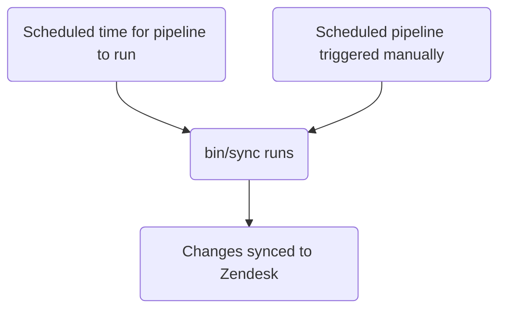

このガイドでは、GitLab における Zendesk のトリガーの作成、編集、管理の方法を説明します。管理者は [管理者向けタスク](#administrator-tasks) のセクションを確認してください。

エージェントが手動で適用する [マクロ](../macros/) とは異なり、トリガーはチケットで更新が発生したときに実行されます。

{}

- デプロイタイプ: `Standard`
- 同期リポジトリ
  - [Zendesk Global](https://gitlab.com/gitlab-support-readiness/zendesk-global/triggers)
  - [Zendesk US Government](https://gitlab.com/gitlab-support-readiness/zendesk-us-government/triggers)
- マネージドコンテンツリポジトリ
  - [Zendesk Global](https://gitlab.com/gitlab-com/support/zendesk-global/triggers)
  - [Zendesk US Government](https://gitlab.com/gitlab-com/support/zendesk-us-government/triggers)
- `CustSuppOps Zendesk Test Suite Generator` 有効

{}

## トリガーを理解する

### トリガーとは

[Zendesk](https://support.zendesk.com/hc/en-us/articles/4408822236058-About-triggers-and-how-they-work) によると次のとおりです。

> トリガーは、チケットが作成または更新された直後に実行される、ユーザーが定義するビジネスルールです。たとえば、チケットがオープンされたときに顧客に通知するためにトリガーを使用できます。また、チケットが解決されたときに顧客に通知するために、別のトリガーを作成することもできます。

### トリガーが Zendesk で実行されるタイミング

Zendesk のトリガーは、チケットで更新が発生するたびに実行されます。これが発生すると、トリガーの完全なリスト（条件に基づいてそのチケットに適用されるもの）がチケットに対して実行されます。

### トリガーは position に基づいて実行される

トリガーは上から下への流れ（つまり、最も低い position から最も高い position へ）で実行されるため、トリガーの position は極めて重要です。

例として、（条件に基づいて）トリガー 2、5、10 がチケットで実行される場合、実行順序はまずトリガー 2、次にトリガー 5、最後にトリガー 10 となります。とはいえ、トリガー 5 がトリガー 10 のマッチを打ち消すようなアクションを実行した場合は、トリガー 2 と 5 のみが実行されます（トリガー 10 はもうマッチしないため）。

### トリガーは条件ロジックを使う

トリガーは条件ロジックを使用します。

- `all`: 配列内のすべての条件が真でなければならない（AND ロジック）
- `any`: 配列内の少なくとも 1 つの条件が真でなければならない（OR ロジック）
- いずれか一方のセットのみ、または両方のセットを使用できます（ただし、少なくとも 1 つのセットを使用する必要があります）

### トリガーの管理方法

Zendesk は UI を介してトリガーを管理する完全な方法を提供していますが、私たちはよりバージョン管理されたやり方を採用しています。これにより、定められたレビュープロセスや、必要に応じてロールバックを実行する能力などが得られます。

そのため、私たちは同期リポジトリとマネージドコンテンツリポジトリを利用しています。

### 同期リポジトリの仕組み

同期リポジトリのワークフローは次のプロセスに従います。



#### 人間が読める形式の置換

{}

- YAML ファイルを介してトリガーを作成・編集する `administrators` にのみ適用されます

{}

現在、同期リポジトリは、人間が読める形式の項目から「Zendesk」相当の項目へ、さまざまな項目の置換を実行できます。これには次のものが含まれます。

| 人間が読める形式の項目 | Zendesk のフィールド項目 | 条件/アクションの場所 | 備考 |
|---------------------|--------------------|-----------------|-------|
| `'Brand: XXX'` | `brand_id` | `value` | `XXX` をブランドの `name` に置き換える |
| `'Field: XXX'` | `custom_fields_xxx` | `field` | `XXX` をチケットフィールドの `title` に置き換える |
| `'Group: XXX'` | `group_id` | `value` | `XXX` をグループの `name` に置き換える |
| `'XXX'` | `role` | `value` | `XXX` をロールタイプの `name`、またはリクエスターのメールアドレスに置き換える |
| `'Form: XXX'` | `ticket_form_id` | `value` | `XXX` をチケットフォームの `name` に置き換える |
| `'Schedule: XXX'` | `set_schedule` | `value` | `XXX` をスケジュールの `name` に置き換える |
| `'Schedule: XXX'` | `schedule_id` | `value` | `XXX` をスケジュールの `name` に置き換える |
| `'XXX'` | `organization_id` | `value` | `XXX` を組織の `salesforce_id` 属性に置き換える |
| `'XXX'` | `assignee_id` | `value` | `XXX` をエージェントのメールアドレスに置き換える |
| `'XXX'` | `satisfaction_reason_code` | `value` | `XXX` を満足度理由の `name` に置き換える |
| `'XXX'` | `via_id` | `value` | `XXX` を via タイプの `name` に置き換える |
| `'XXX'` | `requester_role` | `value` | `XXX` をリクエスターのロールタイプの `name` に置き換える |
| `'Target: XXX'` | `notification_target` | `value` | `XXX` をターゲットの `name` に置き換える |
| `'Webhook: XXX'` | `notification_webhook` | `value` | `XXX` を webhook の `name` に置き換える |

例として、トリガーで `Preferred Region for Support` フィールドの値を `AMER` に変更したい場合、置換を使うには次のようにします。

```yaml
- field: 'Field: Preferred Region for Support'
  value: 'AMER'
```

もう 1 つの例として、チケットのフォームが `SaaS` フォームでないかどうかをチェックする条件が必要な場合は、次のようにします。

```yaml
- field: 'ticket_form_id'
  operator: 'is_not'
  value: 'Form: SaaS'
```

#### 同期リポジトリで MR を作成するとき

同期リポジトリで MR が作成されると、（`bin/compare` スクリプトを介して）比較アクションが実行され、次のことが行われます。

1. マネージドコンテンツリポジトリのクローンを実行します
1. Zendesk インスタンスからすべてのブランド、グループ、満足度理由、スケジュール、ターゲット、チケットフィールド、チケットフォーム、トリガー、webhook を取得します
1. 同期リポジトリ内のすべての YAML ファイルをレビューしてトリガーオブジェクトを生成します
   - また、同期リポジトリのファイルに次の問題のいずれも存在しないことを確認します:
     - title が欠落している
     - `active` 属性が `false` のファイルが `active` フォルダにない
     - `active` 属性が `true` のファイルが `inactive` フォルダにない
     - `title` 属性の重複使用がある
     - `contains_managed_content` 属性が `true` のファイルに対応するマネージドコンテンツファイルがある
     - `contains_managed_webhook` 属性が `true` のファイルに対応するマネージドコンテンツファイルがある
1. YAML ファイルのすべてのトリガーオブジェクトを、マッチする Zendesk 項目と比較します（`title` および `previous_title` 属性の値をチェックして判定）
   - 存在しない場合は、後で使用するために作成オブジェクトを変数に格納します
   - 存在するが属性値が異なる場合は、後で使用するために更新オブジェクトを変数に格納します
1. 比較レポートを出力します

#### Zendesk への同期

同期リポジトリは、プロジェクトのスケジュールされたパイプラインが実行されたとき（正しいタイミング、または手動で実行されたとき）に同期タスクを実行します。

いずれかのアクションが発生すると、同期は [比較アクション](#when-creating-mrs-in-the-sync-repo) を実行し、その後、生成されたオブジェクトを使用して、必要な Zendesk エンドポイントに対するループを介して、必要な作成と更新を実行します。

- [作成](https://developer.zendesk.com/api-reference/ticketing/business-rules/triggers/#create-trigger)
- [更新](https://developer.zendesk.com/api-reference/ticketing/business-rules/triggers/#update-ticket-trigger)

#### 孤立したマネージドコンテンツファイルの報告

2 月、5 月、8 月、11 月の 1 日に、[スケジュールされたパイプライン](https://docs.gitlab.com/ci/pipelines/schedules/) により、同期リポジトリがサポートリーダーシップチーム向けに、孤立したすべてのマネージドコンテンツファイルをレビューするための issue を作成します。

これは同期リポジトリ内の `bin/find_orphaned_files` スクリプトを介して行われ、次のことを実行します。

1. マネージドコンテンツリポジトリのクローンを実行します
1. マネージドコンテンツリポジトリの `active` および `inactive` フォルダ内のすべてのファイルをレビューして、`state`（つまり `active` または `inactive`）、`path`、`title` を判定します
1. 同期リポジトリ自体の `active` および `inactive` フォルダ内のすべてのファイルをレビューして、次を判定します:
   - そのファイルがマネージドコンテンツファイルを使用しているか
   - マネージドコンテンツファイルがあるか
1. 同期リポジトリのファイルのないマネージドコンテンツファイルを見つけた場合は、それを Customer Support リーダーシップに報告する issue を作成します

## 管理者以外がトリガーを作成する

トリガーの作成については、[Feature Request issue](https://gitlab.com/gitlab-com/gl-security/corp/cust-support-ops/issue-tracker/-/issues/new?description_template=Feature) を作成してください（Customer Support Operations チームによる手動の対応が必要なため）。

## 管理者以外がトリガーを編集する

### トリガーで使われるコメントの文言を変更する

トリガーのコメントの文言を編集するには、マネージドコンテンツリポジトリ内の対応するファイルを変更します。`master` ブランチにマージされた後、次のデプロイサイクルで取り込まれて Zendesk にデプロイされます。

### トリガーで使われるペイロードを変更する

トリガーの（マネージド webhook を使用している）ペイロードを編集するには、マネージドコンテンツリポジトリ内の対応するファイルを変更します。`master` ブランチにマージされた後、次のデプロイサイクルで取り込まれて Zendesk にデプロイされます。

### タイトル、コメント以外の文言のアクションなどを変更する

トリガーのその他のものを変更するには、[Feature Request issue](https://gitlab.com/gitlab-com/gl-security/corp/cust-support-ops/issue-tracker/-/issues/new?description_template=Feature) を作成してください（Customer Support Operations チームによる手動の対応が必要なため）。

## 管理者以外がトリガーを無効化する

トリガーの無効化を依頼するには、[Feature Request issue](https://gitlab.com/gitlab-com/gl-security/corp/cust-support-ops/issue-tracker/-/issues/new?description_template=Feature) を作成してください（Customer Support Operations チームによる手動の対応が必要なため）。

## 管理者向けタスク

{}

- このセクション内のすべての項目は、Zendesk への `Administrator` レベルのアクセス権を必要とします。

{}

### トリガーの使用情報を確認する

トリガーの使用情報を確認するには次のようにします。

1. Zendesk インスタンスの管理ダッシュボードに移動します
   - [Zendesk Global (production)](https://gitlab.zendesk.com/admin/home)
   - [Zendesk Global (sandbox)](https://gitlab1707170878.zendesk.com/admin/home)
   - [Zendesk US Government (production)](https://gitlab-federal-support.zendesk.com/admin/home)
   - [Zendesk US Government (sandbox)](https://gitlabfederalsupport1585318082.zendesk.com/admin/home)
1. `Objects and rules > Business rules > Triggers` に移動します
   - [Zendesk Global](https://gitlab.zendesk.com/admin/objects-rules/rules/triggers)
   - [Zendesk Global (sandbox)](https://gitlab1707170878.zendesk.com/admin/objects-rules/rules/triggers)
   - [Zendesk US Government](https://gitlab-federal-support.zendesk.com/admin/objects-rules/rules/triggers)
   - [Zendesk US Government (sandbox)](https://gitlabfederalsupport1585318082.zendesk.com/admin/objects-rules/rules/triggers)
1. トリガーのリストの一番右にあるアイコン（縦長の長方形が 3 つ並んだような形）をクリックします
1. 表示したい使用状況の列をクリックします

### トリガーを作成する

{}

- これは対応するリクエスト issue（Feature Request、Administrative、Bug など）が存在する場合にのみ行ってください。存在しない場合は、まず作成してください（そして対応する前に標準プロセスを通してください）。
- マネージドコンテンツファイルを使用するトリガーを作成する場合は、まずそのマネージドコンテンツファイルを作成する必要があります。

{}

トリガーを作成するには、同期リポジトリで MR を作成する必要があります。加える具体的な変更はリクエスト自体によって異なります。使用できる開始テンプレートは次のとおりです。

```yaml
---
title: 'Your::Title::Here'
previous_title: 'Your::Title::Here'
description: 'Your description here'
active: true
position: 1 # Integer representing trigger position
actions:
- field: 'the_action_to_perform'
  value: 'the_value_to_use'
conditions:
  all:
  - field: 'the_action_to_perform'
    operator: 'the_operator_to_use'
    value: 'the_value_to_use'
  any:
  - field: 'the_action_to_perform'
    operator: 'the_operator_to_use'
    value: 'the_value_to_use'
category_id: 'Name of category'
contains_managed_content: false
contains_managed_email: false
contains_managed_webhook: false
```

ピアが MR をレビューして承認した後、MR をマージできます。次のデプロイが発生すると、Zendesk に同期されます。

### トリガーを編集する

{}

- これは対応するリクエスト issue（Feature Request、Administrative、Bug など）が存在する場合にのみ行ってください。存在しない場合は、まず作成してください（そして対応する前に標準プロセスを通してください）。
- トリガーの `contains_managed_content` または `contains_managed_webhook` 属性を `false` から `true` に変更する場合は、まずそのマネージドコンテンツファイルを作成する必要があります。
- トリガーの `contains_managed_content` または `contains_managed_webhook` 属性を `true` から `false` に変更する場合は、対応するマネージドコンテンツファイルを削除するフォローアップ MR を作成する必要があります。

{}

トリガーを編集するには、同期リポジトリで MR を作成する必要があります。加える具体的な変更はリクエスト自体によって異なります。

ピアが MR をレビューして承認した後、MR をマージできます。次のデプロイが発生すると、Zendesk に同期されます。

#### トリガーのタイトルを変更する

トリガーのタイトルを変更する必要がある場合は、現在の値を `previous_title` 属性にコピーしてから `title` 属性を変更します。これにより、同期は依然として該当するトリガーを見つけて更新できます。

### トリガーを無効化する

{}

- これは対応するリクエスト issue（Feature Request、Administrative、Bug など）が存在する場合にのみ行ってください。存在しない場合は、まず作成してください（そして対応する前に標準プロセスを通してください）。
- トリガーがマネージドコンテンツファイルを使用していた場合（つまり、YAML ファイル内の `contains_managed_content` または `contains_managed_webhook` 属性が以前 `true` に設定されていた場合）、マネージドコンテンツリポジトリ内の対応するファイルも `active` から `inactive` の場所へ移動する必要があるでしょう。

{}

トリガーを無効化するには、同期リポジトリで MR を作成する必要があります。この MR では、該当するトリガーの YAML ファイルに対して次のことを行う必要があります。

1. ファイルを `active` から `inactive` のパスへ移動する
1. `active` 属性の値を `false` に変更する
1. `actions` の値を次のように変更する:
   - Zendesk Global の場合:

     ```yaml
     - field: 'brand_id'
       value: 'GitLab Support'
     ```

   - Zendesk US Government の場合:

     ```yaml
     - field: 'brand_id'
       value: 'GitLab'
     ```

1. `conditions` の値を次のように変更する:
   - Zendesk Global の場合:

     ```yaml
     all:
       - field: 'brand_id'
         operator: 'is_not'
         value: 'GitLab Support'
       - field: 'brand_id'
         operator: 'is_not'
         value: 'GitLab - Internal'
     any: []
     ```

   - Zendesk US Government の場合:

     ```yaml
     all:
       - field: 'brand_id'
         operator: 'is_not'
         value: 'GitLab'
       - field: 'brand_id'
         operator: 'is_not'
         value: 'GitLab - Internal'
     any: []
     ```

1. `contains_managed_content` 属性の値を `false` に変更する
1. `contains_managed_webhook` 属性の値を `false` に変更する

ピアが MR をレビューして承認した後、MR をマージできます。次のデプロイが発生すると、Zendesk に同期されます。

### トリガーを削除する

{}

- トリガーは無効化されている場合のみ削除できます。
- これは対応するリクエスト issue（Feature Request、Administrative、Bug など）が存在する場合にのみ行ってください。存在しない場合は、まず作成してください（そして対応する前に標準プロセスを通してください）。
- トリガーを削除する際は、同期リポジトリとマネージドコンテンツリポジトリからもファイルを削除する必要があるでしょう。

{}

同期リポジトリは削除を行わないため、これは Zendesk 自体を介して行う必要があります。

トリガーを削除するには次のようにします。

1. Zendesk インスタンスの管理ダッシュボードに移動します
   - [Zendesk Global (production)](https://gitlab.zendesk.com/admin/home)
   - [Zendesk Global (sandbox)](https://gitlab1707170878.zendesk.com/admin/home)
   - [Zendesk US Government (production)](https://gitlab-federal-support.zendesk.com/admin/home)
   - [Zendesk US Government (sandbox)](https://gitlabfederalsupport1585318082.zendesk.com/admin/home)
1. `Objects and rules > Business rules > Triggers` に移動します
   - [Zendesk Global](https://gitlab.zendesk.com/admin/objects-rules/rules/triggers)
   - [Zendesk Global (sandbox)](https://gitlab1707170878.zendesk.com/admin/objects-rules/rules/triggers)
   - [Zendesk US Government](https://gitlab-federal-support.zendesk.com/admin/objects-rules/rules/triggers)
   - [Zendesk US Government (sandbox)](https://gitlabfederalsupport1585318082.zendesk.com/admin/objects-rules/rules/triggers)
1. 削除したいトリガーを見つけて、その右にある縦に並んだ 3 つの点をクリックします
   - 使用しているフィルターを変更する必要があるでしょう
1. `Delete` をクリックします
1. `Delete trigger` をクリックして変更を送信します

### 例外デプロイを実行する

トリガーの例外デプロイを実行するには、該当するトリガーの同期プロジェクトに移動し、スケジュールされたパイプラインのページに移動して、同期項目の再生ボタンをクリックします。これにより、トリガーの同期ジョブがトリガーされます。

## よくある問題とトラブルシューティング

### マージ後にトリガーの変更が反映されない

トリガーは `Standard` のデプロイタイプに従うため、通常のデプロイサイクル中（または例外デプロイが行われたとき）にのみデプロイされます。
