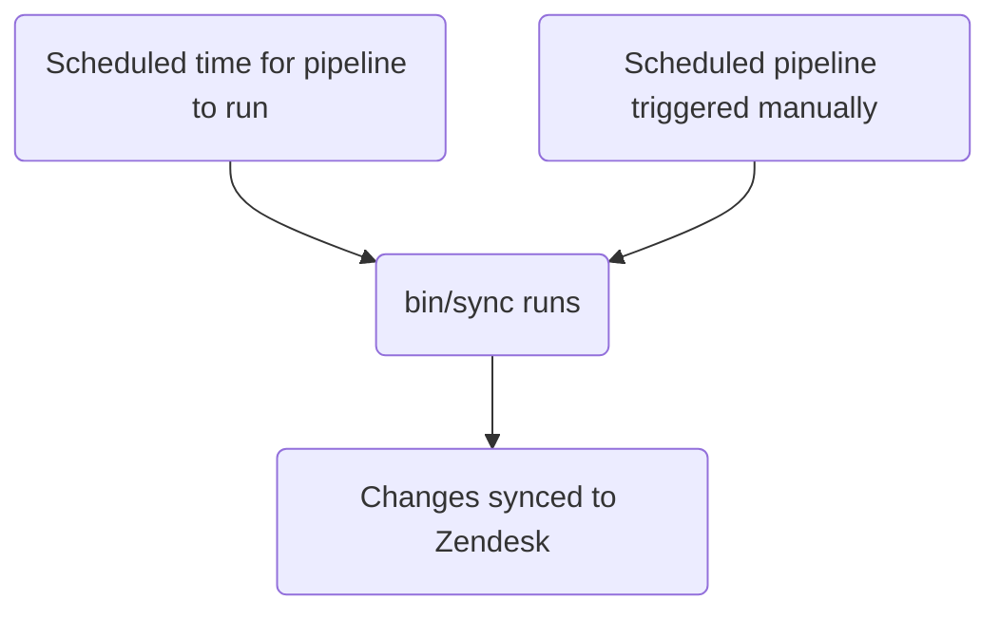

このガイドでは、GitLab で Zendesk のトリガーを作成、編集、管理する方法を説明します。管理者は [管理者タスク](#administrator-tasks) のセクションを確認してください。

エージェントが手動で適用する [マクロ](../macros/) とは異なり、トリガーはチケットに対して更新が発生したときに実行されます。

{}

- デプロイタイプ: `Standard`
- Sync repos
  - [Zendesk Global](https://gitlab.com/gitlab-support-readiness/zendesk-global/triggers)
  - [Zendesk US Government](https://gitlab.com/gitlab-support-readiness/zendesk-us-government/triggers)
- Managed content repos
  - [Zendesk Global](https://gitlab.com/gitlab-com/support/zendesk-global/triggers)
  - [Zendesk US Government](https://gitlab.com/gitlab-com/support/zendesk-us-government/triggers)
- `CustSuppOps Zendesk Test Suite Generator` が有効

{}

## トリガーを理解する

### トリガーとは

[Zendesk](https://support.zendesk.com/hc/en-us/articles/4408822236058-About-triggers-and-how-they-work) によると:

> トリガーは、チケットが作成または更新された直後に実行される、ユーザーが定義したビジネスルールです。たとえば、チケットがオープンされたときに顧客へ通知するためにトリガーを使用できます。また、チケットが解決されたときに顧客へ通知するために別のトリガーを作成することもできます。

### Zendesk でトリガーが実行されるタイミング

Zendesk のトリガーは、チケットに対して更新が発生するたびに実行されます。これが発生すると、（条件に基づいてチケットに適用される）トリガーの全リストがそのチケットに対して実行されます。

### トリガーは position に基づいて実行される

トリガーは上から下への流れ（つまり最も小さい position から最も大きい position へ）で実行されるため、position はきわめて重要です。

例として、（条件に基づいて）トリガー 2、5、10 がチケットに対して実行される場合、実行順序はまずトリガー 2、次にトリガー 5、最後にトリガー 10 となります。とはいえ、トリガー 5 がトリガー 10 のマッチを無効にするアクションを実行した場合は、トリガー 2 と 5 のみが実行されます（トリガー 10 はもうマッチしなくなるため）。

### トリガーは条件ロジックを使用する

トリガーは条件ロジックを使用します:

- `all`: 配列内の **すべて** の条件が真でなければならない（AND ロジック）
- `any`: 配列内の **少なくとも 1 つ** の条件が真でなければならない（OR ロジック）
- どちらか一方のセットのみ、または両方のセットを使用できます（ただし少なくとも 1 つのセットは使用しなければなりません）

### トリガーの管理方法

Zendesk は UI 経由でトリガーを管理する完全な手段を提供していますが、私たちはよりバージョン管理された方法論を採用しています。これにより、定められたレビュープロセスや、必要に応じたロールバックの実行などが可能になります。

そのため、私たちは sync repos と managed content repos を活用しています。

### sync repo の仕組み

sync repo のワークフローは次のプロセスに従います:



#### 人間が読める形式の置換

{}

- YAML ファイル経由でトリガーを作成・編集する `administrators` にのみ適用されます

{}

現在、sync repo はさまざまな項目を、人間が読める形式の項目から「Zendesk」の同等項目へ置換できます。これには以下が含まれます:

| 人間が読める項目 | Zendesk フィールド項目 | 条件/アクションの場所 | 備考 |
|---------------------|--------------------|-----------------|-------|
| `'Brand: XXX'` | `brand_id` | `value` | `XXX` をブランドの `name` に置き換える |
| `'Field: XXX'` | `custom_fields_xxx` | `field` | `XXX` をチケットフィールドの `title` に置き換える |
| `'Group: XXX'` | `group_id` | `value` | `XXX` をグループの `name` に置き換える |
| `'XXX'` | `role` | `value` | `XXX` をロールタイプの `name` または依頼者のメールアドレスに置き換える |
| `'Form: XXX'` | `ticket_form_id` | `value` | `XXX` をチケットフォームの `name` に置き換える |
| `'Schedule: XXX'` | `set_schedule` | `value` | `XXX` をスケジュールの `name` に置き換える |
| `'Schedule: XXX'` | `schedule_id` | `value` | `XXX` をスケジュールの `name` に置き換える |
| `'XXX'` | `organization_id` | `value` | `XXX` を組織の `salesforce_id` 属性に置き換える |
| `'XXX'` | `assignee_id` | `value` | `XXX` をエージェントのメールアドレスに置き換える |
| `'XXX'` | `satisfaction_reason_code` | `value` | `XXX` を満足度理由の `name` に置き換える |
| `'XXX'` | `via_id` | `value` | `XXX` を via タイプの `name` に置き換える |
| `'XXX'` | `requester_role` | `value` | `XXX` を依頼者ロールタイプの `name` に置き換える |
| `'Target: XXX'` | `notification_target` | `value` | `XXX` をターゲットの `name` に置き換える |
| `'Webhook: XXX'` | `notification_webhook` | `value` | `XXX` を webhook の `name` に置き換える |

例として、トリガーで `Preferred Region for Support` フィールドの値を `AMER` に変更したい場合は、置換を使用するために次のように記述します:

```yaml
- field: 'Field: Preferred Region for Support'
  value: 'AMER'
```

別の例として、チケットのフォームが `SaaS` フォームではないことをチェックする条件が必要な場合は、次のように記述します:

```yaml
- field: 'ticket_form_id'
  operator: 'is_not'
  value: 'Form: SaaS'
```

#### sync repo で MR を作成するとき

sync repo で MR が作成されると、（`bin/compare` スクリプト経由で）compare アクションが実行され、次の処理が行われます:

1. managed content repo のクローンを実行する
1. Zendesk インスタンスからすべてのブランド、グループ、満足度理由、スケジュール、ターゲット、チケットフィールド、チケットフォーム、トリガー、webhook を取得する
1. sync repo 内のすべての YAML ファイルをレビューしてトリガーオブジェクトを生成する
   - また、sync repo のファイルに以下の問題が存在しないことを確認する:
     - title が欠落している
     - `active` 属性が `false` のファイルが `active` フォルダーにない
     - `active` 属性が `true` のファイルが `inactive` フォルダーにない
     - `title` 属性の重複した使用がない
     - `contains_managed_content` 属性が `true` のファイルに対応する managed content ファイルがある
     - `contains_managed_webhook` 属性が `true` のファイルに対応する managed content ファイルがある
1. YAML ファイルのすべてのトリガーオブジェクトを、マッチする Zendesk 項目と比較する（`title` および `previous_title` 属性の値をチェックして判定する）
   - 存在しない場合は、後で使用するために create オブジェクトを変数に格納する
   - 存在するが属性値が異なる場合は、後で使用するために update オブジェクトを変数に格納する
1. 比較レポートを出力する

#### Zendesk への同期

sync repo は、プロジェクトのスケジュールされたパイプラインが実行されたとき（正しいタイミングまたは手動実行のいずれか）に同期タスクを実行します。

いずれかのアクションが発生すると、同期は [compare アクション](#when-creating-mrs-in-the-sync-repo) を実行し、その後生成されたオブジェクトを使用して、必要な Zendesk エンドポイントにアクセスするループ経由で必要な作成・更新を実行します:

- [Creates](https://developer.zendesk.com/api-reference/ticketing/business-rules/triggers/#create-trigger)
- [Updates](https://developer.zendesk.com/api-reference/ticketing/business-rules/triggers/#update-ticket-trigger)

#### 孤立した managed content ファイルの報告

2 月、5 月、8 月、11 月の 1 日に、[スケジュールされたパイプライン](https://docs.gitlab.com/ci/pipelines/schedules/) が、サポートリーダーシップチームがすべての孤立した managed content ファイルをレビューするための Issue を sync repo に作成させます。

これは sync repo の `bin/find_orphaned_files` スクリプト経由で行われ、次の処理を実行します:

1. managed content repo のクローンを実行する
1. managed content repo の `active` および `inactive` フォルダー内のすべてのファイルをレビューして、`state`（つまり `active` または `inactive`）、`path`、`title` を判定する
1. sync repo 自体の `active` および `inactive` フォルダー内のすべてのファイルをレビューして、以下を判定する:
   - そのファイルが managed content ファイルを使用しているか
   - managed content ファイルが存在するか
1. sync repo ファイルのない managed content ファイルを見つけた場合は、それを Customer Support リーダーシップに報告する Issue を作成する

## 管理者以外がトリガーを作成する

トリガーの作成については、[Feature Request issue](https://gitlab.com/gitlab-com/gl-security/corp/cust-support-ops/issue-tracker/-/issues/new?description_template=Feature) を作成してください（Customer Support Operations チームによる手動対応が必要となるため）。

## 管理者以外がトリガーを編集する

### トリガーで使用されているコメント文言の変更

トリガー内のコメント文言を編集するには、managed content repo の対応するファイルを修正します。`master` ブランチにマージされた後、次のデプロイサイクルで取り込まれ、Zendesk にデプロイされます。

### トリガーで使用されているペイロードの変更

トリガー内のペイロード（managed webhook を使用しているもの）を編集するには、managed content repo の対応するファイルを修正します。`master` ブランチにマージされた後、次のデプロイサイクルで取り込まれ、Zendesk にデプロイされます。

### title、コメント以外の文言アクションなどの変更

トリガー内のその他のものを変更するには、[Feature Request issue](https://gitlab.com/gitlab-com/gl-security/corp/cust-support-ops/issue-tracker/-/issues/new?description_template=Feature) を作成してください（Customer Support Operations チームによる手動対応が必要となるため）。

## 管理者以外がトリガーを無効化する

トリガーの無効化を依頼するには、[Feature Request issue](https://gitlab.com/gitlab-com/gl-security/corp/cust-support-ops/issue-tracker/-/issues/new?description_template=Feature) を作成してください（Customer Support Operations チームによる手動対応が必要となるため）。

## 管理者タスク

{}

- このセクションのすべての項目には、Zendesk への `Administrator` レベルのアクセスが必要です。

{}

### トリガーの使用状況情報を確認する

トリガーの使用状況情報を確認するには:

1. Zendesk インスタンスの管理ダッシュボードに移動する
   - [Zendesk Global (production)](https://gitlab.zendesk.com/admin/home)
   - [Zendesk Global (sandbox)](https://gitlab1707170878.zendesk.com/admin/home)
   - [Zendesk US Government (production)](https://gitlab-federal-support.zendesk.com/admin/home)
   - [Zendesk US Government (sandbox)](https://gitlabfederalsupport1585318082.zendesk.com/admin/home)
1. `Objects and rules > Business rules > Triggers` に移動する
   - [Zendesk Global](https://gitlab.zendesk.com/admin/objects-rules/rules/triggers)
   - [Zendesk Global (sandbox)](https://gitlab1707170878.zendesk.com/admin/objects-rules/rules/triggers)
   - [Zendesk US Government](https://gitlab-federal-support.zendesk.com/admin/objects-rules/rules/triggers)
   - [Zendesk US Government (sandbox)](https://gitlabfederalsupport1585318082.zendesk.com/admin/objects-rules/rules/triggers)
1. トリガーリストの一番右にあるアイコン（縦長の長方形が 3 つ並んだように見える）をクリックする
1. 表示したい使用状況の列をクリックする

### トリガーを作成する

{}

- これは対応するリクエスト Issue（Feature Request、Administrative、Bug など）がある場合にのみ実施してください。存在しない場合は、まず作成し、対応する前に標準プロセスを通してください。
- managed content ファイルを使用するトリガーを作成する場合は、先にその managed content ファイルを作成しなければなりません。

{}

トリガーを作成するには、sync repo で MR を作成する必要があります。実際に行う変更はリクエスト自体によって異なります。利用できる開始用テンプレートは次のとおりです:

```yaml
---
title: 'Your::Title::Here'
previous_title: 'Your::Title::Here'
description: 'Your description here'
active: true
position: 1 # Integer representing trigger position
actions:
- field: 'the_action_to_perform'
  value: 'the_value_to_use'
conditions:
  all:
  - field: 'the_action_to_perform'
    operator: 'the_operator_to_use'
    value: 'the_value_to_use'
  any:
  - field: 'the_action_to_perform'
    operator: 'the_operator_to_use'
    value: 'the_value_to_use'
category_id: 'Name of category'
contains_managed_content: false
contains_managed_email: false
contains_managed_webhook: false
```

ピアがあなたの MR をレビューして承認した後、MR をマージできます。次のデプロイが発生したときに、Zendesk に同期されます。

### トリガーを編集する

{}

- これは対応するリクエスト Issue（Feature Request、Administrative、Bug など）がある場合にのみ実施してください。存在しない場合は、まず作成し、対応する前に標準プロセスを通してください。
- トリガーの `contains_managed_content` または `contains_managed_webhook` 属性を `false` から `true` に変更する場合は、先にその managed content ファイルを作成しなければなりません。
- トリガーの `contains_managed_content` または `contains_managed_webhook` 属性を `true` から `false` に変更する場合は、対応する managed content ファイルを削除するためのフォローアップ MR を作成してください。

{}

トリガーを編集するには、sync repo で MR を作成する必要があります。実際に行う変更はリクエスト自体によって異なります。

ピアがあなたの MR をレビューして承認した後、MR をマージできます。次のデプロイが発生したときに、Zendesk に同期されます。

#### トリガーの title を変更する

トリガーの title を変更する必要がある場合は、現在の値を `previous_title` 属性にコピーしてから `title` 属性を変更します。これにより、同期が対象のトリガーを引き続き見つけて更新できます。

### トリガーを無効化する

{}

- これは対応するリクエスト Issue（Feature Request、Administrative、Bug など）がある場合にのみ実施してください。存在しない場合は、まず作成し、対応する前に標準プロセスを通してください。
- トリガーが managed content ファイルを使用していた場合（つまり YAML ファイルの `contains_managed_content` または `contains_managed_webhook` 属性が以前 `true` に設定されていた場合）、managed content repo で対応するファイルを `active` から `inactive` の場所に移動する必要が生じる可能性が高いです。

{}

トリガーを無効化するには、sync repo で MR を作成する必要があります。この MR では、対応するトリガーの YAML ファイルに対して次の処理を行ってください:

1. ファイルを `active` から `inactive` のパスに移動する
1. `active` 属性の値を `false` に変更する
1. `actions` の値を次のように変更する:
   - Zendesk Global の場合:

     ```yaml
     - field: 'brand_id'
       value: 'GitLab Support'
     ```

   - Zendesk US Government の場合:

     ```yaml
     - field: 'brand_id'
       value: 'GitLab'
     ```

1. `conditions` の値を次のように変更する:
   - Zendesk Global の場合:

     ```yaml
     all:
       - field: 'brand_id'
         operator: 'is_not'
         value: 'GitLab Support'
       - field: 'brand_id'
         operator: 'is_not'
         value: 'GitLab - Internal'
     any: []
     ```

   - Zendesk US Government の場合:

     ```yaml
     all:
       - field: 'brand_id'
         operator: 'is_not'
         value: 'GitLab'
       - field: 'brand_id'
         operator: 'is_not'
         value: 'GitLab - Internal'
     any: []
     ```

1. `contains_managed_content` 属性の値を `false` に変更する
1. `contains_managed_webhook` 属性の値を `false` に変更する

ピアがあなたの MR をレビューして承認した後、MR をマージできます。次のデプロイが発生したときに、Zendesk に同期されます。

### トリガーを削除する

{}

- トリガーは無効化されている場合のみ削除できます。
- これは対応するリクエスト Issue（Feature Request、Administrative、Bug など）がある場合にのみ実施してください。存在しない場合は、まず作成し、対応する前に標準プロセスを通してください。
- トリガーを削除する場合、sync repo と managed content repo の両方からファイルを削除する必要が生じる可能性が高いです。

{}

sync repo は削除を実行しないため、これは Zendesk 自体で行う必要があります。

トリガーを削除するには:

1. Zendesk インスタンスの管理ダッシュボードに移動する
   - [Zendesk Global (production)](https://gitlab.zendesk.com/admin/home)
   - [Zendesk Global (sandbox)](https://gitlab1707170878.zendesk.com/admin/home)
   - [Zendesk US Government (production)](https://gitlab-federal-support.zendesk.com/admin/home)
   - [Zendesk US Government (sandbox)](https://gitlabfederalsupport1585318082.zendesk.com/admin/home)
1. `Objects and rules > Business rules > Triggers` に移動する
   - [Zendesk Global](https://gitlab.zendesk.com/admin/objects-rules/rules/triggers)
   - [Zendesk Global (sandbox)](https://gitlab1707170878.zendesk.com/admin/objects-rules/rules/triggers)
   - [Zendesk US Government](https://gitlab-federal-support.zendesk.com/admin/objects-rules/rules/triggers)
   - [Zendesk US Government (sandbox)](https://gitlabfederalsupport1585318082.zendesk.com/admin/objects-rules/rules/triggers)
1. 削除したいトリガーを見つけ、その右にある縦に並んだ 3 つの点をクリックする
   - 使用中のフィルターを変更する必要が生じる可能性が高いです
1. `Delete` をクリックする
1. `Delete trigger` をクリックして変更を送信する

### 例外デプロイを実行する

トリガーの例外デプロイを実行するには、対象のトリガー sync プロジェクトに移動し、スケジュールされたパイプラインのページに移動して、sync 項目の再生ボタンをクリックします。これにより、トリガーの同期ジョブがトリガーされます。

## よくある問題とトラブルシューティング

### マージ後にトリガーの変更が反映されない

トリガーは `Standard` のデプロイタイプに従うため、通常のデプロイサイクル中（または例外デプロイが実施されたとき）にのみデプロイされます。
