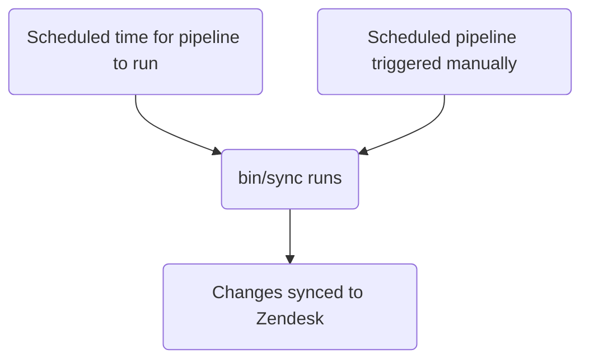

このガイドでは、GitLab における Zendesk ビューの作成、編集、管理の方法を説明します。既存のビューを変更したいサポートエージェントの方は、[ビューで使用するフィールド、グループ化、並べ替えの変更](#changing-the-fields-grouping-or-sorting-used-in-a-view)を参照してください。管理者の方は、[管理者向けタスク](#administrator-tasks)のセクションを確認してください。

{}

- デプロイタイプ: `Standard`
- 同期リポジトリ
  - [Zendesk Global](https://gitlab.com/gitlab-support-readiness/zendesk-global/views)
  - [Zendesk US Government](https://gitlab.com/gitlab-support-readiness/zendesk-us-government/views)
- 管理コンテンツリポジトリ
  - [Zendesk Global](https://gitlab.com/gitlab-com/support/zendesk-global/views)
  - [Zendesk US Government](https://gitlab.com/gitlab-com/support/zendesk-us-government/views)
- `CustSuppOps Zendesk Test Suite Generator` 有効

{}

## ビューを理解する

### ビューとは何か

[Zendesk](https://support.zendesk.com/hc/en-us/articles/4408888828570-Creating-views-to-build-customized-lists-of-tickets) によると:

> ビューとは、一定の条件に基づいてチケットをリストにグループ化することで整理する方法です。たとえば、自分に割り当てられた未解決のチケット用のビュー、トリアージが必要な新規チケット用のビュー、返信待ちの保留中チケット用のビューなどを作成できます。ビューを使うことで、あなたやチームの対応が必要なチケットを把握し、それに応じて計画を立てやすくなります。

### ビューの種類

現在、Zendesk には 3 種類のビューがあります:

- Default: Zendesk によって作成済みの定義済みビュー
- Shared: Zendesk 管理者（すなわち Customer Support Operations）が作成したビュー
- Personal: あなた自身が作成し、あなただけが利用できるビュー

### ビューの制限

現在、Zendesk のビューにはいくつかの制限があります:

- ビューは「定義された」条件以外を使用できません。つまり、選択可能なデータでなければなりません（たとえばテキストフィールドは機能しません）。
- ビューには[アーカイブされたチケット](https://support.zendesk.com/hc/en-us/articles/4408887617050-About-ticket-archiving)（すなわち 120 日経過後のクローズ済みチケット）は含まれません。

### ビューはネストできる

ビューのタイトルにダブルコロン（すなわち `::`）を使用することで、ビューを互いにネストできます。

たとえば、次のビューがあるとします:

- Support Agents Tier 1 Normal tickets
- Support Agents Tier 1 Escalated tickets
- Support Agents Tier 2 Normal tickets
- Support Agents Tier 2 Escalated tickets
- Support Agents Tier 3 Normal tickets
- Support Agents Tier 3 Escalated tickets

これらを次のように名前変更できます:

- Support Agents::Tier 1::Normal tickets
- Support Agents::Tier 1::Escalated tickets
- Support Agents::Tier 2::Normal tickets
- Support Agents::Tier 2::Escalated tickets
- Support Agents::Tier 3::Normal tickets
- Support Agents::Tier 3::Escalated tickets

その結果、ビューは次のように表示されます:

- Support Agents
  - Tier 1
    - Normal tickets
    - Escalated tickets
  - Tier 2
    - Normal tickets
    - Escalated tickets
  - Tier 3
    - Normal tickets
    - Escalated tickets

上記において、`Support Agents`、`Tier 1`、`Tier 2`、`Tier 3` は実際にはビューではありません（ネスト表示のためのカテゴリです）。ファイル構造のように考えてください（カテゴリがフォルダ、実際のビューがファイルに相当します）。

### ビューは条件ロジックを使用する

ビューは条件ロジックを使用します:

- `all`: 配列内のすべての条件が真である必要があります（AND ロジック）
- `any`: 配列内の少なくとも 1 つの条件が真である必要があります（OR ロジック）
- どちらか一方のセットのみ、または両方のセットを使用できます（ただし少なくとも 1 つのセットを使用する必要があります）

### ビューの管理方法

Zendesk は UI 経由でビューを管理する完全な方法を提供していますが、私たちはよりバージョン管理されたメソドロジーを採用しています。これにより、定められたレビュープロセス、必要に応じたロールバックの実行などが可能になります。

そのため、私たちは同期リポジトリと管理コンテンツリポジトリを利用しています。

### 同期リポジトリの仕組み

同期リポジトリのワークフローは次のプロセスに従います:



#### 人間が読める形式の置換

{}

- `administrators` が YAML ファイル経由でビューを作成・編集する場合にのみ適用されます

{}

現在、同期リポジトリは、人間が読める形式の各種項目を「Zendesk」相当の項目へ置換できます。これには次のものが含まれます:

| 人間が読める項目 | Zendesk フィールド項目 | 条件の場所 | 備考 |
|---------------------|--------------------|--------------------|-------|
| `'Brand: XXX'` | `brand_id` | `value` | `XXX` をブランドの `name` に置き換える |
| `'Field: XXX'` | `custom_fields_xxx` | `field` | `XXX` をチケットフィールドの `title` に置き換える |
| `'Group: XXX'` | `group_id` | `value` | `XXX` をグループの `name` に置き換える |
| `'XXX'` | `role` | `value` | `XXX` をロールタイプの `name`、またはリクエスターのメールアドレスに置き換える |
| `'Form: XXX'` | `ticket_form_id` | `value` | `XXX` をチケットフォームの `name` に置き換える |
| `'Schedule: XXX'` | `set_schedule` | `value` | `XXX` をスケジュールの `name` に置き換える |
| `'Schedule: XXX'` | `schedule_id` | `value` | `XXX` をスケジュールの `name` に置き換える |
| `'XXX'` | `organization_id` | `value` | `XXX` をオーガニゼーションの `salesforce_id` 属性に置き換える |
| `'XXX'` | `assignee_id` | `value` | `XXX` をエージェントのメールアドレスに置き換える |
| `'XXX'` | `satisfaction_reason_code` | `value` | `XXX` を満足度理由の `name` に置き換える |
| `'XXX'` | `via_id` | `value` | `XXX` を経由タイプの `name` に置き換える |
| `'XXX'` | `requester_role` | `value` | `XXX` をリクエスターのロールタイプの `name` に置き換える |
| `'Target: XXX'` | `notification_target` | `value` | `XXX` をターゲットの `name` に置き換える |
| `'Webhook: XXX'` | `notification_webhook` | `value` | `XXX` をウェブフックの `name` に置き換える |

また、[制限オブジェクト](#view-restriction-objects)内でも変換を行えます（詳細はそのセクションを参照してください）。

たとえば、チケットのフォームが `SaaS` フォームでないかどうかをチェックする条件を作りたい場合は、次のようにします:

```yaml
- field: 'ticket_form_id'
  operator: 'is_not'
  value: 'Form: SaaS'
```

#### 同期リポジトリで MR を作成する場合

同期リポジトリで MR が作成されると、（`bin/compare` スクリプト経由で）比較アクションが実行され、次の処理が行われます:

1. 管理コンテンツリポジトリのクローンを実行します
1. Zendesk インスタンスからすべてのブランド、グループ、満足度理由、スケジュール、ターゲット、チケットフィールド、チケットフォーム、ビュー、ウェブフックを取得します
1. 同期リポジトリ内のすべての YAML ファイルをレビューしてビューオブジェクトを生成します
   - また、同期リポジトリのファイルに次の問題が存在しないことも確認します:
     - タイトルが欠落している
     - ポジションが欠落している
     - `active` 属性が `false` のファイルが `active` フォルダにない
     - `active` 属性が `true` のファイルが `inactive` フォルダにない
     - `title` 属性が重複して使用されている
     - `contains_managed_content` 属性が `true` のファイルに対応する管理コンテンツファイルがある
     - `contains_managed_webhook` 属性が `true` のファイルに対応する管理コンテンツファイルがある
1. YAML ファイルのすべてのビューオブジェクトを、対応する Zendesk 項目（`title` 属性と `previous_title` 属性の値をチェックして判定）と比較します
   - 該当するものがなければ、後で使用するために作成オブジェクトを変数に格納します
   - 該当するものはあるが属性値が異なる場合は、後で使用するために更新オブジェクトを変数に格納します
1. 比較レポートを出力します

#### Zendesk への同期

同期リポジトリは、プロジェクトのスケジュールパイプラインが実行されたとき（適切なタイミング、または手動実行のいずれか）に同期タスクを実行します。

いずれかのアクションが発生すると、同期は[比較アクション](#when-creating-mrs-in-the-sync-repo)を実行し、生成されたオブジェクトを使用して、必要な Zendesk エンドポイントへのループ処理により必要な作成・更新を行います:

- [作成](https://developer.zendesk.com/api-reference/ticketing/business-rules/views/#create-view)
- [更新](https://developer.zendesk.com/api-reference/ticketing/business-rules/views/#update-view)

#### 孤立した管理コンテンツファイルの報告

2 月、5 月、8 月、11 月の 1 日に、[スケジュールパイプライン](https://docs.gitlab.com/ci/pipelines/schedules/)により、同期リポジトリがサポートリーダーシップチーム向けに Issue を作成し、孤立したすべての管理コンテンツファイルをレビューしてもらいます。

これは同期リポジトリ内の `bin/find_orphaned_files` スクリプト経由で行われ、次の処理を行います:

1. 管理コンテンツリポジトリのクローンを実行します
1. 管理コンテンツリポジトリの `active` フォルダと `inactive` フォルダ内のすべてのファイルをレビューし、`state`（すなわち `active` または `inactive`）、`path`、`title` を判定します
1. 同期リポジトリ自体の `active` フォルダと `inactive` フォルダ内のすべてのファイルをレビューし、次を判定します:
   - そのファイルが管理コンテンツファイルを使用しているか
   - 管理コンテンツファイルが存在するか
1. 同期リポジトリのファイルを持たない管理コンテンツファイルを見つけた場合、それを Customer Support リーダーシップに報告する Issue を作成します

## 非管理者がパーソナルビューを作成する

{}

- あなたが Zendesk の管理者である場合、非パーソナルビューを作成する権限を持っているため、これを行う際は注意してください。

{}

Zendesk でパーソナルビューを作成するには:

1. 新規ビューのページを開きます
   - [Zendesk Global（本番）](https://gitlab.zendesk.com/admin/workspaces/agent-workspace/views/new)
   - [Zendesk Global（サンドボックス）](https://gitlab1707170878.zendesk.com/admin/workspaces/agent-workspace/views/new)
   - [Zendesk US Government（本番）](https://gitlab-federal-support.zendesk.com/admin/workspaces/agent-workspace/views/new)
   - [Zendesk US Government（サンドボックス）](https://gitlabfederalsupport1585318082.zendesk.com/admin/workspaces/agent-workspace/views/new)
1. ビューの名前を入力します
1. ビューの説明を入力します（任意）
1. 管理者の場合は、`Who has access` セクションで `Only you` が選択されていることを確認します
1. ビューの条件（すなわち使用するフィルター）を入力します
1. ビューに表示するフィールドを入力します
1. ビューのグループ化情報を入力します
1. ビューの並べ替え情報を入力します
1. ページ右下の `Save` ボタンをクリックします

## 非管理者が非パーソナルビューを作成する

ビューの作成については、[機能リクエスト Issue](https://gitlab.com/gitlab-com/gl-security/corp/cust-support-ops/issue-tracker/-/issues/new?description_template=Feature) を作成してください（Customer Support Operations チームによる手動の対応が必要なため）。

## 非管理者がパーソナルビューを編集する

既存のパーソナルビューを編集するには:

1. 対象のビューに移動します
1. ページ右上の `Actions` ボタンをクリックします
1. `Edit view` をクリックします
1. 必要な変更を行います
1. ページ右下の `Save` ボタンをクリックします

## 非管理者が非パーソナルビューを編集する

### ビューで使用するフィールド、グループ化、並べ替えの変更

ビューで使用するフィールド、グループ化、並べ替えを編集するには、管理コンテンツリポジトリ内の対応するファイルを変更します。`master` ブランチにマージされた後、次のデプロイサイクルで取り込まれ Zendesk にデプロイされます。

### タイトル、ポジションなどの変更

ビュー内のその他のものを変更するには、[機能リクエスト Issue](https://gitlab.com/gitlab-com/gl-security/corp/cust-support-ops/issue-tracker/-/issues/new?description_template=Feature) を作成してください（Customer Support Operations チームによる手動の対応が必要なため）。

## 非管理者がビューを無効化する

ビューの無効化をリクエストするには、[機能リクエスト Issue](https://gitlab.com/gitlab-com/gl-security/corp/cust-support-ops/issue-tracker/-/issues/new?description_template=Feature) を作成してください（Customer Support Operations チームによる手動の対応が必要なため）。

## 管理者向けタスク

{}

- このセクションのすべての項目には、Zendesk への `Administrator` レベルのアクセスが必要です。

{}

### ビューの制限オブジェクト

ビューは、特定のエージェントのセットに対してのみ表示されるよう制限できます。これは制限オブジェクト経由で行います。

私たちの同期リポジトリはパーソナルビューを管理しないため、このオブジェクトで見かける用途は、`null`（または空白）値か、グループ制限のいずれかのみです。

誰に対してもビューを制限しない場合、オブジェクトの値全体は `null`（または空白）になります。

ビューの表示をグループに限定する場合、オブジェクトの形式は次のとおりです:

```yaml
restriction:
  type: Group
  id: 'Name of group 1'
  ids:
  - 'Name of group 1'
  - 'Name of group 2'
  - 'Name of group 3'
```

同期リポジトリが並べ替えなどを処理するため、`ids` 配列の順序（または `id` 属性に入る具体的な値）は重要ではありません（`ids` にリストされたグループのいずれかが `id` に存在している限り）。`id` の値に何を入れるか迷った場合は、アルファベット順で最初に来るものを使用してください。

たとえば、`Support Ops` グループのみが閲覧できるようにビューを制限するには、次を使用します:

```yaml
restriction:
  type: Group
  id: 'Support Ops'
  ids:
  - 'Support Ops'
```

別の例として、`Support AMER`、`Support APAC`、`Support EMEA` グループのみが閲覧できるようにビューを制限するには、次を使用します:

```yaml
restriction:
  type: Group
  id: 'Support AMER'
  ids:
  - 'Support AMER'
  - 'Support APAC'
  - 'Support EMEA'
```

### ビューの一覧を表示する

Zendesk でビューの一覧を表示するには:

1. Zendesk インスタンスの管理ダッシュボードに移動します
   - [Zendesk Global（本番）](https://gitlab.zendesk.com/admin/home)
   - [Zendesk Global（サンドボックス）](https://gitlab1707170878.zendesk.com/admin/home)
   - [Zendesk US Government（本番）](https://gitlab-federal-support.zendesk.com/admin/home)
   - [Zendesk US Government（サンドボックス）](https://gitlabfederalsupport1585318082.zendesk.com/admin/home)
1. `Workspaces > Agent tools > Views` に移動します
   - [Zendesk Global](https://gitlab.zendesk.com/admin/workspaces/agent-workspace/views)
   - [Zendesk Global（サンドボックス）](https://gitlab1707170878.zendesk.com/admin/workspaces/agent-workspace/views)
   - [Zendesk US Government](https://gitlab-federal-support.zendesk.com/admin/workspaces/agent-workspace/views)
   - [Zendesk US Government（サンドボックス）](https://gitlabfederalsupport1585318082.zendesk.com/admin/workspaces/agent-workspace/views)

特定のビューを見つけるには、使用中のフィルターを調整する必要がある場合があります（デフォルトでは `active` な `shared` ビューが表示されます）。

### ビューの作成

{}

- これは、対応するリクエスト Issue（機能リクエスト、管理、バグなど）がある場合にのみ行うべきです。存在しない場合は、まずそれを作成してください（そして作業を行う前に標準プロセスを通過させてください）。
- 先に管理コンテンツファイルを作成する必要があります。存在しない場合、MR でパイプラインが失敗します。

{}

ビューを作成するには、同期リポジトリで MR を作成する必要があります。具体的な変更内容はリクエスト自体によって異なります。出発点として使用できるテンプレートは次のとおりです:

```yaml
---
title: 'Your view title here'
previous_title: 'Your view title here'
description: 'Your description here'
active: true
position: 1 # Integer representing view position
conditions:
  all:
  - field: 'the_action_to_perform'
    operator: 'the_operator_to_use'
    value: 'the_value_to_use'
  any:
  - field: 'the_action_to_perform'
    operator: 'the_operator_to_use'
    value: 'the_value_to_use'
execution:
  columns: MANAGED_CONTENT # It is always this value as it pulls from the corresponding managed content file
  group_by: MANAGED_CONTENT # It is always this value as it pulls from the corresponding managed content file
  group_order: MANAGED_CONTENT # It is always this value as it pulls from the corresponding managed content file
  sort_by: MANAGED_CONTENT # It is always this value as it pulls from the corresponding managed content file
  sort_order: MANAGED_CONTENT # It is always this value as it pulls from the corresponding managed content file
restriction: # Leave blank to make it visible to all, add a restriction object if you need to fine tune visibility
```

ピアが MR をレビューして承認した後、MR をマージできます。次回のデプロイが発生すると、Zendesk に同期されます。

### ビューの編集

{}

- これは、対応するリクエスト Issue（機能リクエスト、管理、バグなど）がある場合にのみ行うべきです。存在しない場合は、まずそれを作成してください（そして作業を行う前に標準プロセスを通過させてください）。
- これは次の項目を変更する場合にのみ適用されます（それ以外は管理コンテンツリポジトリ経由で行います）:
  - タイトル
  - 説明
  - ポジション
  - 条件
  - 制限

{}

ビューを編集するには、同期リポジトリで MR を作成する必要があります。具体的な変更内容はリクエスト自体によって異なります。

ピアが MR をレビューして承認した後、MR をマージできます。次回のデプロイが発生すると、Zendesk に同期されます。

#### ビューのタイトルの変更

ビューのタイトルを変更する必要がある場合は、現在の値を `previous_title` 属性にコピーしてから `title` 属性を変更します。これにより、同期が更新対象のビューを引き続き見つけられるようになります。

### ビューの無効化

{}

- これは、対応するリクエスト Issue（機能リクエスト、管理、バグなど）がある場合にのみ行うべきです。存在しない場合は、まずそれを作成してください（そして作業を行う前に標準プロセスを通過させてください）。
- ビューは管理コンテンツファイルを使用しているため、管理コンテンツリポジトリで対応するファイルを `active` から `inactive` の場所に移動する必要がある可能性が高いです。

{}

ビューを無効化するには、同期リポジトリで MR を作成する必要があります。この MR では、対応するビューの YAML ファイルに対して次の処理を行ってください:

1. ファイルを `active` から `inactive` のパスに移動します
1. `active` 属性の値を `false` に変更します
1. `conditions` の値を次のように変更します:
   - Zendesk Global の場合:

     ```yaml
       all:
       - field: 'brand_id'
         operator: 'is_not'
         value: 'GitLab Support'
       - field: 'brand_id'
         operator: 'is_not'
         value: 'GitLab - Internal'
       - field: 'status'
         operator: 'less_than'
         value: 'closed'
     any: []
     ```

   - Zendesk US Government の場合:

     ```yaml
     all:
       - field: 'brand_id'
         operator: 'is_not'
         value: 'GitLab'
       - field: 'brand_id'
         operator: 'is_not'
         value: 'GitLab - Internal'
       - field: 'status'
         operator: 'less_than'
         value: 'closed'
     any: []
     ```

ピアが MR をレビューして承認した後、MR をマージできます。次回のデプロイが発生すると、Zendesk に同期されます。

### ビューの削除

{}

- ビューは無効化されている場合にのみ削除できます。
- これは、対応するリクエスト Issue（機能リクエスト、管理、バグなど）がある場合にのみ行うべきです。存在しない場合は、まずそれを作成してください（そして作業を行う前に標準プロセスを通過させてください）。
- ビューを削除する際は、同期リポジトリと管理コンテンツリポジトリからもファイルを削除する必要がある可能性が高いです。

{}

ビューを削除するには:

1. [ビューの一覧](#viewing-a-list-of-views)に移動します
1. 削除したいビューを見つけて、ビューの右側にある 3 つの点をクリックします
   - 特定のビューを見つけるには、使用中のフィルターを調整する必要がある場合があります（デフォルトでは `active` な `shared` ビューが表示されます）。
1. `Delete` をクリックします
1. `Delete view` をクリックして変更を送信します

### 例外デプロイの実行

ビューの例外デプロイを実行するには、対象のビュー同期プロジェクトに移動し、スケジュールパイプラインのページに行き、同期項目の再生ボタンをクリックします。これにより、ビューの同期ジョブがトリガーされます。

## よくある問題とトラブルシューティング

### マージ後にビューの変更が反映されない

ビューは `Standard` デプロイタイプに従うため、通常のデプロイサイクル中（または例外デプロイが行われたとき）にのみデプロイされます。
