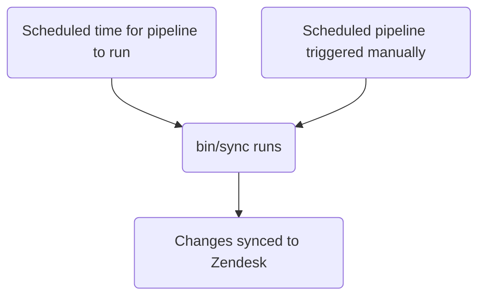

このガイドでは、GitLab における Zendesk ビューの作成、編集、管理の方法について説明します。既存のビューを変更したいサポートエージェントは、[ビューで使用されるフィールド、グルーピング、ソートの変更](#changing-the-fields-grouping-or-sorting-used-in-a-view)を参照してください。管理者は[管理者タスク](#administrator-tasks)セクションを確認してください。

{}

- デプロイタイプ: `Standard`
- 同期リポジトリ
  - [Zendesk Global](https://gitlab.com/gitlab-support-readiness/zendesk-global/views)
  - [Zendesk US Government](https://gitlab.com/gitlab-support-readiness/zendesk-us-government/views)
- 管理コンテンツリポジトリ
  - [Zendesk Global](https://gitlab.com/gitlab-com/support/zendesk-global/views)
  - [Zendesk US Government](https://gitlab.com/gitlab-com/support/zendesk-us-government/views)
- `CustSuppOps Zendesk Test Suite Generator` 有効

{}

## ビューを理解する

### ビューとは

[Zendesk](https://support.zendesk.com/hc/en-us/articles/4408888828570-Creating-views-to-build-customized-lists-of-tickets) より:

> ビューは、特定の条件に基づいてチケットをリストにグループ化することで整理する方法です。たとえば、自分に割り当てられた未解決チケットのビュー、トリアージが必要な新規チケットのビュー、回答待ちの保留中チケットのビューを作成できます。ビューを使うことで、自分やチームの対応が必要なチケットを把握し、それに応じて計画を立てられます。

### ビューの種類

現在、Zendesk には 3 種類のビューがあります:

- Default: Zendesk が作成した事前定義済みのビュー
- Shared: Zendesk 管理者（すなわち Customer Support Operations）が作成したビュー
- Personal: 自分が作成し、自分だけが使えるビュー

### ビューの制限事項

現在、Zendesk のビューにはいくつかの制限があります:

- ビューは「定義されていない」条件を使用できません。つまり、選択可能なデータでなければなりません（例として、テキストフィールドは機能しません）。
- ビューには[アーカイブされたチケット](https://support.zendesk.com/hc/en-us/articles/4408887617050-About-ticket-archiving)（すなわち 120 日経過後の Closed チケット）は含まれません。

### ビューはネストできる

ビューのタイトルにダブルコロン（すなわち `::`）を使用することで、ビュー同士をネストできます。

例として、次のようなビューがあったとします:

- Support Agents Tier 1 Normal tickets
- Support Agents Tier 1 Escalated tickets
- Support Agents Tier 2 Normal tickets
- Support Agents Tier 2 Escalated tickets
- Support Agents Tier 3 Normal tickets
- Support Agents Tier 3 Escalated tickets

これらを次のように名前変更できます:

- Support Agents::Tier 1::Normal tickets
- Support Agents::Tier 1::Escalated tickets
- Support Agents::Tier 2::Normal tickets
- Support Agents::Tier 2::Escalated tickets
- Support Agents::Tier 3::Normal tickets
- Support Agents::Tier 3::Escalated tickets

その結果、ビューは次のように表示されます:

- Support Agents
  - Tier 1
    - Normal tickets
    - Escalated tickets
  - Tier 2
    - Normal tickets
    - Escalated tickets
  - Tier 3
    - Normal tickets
    - Escalated tickets

上記において、`Support Agents`、`Tier 1`、`Tier 2`、`Tier 3` は実際にはビューではない（ネスト表示のために表示されるカテゴリである）ことに注意してください。ファイル構造のようなものだと考えてください（カテゴリがフォルダ、実際のビューがファイルに相当します）。

### ビューは条件ロジックを使用する

ビューは条件ロジックを使用します:

- `all`: 配列内のすべての条件が真でなければならない（AND ロジック）
- `any`: 配列内の少なくとも 1 つの条件が真でなければならない（OR ロジック）
- どちらか一方のセットのみ、または両方のセットを使用できます（ただし、少なくとも 1 つのセットを使用する必要があります）

### ビューを管理する方法

Zendesk は UI でビューを管理する完全な方法を提供していますが、私たちはよりバージョン管理されたやり方を採用しています。これにより、設定されたレビュープロセス、必要に応じたロールバックの実行などが可能になります。

そのため、私たちは同期リポジトリと管理コンテンツリポジトリを利用しています。

### 同期リポジトリの仕組み

同期リポジトリのワークフローは次のプロセスに従います:



#### 人間が読める形式の置換

{}

- YAML ファイル経由でビューを作成・編集する `administrators`（管理者）にのみ適用されます

{}

現在、同期リポジトリは、人間が読める形式の項目から「Zendesk」相当の項目へとさまざまな項目の置換を実行できます。これには次が含まれます:

| 人間が読める形式の項目 | Zendesk フィールド項目 | 条件の場所 | 備考 |
|---------------------|--------------------|--------------------|-------|
| `'Brand: XXX'` | `brand_id` | `value` | `XXX` をブランドの `name` に置き換える |
| `'Field: XXX'` | `custom_fields_xxx` | `field` | `XXX` をチケットフィールドの `title` に置き換える |
| `'Group: XXX'` | `group_id` | `value` | `XXX` をグループの `name` に置き換える |
| `'XXX'` | `role` | `value` | `XXX` をロールタイプの `name`、またはリクエスターのメールアドレスに置き換える |
| `'Form: XXX'` | `ticket_form_id` | `value` | `XXX` をチケットフォームの `name` に置き換える |
| `'Schedule: XXX'` | `set_schedule` | `value` | `XXX` をスケジュールの `name` に置き換える |
| `'Schedule: XXX'` | `schedule_id` | `value` | `XXX` をスケジュールの `name` に置き換える |
| `'XXX'` | `organization_id` | `value` | `XXX` を組織の `salesforce_id` 属性に置き換える |
| `'XXX'` | `assignee_id` | `value` | `XXX` をエージェントのメールアドレスに置き換える |
| `'XXX'` | `satisfaction_reason_code` | `value` | `XXX` を満足度理由の `name` に置き換える |
| `'XXX'` | `via_id` | `value` | `XXX` via タイプの `name` に置き換える |
| `'XXX'` | `requester_role` | `value` | `XXX` をリクエスターのロールタイプの `name` に置き換える |
| `'Target: XXX'` | `notification_target` | `value` | `XXX` をターゲットの `name` に置き換える |
| `'Webhook: XXX'` | `notification_webhook` | `value` | `XXX` を webhook の `name` に置き換える |

[制限オブジェクト](#view-restriction-objects)内でも変換を行えます（詳細はそのセクションを参照してください）。

例として、チケットのフォームが `SaaS` フォームではないかどうかをチェックする条件であれば、次のようにします:

```yaml
- field: 'ticket_form_id'
  operator: 'is_not'
  value: 'Form: SaaS'
```

#### 同期リポジトリで MR を作成する場合

同期リポジトリで MR が作成されると、（`bin/compare` スクリプト経由で）比較アクションが実行され、次のことが行われます:

1. 管理コンテンツリポジトリのクローンを実行する
1. Zendesk インスタンスからすべてのブランド、グループ、満足度理由、スケジュール、ターゲット、チケットフィールド、チケットフォーム、ビュー、webhook を取得する
1. 同期リポジトリ内のすべての YAML ファイルをレビューしてビューオブジェクトを生成する
   - また、同期リポジトリのファイルに次の問題が存在しないことも確認する:
     - タイトルが欠落している
     - position が欠落している
     - `active` 属性が `false` のファイルが `active` フォルダにない
     - `active` 属性が `true` のファイルが `inactive` フォルダにない
     - `title` 属性が重複して使用されている
     - `contains_managed_content` 属性が `true` のファイルに対応する管理コンテンツファイルがある
     - `contains_managed_webhook` 属性が `true` のファイルに対応する管理コンテンツファイルがある
1. YAML ファイルのすべてのビューオブジェクトを、一致する Zendesk 項目（`title` 属性と `previous_title` 属性の値をチェックして判定）と比較する
   - 存在しない場合は、後で使用するために作成オブジェクトを変数に格納する
   - 存在するが属性値が異なる場合は、後で使用するために更新オブジェクトを変数に格納する
1. 比較レポートを出力する

#### Zendesk への同期

同期リポジトリは、プロジェクトのスケジュールパイプラインが実行されたとき（正しいタイミングで、または手動で実行されたとき）に同期タスクを実行します。

いずれかのアクションが発生すると、同期は[比較アクション](#when-creating-mrs-in-the-sync-repo)を実行し、その後、生成されたオブジェクトを使用して、必要な Zendesk エンドポイントにアクセスするループを通じて、必要な作成と更新を実行します:

- [作成](https://developer.zendesk.com/api-reference/ticketing/business-rules/views/#create-view)
- [更新](https://developer.zendesk.com/api-reference/ticketing/business-rules/views/#update-view)

#### 孤立した管理コンテンツファイルの報告

2 月、5 月、8 月、11 月の 1 日に、[スケジュールパイプライン](https://docs.gitlab.com/ci/pipelines/schedules/)により、同期リポジトリがサポートリーダーシップチーム向けに、すべての孤立した管理コンテンツファイルをレビューするための Issue を作成します。

これは、同期リポジトリ内の `bin/find_orphaned_files` スクリプト経由で行われ、次のことを行います:

1. 管理コンテンツリポジトリのクローンを実行する
1. 管理コンテンツリポジトリの `active` および `inactive` フォルダ内のすべてのファイルをレビューし、`state`（すなわち `active` または `inactive`）、`path`、`title` を判定する
1. 同期リポジトリ自体の `active` および `inactive` フォルダ内のすべてのファイルをレビューし、次を判定する:
   - そのファイルが管理コンテンツファイルを使用しているか
   - 管理コンテンツファイルがあるか
1. 同期リポジトリのファイルなしで管理コンテンツファイルを見つけた場合、それを Customer Support リーダーシップに報告する Issue を作成する

## 管理者以外がパーソナルビューを作成する

{}

- Zendesk の管理者である場合、これを行う際には注意してください。パーソナルビュー以外のビューを作成できる権限があるためです。

{}

Zendesk でパーソナルビューを作成するには:

1. 新規ビューページを開きます
   - [Zendesk Global (production)](https://gitlab.zendesk.com/admin/workspaces/agent-workspace/views/new)
   - [Zendesk Global (sandbox)](https://gitlab1707170878.zendesk.com/admin/workspaces/agent-workspace/views/new)
   - [Zendesk US Government (production)](https://gitlab-federal-support.zendesk.com/admin/workspaces/agent-workspace/views/new)
   - [Zendesk US Government (sandbox)](https://gitlabfederalsupport1585318082.zendesk.com/admin/workspaces/agent-workspace/views/new)
1. ビューの名前を入力します
1. ビューの説明を入力します（任意）
1. 管理者の場合、`Who has access` セクションで `Only you` が選択されていることを確認します
1. ビューの条件（すなわち使用するフィルター）を入力します
1. ビューに表示するフィールドを入力します
1. ビューのグルーピング情報を入力します
1. ビューのソート情報を入力します
1. ページ右下の `Save` ボタンをクリックします

## 管理者以外がパーソナル以外のビューを作成する

ビューの作成については、[Feature Request issue](https://gitlab.com/gitlab-com/gl-security/corp/cust-support-ops/issue-tracker/-/issues/new?description_template=Feature) を作成してください（Customer Support Operations チームによる手動対応が必要となるためです）。

## 管理者以外がパーソナルビューを編集する

既存のパーソナルビューを編集するには:

1. 該当するビューに移動します
1. ページ右上の `Actions` ボタンをクリックします
1. `Edit view` をクリックします
1. 必要な変更を行います
1. ページ右下の `Save` ボタンをクリックします

## 管理者以外がパーソナル以外のビューを編集する

### ビューで使用されるフィールド、グルーピング、ソートの変更

ビューで使用されるフィールド、グルーピング、ソートを編集するには、管理コンテンツリポジトリ内の対応するファイルを変更します。`master` ブランチにマージされた後、次のデプロイサイクルで取り込まれ、Zendesk にデプロイされます。

### タイトル、position などの変更

ビューのその他の項目を変更するには、[Feature Request issue](https://gitlab.com/gitlab-com/gl-security/corp/cust-support-ops/issue-tracker/-/issues/new?description_template=Feature) を作成してください（Customer Support Operations チームによる手動対応が必要となるためです）。

## 管理者以外がビューを無効化する

ビューの無効化をリクエストするには、[Feature Request issue](https://gitlab.com/gitlab-com/gl-security/corp/cust-support-ops/issue-tracker/-/issues/new?description_template=Feature) を作成してください（Customer Support Operations チームによる手動対応が必要となるためです）。

## 管理者タスク

{}

- このセクションのすべての項目には、Zendesk への `Administrator` レベルのアクセスが必要です。

{}

### ビュー制限オブジェクト

ビューは、特定のエージェントのセットに対してのみ表示されるよう制限できます。これは制限オブジェクト経由で行われます。

私たちの同期リポジトリはパーソナルビューを管理しないため、このオブジェクトで目にする使用方法は、`null`（または空白）の値か、グループ制限のいずれかだけです。

ビューを誰からも制限しない場合、オブジェクトの値全体が `null`（または空白）になります。

ビューの可視性をグループのものに制限する場合、オブジェクトの形式は次のとおりです:

```yaml
restriction:
  type: Group
  id: 'Name of group 1'
  ids:
  - 'Name of group 1'
  - 'Name of group 2'
  - 'Name of group 3'
```

同期リポジトリがソートなどを処理するため、`ids` 配列の順序（または `id` 属性に正確にどの値が入っているか）は重要ではありません（`ids` にリストされたグループのいずれかが `id` に存在している限り）。`id` の値に何を入れるか迷った場合は、アルファベット順で最初に来るものを使用してください。

例として、グループ `Support Ops` だけがビューを見られるよう制限するには、次を使用します:

```yaml
restriction:
  type: Group
  id: 'Support Ops'
  ids:
  - 'Support Ops'
```

別の例として、グループ `Support AMER`、`Support APAC`、`Support EMEA` だけがビューを見られるよう制限するには、次を使用します:

```yaml
restriction:
  type: Group
  id: 'Support AMER'
  ids:
  - 'Support AMER'
  - 'Support APAC'
  - 'Support EMEA'
```

### ビューのリストを表示する

Zendesk でビューのリストを見るには:

1. Zendesk インスタンスの管理ダッシュボードに移動します
   - [Zendesk Global (production)](https://gitlab.zendesk.com/admin/home)
   - [Zendesk Global (sandbox)](https://gitlab1707170878.zendesk.com/admin/home)
   - [Zendesk US Government (production)](https://gitlab-federal-support.zendesk.com/admin/home)
   - [Zendesk US Government (sandbox)](https://gitlabfederalsupport1585318082.zendesk.com/admin/home)
1. `Workspaces > Agent tools > Views` に移動します
   - [Zendesk Global](https://gitlab.zendesk.com/admin/workspaces/agent-workspace/views)
   - [Zendesk Global (sandbox)](https://gitlab1707170878.zendesk.com/admin/workspaces/agent-workspace/views)
   - [Zendesk US Government](https://gitlab-federal-support.zendesk.com/admin/workspaces/agent-workspace/views)
   - [Zendesk US Government (sandbox)](https://gitlabfederalsupport1585318082.zendesk.com/admin/workspaces/agent-workspace/views)

特定のビューを見つけるために、使用中のフィルターを調整する必要があるかもしれません（デフォルトでは `active` な `shared` ビューになっているためです）。

### ビューを作成する

{}

- これは、対応するリクエスト Issue（Feature Request、Administrative、Bug など）が存在する場合にのみ行うべきです。存在しない場合は、まず作成してください（そして作業を始める前に標準プロセスを通してください）。
- 先に管理コンテンツファイルを作成する必要があります。存在しない場合、MR でパイプラインが失敗します。

{}

ビューの作成には、同期リポジトリで MR を作成する必要があります。実際に行う変更はリクエスト自体によって異なります。使用できる開始用テンプレートは次のとおりです:

```yaml
---
title: 'Your view title here'
previous_title: 'Your view title here'
description: 'Your description here'
active: true
position: 1 # Integer representing view position
conditions:
  all:
  - field: 'the_action_to_perform'
    operator: 'the_operator_to_use'
    value: 'the_value_to_use'
  any:
  - field: 'the_action_to_perform'
    operator: 'the_operator_to_use'
    value: 'the_value_to_use'
execution:
  columns: MANAGED_CONTENT # It is always this value as it pulls from the corresponding managed content file
  group_by: MANAGED_CONTENT # It is always this value as it pulls from the corresponding managed content file
  group_order: MANAGED_CONTENT # It is always this value as it pulls from the corresponding managed content file
  sort_by: MANAGED_CONTENT # It is always this value as it pulls from the corresponding managed content file
  sort_order: MANAGED_CONTENT # It is always this value as it pulls from the corresponding managed content file
restriction: # Leave blank to make it visible to all, add a restriction object if you need to fine tune visibility
```

ピアが MR をレビューして承認した後、MR をマージできます。次のデプロイが発生すると、Zendesk に同期されます。

### ビューを編集する

{}

- これは、対応するリクエスト Issue（Feature Request、Administrative、Bug など）が存在する場合にのみ行うべきです。存在しない場合は、まず作成してください（そして作業を始める前に標準プロセスを通してください）。
- これは次の項目に対する変更にのみ適用されます（それ以外は管理コンテンツリポジトリ経由で行います）:
  - Title
  - Description
  - Position
  - Conditions
  - Restriction

{}

ビューを編集するには、同期リポジトリで MR を作成する必要があります。実際に行う変更はリクエスト自体によって異なります。

ピアが MR をレビューして承認した後、MR をマージできます。次のデプロイが発生すると、Zendesk に同期されます。

#### ビューのタイトルを変更する

ビューのタイトルを変更する必要がある場合、現在の値を `previous_title` 属性にコピーしてから `title` 属性を変更します。これにより、同期が更新対象のビューを引き続き見つけられるようになります。

### ビューを無効化する

{}

- これは、対応するリクエスト Issue（Feature Request、Administrative、Bug など）が存在する場合にのみ行うべきです。存在しない場合は、まず作成してください（そして作業を始める前に標準プロセスを通してください）。
- ビューは管理コンテンツファイルを使用しているため、管理コンテンツリポジトリ内の対応するファイルも `active` から `inactive` の場所に移動する必要があるでしょう。

{}

ビューを無効化するには、同期リポジトリで MR を作成する必要があります。この MR では、対応するビューの YAML ファイルに対して次のことを行うべきです:

1. ファイルを `active` から `inactive` のパスに移動します
1. `active` 属性の値を `false` に変更します
1. `conditions` の値を次のように変更します:
   - Zendesk Global の場合:

     ```yaml
       all:
       - field: 'brand_id'
         operator: 'is_not'
         value: 'GitLab Support'
       - field: 'brand_id'
         operator: 'is_not'
         value: 'GitLab - Internal'
       - field: 'status'
         operator: 'less_than'
         value: 'closed'
     any: []
     ```

   - Zendesk US Government の場合:

     ```yaml
     all:
       - field: 'brand_id'
         operator: 'is_not'
         value: 'GitLab'
       - field: 'brand_id'
         operator: 'is_not'
         value: 'GitLab - Internal'
       - field: 'status'
         operator: 'less_than'
         value: 'closed'
     any: []
     ```

ピアが MR をレビューして承認した後、MR をマージできます。次のデプロイが発生すると、Zendesk に同期されます。

### ビューを削除する

{}

- ビューは無効化されている場合にのみ削除できます。
- これは、対応するリクエスト Issue（Feature Request、Administrative、Bug など）が存在する場合にのみ行うべきです。存在しない場合は、まず作成してください（そして作業を始める前に標準プロセスを通してください）。
- ビューを削除する際には、同期リポジトリと管理コンテンツリポジトリからもファイルを削除する必要があるでしょう。

{}

ビューを削除するには:

1. [ビューのリスト](#viewing-a-list-of-views)に移動します
1. 削除したいビューを見つけて、そのビューの右側にある 3 つの点をクリックします
   - 特定のビューを見つけるために、使用中のフィルターを調整する必要があるかもしれません（デフォルトでは `active` な `shared` ビューになっているためです）。
1. `Delete` をクリックします
1. `Delete view` をクリックして変更を送信します

### 例外デプロイを実行する

ビューの例外デプロイを実行するには、該当するビューの同期プロジェクトに移動し、スケジュールパイプラインのページに行き、sync 項目の再生ボタンをクリックします。これにより、ビューの同期ジョブがトリガーされます。

## よくある問題とトラブルシューティング

### マージ後にビューの変更が反映されない

ビューは `Standard` のデプロイタイプに従うため、通常のデプロイサイクル中（または例外デプロイが行われたとき）にのみデプロイされます。
