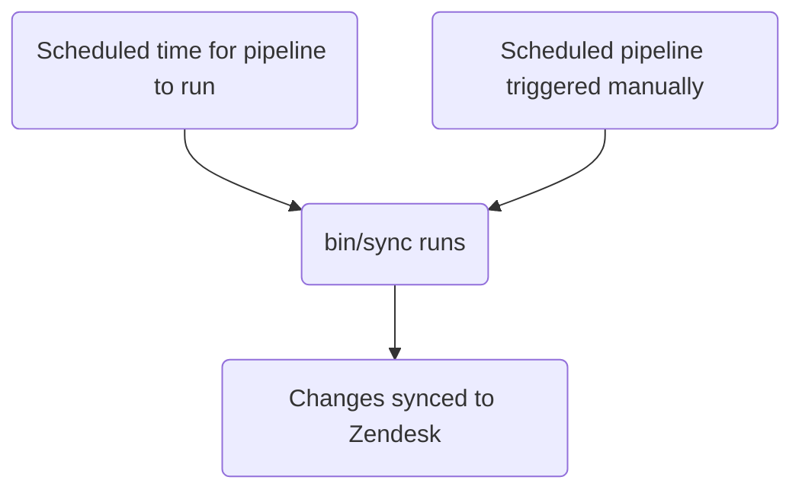

このガイドは、GitLab で Zendesk ビューを作成、編集、管理する方法について説明します。既存のビューを変更したいサポートエージェントは、[ビューで使用されるフィールド、グルーピング、ソートの変更](#changing-the-fields-grouping-or-sorting-used-in-a-view)を参照してください。管理者は[管理者タスク](#administrator-tasks)セクションを確認してください。

{}

- デプロイメントタイプ: `Standard`
- 同期リポジトリ
  - [Zendesk Global](https://gitlab.com/gitlab-support-readiness/zendesk-global/views)
  - [Zendesk US Government](https://gitlab.com/gitlab-support-readiness/zendesk-us-government/views)
- マネージドコンテンツリポジトリ
  - [Zendesk Global](https://gitlab.com/gitlab-com/support/zendesk-global/views)
  - [Zendesk US Government](https://gitlab.com/gitlab-com/support/zendesk-us-government/views)

{}

## ビューの理解 {#understanding-views}

### ビューとは {#what-are-views}

[Zendesk](https://support.zendesk.com/hc/en-us/articles/4408888828570-Creating-views-to-build-customized-lists-of-tickets) によると:

> ビューは、特定の基準に基づいてチケットをリストにグループ化することでチケットを整理する方法です。たとえば、自分にアサインされた未解決チケットのビュー、トリアージが必要な新規チケットのビュー、または応答待ちの保留中チケットのビューを作成できます。ビューを使用すると、自分やチームが対応する必要があるチケットを判断し、それに応じて計画を立てるのに役立ちます。

### ビューのタイプ {#types-of-views}

現在、Zendesk には 3 つのビュータイプがあります。

- Default: Zendesk によって作成された事前定義済みビュー
- Shared: Zendesk 管理者（つまり Customer Support Operations）によって作成されたビュー
- Personal: 自分が作成し、自分だけが使用できるビュー

### ビューの制限 {#view-limitations}

現在、Zendesk ビューにはいくつかの制限があります。

- ビューは「定義済み」でない基準を使用できません。つまり、選択可能なデータでなければなりません（例として、テキストフィールドは機能しません）。
- ビューは[アーカイブ済みチケット](https://support.zendesk.com/hc/en-us/articles/4408887617050-About-ticket-archiving)（つまり 120 日後にクローズされたチケット）を含みません。

### ビューはネストできる {#views-can-be-nested}

ビューのタイトルにダブルコロン（つまり `::`）を使用することで、ビューをお互いにネストできます。

例として、以下のビューがある場合:

- Support Agents Tier 1 Normal tickets
- Support Agents Tier 1 Escalated tickets
- Support Agents Tier 2 Normal tickets
- Support Agents Tier 2 Escalated tickets
- Support Agents Tier 3 Normal tickets
- Support Agents Tier 3 Escalated tickets

これらを以下のように名前変更できます。

- Support Agents::Tier 1::Normal tickets
- Support Agents::Tier 1::Escalated tickets
- Support Agents::Tier 2::Normal tickets
- Support Agents::Tier 2::Escalated tickets
- Support Agents::Tier 3::Normal tickets
- Support Agents::Tier 3::Escalated tickets

結果として、ビューは以下のようになります。

- Support Agents
  - Tier 1
    - Normal tickets
    - Escalated tickets
  - Tier 2
    - Normal tickets
    - Escalated tickets
  - Tier 3
    - Normal tickets
    - Escalated tickets

上記の `Support Agents`、`Tier 1`、`Tier 2`、`Tier 3` は実際にはビューではなく、ネスト用に表示されるカテゴリであることに注意してください。ファイル構造のように考えてください（カテゴリがフォルダで、実際のビューがファイル）。

### ビューは条件ロジックを使用 {#views-use-condition-logic}

ビューは条件ロジックを使用します。

- `all`: 配列内のすべての条件が真でなければならない（AND ロジック）
- `any`: 配列内の少なくとも 1 つの条件が真でなければならない（OR ロジック）
- 1 つのセットのみ、または両方のセットを使用できます（ただし、少なくとも 1 つのセットを使用する必要があります）

### ビューの管理方法 {#how-we-manage-views}

Zendesk は UI を介してビューを管理する完全な方法を提供していますが、私たちはよりバージョン管理されたメソドロジーに頼っています。これにより、レビュープロセスの設定、必要に応じたロールバックの実行などが可能になります。

そのため、同期リポジトリとマネージドコンテンツリポジトリを利用しています。

### 同期リポジトリの動作 {#how-the-sync-repo-works}

同期リポジトリのワークフローは以下のプロセスに従います。



#### 人間が読みやすい置換 {#human-readable-replacements}

{}

- YAML ファイルでビューを作成/編集する `administrators` にのみ適用されます

{}

現在、同期リポジトリは、人間が読みやすい項目から「Zendesk」相当の項目への各種項目の置換を実行できます。これには以下が含まれます。

| 人間が読みやすい項目 | Zendesk フィールド項目 | 条件の場所 | 注記 |
|---------------------|--------------------|--------------------|-------|
| `'Brand: XXX'` | `brand_id` | `value` | `XXX` をブランドの `name` で置換 |
| `'Field: XXX'` | `custom_fields_xxx` | `field` | `XXX` をチケットフィールドの `title` で置換 |
| `'Group: XXX'` | `group_id` | `value` | `XXX` をグループの `name` で置換 |
| `'XXX'` | `role` | `value` | `XXX` をロールタイプの `name` または依頼者のメールアドレスで置換 |
| `'Form: XXX'` | `ticket_form_id` | `value` | `XXX` をチケットフォームの `name` で置換 |
| `'Schedule: XXX'` | `set_schedule` | `value` | `XXX` をスケジュールの `name` で置換 |
| `'Schedule: XXX'` | `schedule_id` | `value` | `XXX` をスケジュールの `name` で置換 |
| `'XXX'` | `organization_id` | `value` | `XXX` を組織の `salesforce_id` 属性で置換 |
| `'XXX'` | `assignee_id` | `value` | `XXX` をエージェントのメールアドレスで置換 |
| `'XXX'` | `satisfaction_reason_code` | `value` | `XXX` を満足理由の `name` で置換 |
| `'XXX'` | `via_id` | `value` | `XXX` を via タイプの `name` で置換 |
| `'XXX'` | `requester_role` | `value` | `XXX` を依頼者ロールタイプの `name` で置換 |
| `'Target: XXX'` | `notification_target` | `value` | `XXX` をターゲットの `name` で置換 |
| `'Webhook: XXX'` | `notification_webhook` | `value` | `XXX` を webhook の `name` で置換 |

[制限オブジェクト](#view-restriction-objects)でも変換を実行できます（詳細はそのセクションを参照）。

例として、チケットのフォームが `SaaS` フォームでないかをチェックする条件があれば、以下のようにします。

```yaml
- field: 'ticket_form_id'
  operator: 'is_not'
  value: 'Form: SaaS'
```

#### 同期リポジトリで MR を作成する場合 {#when-creating-mrs-in-the-sync-repo}

同期リポジトリで MR が作成されると、`bin/compare` スクリプト経由で比較アクションを実行します。これは以下を行います。

1. マネージドコンテンツリポジトリのクローンを実行
1. Zendesk インスタンスからすべてのブランド、グループ、満足理由、スケジュール、ターゲット、チケットフィールド、チケットフォーム、ビュー、webhook を取得
1. 同期リポジトリ内のすべての YAML ファイルをレビューしてビューオブジェクトを生成
   - 同期リポジトリのファイルに以下の問題がないかも確認します:
     - title が欠けている
     - position が欠けている
     - `active` 属性が `false` のファイルが `active` フォルダにない
     - `active` 属性が `true` のファイルが `inactive` フォルダにない
     - `title` 属性に重複がある
     - `contains_managed_content` 属性が `true` のファイルに対応するマネージドコンテンツファイルがない
     - `contains_managed_webhook` 属性が `true` のファイルに対応するマネージドコンテンツファイルがない
1. YAML ファイルからのすべてのビューオブジェクトを、対応する Zendesk 項目（`title` および `previous_title` 属性の値をチェックして判定）と比較
   - 存在しない場合、後で使用するために変数に作成オブジェクトを格納
   - 存在するが属性値が異なる場合、後で使用するために変数に更新オブジェクトを格納
1. 比較レポートを出力

#### Zendesk への同期 {#syncing-to-zendesk}

同期リポジトリは、プロジェクトのスケジュールパイプラインが実行されたとき（正しいタイミングまたは手動実行時）に同期タスクを実行します。

いずれかのアクションが発生すると、同期は[比較アクション](#when-creating-mrs-in-the-sync-repo)を実行し、生成されたオブジェクトを使用して、必要な Zendesk エンドポイントを呼び出すループ経由で必要な作成と更新を実行します。

- [作成](https://developer.zendesk.com/api-reference/ticketing/business-rules/views/#create-view)
- [更新](https://developer.zendesk.com/api-reference/ticketing/business-rules/views/#update-view)

#### 孤立したマネージドコンテンツファイルの報告 {#reporting-orphaned-managed-content-files}

2 月、5 月、8 月、11 月の 1 日に、[スケジュールパイプライン](https://docs.gitlab.com/ci/pipelines/schedules/)が同期リポジトリにすべての孤立したマネージドコンテンツファイルをレビューする Issue をサポートリーダーシップチーム向けに作成させます。

これは同期リポジトリの `bin/find_orphaned_files` スクリプト経由で行われ、以下を行います。

1. マネージドコンテンツリポジトリのクローンを実行
1. マネージドコンテンツリポジトリの `active` および `inactive` フォルダ内のすべてのファイルをレビューして `state`（つまり `active` または `inactive`）、`path`、`title` を判定
1. 同期リポジトリ自体の `active` および `inactive` フォルダ内のすべてのファイルをレビューして以下を判定:
   - ファイルがマネージドコンテンツファイルを使用しているか
   - マネージドコンテンツファイルがあるか
1. 同期リポジトリファイルがないマネージドコンテンツファイルが見つかった場合、Customer Support リーダーシップに報告する Issue を作成

## 管理者以外による個人ビューの作成 {#creating-a-personal-view-as-a-non-admin}

{}

- Zendesk の管理者の場合、これを行うと非個人ビューを作成する能力があるため注意してください。

{}

Zendesk で個人ビューを作成するには:

1. 新規ビューページを開きます
   - [Zendesk Global (production)](https://gitlab.zendesk.com/admin/workspaces/agent-workspace/views/new)
   - [Zendesk Global (sandbox)](https://gitlab1707170878.zendesk.com/admin/workspaces/agent-workspace/views/new)
   - [Zendesk US Government (production)](https://gitlab-federal-support.zendesk.com/admin/workspaces/agent-workspace/views/new)
   - [Zendesk US Government (sandbox)](https://gitlabfederalsupport1585318082.zendesk.com/admin/workspaces/agent-workspace/views/new)
1. ビューの名前を入力します
1. ビューの説明を入力します（任意）
1. 管理者の場合、`Who has access` セクションが `Only you` になっていることを確認します
1. ビューの条件（つまり使用するフィルター）を入力します
1. ビューに表示するフィールドを入力します
1. ビューのグルーピング情報を入力します
1. ビューのソート情報を入力します
1. ページ右下の `Save` ボタンをクリックします

## 管理者以外による非個人ビューの作成 {#creating-a-non-personal-view-as-a-non-admin}

ビューの作成については、[機能リクエスト Issue](https://gitlab.com/gitlab-com/gl-security/corp/cust-support-ops/issue-tracker/-/issues/new?description_template=Feature) を作成してください（Customer Support Operations チームによる手動対応が必要なため）。

## 管理者以外による個人ビューの編集 {#editing-a-personal-view-as-a-non-admin}

既存の個人ビューを編集するには:

1. 該当ビューに移動します
1. ページ右上の `Actions` ボタンをクリックします
1. `Edit view` をクリックします
1. 必要な変更を行います
1. ページ右下の `Save` ボタンをクリックします

## 管理者以外による非個人ビューの編集 {#editing-a-non-personal-view-as-a-non-admin}

### ビューで使用されるフィールド、グルーピング、ソートの変更 {#changing-the-fields-grouping-or-sorting-used-in-a-view}

ビューで使用されるフィールド、グルーピング、ソートを編集するには、マネージドコンテンツリポジトリ内の対応するファイルを変更します。`master` ブランチにマージされた後、次のデプロイメントサイクルでピックアップされ Zendesk にデプロイされます。

### タイトル、位置などの変更 {#changing-title-position-and-so-on}

ビュー内の他の何かを変更するには、[機能リクエスト Issue](https://gitlab.com/gitlab-com/gl-security/corp/cust-support-ops/issue-tracker/-/issues/new?description_template=Feature) を作成してください（Customer Support Operations チームによる手動対応が必要なため）。

## 管理者以外によるビューの無効化 {#deactivating-a-view-as-a-non-admin}

ビューの無効化をリクエストするには、[機能リクエスト Issue](https://gitlab.com/gitlab-com/gl-security/corp/cust-support-ops/issue-tracker/-/issues/new?description_template=Feature) を作成してください（Customer Support Operations チームによる手動対応が必要なため）。

## 管理者タスク {#administrator-tasks}

{}

- このセクションのすべての項目には Zendesk への `Administrator` レベルのアクセスが必要です。

{}

### ビュー制限オブジェクト {#view-restriction-objects}

ビューは特定のエージェントセットのみに表示するよう制限できます。これは制限オブジェクトを介して行われます。

同期リポジトリは個人ビューを管理しないため、このオブジェクトの使用として目にするのは `null`（または空白）の値またはグループ制限のみです。

ビューを誰にも制限しない場合、オブジェクトの値全体は `null`（または空白）です。

ビューの可視性をグループに制限する場合、オブジェクトの形式は以下の通りです。

```yaml
restriction:
  type: Group
  id: 'Name of group 1'
  ids:
  - 'Name of group 1'
  - 'Name of group 2'
  - 'Name of group 3'
```

同期リポジトリがソートなどを処理するため、`ids` 配列の順序（または `id` 属性に正確にどの値があるか）は重要ではありません（ただし `ids` にリストされたグループの 1 つが `id` に存在すること）。`id` 値に何を入れるか迷ったら、アルファベット順で先に来るものを使用してください。

例として、`Support Ops` グループのみがビューを見られるよう制限するには、以下を使用します。

```yaml
restriction:
  type: Group
  id: 'Support Ops'
  ids:
  - 'Support Ops'
```

別の例として、`Support AMER`、`Support APAC`、`Support EMEA` グループのみがビューを見られるよう制限するには、以下を使用します。

```yaml
restriction:
  type: Group
  id: 'Support AMER'
  ids:
  - 'Support AMER'
  - 'Support APAC'
  - 'Support EMEA'
```

### ビュー一覧の表示 {#viewing-a-list-of-views}

Zendesk でビュー一覧を見るには:

1. Zendesk インスタンスの管理ダッシュボードに移動します
   - [Zendesk Global (production)](https://gitlab.zendesk.com/admin/home)
   - [Zendesk Global (sandbox)](https://gitlab1707170878.zendesk.com/admin/home)
   - [Zendesk US Government (production)](https://gitlab-federal-support.zendesk.com/admin/home)
   - [Zendesk US Government (sandbox)](https://gitlabfederalsupport1585318082.zendesk.com/admin/home)
1. `Workspaces > Agent tools > Views` に移動します
   - [Zendesk Global](https://gitlab.zendesk.com/admin/workspaces/agent-workspace/views)
   - [Zendesk Global (sandbox)](https://gitlab1707170878.zendesk.com/admin/workspaces/agent-workspace/views)
   - [Zendesk US Government](https://gitlab-federal-support.zendesk.com/admin/workspaces/agent-workspace/views)
   - [Zendesk US Government (sandbox)](https://gitlabfederalsupport1585318082.zendesk.com/admin/workspaces/agent-workspace/views)

特定のビューを見つけるためにフィルターを調整する必要がある場合があります（デフォルトは `active` `shared` ビュー）。

### ビューの作成 {#creating-a-view}

{}

- これは対応するリクエスト Issue（機能リクエスト、管理、バグなど）がある場合のみ実施してください。存在しない場合は、まず作成し（標準プロセスを通してから対応）してください。
- まずマネージドコンテンツファイルを作成する必要があります。存在しない場合、MR でパイプラインが失敗します。

{}

ビューを作成するには、同期リポジトリで MR を作成する必要があります。実際の変更内容はリクエスト自体によります。使用できる開始テンプレートは以下の通りです。

```yaml
---
title: 'Your view title here'
previous_title: 'Your view title here'
description: 'Your description here'
active: true
position: 1 # Integer representing view position
conditions:
  all:
  - field: 'the_action_to_perform'
    operator: 'the_operator_to_use'
    value: 'the_value_to_use'
  any:
  - field: 'the_action_to_perform'
    operator: 'the_operator_to_use'
    value: 'the_value_to_use'
execution:
  columns: MANAGED_CONTENT # It is always this value as it pulls from the corresponding managed content file
  group_by: MANAGED_CONTENT # It is always this value as it pulls from the corresponding managed content file
  group_order: MANAGED_CONTENT # It is always this value as it pulls from the corresponding managed content file
  sort_by: MANAGED_CONTENT # It is always this value as it pulls from the corresponding managed content file
  sort_order: MANAGED_CONTENT # It is always this value as it pulls from the corresponding managed content file
restriction: # Leave blank to make it visible to all, add a restriction object if you need to fine tune visibility
```

ピアレビューと承認の後、MR をマージできます。次回のデプロイメント時に Zendesk へ同期されます。

### ビューの編集 {#editing-a-view}

{}

- これは対応するリクエスト Issue（機能リクエスト、管理、バグなど）がある場合のみ実施してください。存在しない場合は、まず作成し（標準プロセスを通してから対応）してください。
- これは以下の項目を変更する場合のみに適用されます（その他はマネージドコンテンツリポジトリ経由で行います）:
  - Title
  - Description
  - Position
  - Conditions
  - Restriction

{}

ビューを編集するには、同期リポジトリで MR を作成する必要があります。実際の変更内容はリクエスト自体によります。

ピアレビューと承認の後、MR をマージできます。次回のデプロイメント時に Zendesk へ同期されます。

#### ビューのタイトル変更 {#changing-the-title-of-a-view}

ビューのタイトルを変更する必要がある場合、現在の値を `previous_title` 属性にコピーし、`title` 属性を変更します。これにより、同期は対象のビューを引き続き特定して更新できます。

### ビューの無効化 {#deactivating-a-view}

{}

- これは対応するリクエスト Issue（機能リクエスト、管理、バグなど）がある場合のみ実施してください。存在しない場合は、まず作成し（標準プロセスを通してから対応）してください。
- ビューはマネージドコンテンツファイルを使用しているため、マネージドコンテンツリポジトリ内の対応するファイルも `active` から `inactive` の場所に移動する必要があるでしょう。

{}

ビューを無効化するには、同期リポジトリで MR を作成する必要があります。この MR では、対応するビューの YAML ファイルに対して以下を行ってください。

1. ファイルを `active` から `inactive` パスに移動します
1. `active` 属性の値を `false` に変更します
1. `conditions` の値を以下に変更します:
   - Zendesk Global の場合:

     ```yaml
       all:
       - field: 'brand_id'
         operator: 'is_not'
         value: 'GitLab Support'
       - field: 'brand_id'
         operator: 'is_not'
         value: 'GitLab - Internal'
       - field: 'status'
         operator: 'less_than'
         value: 'closed'
     any: []
     ```

   - Zendesk US Government の場合:

     ```yaml
     all:
       - field: 'brand_id'
         operator: 'is_not'
         value: 'GitLab'
       - field: 'brand_id'
         operator: 'is_not'
         value: 'GitLab - Internal'
       - field: 'status'
         operator: 'less_than'
         value: 'closed'
     any: []
     ```

ピアレビューと承認の後、MR をマージできます。次回のデプロイメント時に Zendesk へ同期されます。

### ビューの削除 {#deleting-a-view}

{}

- ビューを削除できるのは、それが無効化されている場合のみです。
- これは対応するリクエスト Issue（機能リクエスト、管理、バグなど）がある場合のみ実施してください。存在しない場合は、まず作成し（標準プロセスを通してから対応）してください。
- ビューを削除する場合、同期リポジトリとマネージドコンテンツリポジトリからファイルも削除する必要があるでしょう。

{}

ビューを削除するには:

1. [ビュー一覧](#viewing-a-list-of-views)に移動します
1. 削除するビューを見つけ、その右側にある三点リーダーをクリックします
   - 特定のビューを見つけるためにフィルターを調整する必要がある場合があります（デフォルトは `active` `shared` ビュー）。
1. `Delete` をクリックします
1. 変更を送信するため、`Delete view` をクリックします

### 例外デプロイメントの実施 {#performing-an-exception-deployment}

ビューの例外デプロイメントを実施するには、対象のビュー同期プロジェクトに移動し、スケジュールパイプラインページに移動して、同期項目の再生ボタンをクリックします。これによりビューの同期ジョブがトリガーされます。

## よくある問題とトラブルシューティング {#common-issues-and-troubleshooting}

### マージ後にビューの変更が反映されない {#not-seeing-view-changes-after-a-merge}

ビューは `Standard` デプロイメントタイプに従うため、通常のデプロイメントサイクル時（または例外デプロイメントが行われた時）にのみデプロイされます。
