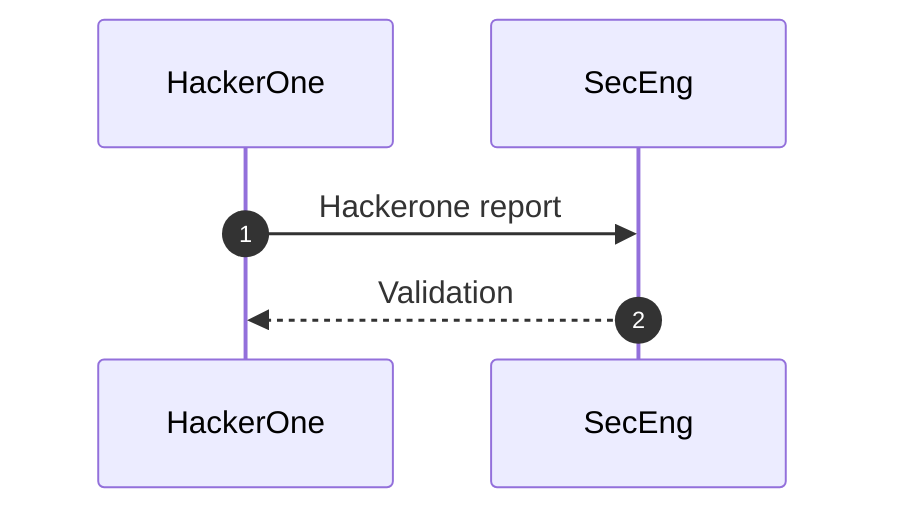
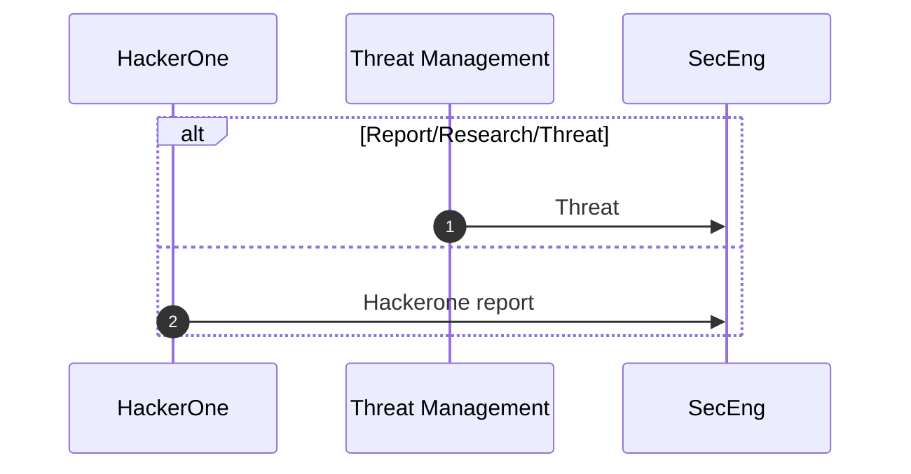

## 概要

このページでは、セキュリティ部門のエコシステムを各部門の様々なプロセスとともに説明し、概観します。
これらのプロセスは図で表現され、当社のチーム間のデータフローだけでなく、Product や Engineering 部門のような外部のアクターとのデータフローも強調します。

## 目的

このページは、セキュリティ部門のエコシステムをどのように維持するかを記述します。

## セキュリティエコシステムのスコープ

セキュリティが関与するすべてのプロセスは、このページに文書化される必要があります。各セキュリティ部門が表現され、自身の図に責任を持ちます。

## プロセス

図は、説明されているプロセスに責任を持つチームまたは部門が維持します。エコシステムは各部門のサブフォルダーで利用可能であるべきで、[`CODEOWNERS`](https://gitlab.com/gitlab-com/www-gitlab-com/-/blob/master/.gitlab/CODEOWNERS) ファイルを活用して適切な承認者が要求されるようにします。各部門、さらには各サブ部門ごとに専用のページが推奨されます。

[SAFE](/handbook/legal/safe-framework/) でないコンテンツに関する図は、[内部ハンドブック](https://internal.gitlab.com/handbook/security/) に保管できます。

セキュリティ部門エコシステムは、プロセスが更新されるにつれて、これらのプロセスのシングルソースオブトゥルースとして維持・更新される必要があります。
セキュリティリーダーシップは、各オフサイトの前にエコシステム図をレビューします。

### ツール

すべての図とこのエコシステム全体で一貫性を維持するため、当社は GitLab とこのハンドブックでの [Mermaid ネイティブ統合](/handbook/tools-and-tips/#using-mermaid) を使用します。

図は FY24-Q2 セキュリティリーダーシップオフサイトで作成され、ハンドブックに移行されるまでは [Security Google Drive](https://drive.google.com/drive/u/0/folders/1uekt058WCzwIQjH_d06hjR3RUvR2aVS6) (セキュリティ部門のチームメンバーのみアクセス可能) で利用できます。

シーケンス図のリンクは[まだサポートされていません](https://github.com/mermaid-js/mermaid/issues/1279) が、エコシステム図の上下に runbook やその他のドキュメントへのリンクを追加することが有用な場合があります。

### ガイドライン

シーケンス図用 Mermaid DSL は、参加者と相互作用がどのように宣言されるかをすでに定義しています。以下のガイドラインと推奨事項を使用してください。

#### シーケンス番号

[シーケンス番号](https://mermaid.js.org/syntax/sequenceDiagram.html) (`autonumber`) を使用して、各矢印にシーケンス番号を付けます。これによりシーケンスの読みやすさが向上し、必要に応じて図の一部を参照できます。

例:

#### 代替パス

「または」条件を表現するために代替パス (`alt`) を使用できます。

例:

## リソース

- [Mermaid シーケンス図ドキュメント](https://mermaid.js.org/syntax/sequenceDiagram.html)
- [FY24-Q2 オフサイト: エコシステム図](https://gitlab.com/gitlab-com/gl-security/security-department-meta/-/issues/1645#top) このページの作成に関連する Issue。
