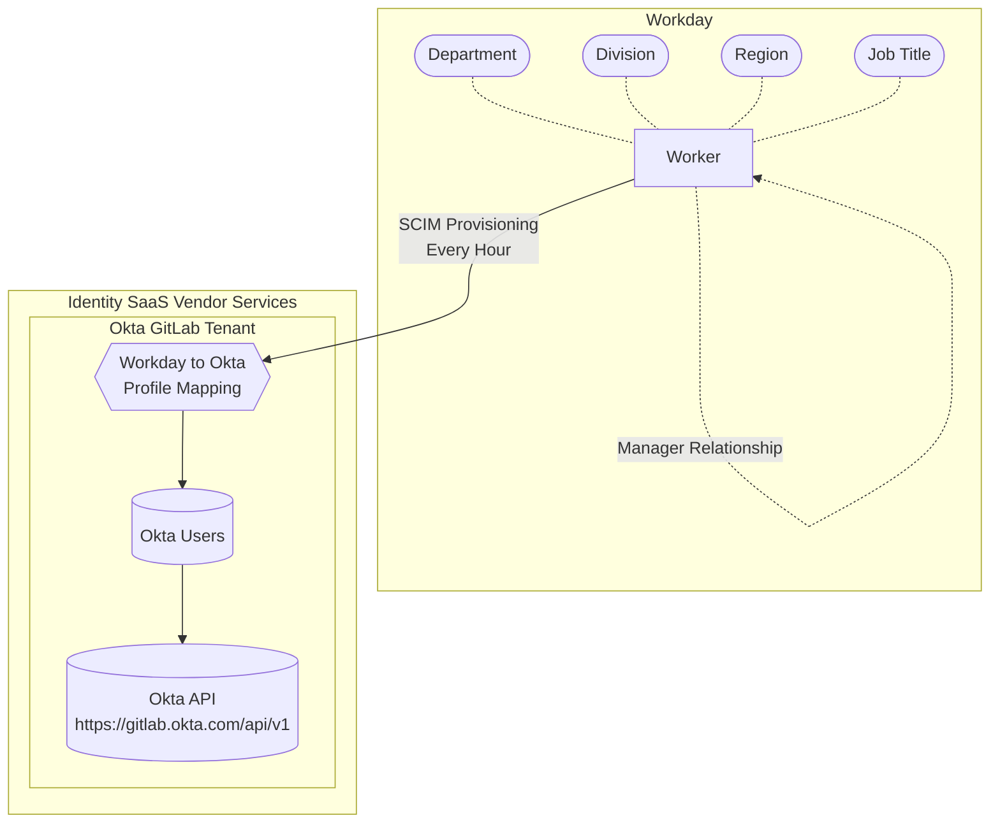

<link rel="stylesheet" type="text/css" href="/stylesheets/biztech.css" />

{}
GitLab Identity v3 の将来状態（2024 年中頃）に関するドキュメントのプレビューを表示しています。GitLab Identity v2 の現在の状態（baseline entitlements とアクセスリクエスト）については <a href="/handbook/security/security-and-technology-policies/access-management-policy/">Access Management Policy</a> を参照してください。ロードマップは <a href="https://gitlab.com/groups/gitlab-com/gl-security/identity/eng/-/roadmap?state=all&sort=start_date_asc&layout=QUARTERS&timeframe_range_type=THREE_YEARS&group_path=gitlab-com/gl-security/identity/eng&progress=WEIGHT&show_progress=true&show_milestones=false&milestones_type=ALL&show_labels=true">Epic ガントチャート</a> で確認できます。
{}

{}
このページでは、Identity Platform および Security Program のアーキテクチャとドキュメントに焦点を当てています。アプリケーションやインフラへのアクセス取得をお探しの場合は、<a href="/handbook/security/identity/guide/user">Team Member User Guide</a> を参照してください。あなたに直属するチームメンバーのアクセスを管理するには、<a href="/handbook/security/identity/guide/manager">Manager User Guide</a> を参照してください。このページの最下部までスクロールすると、その他のユーザーガイドが確認できます。
{}

## ミッション

GitLab は世界のソースコードと知的財産の管理者の一つです。私たちのミッションは、顧客および製品データへの内部および管理者アクセスを保護し、業界の信頼を維持することです。

### リスクとプロセス改善

私たちの仕事は次のリスクおよびプロセス改善領域に焦点を当てています:

1. **横展開リスク（Lateral Movement Risk）:** データ漏洩やデータ損失を防ぐため、「知る必要がある」原則と最小権限のセキュリティ原則に基づいて、GitLab の内部データおよびシステムへのアクセスを制限し保護します。
1. **侵入リスク（Penetration Risk）:** GitLab チームメンバー、一時的なサービスプロバイダー、内部 GitLab システムや管理者アクセスを持つサービスアカウントに対する認証、認可、デバイストラスト、最小権限に関連するセキュリティ境界（「城壁」）を実装し管理します。
1. **クラウドインフラのコントロールプレーン（Cloud Infrastructure Control Plane）:** AWS および GCP クラウドプロバイダの最上位アクセスとアーキテクチャを管理し、ワークロードに対するアカウントとリソースの最小権限と分離を強制します。
1. **ラストマイルプロセス自動化（Last Mile Process Automation）:** ベンダー機能のギャップに対するカスタムコードを実装し、ラストマイルのコンプライアンスとプロビジョニング自動化を実現することで、業務効率と変更管理の監査可能性を改善します。これにより、改良されたロールベースアクセスコントロールアーキテクチャを使用したオンボーディング、キャリアモビリティ、オフボーディング、アドホックなアクセスリクエストでのバックオフィスとチームメンバーのエンドユーザー体験、自動化、監査レポートが改善されます。
1. **構成状態管理（Configuration State Management）:** 手動構成とドリフト検知のリスクを避けるため、可能な場合はシステム構成のために GitOps の構成／インフラのコード化を使用します。

### 将来状態の目標

#### プロビジョニングと承認

将来を見据えて、私たちはアクセスと権限がシステム管理者によって手動ではなく、プログラム的にプロビジョニングされるという北極星ビジョンを持っています。

また、すべての承認が本質的にシステム的であり、自動化された監査ログのエクスポートを可能にすることを確実にしたいと考えています。例えば:

1. GitLab Issue の Markdown チェックボックスは視覚的には監査可能ですが、プログラム的には監査可能ではありません。誰でもボックスを選択できるため、適切な人物がボックスをチェックしたかを確認するには手動の労力が必要です。
1. GitLab ラベルは、それが存在することは監査可能ですが、誰がそれを適用したか、適用のタイムスタンプは監査可能ではありません。UI ではどのユーザーがラベルを適用したかが表示されますが、これはイベントログでは容易にアクセスできません。任意のユーザーがラベルを適用できるため、誰がラベルを適用する権限を持っていたかの保証にはリスクがあります。
1. Slack ボットや緑と赤のボタンを持つ Web UI フォームを使用する場合、ユーザーは既に認証されており、システムが定義するポリシーに基づいて、そのユーザーのみがそのボタンをクリックする能力を持っています。追加のバリデーションチェックと追跡用の監査ログを持つアクションを実行するために、API 呼び出しを使用します。

私たちは、管理者、マネージャー、エンドユーザーの全員に対して摩擦を減らし、可能な限りセルフサービスを提供する流線型のユーザー体験を提供したいと考えています。過去のプロジェクトで成功を収めており、その経験と教訓を次世代のアイデンティティ管理にもたらしたいと考えています。

> 「[gitlabsandbox.cloud](/handbook/company/infrastructure-standards/realms/sandbox/#individual-aws-account-or-gcp-project) で AWS アカウントを今日作成しました。正直なところ、完全に自動化されているとは思っていませんでした。誰にも迷惑をかけずに 5 分で AWS のクレデンシャルを得られました。素晴らしい！」 - Dmitriy Zaporozhets (DZ), GitLab Co-Founder, 2020-12-14

可能な限り SaaS ベンダー（Google Workspace、Okta、Okta IGA、Workday）を使用し、私たちのカスタム [Identity Platform](/handbook/security/identity/platform) でラストマイルの自動化、監査、ユーザー体験を提供していきます。

#### 監査可能性

Identity v2 では、スクリーンショットと CSV エクスポートで手動の視覚監査を実施しています。

Identity v3 では、プログラム的なプロビジョニングを使用するため、すべてのアクションとメタデータの差分が標準化されたスキーマでログ記録され、アラート、監査可能性、プロビジョニングおよびデプロビジョニングのための自動化のディスパッチが改善されます。これはまた、必要な情報をセルフサービスでチームメンバーが取得できる透明性を改善し、何がいつ変更されたかというポイントインタイムの記録履歴を持つことでユーザーアクセスレビュープロセスを流線型化し、すべての観察事項を自動化します。

#### 昇格、ジャストインタイム、Admin アクセス

私たちの次世代アーキテクチャでは、手動で管理するには煩雑な昇格および管理者アクションのジャストインタイムアクセスを自動化できるようになります。

恒常的な管理者アクセスを必要とするユーザーには、Customer Support、Infrastructure、IT、Security、その他のロールにいる各ユーザーに対して追加の admin アカウントがあります。詳細は [access level wristbands](https://internal.gitlab.com/handbook/it/it-self-service/access-level-wristband-colors/) で確認できます。

また、追加の管理コントロールプレーンの分離にも投資しています。詳細はセキュリティ上の理由から公開ハンドブックには公開されていません。

## ロードマップ

どの企業も成長すると、その過程で多くの有機的なイテレーションを伴う成長フェーズを経験します。GitLab は現在 Identity v2 を超えて成長し、Identity v3 プログラムを構築しています。

### GitLab Identity v1

GitLab Identity v1 は 2018 年以前、Infrastructure および People Operations チームによる Tech Ops プラクティスを使用して管理されていました。

### GitLab Identity v2

GitLab Identity v2 は私たちが今日行っており、2018 年以降 [baseline entitlements](https://internal.gitlab.com/handbook/security/corporate/end-user-services/access-request/baseline-entitlements/) と[アクセスリクエスト](/handbook/security/corporate/end-user-services/access-requests/access-requests/) で実施しているものです。詳細は [Access Management Policy](/handbook/security/security-and-technology-policies/access-management-policy/) を参照してください。

私たちが今日行っているプロセスは監査とコンプライアンスの要件を満たしていますが、プロセスはほとんど手動であり、結果として内部の非効率性が生じています。オンボーディング、アクセスリクエスト、アクセスレビュー、オフボーディングのプロセスを管理するには多くの工数を要します。

アクセスリクエストの過去の統計はこの（内部）[スプレッドシート](https://docs.google.com/spreadsheets/d/15MSlSmeT9sirHJquNkzXwMQLYyHz3DvjEe5VAoMUwyE/edit#gid=0) で確認できます。

### GitLab Identity v3

{}
私たちはアーキテクチャと初期のエンジニアリングインキュベーションフェーズにあります。すべてのリクエストについては、2024 年中頃まで既存の Identity v2 プロセス（業務通常運営）を引き続き使用してください。
{}

GitLab Identity v3 は、私たちのポリシーすべてと、可能な限り多くの承認、プロビジョニング、アクセスレビューを自動化する擬似グリーンフィールドアプローチで、FY25-2H（2024 年中後半）に到達したい場所です。

#### ロールベースアクセスコントロール（RBAC）

[Identity Roles と Identity Groups](/handbook/security/identity/platform#terminology) の導入により、ネームドユーザーアクセスコントロールではなく、ロールベースアクセスコントロールに基づく事前定義されたポリシーと自動プロビジョニングを使用することで、アドホックなアクセスリクエストの数を減らすことができます。

Identity v2 のジョブファミリーに馴染みがあれば、これは IAM および RBAC のための改良されたアーキテクチャとスキーマを持つ次世代です。

#### Identity Governance（IGA）の実装

Identity Governance and Administration（IGA）ベンダー製品は通常、ユーザーがアプリケーションへのアクセスを要求した際に承認プロセスを管理し、アプリケーションへのアクセスを持つ既存ユーザーに対するユーザーアクセスレビュー監査を実行するためのコンプライアンスチームメンバー向け UI を提供することを目標とした、コンプライアンスのレンズに焦点を当てています。

私たちは Okta の IGA プラットフォームの実装の初期段階にいます。詳細は[内部スライドデッキ](https://docs.google.com/presentation/d/1B-H2YFm6nLCsGIHXg6_Nh_oss-0mQ-CnYuHoMM5n2WE/edit) と [Google Drive](https://drive.google.com/drive/folders/18VWrD-dEZOYeLi6t01DMko6VcnCa5CQu) フォルダーの資料で確認できます。RFP プロセス中のチームメンバーからの追加フィードバックも [it/engops#289](https://gitlab.com/gitlab-com/it/engops/issue-tracker/-/issues/289) で確認できます。

高レベルの目標は、Okta IGA が baseline entitlements で管理されていない Okta アプリケーションへのアクセスをユーザーがリクエストするための Web UI と Slack Bot で改善されたユーザー体験を提供し、ユーザーアクセスレビューを実行するための役立つコンプライアンスバックエンド UI 機能を持つことです。

#### カスタムコード

Security 部門は Identity Management に特化したベンダー（例: Okta、IGA ソリューションなど）を活用していますが、私たちが必要とするすべての機能を持つ SaaS ベンダーはありません。

IAM/RBAC に関連する存在的かつセキュリティ上のリスクのため、Security 部門はラストマイルの自動化とツールを構築するために社内インフラ、スクリプト、ソフトウェア統合を構築する Identity Engineers をサポートしています。

[Identity Platform](/handbook/security/identity/platform) は、私たちのベンダーソリューションの API 統合と配管を提供し、未来の課題に対応し、GitLab を社内でビジネスしやすくし、ホリスティックなアプローチで IAM および RBAC リスクを単独で対処することを可能にします。

Identity Platform は、[CI/CD パイプラインジョブ](/handbook/security/identity/platform/#cicd-pipeline-jobs) を使用して [YAML ポリシーファイル](https://gitlab.com/gitlab-com/gl-security/identity/data-poc/policies/-/tree/main/role/policies?ref_type=heads) を解析し、[ユーザーマニフェスト](https://gitlab.com/gitlab-com/gl-security/identity/data-poc/manifests/-/tree/main/accessctl/manifests/role?ref_type=heads) を生成し、各ベンダー固有の [REST API](/handbook/security/identity/platform/#group-user-sync) を使用してユーザーがグループに属しているか、グループから削除されるべきかを確認し、私たちのポリシーに対してグループメンバーを同期する、よく設計されたスクリプトのライブラリです。詳細は[データフロー](/handbook/security/identity/platform#data-flow) を参照してください。

[Okta アプリケーションへの状態管理付きグループ割り当て](/handbook/security/identity/gitops/okta/) には [GitOps](/handbook/security/identity/gitops/)（つまり Terraform と GitLab CI/CD パイプライン）アプローチを使用していきます。

#### 複雑なシステム

私たちは Identity Security を最適化するために集中して投資する必要があるいくつかの主要なシステムとアプリケーションを特定しました。オンボーディングとオフボーディングに関連する多くの業務非効率性を引き起こしている admin コントロールプレーンとテックスタックシステムの管理に焦点を当てています。

これらは、サードパーティベンダーが容易に管理できる「簡単ボタン」のプロビジョニングを持たない「複雑な」システムと表現しています。複雑なシステムを扱うには、Terraform や REST API 呼び出しを使用してカスタム自動化を構築する必要があります。

- (新規) GitOps と Admin アカウントを伴う Admin コントロールプレーン
- GitLab SaaS インスタンス Admin
- Google Cloud
- Google Workspace Groups
- GitLab SaaS Group とメンバー（例: `gitlab-com`、`gitlab-org`、`gitlab-*`、`gl-*` ネームスペース）
- Okta Group メンバーシップポリシー／ルール（Okta Application で使用）

また、最も非効率や苦痛を引き起こすプロセスやシステムにも密接に関わっています。

- オンボーディング Issue とアクセスリクエスト
- baseline entitlement のアーキテクチャと自動化
- オフボーディング Issue とアクセスのデプロビジョニング
- Okta アーキテクチャ
- Google Workspace アーキテクチャ
- 1Password 管理
- Google Cloud アーキテクチャ

詳細は関連するハンドブックページを参照、`#security-identity-ops` に質問するか、Jeff Martin と通話をスケジュールしてください。

### 自動化のオプション

これは低コンテキストの簡略化された説明です。

#### Okta 認証

私たちのテックスタックアプリケーションの大多数は、SCIM、SAML、OIDC プロトコルの組み合わせを使用して、Okta シングルサインオン（SSO）によって **認証** が連携されています。

Okta は **認可** プラットフォームではないことに留意することが重要です。つまり、サインインすると、アプリケーションはあなたの名前、メールアドレス、プロファイル属性または所属するグループ名のリストを見ることができますが、Okta はアプリケーション自体でロールや権限をプロビジョニング／付与することはできません。

ほとんどのアプリケーションには、ユーザーを追加する必要のある「シンプル」なプロビジョニングがあり、ユーザーには baseline 権限が割り当てられ、追加の権限は不要です。議論のために、これは私たちのアプリケーションの約 80% をカバーします。

少数のアプリケーションでは、Okta 認証統合とともに、どのユーザープロファイル属性またはグループ名がアプリケーション内の追加ロールおよび権限を付与するために使用されるべきかを指定できるコードロジックがありますが、この機能を持つアプリケーションはほとんど見ません。ほとんどのアプリケーションは、既存ユーザーにロールを手動で割り当てることができる UI を提供します。

#### 認可の自動化

「リソース」または「ロール」のプロビジョニングを必要とする約 20% のアプリケーションでは、これを実現するためにノーコードまたは独自のスクリプトを使用する必要があります。Okta やその他の Identity ソリューションには、これらの機能を提供するものはありません。これは、私たちの独自スクリプトでベンダーの REST API を使用し、それぞれのエンドポイントを呼び出す必要があります。広告されている統合は通常、彼らのエンジニアがスクリプトを書いた Professional Services のカスタム統合です。

例として、GitLab 製品の [Members API](https://docs.gitlab.com/ee/api/members.html) エンドポイントを参照できます。Okta でユーザーをサインインさせることはできますが、Okta はユーザーがアクセスできるグループとプロジェクト、またはそれらの各グループまたはプロジェクトのロール／権限レベルを自動化できません。

#### ノーコード自動化

これらのニーズを解決できる Okta Workflows、Tines、Workato、Zapier などのノーコードソリューションについて聞いたことがあるかもしれません。コード経験のないユーザー向けのシンプルなユースケースではうまく機能しますが、すべての場合、特に複雑なケースでは、これは仕事のためのツールではありません。

ノーコードワークフローはポイントツーポイントであり、規模の経済を提供する共有エコシステムの一部ではないことが多いことを覚えておいてください。つまり、別のクラスから関数／メソッドを呼び出すことはできません。

WYSIWYG ツールでは、コードを数行書くときに使用できるような表現言語の構文をネイティブに使用できないため、データをキャッチして属性を取り出し、その文字列属性を次の関数に挿入する必要があります。最終的な結果として、ノーコードワークフローは過度に複雑になり、5 行のコードで実現できることが 50 ステップになることがあります。

つまり、ノーコードは非常にシンプルなものには素晴らしいですが、十分な理由なしに複雑なワークフローに頼るべきではありません。Identity v2 では、ノーコードワークフローの限界を伸ばそうとしてきましたが、よく設計されていれば CI/CD パイプラインで実行されるスクリプトの方が保守が容易だと考えています。

#### カスタムコードの自動化

コードまたはカスタムアプリケーションを書くという概念は、煩雑であり多大な投資を必要とすると認識されることがあります。私たちの戦略は、GitLab CI/CD パイプラインで実行される小さなスクリプトを使用することで、コードベースを小さく保ち、GitLab 製品をドッグフーディングしながら自動化のための可能な限り最小のコードベースフットプリントを維持することです。

私たちのアプローチについて詳しくは、[Identity Platform](/handbook/security/identity/platform) を参照してください。

## 関心事の分離

### Tech Stack Kingdoms

私たちは、ビジネス、クラウド、製品（SaaS および Dedicated）の独自のニーズ、特に管理コントロールプレーンと最小権限構成の関心事を分離するため、テックスタックを **Identity Kingdoms**（realm に類似）にリファクタリングしました。これにより、各 Kingdom のコンプライアンス要件に固有の自動化とポリシーを作成し、それぞれのチームが私たちのトップレベルアーキテクチャとガードレール内で効率的に運用できるようになります。

詳細は [Identity Kingdoms](/handbook/security/identity/kingdoms) ハンドブックページを参照してください。

### Trust Landscape DRI

Security チームは顧客、コンプライアンス、製品の信頼に焦点を当てており、Business Technology および IT チームは企業および財務の信頼に焦点を当てています。

- **Administrator Trust:** Security Department - Identity Ops
- **Automation Trust:** Security Department - Identity Engineering
- **Boundary Trust:** Security Department - Identity Engineering
- **Compliance Trust:** Security Department - Commercial Compliance Team
- **Customer Trust:** Engineering、Product、Security 部門
- **Financial Trust:** Business Technology/IT Department
- **Product Feature Trust:** Development Department および Product Management
- **Product Reliability Trust:** Infrastructure Department

### 技術的な信頼

人間の信頼を維持することに加えて、サプライチェーンの信頼も確保し、単一のベンダー侵害が私たちのアーキテクチャの完全性、特に城壁と呼ぶ境界を侵害することがないようにする必要があります。多層防御アプローチを使用することで、外部の攻撃面を最小化できます。

詳細は [Identity Boundaries](/handbook/security/identity/boundaries) ハンドブックページを参照してください。

### データソース

私たちは Workday を [チームメンバー](/handbook/people-group/employment-solutions/#team-member-types-at-gitlab) のソース・オブ・トゥルースとみなしています。すべてのユーザーとその属性は、組み込みベンダー統合により、毎時 Okta と同期されます。

[Temporary Service Provider](/handbook/finance/procurement/contingent-worker-policy/) プロセスは、契約者と外部ユーザーの SSOT です。IT チームは、`-ext@gitlab.com` メールアドレスで Okta に一時サービスプロバイダーユーザーを作成する自動化を管理しています。

Workday には部門、職位、マネージャーのメタデータがありますが、RBAC に必要な十分なサブ部門／チーム／ロールメタデータはありません（評価中）。Workday には一時サービスプロバイダー契約者もありません。私たちの現在のイテレーションでは、Workday は People Group 関連のユースケースに焦点を当てていると考えています。

私たちは Okta のカスタム属性を柔軟に制御できるため、Okta Users とその属性をアイデンティティの集約された SSOT と考えています。

ユーザーの Okta ステータスが `deprovisioned` に変更されると（Workday からプッシュ）、私たちはそのユーザーがオフボードされたとみなします。

Identity チームは、各チームの情報を集約してロールベースアクセスコントロールに使用されるチームの統合された階層を作成し、マニフェストの生成に使用されるポリシーファイルに追加します。データソースとポリシーの完全なリストは [Identity Roles](/handbook/security/identity/platform#identity-roles) を参照してください。



#### Workday フィールド

私たちがアイデンティティ管理に使用する Okta プロファイルフィールドの非網羅的リストです。

- Okta ID
- 名前
- メール
- マネージャーメール (`managerId`)
- コストセンター (`costCenter`)
- Division (`division`)
- 部門 (`department`)
- 職位 (`title`)
- 入社日（通常 `created_at` と重複）
- 管理レベル (`workday_managementLevel`)
- 地域（Americas、EMEA、APAC）
- GitLab SaaS ユーザー名
- GitLab SaaS ID
- Slack ID

PII リスクや無関係なフィールドの理由から使用しない選択をしている追加フィールドもあります。これは属性ごとの双方向のドアの判断です。

- 法人エンティティ (`gitlab_loc`)
- 従業員番号
- Workday 職コード
- Workday ID（従業員番号と同様）
- 郵送先住所
- 市
- 州／県
- 郵便番号
- 携帯電話番号
- 国

#### User Array フィールド

[Identity Platform](/handbook/security/identity/platform) の自動化は、追加の自動化のためのデータソースとして使用される [ユーザーを抽出](https://gitlab.com/gitlab-com/gl-security/identity/data-poc/manifests/-/blob/main/accessctl/extract/okta/prod/users/users.yml?ref_type=heads) するために、毎時、私たちの集中化された（単一の）API 呼び出しを Okta に対して使用します。

```yml
dmurphy:
  provider_id: 00u1b2c3d4e5fg7h8357
  anonymized: false
  type: purple
  first_name: Dade
  last_name: Murphy
  full_name: 'Dade Murphy'
  email: dmurphy@gitlab.com
  handle: dmurphy
  manager: klibby
  id_role: sec_identity_eng
  organization_name: null
  cost_center: rd
  division: security
  department: security
  title: security_engineer
  management_level: individual_contributor
  region: americas
  gitlab_saas_id: 12345678
  gitlab_saas_username: z3r0c00l-example
  slack_id: UA1B2C3D4
  status: active
  created_at_date: 'YYYY-MM-DD'
  created_at_timestamp: 'YYYY-MM-DDTHH:MM:SS.000000Z'
  created_at_age_days: 123
  last_login_at_date: 'YYYY-MM-DD'
  last_login_at_timestamp: 'YYYY-MM-DDTHH:MM:SS.000000Z'
  last_login_at_age_days: 2
  password_updated_at_date: 'YYYY-MM-DD'
  password_updated_at_timestamp: 'YYYY-MM-DDTHH:MM:SS.000000Z'
  password_updated_at_age_days: 123
  profile_updated_at_date: 'YYYY-MM-DD'
  profile_updated_at_timestamp: 'YYYY-MM-DDTHH:MM:SS.000000Z'
  profile_updated_at_age_days: 123
  status_updated_at_date: 'YYYY-MM-DD'
  status_updated_at_timestamp: 'YYYY-MM-DDTHH:MM:SS.000000Z'
  status_updated_at_age_days: 123
```

## Identity チームの機能

[Identity Engineering](/handbook/security/threat-management/identity) チームは、2023-12-01 の部門横断的な再編成で [Security Threat Management](/handbook/security/threat-management) サブ部門に編成され、GitLab における次世代のアイデンティティおよびアクセス管理フレームワークとプログラムである [Identity v3](#gitlab-identity-v3) として、[2024 年を通じて反復的にリリース](https://gitlab.com/groups/gitlab-com/gl-security/identity/eng/-/roadmap?state=all&sort=start_date_asc&layout=QUARTERS&timeframe_range_type=THREE_YEARS&group_path=gitlab-com/gl-security/identity/eng&progress=WEIGHT&show_progress=true&show_milestones=false&milestones_type=ALL&show_labels=true) されるブランドの設計と実装をリードしています。

Identity チームには 3 つの機能専門があり、私たちの [stable counterparts](/handbook/security/identity/counterparts) と部門横断的にコラボレーションしています。

### Identity Infrastructure Engineering

Identity Infrastructure チームは、[Infrastructure Security](/handbook/security/product-security/infrastructure-security) チームとコラボレーションして、AWS と GCP のクラウドプロバイダのトップレベル組織レベル管理に焦点を当てています。

ユーザーが自身の AWS アカウントと GCP プロジェクトを作成できるセルフサービスツールを構築し、城壁の硬化を提供します。

インフラリソースをデプロイする各チームは、業界のベストプラクティスを使用して、自身のインフラワークロードと DevOps 業務を管理する責任を負います。つまり、Security チームは城のための足場を作り、硬化された城壁を提供しますが、城壁の中で構築するものについては各チームに責任があります。

詳細は [Identity Infrastructure](/handbook/security/identity/infrastructure) ハンドブックページを参照してください。

- **Slack Channel:** `#security-identity-ops`
- **Slack Tag:** `@security-identity`
- **GitLab Tag:** `@gitlab-com/gl-security/identity/infra`
- **Epics:** [gitlab.com/gl-security/identity/infra](https://gitlab.com/groups/gitlab-com/gl-security/identity/infra/-/epics)
- **Issue Tracker:** [gitlab.com/gl-security/identity/infra/issue-tracker](https://gitlab.com/gitlab-com/gl-security/identity/infra/issue-tracker/-/issues)
- **Escalation DRI:** Jeff Martin または Vlad Stoianovici

### Identity Operations

2024 年中頃に GitLab Identity v3 をオペレーション化する際、IT Operations、People Operations、Security Operations チームから部門横断的なチームメンバーが配置され、Okta、Okta IGA、および Identity Platform の日々の管理を実施し、業務およびユーザーリクエストを処理します。

その間、Identity Platform Engineering と Identity Infrastructure チームメンバーが [counterparts](/handbook/security/identity/counterparts) とコラボレーションしてカバーします。

- **Slack Channel:** `#security-identity-ops`
- **Slack Tag:** `@security-identity`
- **GitLab Tag:** `@gitlab-com/gl-security/identity/ops`
- **Epics:** [gitlab.com/gl-security/identity/ops](https://gitlab.com/groups/gitlab-com/gl-security/identity/ops/-/epics)
- **Issue Tracker:** [gitlab.com/gl-security/identity/ops/issue-tracker](https://gitlab.com/gitlab-com/gl-security/identity/ops/issue-tracker/-/issues)
- **Escalation DRI:** Jeff Martin

### Identity Platform Engineering

GitLab Identity Security チームは CI/CD スクリプトとフルスタック開発スキルを持っており、IAM および RBAC のニーズに対応する独自のオープンソースのポリシーとプロビジョニング自動化を構築し、私たちのベンダーを補完してラストマイル自動化「配管」を提供します。

HackyStack で動作する [GitLab Sandbox Cloud](/handbook/company/infrastructure-standards/realms/sandbox) を既に使用しているかもしれません。私たちは HackyStack を Identity Platform のコンポーネントになるようリファクタリングしています。

新しいオープンソースプロジェクトである [accessctl](https://gitlab.com/gitlab-identity/accessctl) で動作する [Identity Platform](/handbook/security/identity/platform) を構築する初期インキュベーション段階にあります。Identity Platform が 2024 年を通じて成熟するにつれて、コミュニティが私たちのプラットフォームとベストプラクティスを採用するためのドキュメントを追加していきます。

### リアルタイム更新

- **Slack Channel:** `#security-identity-eng`
- **Slack Tag:** `@security-identity`
- **GitLab Tag:** `@gitlab-com/gl-security/identity/eng`
- **Epics:** [gitlab.com/gl-security/identity/eng](https://gitlab.com/groups/gitlab-com/gl-security/identity/eng/-/epics)
- **Issue Tracker:** [gitlab.com/gl-security/identity/eng/issue-tracker](https://gitlab.com/gitlab-com/gl-security/identity/eng/issue-tracker/-/issues)
- **Escalation DRI:** Jeff Martin

### 透明性

私たちが軽減するリスクの性質により、私たちのロードマップは [Epic ロードマップ](https://gitlab.com/groups/gitlab-com/gl-security/identity/eng/-/roadmap?state=all&sort=start_date_asc&layout=QUARTERS&timeframe_range_type=THREE_YEARS&group_path=gitlab-com/gl-security/identity/eng&progress=WEIGHT&show_progress=true&show_milestones=false&milestones_type=ALL&show_labels=true) で内部チームメンバーにのみ表示されます。

進捗の詳細は [Identity Engineering Epics](https://gitlab.com/groups/gitlab-com/gl-security/identity/eng/-/epics) と [Identity Engineering Issues](https://gitlab.com/gitlab-com/gl-security/identity/eng/issue-tracker/-/issues) で確認できます。

プラットフォーム機能リクエストにはパブリックな Issue トラッカーを使用しますが、GitLab のビジネス、データ、インフラ、リスクに関連するすべての Issue は [Identity Engineering（内部）Issue トラッカー](https://gitlab.com/gitlab-com/gl-security/identity/eng/issue-tracker/-/issues) で作成・管理され、リスクが軽減およびマージされた後に（タイトルや内容を開示することなく）オープンソースプロジェクトのマージリクエストにリンクされます。

リスクが軽減され、最新のベストプラクティスが整っていると考えられた後、ドキュメントを公開ハンドブック、内部ハンドブック、および／または Access Control ドキュメントに公開します。
