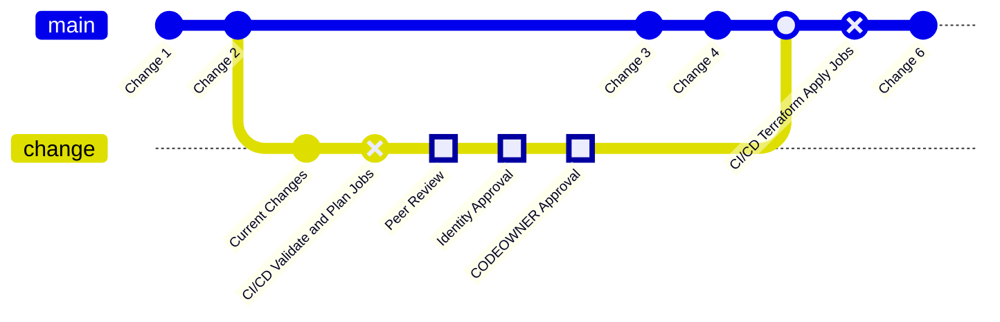

{}
これは GitLab Identity v3 (2024年中頃) の将来状態のドキュメントプレビューです。GitLab Identity v2 のベースラインエンタイトルメントとアクセスリクエストを含む現状については、<a href="/handbook/security/security-and-technology-policies/access-management-policy/">Access Management Policy</a> を参照してください。ロードマップは <a href="https://gitlab.com/groups/gitlab-com/gl-security/identity/eng/-/roadmap?state=all&sort=start_date_asc&layout=QUARTERS&timeframe_range_type=THREE_YEARS&group_path=gitlab-com/gl-security/identity/eng&progress=WEIGHT&show_progress=true&show_milestones=false&milestones_type=ALL&show_labels=true">エピックのガントチャート</a> を参照してください。
{}

## GitOps ワークフロー

各ベンダーインスタンスごとに GitLab リポジトリを持っており、`.gitlab-ci.yml` ファイルには `terraform validate`、`checkov` (IaC SAST スキャン)、`terraform plan`、`terraform apply`、`terraform destroy` などの CI/CD パイプラインジョブが定義されています。

すべての変更は `terraform validate`、`checkov`、`terraform plan` ジョブを持つ GitLab ブランチで実行されます。マージリクエストはすべてのジョブが成功し、すべての承認が得られることを必須とするように設定されており、すべての承認後に自動的にマージされます。

## 承認ルール

各マージリクエストはピアレビューを必須とし、3 つ (実際は 2 つ) の [GitLab 承認ルール](https://docs.gitlab.com/ee/user/project/merge_requests/approvals/) で構成されています。ピアレビュアーは修正のためにコミットを追加したり、マージリクエストレビューコメントで提案を行うことが許可されています。

1. **Identity Approval** 承認は、技術的な正確性を保証するため、Identity Engineering または Identity Operations チームによるレビューを必須とします。これは、コミットを行わなかった Identity ピアレビュアーが実行できます。ピアレビュアーがコミットを行った場合、職務分掌のために追加の人物が承認を提供する必要があります。
1. **System Owner** 承認は、Terraform GitLab リポジトリ内の各ディレクトリまたはファイルのビジネスオーナーとテクニカルオーナーを指定する [CODEOWNERS](https://docs.gitlab.com/ee/user/project/codeowners/) ファイルを利用します。デフォルトでは GitLab のテックスタックに依存していますが、Identity Operations チームが特定の構成のドメイン主題専門家 (SME) になるように更新できます。

すべての承認が提供された後、マージリクエストは自動的にマージされます。**変更が本番に反映される準備が整うまで承認は提供すべきではありません。**

ブランチが `main` ブランチにマージされると、`terraform apply` ジョブが CI/CD パイプラインに含まれ、`terraform plan` ジョブがパスすれば自動的に実行され、変更は自動的に本番に反映されます。

## 標準化されたモジュールと構文

私たちは、モジュール構成ブロック内に少数の変数を定義するだけで、その他の構文をすべてモジュール内で標準化して扱える事前定義済みモジュール (構成テンプレート) のライブラリを持っています。

各モジュールは、適切な Terraform 構成ファイル内で利用できます。詳細については、各ベンダーのリポジトリを参照してください。
