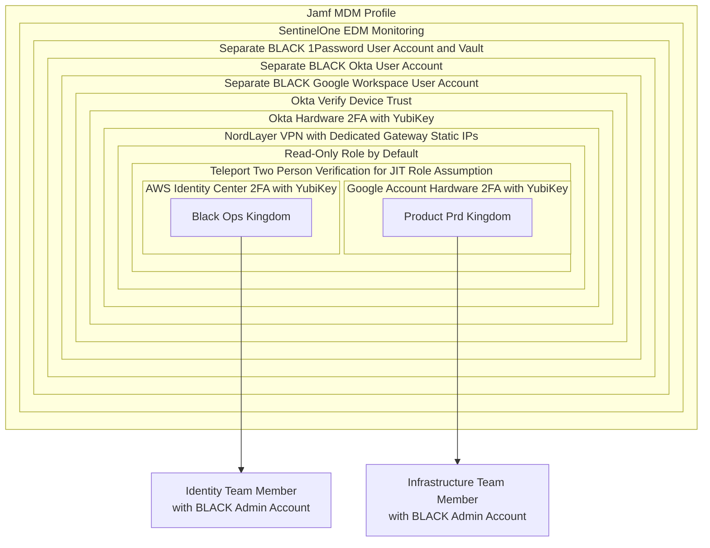

## セキュリティリスクの免責事項

私たちは透明性の一環として、何を行っているかについての高レベルな説明を共有しますが、それをどのように行っているかの詳細は公表しません。この高レベルの概要を公開することで、姿勢を改善するために是正できる不備についてコミュニティからフィードバックを受け取れる傾向があります。

世界のソースコードは、ベストプラクティスを共に協力することでより安全になります。もしこれを侵入できる方がいれば、ぜひ私たちのチームに参加することについてお話ししたいです。

脆弱性の報告については、私たちのバグバウンティおよび責任ある開示のプロセスを利用してください。

## 城壁

### 管理 Kingdom

## インサイダーアクセスの信頼

各 Kingdom のラテラルムーブメント制御は異なり、公にも共有されていません。機密領域には追加の隠れた監視制御があり、すべてのアクティビティがクロスファンクショナルなチームによって監視され、アクションがユーザーと検証され、根拠ドキュメント (インシデント / Issue / チケットなど) にマッピングされていることを保証します。

GitLab Identity v2 から GitLab Identity v3 へとイテレーションを進めるにつれて、ラテラルムーブメントの可能性を防ぐため、スコープ付きアクセスポリシーを洗練していきます。
