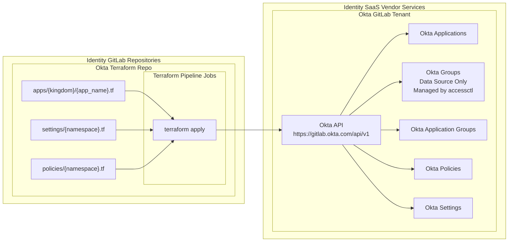

{}
これは GitLab Identity v3 (2024年中頃) の将来状態のドキュメントプレビューです。GitLab Identity v2 のベースラインエンタイトルメントとアクセスリクエストを含む現状については、<a href="/handbook/security/security-and-technology-policies/access-management-policy/">Access Management Policy</a> を参照してください。ロードマップは <a href="https://gitlab.com/groups/gitlab-com/gl-security/identity/eng/-/roadmap?state=all&sort=start_date_asc&layout=QUARTERS&timeframe_range_type=THREE_YEARS&group_path=gitlab-com/gl-security/identity/eng&progress=WEIGHT&show_progress=true&show_milestones=false&milestones_type=ALL&show_labels=true">エピックのガントチャート</a> を参照してください。
{}

{}
このページは Okta バックエンド設定に固有の内容です。あわせて <a href="/handbook/security/identity/platform/provisioning/okta">Okta グループおよびユーザープロビジョニング</a>、<a href="/handbook/security/identity/guide/app">Tech Stack アプリケーションユーザーガイド</a>、<a href="/handbook/security/identity/approvals">マージリクエストの承認</a> のドキュメントもご確認ください。
{}

## Terraform アーキテクチャ

Okta リポジトリは、Admin UI で実行可能なあらゆる構成の管理に利用されます。これにより、日々の管理操作とグローバル設定のすべてを、MR 承認ルールと CI/CD 自動化を備えた状態管理へと移行できます。

## Okta ポリシーおよび設定の構成

グローバル設定とポリシーは、Identity Kingdom が管理する各フォルダーで管理されます。

| 構成ファイル              | CODEOWNERS                                    |
|---------------------------|-----------------------------------------------|
| `admins/{handle}.tf`      | `sec_identity_ops`                            |
| `policies/{namespace}.tf` | (2 Approvals) `sec_identity_ops` `sec_leader` |
| `settings/{namespace}.tf` | (2 Approvals) `sec_identity_ops` `sec_leader` |

## アプリケーションと割り当てグループ

GitLab のテックスタックには、さまざまなビジネスオーナーおよびテクニカルオーナーによって管理される数百のアプリケーションがあります。

`apps` ディレクトリは、コンプライアンス要件の違いに対応するために、私たちの [Identity Kingdom](/handbook/security/identity/kingdoms) に基づくネストされたディレクトリ構造になっています。Kingdom が所有する各アプリケーションは独自のファイルを持ち、アプリケーション設定とそのアプリケーションに割り当てられる Okta グループを指定します。

| 構成ファイル                        | CODEOWNERS                                                |
|-------------------------------------|-----------------------------------------------------------|
| `apps/identity/{app_name}.tf`       | `sec_identity_eng`                                        |
| `apps/business_sox/{app_name}.tf`   | `it_ops_leader`                                           |
| `apps/business_stack/{app_name}.tf` | テックスタックのビジネスオーナーおよびテクニカルオーナーに基づきファイル単位 |
| `apps/product_ded/{app_name}.tf`    | テックスタックのビジネスオーナーおよびテクニカルオーナーに基づきファイル単位 |
| `apps/product_dev/{app_name}.tf`    | テックスタックのビジネスオーナーおよびテクニカルオーナーに基づきファイル単位 |
| `apps/product_prd/{app_name}.tf`    | テックスタックのビジネスオーナーおよびテクニカルオーナーに基づきファイル単位 |
| `apps/sandbox/{app_name}.tf`        | リクエスターまたはサービスアカウントオーナーに基づきファイル単位             |
| `apps/services/{app_name}.tf`       | リクエスターまたはサービスアカウントオーナーに基づきファイル単位             |

### 承認ルール

構成は、設定の名前空間または特定のリソースを制御する Kingdom に基づいて、別々のファイルに分割されています。

私たちは GitLab マージリクエスト (MR) の承認ルールに `CODEOWNERS` を利用し、特定のフォルダーまたは構成ファイルに対する変更について、どのビジネスオーナーおよびテクニカルオーナーが承認できるかを指定しています。

Okta グループとユーザーメンバーシップは Terraform の外で管理されているため、状態管理への変更は数少なく、監査性を簡素化できます。

詳細は [マージリクエスト承認](/handbook/security/identity/approvals) のドキュメントを参照してください。

### アプリケーションユーザー

私たちは個別の名前付きユーザーをアプリケーションに直接割り当てることはしません。すべてのユーザーはグループに割り当てられ、グループがアプリケーションに割り当てられます。

アプリケーションには 3 つの異なるカテゴリのグループを割り当てることができます。

1. **Type (`rbac_type_*` グループ)** ユーザーのカテゴリ (例: 従業員、契約社員など) を割り当てることができます。GitLab では [アクセスレベルリストバンドカラー](https://internal.gitlab.com/handbook/it/it-self-service/access-level-wristband-colors/) を利用しているため、すべての `blue`、`purple`、`brown`、`black` ユーザーに一括でアクセスを割り当てられます。

1. **Identity Role (`rbac_role_*` グループ):** 通常はジョブタイトルやマネージャーに固有の機能チームに基づいて、ユーザーを割り当てることができます。

1. **Identity Organizational Unit (`rbac_ou_*` グループ):** 部署、サブ部署、その他の機能領域に属し、複数の継承された Identity Role や他のルールセットを持つユーザーを割り当てることができます。

すべてのグループとユーザー割り当ては `accessctl` によって管理され、ユーザーメンバーシップは Okta API を介して、各 `rbac_type_*`、`rbac_role_*`、または `rbac_group_*` グループの名前と一致する既存の Okta グループと同期されます。

これにより、職務分掌とコントロールプレーンの分離が実現します。「誰がどのグループのメンバーであるか」と「どのグループがどのアプリケーションへアクセスを許可されているか」が分離されるのです。これにより `accessctl` のコントロールプレーンがアプリケーションからグループを付与/取り外しすることを防ぎ、その変更にはアプリケーションの Terraform 設定でアプリケーションオーナーが構成または承認することを必須とします。

### 自動化されたグループ

スケジュールされたバックグラウンドジョブが実行されると、`accessctl` は Identity チームが管理するポリシールールセットに基づいて各ユーザーの `rbac_type` および `rbac_role` を計算し、各 `rbac_type` および `rbac_role` の既存の Okta グループとユーザーリストを同期します。

ユーザーのタイプごとおよびジョブロールごとに事前定義されたグループがあることで、アプリケーションオーナーはどのロールがアプリケーションへのアクセスを持つかを「ハードコーディング」することが容易になり、日々のユーザーアクセスリクエストを管理することなく「設定して忘れる」運用が可能となり、変更管理コンプライアンスも保証されます。

`rbac_role` ポリシーは Identity チームによって中央集約的に厳密に管理されているため、チームやマネージャーが任意または動的に追加ユーザーを更新する新しいグループを作成し、本来アクセスを持つべきでないユーザーがアクセスを得てしまうという可能性を回避できます。

### 動的ポリシー Organization Unit グループ

**Organization Unit グループ** は、部署、サブ部署、チーム、または **2 つ以上のロール** で構成される他の大きなグループに利用できます。Organization Unit グループは、機能領域を中央で管理し、まとめてグループ化するのを助けるために、ディビジョンおよび部門のリーダーまたはピープルマネージャーによって管理されます。

Organization Unit グループでは、1 つ以上のロール、1 つ以上のユーザー属性、または特定のユーザーハンドル (クロスファンクショナルなユーザーに有用) を指定できます。再帰的な複雑性を防ぐため、他の Organization Unit グループを付加することはできません。これにより、各 Organization Unit を中央で管理でき、各アプリケーションの複数の場所でロールリストを保守する必要がなくなり、メンテナンスが簡素化されます。

### ロールおよびグループの割り当て

Organization Unit はポリシーで管理されますが、ユーザーがアクセス可能なシステムに対するコンプライアンスおよびロールベースアクセス制御の意味を完全に理解していない多くの貢献者が存在する可能性があります。

権限要件やコンプライアンス要件が厳しいアプリケーションについては、アプリケーションオーナーは「信頼された」`rbac_type` または `rbac_role` グループのみを利用すべきです。比較的厳格でない、「マスアサイン可能」とみなされるアプリケーションについては、Organization Unit グループの方がメンテナンスが容易です。

必要に応じて Terraform 設定で `rbac_role_*` と `role_ou_*` グループを組み合わせて利用できます。

グループを定義したら、すべてのアクセスは自動化されているため、アプリケーションオーナーは日々のアクセスリクエストを処理する必要がありません。唯一の例外は、ユーザーがサインインした後にアプリケーション内で追加の権限を付与する必要があるシステムです。これについては、各ベンダーの API を利用して特定のリソースへのアクセスを付与するプロビジョニングスクリプトとしての Identity Blueprints の概念を使い、システムごとに将来的にイテレーションすることを検討します。

### アクセスリクエスト

追加のユーザーがアクセスを必要とする場合、いくつかのアプローチがあります。

1. ユーザーの属性が、Okta アプリケーションにすでに付加されているロールまたは Organization Unit の **既存の基準と一致する** 場合。リクエストなしで自動的にアクセスが付与されます。

1. **Organization Unit グループ** ポリシーの `CODEOWNER` (例: ディビジョンリーダー、部門マネージャー、Executive Business Assistant) は、追加のロールを含めるよう `accessctl` のポリシーを更新できます。Organization Unit のユーザーマニフェストは自動的に再計算され、ユーザーはアプリケーションにすでに付加されている Organization Unit Okta グループに追加されます。

1. アプリケーションの CODEOWNER は、Terraform を利用して追加の **ロールグループ** をアプリケーションに追加できます。

これにより、ディビジョンおよび部門のリーダー、またはその代理人 (例: Executive Business Administrator) が Organization Unit グループのポリシーとどのロールがメンバーであるかを中央で管理することにより、メンテナンス性が向上します。

各グループに付加される *ユーザー* は `accessctl` のポリシーと REST API 呼び出しによって管理されている (Terraform ではない) ため、Terraform 状態管理への変更は数少なく、監査性を簡素化できます。

## 管理者ユーザーアクセス

### 日常の管理者アクセス

私たちの Identity Engineering および Operations Okta システム管理者と、IT およびセキュリティの指定チームメンバーは、`Read Only Administrator` ロールを持っています。彼らは `accessctl` を使用してブレークグラスの設定変更のために一時的な昇格 (Super Admin ではない) ロールをリクエストできますが、ほとんどの変更は Terraform MR で実行されます。

### スーパー管理者 (Root) アクセス

私たちは、中央集約コントロールプレーンで管理されない別個のユーザーアカウントとして、バックドア管理アクセスを提供する 2 つのスーパー管理者ユーザーアカウントを持っています。これらの認証情報は帯域外で Vault に安全に保管され、コンプライアンスを保証するため、インシデントの宣言と Identity チームによる二人ルールの承認が必要です。

これらのアカウントには追加のセキュリティ対策が施されています。

- IP アドレスのアクセス制御リスト (ACL) で VPN の既知のゲートウェイアドレスに制限
- スーパー管理者イベントログアクション (キーロガーに似たもの) のすべての監査ログは、デフォルトで中央集約のロギングシステムにエクスポートされます。また、すべてのログをプログラム的に解析し、透明性のためにインシデント Issue コメントに追加します。
- 各ブレークグラスインシデント後、ユーザーマシン上の認証情報が再利用されないよう、パスワードは自動的にローテーションされます。

セキュリティリスクの観点から、追加の詳細は意図的に伏せています。
