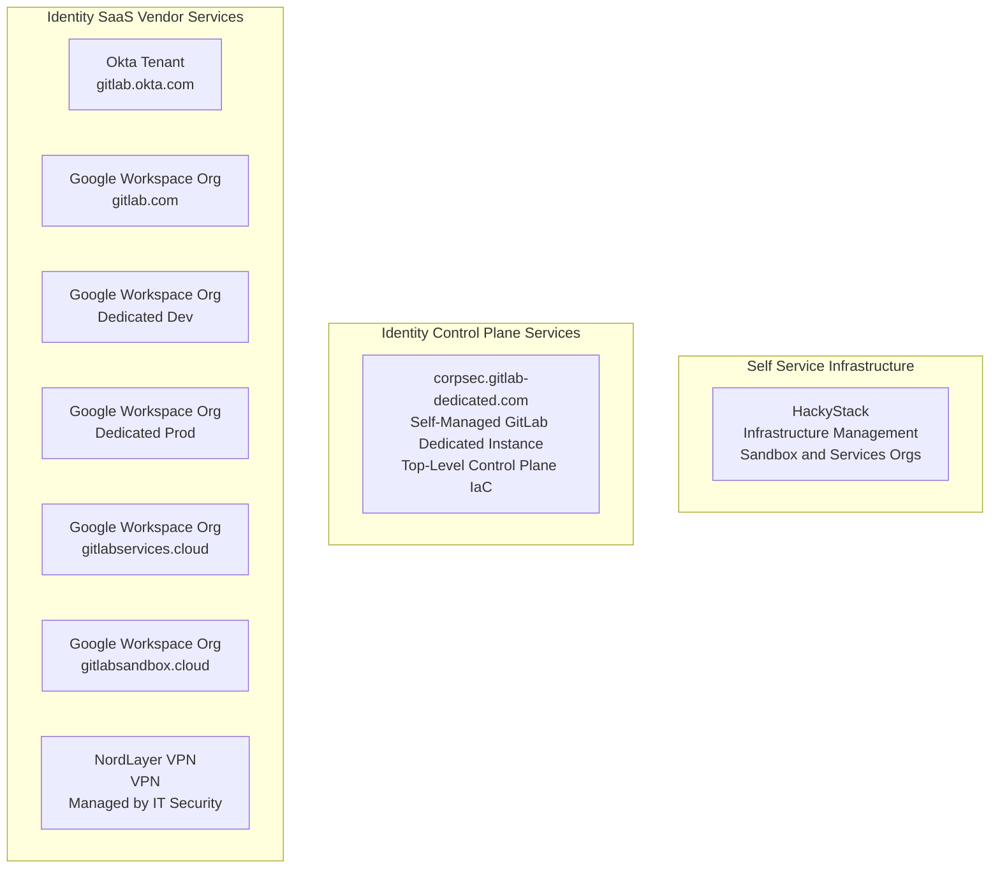
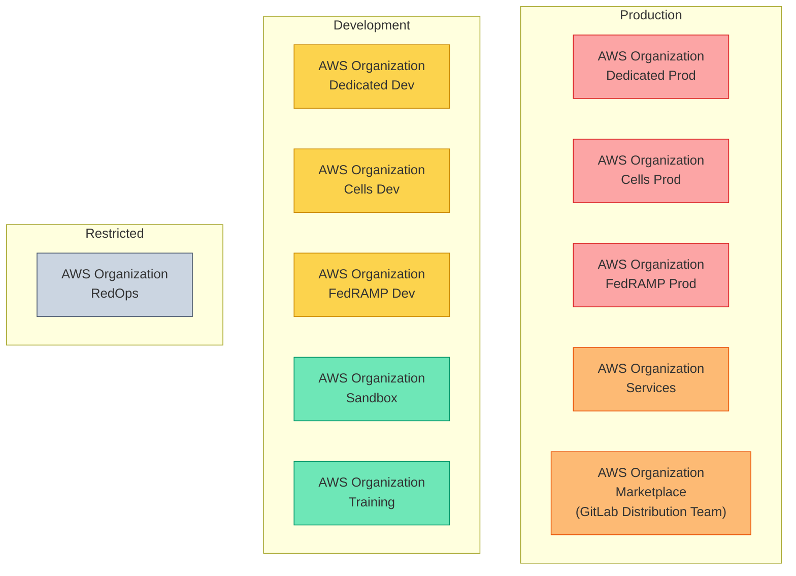
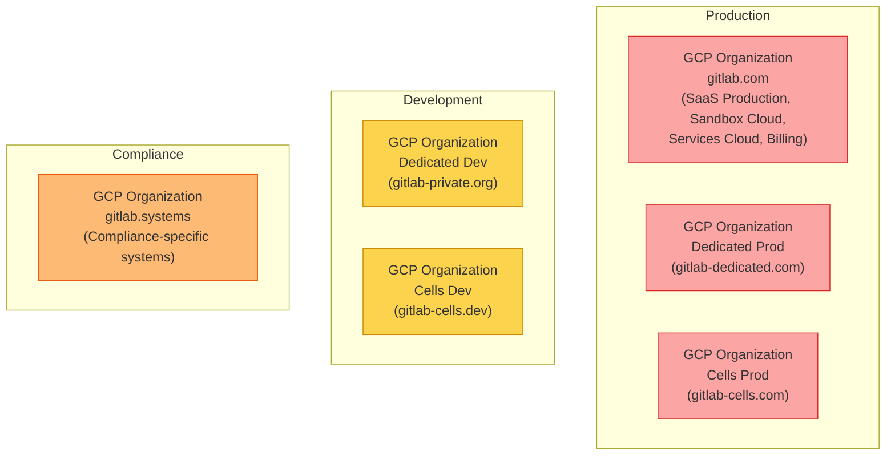

<link rel="stylesheet" type="text/css" href="/stylesheets/biztech.css" />

## 概要

RED データを扱うすべての Cloud インフラは [Infrastructure](/handbook/engineering/infrastructure) 部門が管理しています。ORANGE/YELLOW/GREEN データに対するすべてのデモ／開発／テスト／サンドボックス／ステージング／本番インフラは、CorpSec Identity チームがセルフサービスポータルまたは Issue テンプレートを通して作成しています。

各チームメンバーは、Sandbox Cloud を使って自分の実験用に AWS アカウントと GCP プロジェクトをセルフサービスで作成できます。これは個人用のサンドボックスであり、他者と共有するものではありません。

複数のユーザーがアクセスする各サービス／ワークロード用に、私たちは AWS アカウントと GCP プロジェクトをプロビジョニングします。

私たちは、セキュリティ上のブラスト半径とコスト按分の理由から、「ワークロードごとに 1 アカウント／プロジェクト」を信条としています。これらを `collaborative projects/accounts` と呼びます。チームの名前が付いた同一の AWS アカウントや GCP プロジェクトに、機能が異なるアプリケーションを **デプロイしないでください**。新しい AWS アカウントや GCP プロジェクトを依頼するには Issue テンプレートを使うだけです。

- [Sandbox Cloud ドキュメント](/handbook/company/infrastructure-standards/realms/sandbox)
- セルフサービス: [個人用 AWS アカウントまたは GCP プロジェクトを作成する](/handbook/company/infrastructure-standards/realms/sandbox/#individual-aws-account-or-gcp-project)
- Issue テンプレート: [サービス／チーム／ワークロード用 AWS アカウントを作成する](https://gitlab.com/gitlab-com/gl-security/corp/issue-tracker/-/issues/new?issuable_template=aws_account_create)
- Issue テンプレート: [サービス／チーム／ワークロード用 GCP プロジェクトを作成する](https://gitlab.com/gitlab-com/gl-security/corp/issue-tracker/-/issues/new?issuable_template=gcp_project_create)
- Issue テンプレート: [AWS アカウントから IAM ユーザーを追加または削除する](https://gitlab.com/gitlab-com/gl-security/corp/issue-tracker/-/issues/new?issuable_template=aws_account_iam_update)
- Issue テンプレート: [GCP プロジェクトから IAM ユーザーを追加または削除する](https://gitlab.com/gitlab-com/gl-security/corp/issue-tracker/-/issues/new?issuable_template=gcp_project_iam_update)
- 非本番インフラに関する質問は `#sandbox-cloud-questions` まで - Vlad Stoianovici にメンションしてください

## Identity コントロールプレーン

Identity チームは、インフラ用の管理アクセス制御プレーンを管理しています。Identity コントロールプレーンを構成するサービスは次のとおりです。

- [corpsec.gitlab-dedicated.com](https://corpsec.gitlab-dedicated.com) - CorpSec 用のセルフマネージド GitLab Dedicated インスタンス。Identity の構成パイプライン、ポリシー、Infrastructure-as-Code をホスティング。Okta による SSO。指定された Security チームメンバーのみアクセス可能。
- [gitops.gitlabsandbox.cloud](https://gitops.gitlabsandbox.cloud) - Sandbox Cloud 用の Terraform 環境（HackyStack で動作）
- [gitlabsandbox.cloud](https://gitlabsandbox.cloud) - チームメンバーに対して AWS と GCP へのセルフサービスアクセスを提供する HackyStack のインスタンス。

## クラウドプロバイダー組織管理

CorpSec Identity チームは、[Infrastructure Security](/handbook/security/product-security/infrastructure-security) チームと協業しながら、GCP、AWS、Azure のトップレベルのクラウドプロバイダーインフラ組織レベルの管理を担っています。

インフラリソースをデプロイする各チームは、業界のベストプラクティスを用いて自チームのインフラワークロードと DevOps オペレーションを管理する責任を持ちます。Security チームは組織のスキャフォールディング（Terraform テンプレート）とセキュリティ境界を提供し、各チームはその境界の中で自チームのワークロードを管理する責任を持ちます。

### AWS Organizations

AWS Organizations は合計で 11 個あります。以前言及されていた「AWS Billing Org」と「AWS Systems Org」は存在しません。

| Organization | 目的 | データ分類 |
|---|---|---|
| **Sandbox** | チームメンバーの実験用セルフサービス個人アカウント。ユーザーごとに 1 アカウント。 | GREEN |
| **Services** | 内部ツール／サービス用の共有ワークロードアカウント。ワークロードごとに 1 アカウント。 | ORANGE |
| **Marketplace** | GitLab Distribution チーム。マーケットプレイスへの掲載と配布インフラ。 | ORANGE |
| **Training** | 製品トレーニングおよびハンズオンラボ環境。 | GREEN |
| **Dedicated Dev** | GitLab Dedicated 用の開発環境。ユーザーごとに 1 アカウント。 | YELLOW |
| **Dedicated Prod** | GitLab Dedicated 用の本番環境。コントロールプレーンアカウントとテナント環境ごとに 1 アカウント。 | RED |
| **Cells Dev** | GitLab Cells 用の開発環境。 | YELLOW |
| **Cells Prod** | GitLab Cells 用の本番環境。 | RED |
| **FedRAMP Dev** | FedRAMP 開発環境。正確な組織名は異なる場合があります。 | YELLOW |
| **FedRAMP Prod** | FedRAMP 本番環境。正確な組織名は異なる場合があります。 | RED |
| **RedOps** | Red Team 運用。アクセス制限あり — 意図的に他組織から隔離されています。 | Restricted |

### GCP Organizations

既知の GCP Organizations は 6 個あります。請求設定の都合上、請求チームが特定の組織すべてを完全に把握できるわけではないため、このリストはベストエフォートです。以前言及されていた「GCP Billing」は別組織ではなく、請求は `gitlab.com` GCP 組織の一部です。

> **注意**: Dedicated と Cells のチームは [GCP からの移行](https://gitlab.com/gitlab-com/gl-infra/gitlab-dedicated/team/-/work_items/11211) を進めています。これらの GCP Organizations は近～中期的に廃止される可能性があります。

| Organization | ドメイン | 目的 | データ分類 |
|---|---|---|---|
| **gitlab.com** | `gitlab.com` | プライマリ GCP 組織。SaaS 本番インフラ、Sandbox Cloud（フォルダ／レルムとして）、Services Cloud、請求を含む。 | RED |
| **gitlab.systems** | `gitlab.systems` | 他のインフラから完全分離が必要なコンプライアンス固有アプリケーション。CorpSec Identity が所有。 | ORANGE |
| **Dedicated Dev** | `gitlab-private.org` (Org ID: 407309174171) | GitLab Dedicated 用の開発環境。 | YELLOW |
| **Dedicated Prod** | `gitlab-dedicated.com` | GitLab Dedicated 用の本番環境。 | RED |
| **Cells Dev** | `gitlab-cells.dev` | GitLab Cells 用の開発環境。 | YELLOW |
| **Cells Prod** | `gitlab-cells.com` | GitLab Cells 用の本番環境。 | RED |

## 共有責任

私たちはクラウドプロバイダーに対して責任共有モデルを採用しています。

### CorpSec Identity チーム

> CorpSec Identity チームは、GitLab 全体の Identity、アクセス、クラウドインフラ管理を所有しています。私たちは、ID プロバイダーの管理からクラウド組織管理、セキュリティポリシーの強制まで、全領域をカバーする 1 つのチームです。

**Identity & アクセス管理**

- Okta の管理および統合
- Lumos アクセスガバナンス
- Workday の ID ライフサイクル統合
- Identity Roles および Identity Groups の定義
- AWS Identity Center Groups と Permission Sets の管理
- Google Groups とユーザーメンバーシップの管理
- サービスアカウントのライフサイクル管理
- 非人間 ID（NHI）のセキュリティ — サービスアカウント、API キー、OAuth トークン
- 従業員 ID の検証と本人確認
- ジャストインタイムアクセス制御
- 最小権限とロールベースのアクセス制御の割り当て

**クラウドインフラ管理**

- トップレベルの GCP、AWS、Azure 組織レベルの管理、請求、IAM/RBAC
- AWS アカウントと GCP プロジェクトの作成と廃止
- Azure サンドボックスユーザー管理
- インフラ標準と命名規約
- Sandbox Cloud のアーキテクチャと自動化（開発／テスト環境）
- Services Cloud のアーキテクチャと自動化（本番相当環境）
- レガシーな AWS アカウントと GCP プロジェクトの技術的負債削減
- クラウドセキュリティポリシーと構成監査

**AI Enterprise Enablement**

- AI ツールのセキュリティ評価および承認ワークフロー
- AI リスクアセスメントとガバナンスフレームワーク
- CorpSecAI 自動化エンジニアリング（データパイプライン、Webhook 自動化）
- 組織全体での AI ツール／プラットフォームのセキュアな採用支援

### Services Cloud

インフラリソースをデプロイする各チームは、業界のベストプラクティスを用いて自チームのインフラワークロードと DevOps オペレーションを管理する責任を持ちます。

Security チームは組織のスキャフォールディングとセキュリティ境界を提供し、各チームはその境界の中で自チームのワークロードを管理する責任を持ちます。

### Sandbox Cloud のユーザー（エンジニア）

各ユーザーは、自身のワークロードの作成と削除に責任を持ちます。

詳細は [Sandbox Cloud ハンドブックページ](/handbook/company/infrastructure-standards/realms/sandbox) で学べます。
