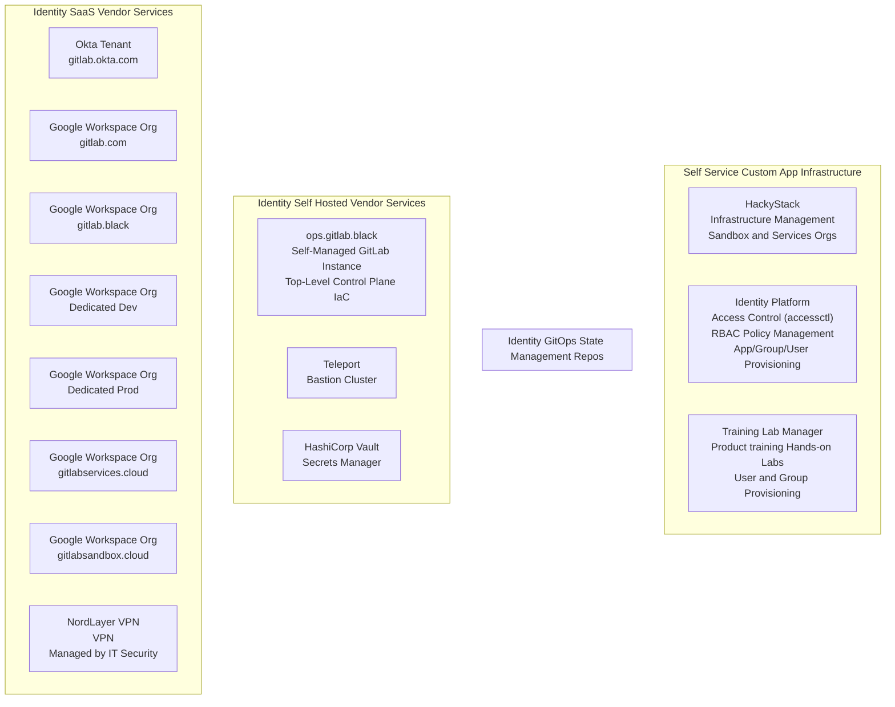

## Business Kingdom

[GitLab テックスタック](/handbook/business-technology/tech-stack-applications/) には、私たちが利用しているすべての SaaS アプリケーションとベンダーの包括的なリストがあります。Finance 部門配下の Business Technology および IT チームは、私たちの [部門横断的なシステムオーナー](/handbook/security/corporate/systems/) に対して IT ガバナンスと調達管理を提供しています。

IT チームの主な焦点は、ほとんどのアプリケーションを Okta SSO と連携させることであり、組織全体で利用されるアプリケーション、SOX コンプライアンス対象のアプリケーション、または Finance、Legal、People、Sales 機能に関連するアプリケーションを優先します。

詳しくは [テックスタックのハンドブックページ](/handbook/business-technology/tech-stack-applications/) と [Okta ハンドブックページ](/handbook/security/corporate/end-user-services/okta/) をご覧ください。

## Cloud Kingdom

GitLab では Amazon Web Services (AWS) と Google Cloud Platform (GCP) を利用しており、Microsoft 固有のサンドボックスユースケースの一部のワークロードを Azure で、小規模な GitLab SaaS Runner ワークロードを Oracle Cloud Infrastructure (OCI) で運用しています。

各チームは、自チームの子 AWS アカウント、GCP プロジェクトなどのワークロードに責任を持ちます。

Cloud Kingdom は Security Identity チームが管理し、Infrastructure Security、Infrastructure、SIRT のカウンターパートと協業しています。すべてのアクセス管理は、標準的なベースラインエンタイトルメント、本番アクセス用のアクセスリクエスト、および非本番アクセスや開発・テスト用のアカウント／プロジェクト用の [Sandbox Cloud](/handbook/company/infrastructure-standards/realms/sandbox/) を通して処理されます。

詳細は [Identity Infrastructure](/handbook/security/identity/infrastructure) ハンドブックページをご覧ください。

## Product SaaS Production (product-prd) Kingdom

Product テックスタックとは、GitLab.com SaaS、GitLab Dedicated、GitLab 製品ソースコードと関連サービス、および顧客向けの製品関連サービスをホストするために使用するすべてのインフラパッケージ、サービス、ソフトウェアを指します。

サービスがどのように管理されているかについての詳細は [Infrastructure Production Architecture](/handbook/engineering/infrastructure-platforms/production/architecture/) ハンドブックページをご覧ください。含まれるサービスの非網羅的なリストについては [Services Catalog](https://gitlab.com/gitlab-com/runbooks/-/blob/master/services/service-catalog.yml) をご覧ください。インフラ as コードの構成については [config-mgmt](https://gitlab.com/gitlab-com/gl-infra/config-mgmt) リポジトリで確認できます。

Infrastructure 部門のカウンターパートが、`Product Stack` のアーキテクチャ、構成、管理に責任を持ちます。

## Product Dedicated (product-ded) Kingdom

Dedicated Product Kingdom は Environment Automation チームが管理しています。

詳細は [GitLab Dedicated Group ハンドブックページ](/handbook/engineering/infrastructure-platforms/gitlab-dedicated/) で学べます。

## Black Ops Kingdom

私たちは [アクセスレベル リストバンドカラー](https://internal.gitlab.com/handbook/it/it-self-service/access-level-wristband-colors/) を利用して、管理者アクセス用に別個の `BLACK` ユーザーアカウントを提供しています。すべての管理者アカウントは `gitlab.black` ドメイン名を持つ上流のコントロールプレーンで GitOps によって管理されます。Product Kingdom の構成管理に対する `ops.gitlab.net` という命名規則と整合させ、管理者レベルの構成は `Black Ops` と呼ぶセルフマネージド GitLab インスタンス `ops.gitlab.black` で管理されます（ステルス運用へのオマージュであり、軍事的な意味合いはありません）。

Black Ops Kingdom は Identity Infrastructure チームが管理しています。

