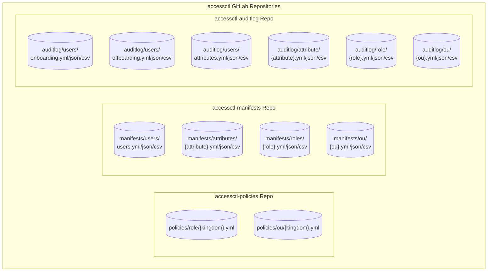
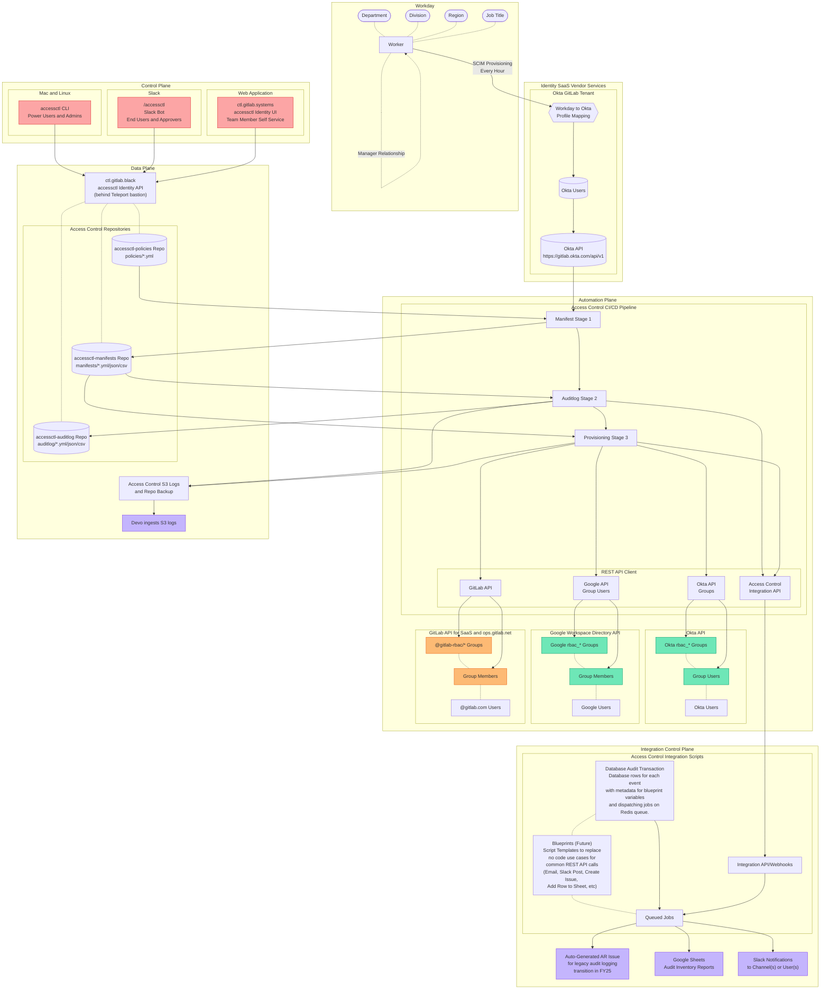

{}
GitLab Identity v3 の将来状態（2024 年中頃）に関するドキュメントのプレビューを表示しています。GitLab Identity v2 の現在の状態（baseline entitlements とアクセスリクエスト）については <a href="/handbook/security/security-and-technology-policies/access-management-policy/">Access Management Policy</a> を参照してください。ロードマップは <a href="https://gitlab.com/groups/gitlab-com/gl-security/identity/eng/-/roadmap?state=all&sort=start_date_asc&layout=QUARTERS&timeframe_range_type=THREE_YEARS&group_path=gitlab-com/gl-security/identity/eng&progress=WEIGHT&show_progress=true&show_milestones=false&milestones_type=ALL&show_labels=true">Epic ガントチャート</a> で確認できます。
{}

## Identity Platform アーキテクチャ {#identity-platform-architecture}

- CI/CD パイプライン
  - [Manifests Stage](/handbook/security/identity/platform/manifests)
  - [Auditlog Stage](/handbook/security/identity/platform/auditlog)
  - Provisioning Stage
    - [Okta Provisioning](/handbook/security/identity/platform/provisioning/okta)
    - [Google Groups Provisioning](/handbook/security/identity/platform/provisioning/google)
    - [GitLab Groups Provisioning](/handbook/security/identity/platform/provisioning/gitlab)
    - [GitLab Projects Provisioning](/handbook/security/identity/platform/provisioning/gitlab)
- [Access Requests](/handbook/security/identity/access-requests)
- [Approvals](/handbook/security/identity/approvals)
- [Access Check (accesschk) Audit](/handbook/security/identity/platform/accesschk)
- [Terraform GitOps Configuration-as-Code](/handbook/security/identity/gitops)
  - [AWS Configuration](/handbook/security/identity/gitops/aws)
  - [GCP Configuration](/handbook/security/identity/gitops/gcp)
  - [Okta Configuration](/handbook/security/identity/gitops/okta)

## ユーザーガイド {#user-guides}

- [Admin Guide](/handbook/security/identity/guide/admin)
- [Application Configuration Guide](/handbook/security/identity/guide/app)
- [Audit and Compliance Guide](/handbook/security/identity/guide/audit)
- [Change Management Guide](/handbook/security/identity/guide/change-mgmt)
- [Developer Guide](/handbook/security/identity/guide/developer)
- [Incident Response Guide](/handbook/security/identity/guide/incident)
- [Manager Guide](/handbook/security/identity/guide/manager)
- [Offboarding Ops Guide](/handbook/security/identity/guide/offboarding)
- [Onboarding Ops Guide](/handbook/security/identity/guide/onboarding)
- [Policy Management Guide](/handbook/security/identity/guide/policy)
- [Team Member End User Guide](/handbook/security/identity/guide/user)

## 存在意義

私たちは、各プラットフォーム／ベンダー（例: Okta Settings と Okta Applications）の構成とリソースを管理し、それぞれのプラットフォームでどのグループが各アプリケーション／リソース／権限に割り当てられているかを指定するために（例: Okta application グループ、GCP project ロールなど）、GitOps CI/CD パイプラインで Terraform を使用しています。すべてのユーザーメンバーシップ変更がない方が構成と状態管理の監査ログがはるかに監査しやすいと考えているため、それらの変更を分離し、それらのユースケース向けに改良された自動化ユーザー体験を提供するために Access Control を使用しています。

つまり、すべてのユーザーがアクセスリクエストのためにセルフサービス Terraform 変更を実行することは現実的ではありません。

Identity Engineering チームは、ロールベースアクセスコントロールに使用される標準化されたグループとユーザー管理アーキテクチャを作成しました。各標準化されたロールは、様々なシステムのグループと組み合わせて使用され、集中化されたポリシーと変更管理プロセスで管理される既知のユーザーリストにアクセスを一様に割り当てます。

Identity Platform は、各ベンダーの API を使用し、それらの間の統合配管を、集中管理される GitLab リポジトリに保存されるポリシーファイルとマニフェストを使用して提供するように設計されています。集中化されたデータベース（Git 経由）を維持しているため、統一されたポリシー管理、流線型のユーザー体験を提供でき、オンボーディング、アクセスリクエスト、キャリアモビリティ、オフボーディングに対して 90%+ の自動化を提供できます。

多くのベンダーが部分的な能力と一部の重複を持っていますが、使いやすさと統合は劇的に異なり、Identity v2 では多くの非効率性の問題を抱えていました。グループ管理が問題の核心にあるため、Identity Platform は主にグループユーザー管理の自動化に焦点を当てており、それは可能な場合に Terraform で自動化するベンダー設定の下流で使用されます。

### オープンソース

私たちが解決する必要があるリスクは機密ですが、リスクを軽減した後、コミュニティに還元し他社にインスパイアするため、ベストプラクティスのドキュメントとツールをオープンソース化することを信じています。

**私たちは一緒の方が強く、より安全です。**

私たちの Identity Platform オープンソースプロジェクトは [https://gitlab.com/gitlab-identity](https://gitlab.com/gitlab-identity) で探索できます。私たちのチームメンバーは、有用な依存関係と開発ヘルパーであるサイドプロジェクトパッケージも [https://gitlab.com/provisionesta](https://gitlab.com/provisionesta) で保守しています。

## 用語 {#terminology}

### Identity Types

> Okta User Attribute: `rbac_type`

私たちは、様々なシステムへの birthright アクセスを必要とするユーザー（例: 従業員、契約者、サービスアカウント、システム管理者）の異なるカテゴリーを持っています。各 Okta ユーザーのタイプを `blue`、`purple`、`gray`、`brown`、または `black` として指定するために、[access level wristbands](https://internal.gitlab.com/handbook/it/it-self-service/access-level-wristband-colors/) のカラーコーディングを使用しています。

### Identity Roles {#identity-roles}

> Okta User Attribute: `rbac_role`

**Identity Role** は、アクセスコントロールと権限に関連する、ユーザーが所属する機能チームまたは職位の標準化された snake case フォーマットです。

これは、GitLab Identity v2 の [job family](/job-description-library/) と [ロールベースの baseline entitlements](https://internal.gitlab.com/handbook/security/corporate/end-user-services/access-request/baseline-entitlements/) の次世代イテレーションです。

各ロールは `{department_slug}_{functional_team_slug}_{specific_role_if_applicable}` の構文を使用します。例えば、あなたの部門が `Infrastructure` であれば、RBAC slug は `infra` です。

`Site Reliability Engineer` の職位は、私たちが異なるレベルのアクセスを持つべき複数の機能的な Site Reliability Engineer のチームを持っているため、IAM/RBAC 目的では曖昧すぎます。

`infra_` プレフィックスを含む Infrastructure の各機能チームに対して、RBAC slug を定義しています:

- `infra_analytics`
- `infra_people_leader`
- `infra_platforms_leader`
- `infra_scalability_leader`
- `infra_eng_leader`
- `infra_ded_general`
- `infra_ded_env_automation`
- `infra_ded_switchboard`
- `infra_ded_us_pubsec`
- `infra_ded_ext`
- `infra_deployment`
- `infra_foundations`
- `infra_observability`
- `infra_ops`
- `infra_orchestration`
- `infra_practices`

これらの機能チームは通常、1 人または 2 人のマネージャーに報告する 1〜10（程度の）チームメンバーを持ちます。一部の機能チームはより大きい場合があります（例: プロダクトマネージャー、セールスロールなど）。

ポリシーの観点から、私たちはほとんどの場合、ユーザーの `manager` に基づいて、または必要に応じて特定の job `title` または特定のユーザー `handle` に基づいて、ユーザーをロールに関連付けます。

これらのチームのほとんどには特定のロールは必要ありません（Site Reliability Engineer の職位と Engineering Manager の職位の間に IAM の違いはありません）。承認権限の要件があるチームには、適切に `_engineer`、`_manager`、`_leader` などをサフィックスします。特定のロールには地域もサフィックスする場合があります（例: `sales_ent_amer_east_northeast`）。必ずしも特定のチームではないロールには、`_general`（複数機能の Staff/Principal Engineer）、`_ext`（最小権限アクセスの契約者）、その他 Identity チームの命名規則の判断によります。

チームマネージャーと部門のリーダーシップは、機能チームの命名に責任があります。Identity チームは、各チームのハンドブックページまたは提供される組織図ドキュメントを解析し、短縮された標準化された略語の命名法を作成する責任を持ちます。

組織構造が増減する中、私たちは常時 200〜250 のユニークな Identity Roles を持っています。すべてのロールは [policies](https://gitlab.com/gitlab-com/gl-security/identity/data-poc/policies) と [manifests](https://gitlab.com/gitlab-com/gl-security/identity/data-poc/manifests) リポジトリで確認できます。

| Division/Function | Identity Roles | アップストリームデータソース |
|-------------------|----------------|----------------------|
| Administrators | [Policies](https://gitlab.com/gitlab-com/gl-security/identity/data-poc/policies/-/blob/main/role/policies/black_ops.yml?ref_type=heads) | Identity Engineering |
| Executive | [Policies](https://gitlab.com/gitlab-com/gl-security/identity/data-poc/policies/-/blob/main/role/policies/business_executive.yml?ref_type=heads) | Identity Engineering |
| Finance | [Policies](https://gitlab.com/gitlab-com/gl-security/identity/data-poc/policies/-/blob/main/role/policies/business_finance.yml?ref_type=heads) | Manager と職位 |
| Legal | [Policies](https://gitlab.com/gitlab-com/gl-security/identity/data-poc/policies/-/blob/main/role/policies/business_legal.yml?ref_type=heads) | Identity Engineering |
| Marketing | [Policies](https://gitlab.com/gitlab-com/gl-security/identity/data-poc/policies/-/blob/main/role/policies/business_marketing.yml?ref_type=heads) | 部門名 |
| People | [Policies](https://gitlab.com/gitlab-com/gl-security/identity/data-poc/policies/-/blob/main/role/policies/business_people.yml?ref_type=heads) | [ハンドブックページ](/handbook/people-group/#how-to-reach-the-right-member-of-the-people-group) と Manager |
| Sales | [Policies](https://gitlab.com/gitlab-com/gl-security/identity/data-poc/policies/-/blob/main/role/policies/business_sales.yml?ref_type=heads) | Sales EBA Team と Department/Manager |
| Product Development | [Policies](https://gitlab.com/gitlab-com/gl-security/identity/data-poc/policies/-/blob/main/role/policies/product_dev.yml?ref_type=heads) | [DevOps Stages](/handbook/product/categories/#devops-stages) / [YAML](https://gitlab.com/gitlab-com/www-gitlab-com/-/blob/master/data/stages.yml?ref_type=heads) |
| Product Production | [Policies](https://gitlab.com/gitlab-com/gl-security/identity/data-poc/policies/-/blob/main/role/policies/product_prd.yml?ref_type=heads) | [ハンドブックページ](/handbook/engineering/infrastructure-platforms/#organization-structure) |
| Security | [Policies](https://gitlab.com/gitlab-com/gl-security/identity/data-poc/policies/-/blob/main/role/policies/security.yml?ref_type=heads) | [ハンドブックページ](/handbook/security/#division-structure) |
| Service Accounts | [Policies](https://gitlab.com/gitlab-com/gl-security/identity/data-poc/policies/-/blob/main/role/policies/service_accounts.yml?ref_type=heads) | Identity Engineering |

### Identity Organization Units

Identity Roles を作成する目標はアプリケーションとグループ割り当てのためのロールベースアクセスコントロール（RBAC）を実装することですが、各アプリケーションにすべてのロールを追加することは退屈で非効率的になる場合があります。

より粒度が細かくない権限や非機密のアクセスでは、長いロールリストではなく、組織単位にアクセスを付与できます。

**Identity Organization Unit (OU)** は、部門全体、サブ部門、チーム、地域グループ、その他の機能グループへのアクセス付与に有用な、より高レベルのグループのための *2 つ以上* の **Identity Roles** のグルーピングです。Identity チームは、各 division の Director/VP/EBA チームメンバーからのコラボレーティブな入力を受けて、organization unit の慣例に責任を負います。

ユーザーは 1 つのロールにのみ属することができますが、複数の organization unit に属することができます。

すべての organization unit は [policies](https://gitlab.com/gitlab-com/gl-security/identity/data-poc/policies) と [manifests](https://gitlab.com/gitlab-com/gl-security/identity/data-poc/manifests) リポジトリで確認できます。

### Identity Groups

ロールベースアクセスコントロール（RBAC）のため、複数のシステム間で同じ名前の Okta Group、Google Group、GitLab SaaS Group を作成することで、**Identity Types**、**Identity Roles**、**Identity Organization Units** を使用します。これらの各グループは、1 つ以上の Okta Application、Google Cloud project または folder、GitLab Group または Project にアタッチできます。将来的に追加のシステムが追加される可能性があります。

各ロールのユーザーリストが集中管理され、ユーザーが自動的に同期されるため、これにより多くの手動プロビジョニングの非効率性が削減されます。

私たちの自動化は各グループを自動的に作成し、検出された属性とポリシーマニフェストの変更に対する監査ログと自動化ワークフローと共に毎時間ユーザーリストを同期します。[manifests](/handbook/security/identity/platform/manifests)、[auditlog](/handbook/security/identity/platform/auditlog)、[provisioning](/handbook/security/identity/platform/provisioning) について詳しく確認できます。

生成された Okta Groups と Google Groups はアプリケーションに割り当てられ、JSON/YAML/CSV のスケジュール生成でアクセスでき、Identity Platform への API 呼び出しでアクセスでき、Compliance チームメンバーによる監査が可能で、生成された Google Sheets で表示でき、毎時または毎日更新される single source of truth として信頼できます。

#### Okta と Google Groups

各 **Type** グループは `rbac_type_{color}` でプレフィックスが付きます。

各 **Organization Unit** グループは `rbac_ou_{ou_name}` でプレフィックスが付きます

各 **Role** グループは `rbac_role_{color}_{role_name}` でプレフィックスが付きます。

`brown` アカウントには、各サービスアカウントがユースケースに基づいて最小権限の権限を持つため、ロールグループを作成しません。すべてのサービスアカウントのグルーピングは `rbac_type_brown` グループを使用します。

#### GitLab SaaS Groups

タイプ、ロール、または organization unit の GitLab SaaS グループは、適切な[権限ロール](https://docs.gitlab.com/ee/user/permissions.html) を持つ任意の他の GitLab グループ（子プロジェクト付き）または GitLab プロジェクトに Direct Member として招待できます。

- `@gitlab-rbac/type/{color}`
- `@gitlab-rbac/ou/{ou_name}`
- `@gitlab-rbac/role/{role_name}`

これにより、`gitlab-com` および `gitlab-org` ネームスペースのトップレベルで最小権限を付与し、特定のチームがトップレベルネームスペースから継承されたすべてのプロジェクトに対する完全な読み書きアクセスを持つことなく、独自の子ネームスペースをセルフ管理できる下流のグループとプロジェクトでプログラム的に昇格された `Developer`、`Maintainer`、`Owner` の[権限](https://docs.gitlab.com/ee/user/permissions.html) を追加できます。

（遠い）将来には、Terraform を使用して GitLab グループとプロジェクトの構成設定を管理する予定です。

### Identity Policies

各 Identity Role と Identity Organization Unit は、ユーザーがマニフェストに追加されるためにマッチする必要があるユーザー属性を定義する条件付きルールのリストとともに YAML ファイルで定義されます。

粒度の細かいロールの場合、1 つ以上の職位を指定できます。職位が複数の部門に存在する場合、特定の部門内または特定のマネージャーに報告する職位を指定できます。粒度のあまり細かくないロールでは、1 人のマネージャーが通常 1 つの命名された機能を所有するため、ユーザーのマネージャーを使用できます。より大きな機能チームでは、複数のマネージャーを単一のロールにマップできます。

すべてのポリシーは [policies](https://gitlab.com/gitlab-com/gl-security/identity/data-poc/policies) リポジトリで確認できます。

#### Identity Policy Rulesets

私たちのルールロジックはシンプルでありながら、合理的に強力です。チェックする 1 つ以上の属性を定義でき、属性条件のいずれかがマッチすれば、ユーザーがそのグループに追加されます。

YAML とのプログラム的な一貫性のため、すべての属性値は計算目的で lower_snake_case に変換されます。これにより、すべての句読点が削除され、空白がアンダースコアに置き換えられ、わずかな命名の不整合を解消します。

```plain
Infrastructure => infrastructure
Site Reliability Engineer => site_reliability_engineer
Director, Infrastructure => director_infrastructure
```

##### 利用可能な属性

Manifest Users ステージ中にインポートされた任意の Okta ユーザープロファイル属性を使用できます。

```yaml
# {accessctl_key}: '{oktaApiKey}'
email_to_handle:
  handle: 'email'
  manager: 'managerEmail'
snake_case:
  cost_center: 'costCenter'
  division: 'division'
  department: 'department'
  management_level: 'workday_managementLevel'
  organization_name: 'organization'
  region: 'workday_region'
  role: 'rbac_role'
  title: 'title'
``````

##### Single Attribute Rule

これは単一の属性の値をマッチさせる基本的なユースケースをカバーします。任意の条件がマッチすれば、ユーザーがマニフェストに追加されます。

```yaml
# Any user with these job titles
accounting_payable_analyst:
  - title: accounts_payable_analyst
  - title: senior_accounts_payable_analyst

# Any user with these job titles
product_manager:
  - title: product_manager
  - title: senior_product_manager
  - title: principal_product_manager
  - title: group_manager_product

# Any user that reports to this manager, including the manager too
eng_productivity:
  - manager: dmurphy
  - handle: dmurphy
```

##### Multiple Attribute Rule

Identity Groups の目標は粒度を提供することなので、チェックする複数の属性を定義できます（プログラム的には無制限ですが、現実的には 5 未満）。すべての属性値がマッチする必要があります。「いずれかまたは」のルールを実行するには、各「または」に対して追加のルールを定義します。

```yaml
# Any user in this specific department with this job title
dev_eng_leader:
  - {department: development, title: distinguished_engineer}
  - {department: development, title: senior_distinguished_engineer}
  - {department: development, title: engineering_fellow}
  - {department: development, title: principal_engineer}
  - {department: development, title: principal_fullstack_engineer}

# Any user in this department, that is at a specific management level (to accommodate title variations)
dev_people_leader:
  - {department: development, management_level: vice_president}
  - {department: development, management_level: director}
```

##### Organization Unit Rules

各 Identity Role ポリシーは Okta ユーザープロファイル属性キーを使用できるようにします。Organization Unit ポリシーはロールも指定できるようにします。

ロールを排他的に使用するのがベストプラクティスですが、必要に応じて属性または命名されたユーザーハンドルを使用する柔軟性があります。

```yaml
infra_saas_prod_log_viewers:
  - department: infrastructure
  - handle: dmurphy
  - handle: klibby
  - role: sec_logging
  - role: sec_sirt
  - role: eng_core_database
  - role: eng_core_dbre
```

```yaml
infra_saas_extended:
  - {department: infrastructure, management_level: leader}
  - {department: infrastructure, management_level: vice_president}
  - {division: engineering, management_level: leader}
  - {division: engineering, management_level: vice_president}
  - handle: dmurphy
  - handle: klibby
  - role: infra_saas_leaders
  - role: infra_saas_scalability_leaders
  - role: infra_saas_dedicated_general
  - role: infra_saas_dedicated_env_automation
  - role: infra_saas_dedicated_switchboard
  - role: infra_saas_dedicated_us_pubsec
  - role: infra_saas_deployment
  - role: infra_saas_foundations
  - role: infra_saas_observability
  - role: infra_saas_ops
  - role: infra_saas_orchestration
  - role: infra_saas_practices
```

### Manifest Generation

Identity Platform CI/CD ジョブが実行されると、ルールにマッチするユーザーの最新リストが計算されます。

各ルールは独立して評価され、その属性条件にマッチするすべてのユーザーメールハンドルが返される配列に含まれます。

すべてのルールが評価された後、各ルールからの結果配列が集約され、ユーザーが 2 つ以上のルールにマッチした場合の重複が削除されます。

```plain
Generate a JSON manifest of users based on a policy.yml definition file

Manifest Does Not Exist Yet rbac/roles/{role_name}/manifest.json

[member] abarton@example.com Added user to manifest
[member] acummerata@example.com Added user to manifest
[member] akonopelski@example.com Added user to manifest
[member] alegros@example.com Added user to manifest
[member] arunte@example.com Added user to manifest
... truncated

[member] Added Total 119 users

File Created rbac/roles/{role_name}/manifest.json
```

#### Diff and Drift Management

ロギングとアラートのために、前回および最新のマニフェスト間の差分検出があります。

```plain
Generate a JSON manifest of users based on a policy.yml definition file

[member] acummerata@example.com Removed user from manifest
[member] akonopelski@example.com Removed user from manifest

[member] Removed Total 2 users

File Updated rbac/roles/{role_name}/manifest.json
```

#### Log Schema

<details>

```json
{
  "message": "User added to manifest",
  "job_batch_id": "{uuid}",
  "timestamp": "YYYY-MM-DDTHH:II:SS.000000Z",
  "event": "accessctl.manifest.create.user.added",
  "policy_type": "role",
  "policy_name": "{role_name}",
  "manifest_email": "acummerata@example.com",
  "user_key": "acummerata",
  "status": "active",
  "status_updated_at_timestamp": "YYYY-MM-DDTHH:II:SS.000000Z",
  "department": "entr",
  "division": "sales",
  "title": "inside_sales_representative",
  "management_level": "individual_contributor",
  "manager": "vdooley",
  "region": "japac",
  "rbac_type": null,
  "rbac_role": "{role_name}"
},
{
  "message": "User removed from manifest",
  "job_batch_id": "{uuid}",
  "timestamp": "YYYY-MM-DDTHH:II:SS.000000Z",
  "event": "accessctl.manifest.create.user.removed",
  "policy_type": "role",
  "policy_name": "{role_name}",
  "manifest_email": "akonopelski@example.com",
  "user_key": null,
  "status": "deprovisioned",
  "status_updated_at_iso8601": "YYYY-MM-DDTHH:II:SS.000000Z"
}
```

</details>

### Group User Sync {#group-user-sync}

多くのベンダーのルールエンジンはユーザーをグループに追加するためにはうまく動作しますが、グループからユーザーを削除する際に制限があります。この問題はオフボードされたユーザーで増幅されます。非アクティブ化されたユーザーはグループから自動的に削除されないからです（彼らの認証はブロックされますが、認可は無傷のままです）。

ベンダーには、変更検出と差分ロギング、または自動化ワークフローのトリガーに利用可能な機能はほとんどないか限定的です。

`accessctl` では、高度な変更／差分監査ロギングとワークフロー自動化があり、ユーザーの追加と削除のためにグループを同期させ続けます。

Identity Platform で管理されている Google Groups、Okta Groups、またはテックスタック API について、CI/CD ジョブが API にクエリしてそのグループの現在のメンバーをすべて取得し、マニフェストと比較し、必要に応じてユーザー追加またはユーザー削除の API 呼び出しを実行します。

#### グループへのユーザー追加

```php
// https://developer.okta.com/docs/reference/api/groups/#add-user-to-group
$okta_response = OktaApiClient::post(
    connection: config('connections.okta.prod'),
    uri: 'groups/ ' . $okta_group_id . '/members/' . $okta_user_id,
);

// https://developers.google.com/admin-sdk/directory/reference/rest/v1/members/insert
$google_response = GoogleApiClient::post(
    connection: config('connections.google.workspace'),
    url: 'https://admin.googleapis.com/admin/directory/v1/groups/' . $google_group_id . '/members',
    form_data: [
        'email' => $email,
        'role' => 'MEMBER',
        'type' => 'USER',
    ]
);

// https://docs.gitlab.com/ee/api/members.html#add-a-member-to-a-group-or-project
// https://docs.gitlab.com/ee/api/members.html#roles
$gitlab_response = GitlabApiClient::post(
    connection: config('connections.gitlab.saas'),
    uri: 'groups/' . $gitlab_group_id . '/members',
    request_data: [
        'user_id' => $gitlab_user_id,
        'access_level' => $gitlab_access_level,
        'expires_at' => null
    ]
);
```

#### グループからのユーザー削除

```php
// https://developer.okta.com/docs/reference/api/groups/#remove-user-from-group
$okta_response = OktaApiClient::delete(
    connection: config('connections.okta.prod'),
    uri: 'groups/ ' . $okta_group_id . '/members/' . $okta_user_id,
);

// https://developers.google.com/admin-sdk/directory/reference/rest/v1/members/delete
$google_response = GoogleApiClient::delete(
    connection: config('connections.google.workspace'),
    url: 'https://admin.googleapis.com/admin/directory/v1/groups/' . $google_group_id . '/members/' . $email
);

// https://docs.gitlab.com/ee/api/members.html#remove-a-member-from-a-group-or-project
$gitlab_response = GitlabApiClient::delete(
    connection: config('connections.gitlab.saas'),
    uri: 'groups/' . $gitlab_group_id . '/members/' . $gitlab_user_id
);
```

## CI/CD Pipeline Jobs {#cicd-pipeline-jobs}

私たちは Workday を **新規ユーザー** とユーザープロファイル属性値への **変更** のソース・オブ・トゥルースとみなし、それらの値を Okta API Users エンドポイントから **fetch** します。ユーザーの Okta ステータスが `deprovisioned` に変更されると、私たちはそのユーザーをオフボードされたとみなし、すべてのマニフェストから削除します。

Identity Platform は、最新データに基づいてすべての Identity Role と Identity Organization Unit のユーザーリスト（つまりマニフェスト）を再計算するために `accessctl` CLI ジョブを使用するスケジュールされた CI/CD パイプラインジョブを実行します。

ユーザー属性値が Workday で変更されて Okta にプッシュされると、Identity Platform は [manifests](/handbook/security/identity/platform/manifests) パイプラインステージ中に差分を検出し、[auditlog](/handbook/security/identity/platform/auditlog) パイプラインステージで監査ログエントリを作成し自動化ワークフローをディスパッチします。マニフェストが作成されると、provisioning パイプラインは Identity Platform が管理する `rbac_*` プレフィックス付きの [Okta groups](/handbook/security/identity/platform/provisioning/okta)、[Google Groups](/handbook/security/identity/platform/provisioning/google)、`@gitlab-rbac/*` [GitLab groups](/handbook/security/identity/platform/provisioning/gitlab) すべてのグループおよびグループユーザーを同期します。

成熟段階に達したら、スケジュールされたジョブは毎時間実行され、すべての属性値とグループは人間ユーザーの介入や日々のプロビジョニングタスクなしに自動的に計算され、プログラム的に保守されます。PoC/alpha/beta の間、ジョブは毎日実行され、Identity Ops チームが正確性を確認するレビューを行うマージリクエスト内で作成され、バグや意図しない変更を捕捉します。

```mermaid
graph LR

subgraph accessctl GitLab CI/CD Pipeline Jobs
direction LR
subgraph Manifest Stage
direction LR
CI_MANIFEST_USER_JOB[["Stage 1.1<br />Users Job<br/>CLI manifest:users"]]
CI_MANIFEST_ROLE_JOB[["Stage 1.2<br />Roles Job<br />CLI manifest:roles"]]
CI_MANIFEST_GROUP_JOB[["Stage 1.3<br />Org Units Job<br/>CLI manifest:ou"]]
end
subgraph Auditlog Stage
direction LR
CI_CHANGELOG_USER_JOB[["Stage 2.1<br />Users Job<br/>CLI auditlog:users"]]
CI_CHANGELOG_ATTRIBUTE_JOB[["Stage 2.2<br />Attributes Job<br/>CLI auditlog:attributes"]]
CI_CHANGELOG_ROLE_JOB[["Stage 2.3<br />Roles Job<br/>CLI auditlog:roles"]]
CI_CHANGELOG_GROUP_JOB[["Stage 2.4<br />Org Units Job<br/>CLI auditlog:ou"]]
end
subgraph Provisioning Stage
direction LR
subgraph Okta API
CI_PROVISIONING_OKTA_USER_JOB["Stage 3.1<br />Okta Users Job<br />provision:okta-users"]
CI_PROVISIONING_OKTA_GROUP_JOB["Stage 3.2<br />Okta Groups Job<br />provision:okta-groups"]
end
subgraph Google Workspace Directory API
CI_PROVISIONING_GOOGLE_GROUP_JOB["Stage 3.3<br />Google Groups Job<br />provision:google-groups"]
end
subgraph GitLab.com SaaS API
CI_PROVISIONING_GITLAB_SAAS_GROUP_JOB["Stage 3.4<br />GitLab SaaS Groups Job<br />provision:gitlab-saas-groups"]
end
subgraph GitLab Self-Managed Instance API
CI_PROVISIONING_GITLAB_SELF_GROUP_JOB["Stage 3.5<br />GitLab Self-Managed Groups Job<br />provision:gitlab-self-groups"]
end
end

CI_MANIFEST_USER_JOB --> CI_MANIFEST_ROLE_JOB --> CI_MANIFEST_GROUP_JOB
CI_CHANGELOG_USER_JOB --> CI_CHANGELOG_ATTRIBUTE_JOB --> CI_CHANGELOG_ROLE_JOB --> CI_CHANGELOG_GROUP_JOB
CI_PROVISIONING_OKTA_USER_JOB --> CI_PROVISIONING_OKTA_GROUP_JOB --> CI_PROVISIONING_GOOGLE_GROUP_JOB --> CI_PROVISIONING_GITLAB_SAAS_GROUP_JOB --> CI_PROVISIONING_GITLAB_SELF_GROUP_JOB

click CI_MANIFEST_USER_JOB "/handbook/security/identity/platform/manifests" "View Details"
click CI_MANIFEST_ROLE_JOB "/handbook/security/identity/platform/manifests" "View Details"
click CI_MANIFEST_GROUP_JOB "/handbook/security/identity/platform/manifests" "View Details"
click CI_CHANGELOG_USER_JOB "/handbook/security/identity/platform/auditlog" "View Details"
click CI_CHANGELOG_ATTRIBUTE_JOB "/handbook/security/identity/platform/auditlog" "View Details"
click CI_CHANGELOG_ROLE_JOB "/handbook/security/identity/platform/auditlog" "View Details"
click CI_CHANGELOG_GROUP_JOB "/handbook/security/identity/platform/auditlog" "View Details"
click CI_PROVISIONING_OKTA_USER_JOB "/handbook/security/identity/platform/provisioning/okta" "View Details"
click CI_PROVISIONING_OKTA_GROUP_JOB "/handbook/security/identity/platform/provisioning/okta" "View Details"
click CI_PROVISIONING_GOOGLE_GROUP_JOB "/handbook/security/identity/platform/provisioning/google" "View Details"
click CI_PROVISIONING_GITLAB_SAAS_GROUP_JOB "/handbook/security/identity/platform/provisioning/gitlab" "View Details"
click CI_PROVISIONING_GITLAB_SELF_GROUP_JOB "/handbook/security/identity/platform/provisioning/gitlab" "View Details"

classDef slate fill:#cbd5e1,stroke:#475569,stroke-width:1px;
classDef red fill:#fca5a5,stroke:#dc2626,stroke-width:1px;
classDef orange fill:#fdba74,stroke:#ea580c,stroke-width:1px;
classDef yellow fill:#fcd34d,stroke:#ca8a04,stroke-width:1px;
classDef emerald fill:#6ee7b7,stroke:#059669,stroke-width:1px;
classDef cyan fill:#67e8f9,stroke:#0891b2,stroke-width:1px;
classDef sky fill:#7dd3fc,stroke:#0284c7,stroke-width:1px;
classDef violet fill:#c4b5fd,stroke:#7c3aed,stroke-width:1px;
classDef fuchsia fill:#f0abfc,stroke:#c026d3,stroke-width:1px;
end
```



## Configuration and Data Repositories

`tf_*` Terraform GitOps リポジトリには、各プラットフォーム／ベンダーの構成とリソースを管理する Terraform が含まれており（例: Okta Settings と Okta Applications）、各プラットフォームでどのグループが各アプリケーション／リソース／権限に割り当てられているかを指定します（例: Okta application グループ、GCP project ロールなど）。すべてのユーザーメンバーシップ変更がない方が構成と状態管理の監査ログがはるかに監査しやすいと考えているため、それらの変更を分離し、それらのユースケース向けに改良された自動化ユーザー体験を提供するために Access Control を使用しています。つまり、すべてのユーザーがアクセスリクエストのためにセルフサービスの Terraform 変更を実行することは現実的ではありません。

Access Control は、誰がグループに属するかに焦点を当てた Identity Data の `policies` および `manifests` リポジトリを使用します。

`policies` リポジトリは、適切にフォーマットされた変更を生成する CLI を使用して人間によって管理される YAML ポリシーファイルを管理するためのもので、変更がマージされる前に厳格なマージリクエスト承認ルールを持っています。

`manifests` リポジトリは、`accessctl` の自動化によって生成されたデータを持ち、検出された変更は監査保存のために `auditlog` リポジトリに別途追加されます。

ミラーされた [PoC データリポジトリ](https://gitlab.com/gitlab-com/gl-security/identity/data-poc) で Identity v3 の未来をのぞき見できます。



### Data Security

- これらは同じリポジトリの一部にもなり得ますが、潜在的な侵害を避けるためにパイプライン自動化が policies リポジトリへの読み取り専用アクセスを持つように分離を提供しています。
- SSOT リポジトリは、データの完全性を保護するために Black OPs Self-Managed GitLab インスタンス上でホストされており、リポジトリデータはチームメンバーの読み取り専用可視化のために GitLab.com SaaS にミラーされています。
- ランタイムパイプライン、CI/CD 変数、シークレット管理は、Identity Engineering チームによる緊急アクセス以外、チームメンバーが昇格された権限を持たない Black Ops GitLab インスタンス上にあります。ユーザーが自由形式の変更を行ったりボタンをクリックしたりすることを避けるため、API 呼び出しを介して適切にフォーマットされた変更を生成するために CLI を使用しています。

## Data Flow {#data-flow}



## Access Control (accessctl)

Access Control は、[Laravel framework](https://laravel.com) で構築された、Jeff Martin が作成したオープンソースのモノリス[コードベース](https://gitlab.com/gitlab-identity/accessctl) であり、複数の機能コンポーネントを含み、GitLab CI/CD パイプラインと GitLab Runner をバックグラウンドジョブにドッグフードし、ポリシーとマニフェスト保管に GitLab リポジトリを使用し、変更管理に CODEOWNERS とマージリクエスト承認を使用するように分散デプロイされています。

Laravel は Django や Ruby on Rails に匹敵するフルスタック Web アプリケーションと SQL データベース機能のための [batteries included](https://laravel.com/docs/11.x) を持っていますが、私たちはそれをチームメンバーが貢献しやすく、可能な限りバックエンド処理に GitLab を活用するスクリプティングエンジンとしてより使用しています。改善されたフロントエンドユーザー体験のために REST API、Web UI、CLI を公開するために Laravel ネイティブ機能を引き続き使用しています。

私たちはビジネスロジックのサービスクラスに [Laravel Actions](https://www.laravelactions.com/) を使用しています。Laravel Actions を使用することで、各単一責任原則（SRP）アクションがクラス、コンソール CLI コマンド、またはバックグラウンドジョブとして呼び出せるため、アーキテクチャを簡素化できます。これにより、大規模な SQL データベースのためにモデルとマイグレーションを使用する必要なしに、リポジトリデータについて GitLab API からデータを取得することもできます。

詳細は [gitlab-identity/accessctl](https://gitlab.com/gitlab-identity/accessctl) リポジトリと README を参照してください。

### Why Laravel

これは私たちが知っていてビジネス価値を効率的に届けられるツールを使うシンプルなケースです。プライマリ開発者である Jeff Martin は 10 年以上 Laravel を使ってきており、Ruby on Rails、Golang、Python の使用も試してきましたが、Laravel エコシステムの方が依然として豊かであることを発見しています。

GitLab Sandbox Cloud、Demo Systems、Training Lab Manager で何が可能かをすでに見たかもしれません。それは単に動作し、本番環境に持っていくのに 1 人のエンジニアがパートタイムで関与するだけで済みます。これまでに 12 名以上のチームメンバーに、何の問題もなく Laravel の動作を教えてきました。これは GitLab 製品自体の一部ではないので、それは関係ありません。興味があれば Jeff にコードペアの依頼をお気軽にお送りください。

### CI/CD Scripts

私たちは `accessctl` アプリケーションの Docker イメージと GitLab Runner を使用して、Laravel actions からの Artisan Console コマンドを実行します。各 CI/CD ジョブは通常、ベンダー API から IAM/RBAC データを (E)xtract し、API レスポンスを標準化された YAML と JSON 配列スキーマに (T)ransform し、データを GitLab リポジトリ（システム自動化向けの `accessctl-manifests`、`accessctl-auditlog`、`accessctl-policies`）と Google Sheets（人間使用向け）に (L)oad する ETL 操作に関連します。

CI/CD パイプラインにはいくつかのステージがあります:

- [Manifests Stage](/handbook/security/identity/platform/manifests)
- [Auditlog Stage](/handbook/security/identity/platform/auditlog)
- [Provisioning Stage](/handbook/security/identity/platform/provisioning)

### API

私たちは `https://ctl.gitlab.black` に `accessctl` アプリケーションをデプロイしており、これは GitLab リポジトリに保存されたデータに対する REST API を提供し、従来の SQL データベースを使ったかのようにプロキシされフォーマットされます。これにより、私たちのデータの消費可能性が向上し、CLI アプリケーションのためのエンドポイントを提供します。

これは Web UI とは別にデプロイされており、VPN に接続したユーザーまたは事前構成された allowlist IP アドレスを持つサービスアカウントにのみアクセスを許可するためにネットワーク ACL を使用しています。

### Web UI

私たちは `https://ctl.gitlab.systems` に `accessctl` アプリケーションをデプロイしており、エンドユーザーチームメンバーやマネージャーが管理者アクセスなしに日々のタスクを実行するための Okta 認証（2FA と Okta Verify デバイス信頼）を持つ Web UI を提供します。

セキュリティと UI 設計の内部ツール効率の理由から、admin アクションには CLI のみが使用されます。

### Slack Bot

エンドユーザーフォームウィザードワークフローおよびジャストインタイム／マネージャー承認のために Web UI を補完する Slack ボットを構築する予定です。

### CLI

`accessctl` CLI は、accessctl API を使用してポリシー変更を含む適切にフォーマットされた MR を生成するためにパワーユーザーと admin に使用されます。

私たちはシステム生成の変更のみを受け入れます。人間が生成した（手動編集の）MR は許可されません。

## Access Check (accesschk)

Access Check は監査エビデンス収集を実行する一連のスクリプトです。これは accessctl コードベースの一部ですが、独立した CI/CD パイプラインを使用して実行されます。

これは、各ベンダーの API から利用可能な最新の集約された情報の Single Source of Truth（SSOT）データソースを提供し、それを CSV/JSON/YML ファイルおよび Google Sheet として保存して、必要に応じて監査人、コンプライアンスチーム、その他のチームメンバーが参照できるようにする監査自動化プラットフォームと考えることができます。

詳細は [accesschk](/handbook/security/identity/platform/accesschk) ハンドブックページを参照してください。

## Additional Reading

このページの上部にある [Identity Platform Architecture](#identity-platform-architecture) と [User Guide](#user-guides) リンクを参照してください。
