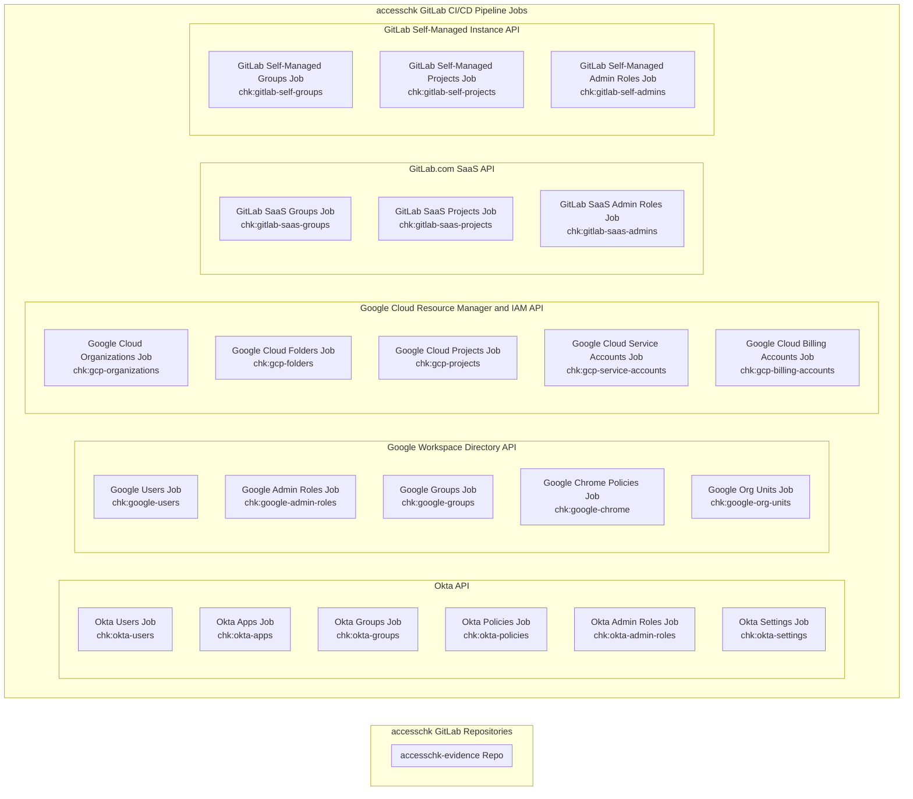

{}
これは GitLab Identity v3 の将来状態（2024 年中頃）に関するドキュメントのプレビューです。GitLab Identity v2 の現在の状態（ベースラインエンタイトルメントとアクセスリクエスト）については <a href="/handbook/security/security-and-technology-policies/access-management-policy/">アクセス管理ポリシー</a> をご覧ください。<a href="https://gitlab.com/groups/gitlab-com/gl-security/identity/eng/-/roadmap?state=all&sort=start_date_asc&layout=QUARTERS&timeframe_range_type=THREE_YEARS&group_path=gitlab-com/gl-security/identity/eng&progress=WEIGHT&show_progress=true&show_milestones=false&milestones_type=ALL&show_labels=true">エピックのガントチャート</a> でロードマップを確認できます。
{}

{}
ご覧いただいているのは、監査・コンプライアンスのエビデンス収集を行う `accesschk` のエンジニアリング深掘りアーキテクチャです。`accessctl` のエンジニアリングアーキテクチャドキュメント（<a href="/handbook/security/identity/platform">ポリシー管理と自動プロビジョニング</a>）も用意しています。また、<a href="/handbook/security/identity/guide/audit">監査担当者</a>、<a href="/handbook/security/identity/guide/change-mgmt">変更管理</a>、<a href="/handbook/security/identity/guide/app">テックスタックアプリケーションのシステムオーナー</a> 向けのスタートガイドもあります。
{}

{}
このページは作成中です。最新の詳細については後ほどご確認ください。
{}

## CI/CD パイプライン概要

