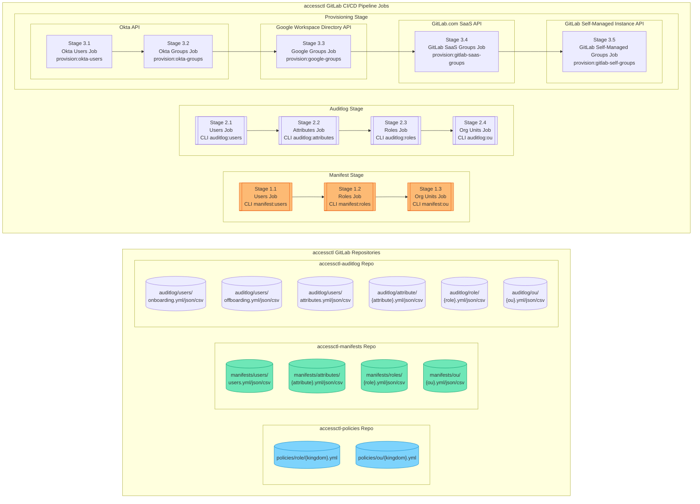
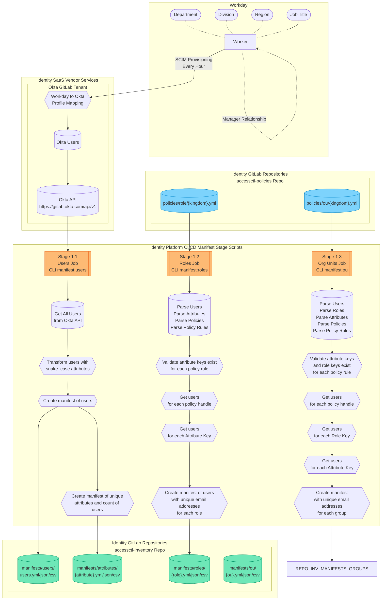

{}
これは GitLab Identity v3 の将来状態（2024 年中頃）に関するドキュメントのプレビューです。GitLab Identity v2 の現在の状態（ベースラインエンタイトルメントとアクセスリクエスト）については <a href="/handbook/security/security-and-technology-policies/access-management-policy/">アクセス管理ポリシー</a> をご覧ください。<a href="https://gitlab.com/groups/gitlab-com/gl-security/identity/eng/-/roadmap?state=all&sort=start_date_asc&layout=QUARTERS&timeframe_range_type=THREE_YEARS&group_path=gitlab-com/gl-security/identity/eng&progress=WEIGHT&show_progress=true&show_milestones=false&milestones_type=ALL&show_labels=true">エピックのガントチャート</a> でロードマップを確認できます。
{}

## パイプライン概要

## CI/CD ジョブワークフロー

## ポリシーとマニフェストの破壊的変更

### 属性キーがもう存在しない場合 {#attribute-key-no-longer-exists}

マニフェスト作成前にポリシーが解析されると、`manifests/attributes/{attribute}.yml` ファイルが解析され、属性キーが存在することを検証します。このファイルには Okta API のユーザーから取得した最新のユニーク値リストが含まれています。

これにより、`department`、`division`、`title` などがもう存在しないこと（例: 上流側で名前変更された）を検出できます。

ポリシーがもう存在しない属性キー値を使用している場合、更新後のマニフェストは作成されず、現在（前回）の状態が維持されます。これにより、Identity Operations とポリシーの `CODEOWNERS` がポリシーを更新するまで、現在のマニフェストは凍結されます。

このプロセスがどのように部分的に自動化されたかについては、[ポリシー内のキーの更新](#updating-keys-in-policies) のドキュメントを参照してください。

### マネージャーがもう存在しない場合

[属性キーがもう存在しない場合](#attribute-key-no-longer-exists) と同様に、すべての `manager` 値は最新のユーザーマニフェストに対して検証されます。これにより、ユーザーがオフボーディングされていないこと、メールハンドルが変更されていないこと（例: 旧姓への変更）を確認します。

ポリシーで定義された `manager` ハンドルに基づいてマネージャーユーザーがもう存在しない場合、更新後のマニフェストは作成されず、現在（前回）の状態が維持されます。これにより、Identity Operations とポリシーの `CODEOWNERS` がポリシーを更新するまで、現在のマニフェストは凍結されます。

このプロセスがどのように部分的に自動化されたかについては、[ポリシー内のキーの更新](#updating-keys-in-policies) のドキュメントを参照してください。

### ポリシー内のキーの更新 {#updating-keys-in-policies}

ポリシー内のキーが見つからない場合、`accessctl` によって自動的にブランチとマージリクエストが作成され、`CODEOWNERS` と Identity Operations のチームメンバーが編集を担当するようアサインされます。

マージリクエストには、前回のマニフェストユーザーのリストと、もう存在しない値のキーに対する最新の更新値が自動的にコメントとして投稿されます。これにより、新しい値が上流で何になっているかを判定する調査作業が自動化され、`CODEOWNERS` が確認・調整できます。

ポリシーマニフェストは変更が行われるまで凍結されたままになります。ブランチがマージされると、次回のパイプライン実行時に更新後のマニフェストが作成され、問題が自動的に解消されます。
