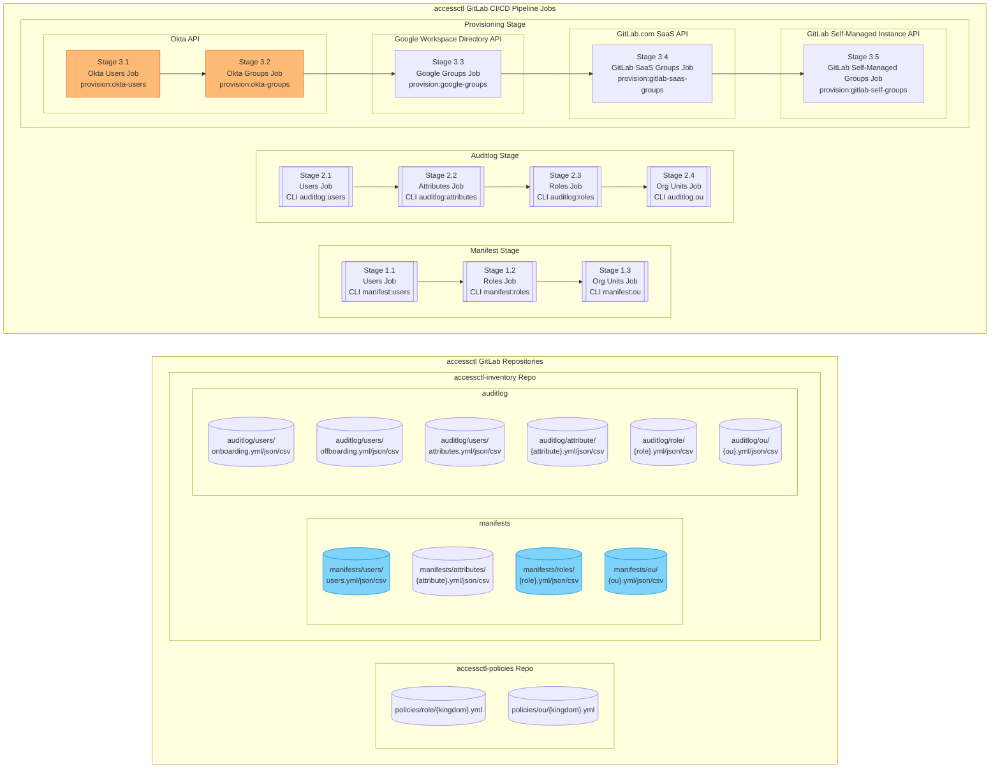
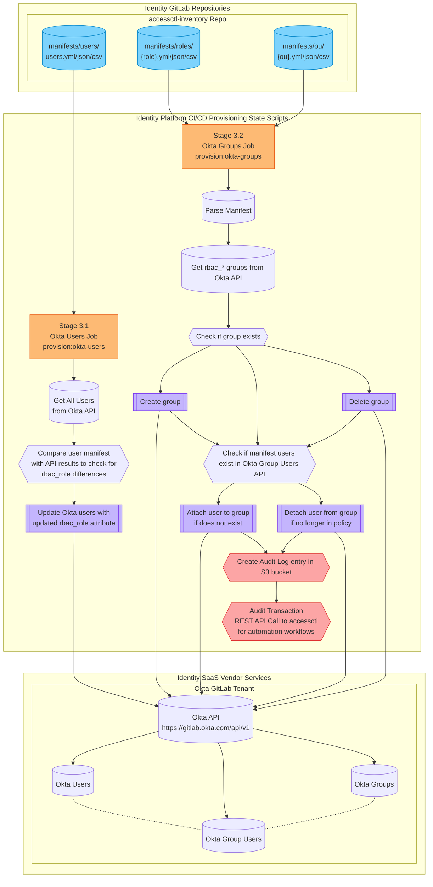

{}
これは GitLab Identity v3 の将来状態（2024 年中頃）に関するドキュメントのプレビューです。GitLab Identity v2 の現在の状態（ベースラインエンタイトルメントとアクセスリクエスト）については <a href="/handbook/security/security-and-technology-policies/access-management-policy/">アクセス管理ポリシー</a> をご覧ください。<a href="https://gitlab.com/groups/gitlab-com/gl-security/identity/eng/-/roadmap?state=all&sort=start_date_asc&layout=QUARTERS&timeframe_range_type=THREE_YEARS&group_path=gitlab-com/gl-security/identity/eng&progress=WEIGHT&show_progress=true&show_milestones=false&milestones_type=ALL&show_labels=true">エピックのガントチャート</a> でロードマップを確認できます。
{}

{}
このページは Okta のグループとユーザーの設定に特化しています。アプリケーションと設定の構成については <a href="/handbook/security/identity/gitops/okta">Okta GitOps Terraform アーキテクチャ</a> や <a href="/handbook/security/identity/approvals">マージリクエストの承認</a> ドキュメントもあわせてご覧ください。
{}

## パイプライン概要

## Okta 向け CI/CD ジョブワークフロー

