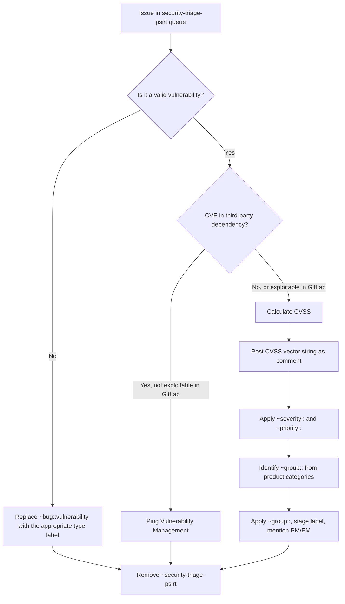

## 目的と概要

この Runbook は、[gitlab-org Issue トラッカー](https://gitlab.com/groups/gitlab-org/-/issues?scope=all&utf8=%E2%9C%93&state=opened&label_name%5B%5D=security-triage-psirt) で `~security-triage-psirt` というラベルが付けられた Issue をトリアージするプロセスについて説明します。これらの Issue は、評価、分類、適切なエンジニアリンググループへのルーティングを必要とする潜在的な脆弱性を表します。

ボットが毎日 Slack で、現在オープンな `~security-triage-psirt` Issue 数を含む要約を投稿します。トリアージの目的は、各 Issue を評価し、`~security-triage-psirt` ラベルを適切な `~group::`、`~severity::`、`~priority::` ラベルに置き換えることです。

## 主要な利害関係者と責任

- **PSIRT チーム:** `~security-triage-psirt` Issue のトリアージに集合的に責任を負います。これは、[HackerOne キュー](/handbook/security/product-security/psirt/runbooks/hackerone-process/) の処理方法と同様に、すべての PSIRT チームメンバー間で共有される責任です。
- **プロダクトおよびエンジニアリングマネージャー:** Issue がトリアージされ、自分たちのグループにルーティングされた後の修復のスケジューリングを担当します。
- **SIRT:** 活発な悪用やインシデント対応が必要な場合に関与します。

## 毎日のトリアージ通知

毎日、GitLab SecurityBot が Slack でメッセージを投稿します:

> There are currently **N** security-triage-psirt issues on the gitlab-org issue list. (X created in the last 24 hours.)

このメッセージには [オープン Issue リスト](https://gitlab.com/groups/gitlab-org/-/issues?scope=all&utf8=%E2%9C%93&state=opened&label_name%5B%5D=security-triage-psirt) へのリンクが含まれています。PSIRT チームメンバーは、このキューを処理する責任を共有します。

## ステップバイステップのトリアージ手順

### 1. Issue キューを開く

[security-triage-psirt Issue リスト](https://gitlab.com/groups/gitlab-org/-/issues?scope=all&utf8=%E2%9C%93&state=opened&label_name%5B%5D=security-triage-psirt) に移動し、最も古いものから並べ替えます。

### 2. 潜在的な脆弱性を評価する

各 Issue について:

- Issue の説明とリンクされた参照や再現手順を読みます。
- Issue が有効な脆弱性を説明しているかどうかを判断します。脆弱性に該当しない Issue のガイダンスについては、[非脆弱性のセキュリティ Issue](/handbook/security/engaging-with-security/#non-vulnerability-security-issues) を参照してください。
- Issue が**脆弱性ではない**場合、適切なラベル (例: `~"type::feature"`、`~"type::maintenance"`、`~"securitybot::ignore"`) を適用し、`~security-triage-psirt` を削除します。利用可能なさまざまなラベルについては、[非脆弱性 ~security Issue](/handbook/security/engaging-with-security/#non-vulnerability-security-issues) を参照してください。

### 3. 重要度と優先度を決定する

有効な脆弱性の場合:

- [CVSS スコアを計算](/handbook/security/product-security/psirt/runbooks/cvss-calculation/) して適切な重要度を決定します。
- CVSS ベクトル文字列 (例: `CVSS:3.1/AV:N/AC:L/PR:L/UI:R/S:C/C:L/I:L/A:N`) を含むコメントを Issue に投稿します。これは、私たちの [security-release-tools](https://gitlab.com/gitlab-com/gl-security/product-security/appsec/tooling/security-release-tools) が CVE データを設定するために Issue コメントから CVSS をパースするため、必須です。
- CVSS スコアに基づいて `~severity::` ラベル (`~severity::1` から `~severity::4`) を適用します。
- 対応する `~priority::` ラベルを適用します。ガイダンスについては、[セキュリティ Issue の重要度と優先度ラベル](/handbook/security/engaging-with-security/#severity-and-priority-labels-on-security-issues) を参照してください。
- Issue が `~severity::1` / `~priority::1` の場合は、すぐに [S1/P1 処理プロセス](/handbook/security/product-security/psirt/runbooks/handling-s1p1/) に従います。

### 4. 責任あるグループを特定して割り当てる

- [製品カテゴリーページ](/handbook/product/categories/features/) を使用して、責任のあるエンジニアリンググループを判断します。Duo Agent Platform (DAP) を使用して、関連するドキュメントと関連グループを見つけるよう依頼することで、ここでも支援を受けられます。
- 適切な `~group::` ラベル (例: `~"group::editor"`、`~"group::package"`) を適用します。
- [stage ラベル](https://gitlab.com/gitlab-org/gitlab/blob/master/doc/development/contributing/issue_workflow.md#stage-labels) は自動的に適用されるはずですが、適用されていない場合は手動で適用してください。
- スケジューリングのために、関連するプロダクトマネージャーとエンジニアリングマネージャーに @ メンションを送ります。

### 5. Issue を最終化する

- Issue に `~security`、`~type::bug`、`~bug::vulnerability` ラベルがあることを確認します。
- Issue に明確な `How to reproduce` セクションがあることを確認します。必要に応じて再現手順を追加または改良します。
- **`~security-triage-psirt` ラベルを削除します。** これでトリアージが完了したことを示します。

### トリアージ判断フローチャート

## 特殊なケースの処理

### 情報不足

Issue に脆弱性を評価するための十分な詳細がない場合は、コメントを残して報告者に明確化を求めてください。十分な情報が提供されるまで、`~security-triage-psirt` ラベルを保持します。

### 重複

脆弱性がすでに報告されているかどうかを確認します。重複が存在する場合:

- 既存の Issue にリンクします。
- 重複をクローズします。
- `~security-triage-psirt` ラベルを削除します。

### CVE 関連の Issue

Issue がサードパーティ依存関係の CVE に関連しているが、GitLab 内での悪用可能性を**示していない**場合は、`@gitlab-com/gl-security/product-security/vulnerability-management` に ping し、`~security-triage-vulnmgmt` ラベルを適用して脆弱性管理チームにルーティングします。これにより、ボットが `~security-triage-psirt` を再適用することを防ぎながら、後のステージのリマインダー (マイルストーン、エスカレーション) を引き続き有効にしておきます。ボットは次回の実行時に `~security-triage-psirt` を削除しますが、すぐに手動で削除することもできます。Issue が GitLab 内での悪用可能性を示している場合、トリアージのために PSIRT に残るか、活発な悪用が含まれている場合は SIRT にエスカレーションする必要があります。

### SIRT の関与が必要な Issue

Issue が活発な悪用や進行中のセキュリティインシデントを説明している場合は、`/security` Slack コマンドを使用して SIRT を関与させます。詳細は [SIRT との連携](/handbook/security/product-security/psirt/runbooks/working-with-sirt/) を参照してください。

## トリアージ SLO

PSIRT は、[PSIRT ケースライフサイクル](/handbook/security/product-security/psirt/runbooks/psirt-case-lifecycle/#slo) で定義されているとおり、トリアージ SLO を確立しています。トリアージ SLO は重要度に関係なく一様に適用されます:

| | Critical/High | Medium | Low |
| :---- | :---- | :---- | :---- |
| トリアージ | 5 日 | 5 日 | 5 日 |

SLO 内にトリアージされなかった Issue は **breached (違反)** とみなされます。SecurityBot からの毎日の Slack 通知は、HackerOne Daily Pulse と同様に、キューの SLO ステータスをレポートします:

> X are within triage SLO
> X have breached the triage SLO < 10 days
> X have breached the triage SLO by >= 11 days

## 関連リソース

- [CVSS 計算](/handbook/security/product-security/psirt/runbooks/cvss-calculation/)
- [HackerOne プロセス](/handbook/security/product-security/psirt/runbooks/hackerone-process/)
- [S1/P1 Issue の処理](/handbook/security/product-security/psirt/runbooks/handling-s1p1/)
- [重要度と優先度ラベル](/handbook/security/engaging-with-security/#severity-and-priority-labels-on-security-issues)
- [セキュリティとの連携](/handbook/security/engaging-with-security/)
