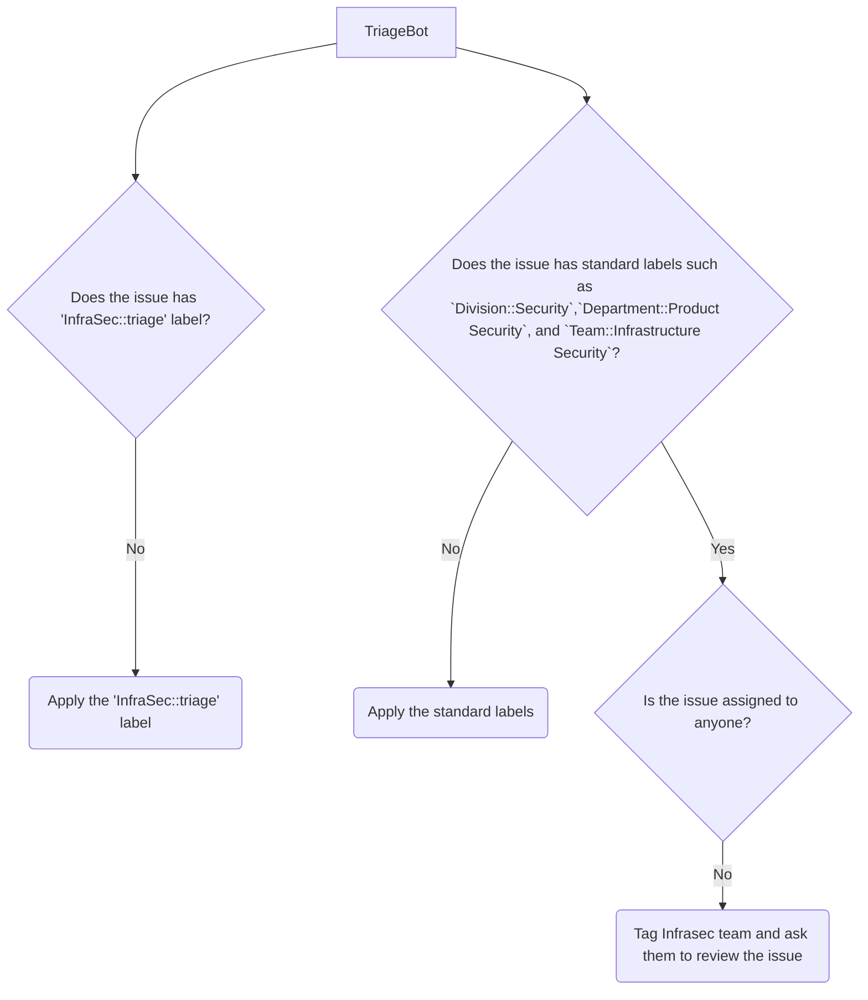
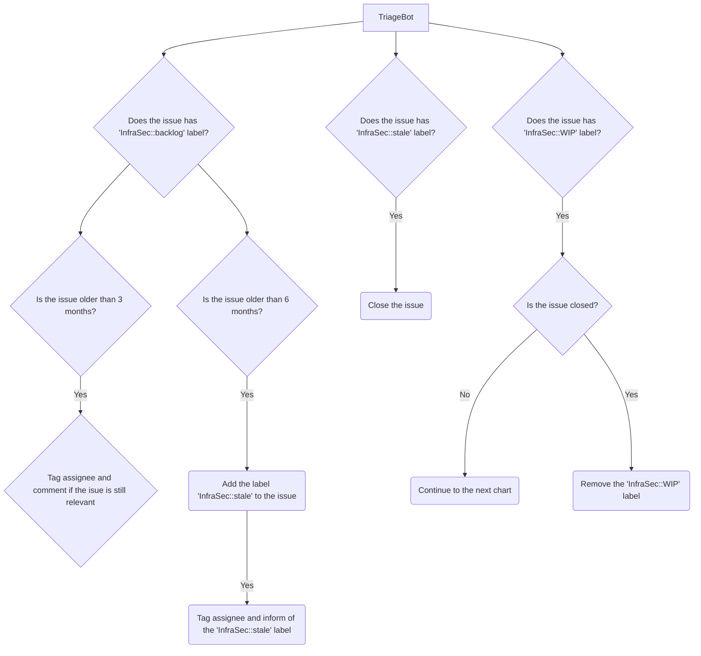
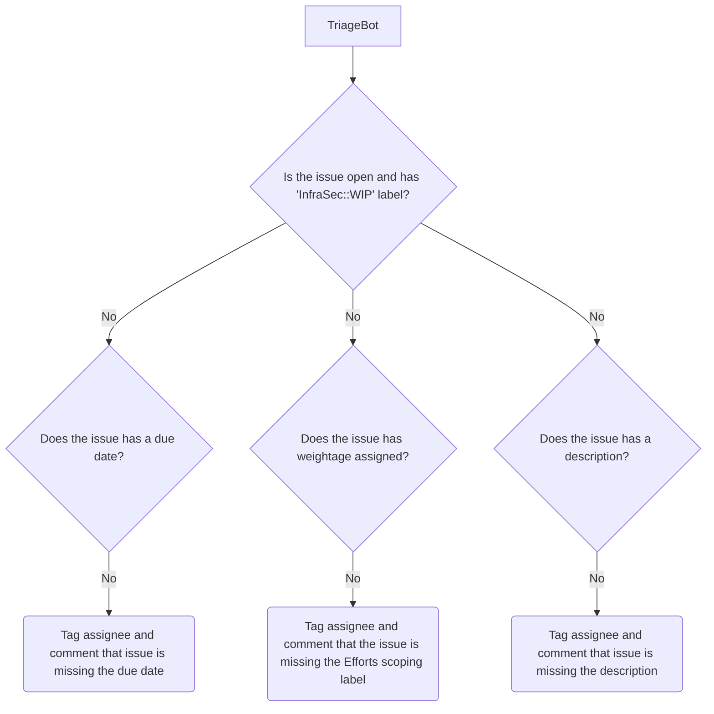

Issue を作成からクローズまで管理することは、それらが体系的に対処されることを保証する基本的なプロセスです。Issue のライフサイクルは通常、チームメンバーまたは利害関係者が Issue を作成し、解決すべき問題、機能拡張、またはタスクを詳述するときに始まります。Issue は、解決またはクローズされる前に、トリアージや進行中などのさまざまなステージを経て進行します。このワークフローにより、作業の透明な追跡、チームメンバー間の説明責任、ソリューション提供への構造化されたアプローチが可能になります。各ステージは、Issue が効率的に処理され、コラボレーションが促進され、すべての懸念事項に時間どおりに対処されることを保証する上で重要です。

## Issue ステージ

### ステージ 1: Issue の作成

最初のステップは、InfraSec チームによるレビューのために適切に分類されることを確認することです。

- 最初に、`Division::Security`、`Department::Product Security`、`Team::Infrastructure Security` などの標準ラベルがまだ存在しない場合は適用され、Issue がセキュリティ部門のインフラストラクチャセキュリティチームに関連していることを示します。
- 上記のステップの後、`InfraSec::triage` ラベルが Issue に適用されます。このラベルは、Issue が彼らの注意とトリアージを必要とすることを InfraSec チームに知らせます。
- トリアージプロセス中、InfraSec チームは Issue の優先度、スコープ、インフラストラクチャへの影響を評価します。
- この評価に基づいて、Issue は将来検討するために `InfraSec::backlog` に移動されるか、即座のアクションが必要な場合は`InfraSec::prioritised`としてマークされます。
- この構造化されたアプローチにより、Issue は緊急性とビジネスへの影響に応じて対処されることが保証されます。

### ステージ 2: Issue への対応

- Issue がトリアージ中に `InfraSec::prioritised` としてマークされると、第 2 ステージに移行し、InfraSec チームが積極的に作業を開始します。
- この時点で、Issue は `InfraSec::WIP` ラベルで更新され、チームが問題またはタスクへの対応を開始したことを示します。
- チームはまた、Issue を解決するために必要な労力を見積もります。これは、`InfraSecWork::Large` などの労力見積もりラベルを適用して、関係する作業のサイズと複雑さを示すことで行われます。詳細については、[インフラストラクチャセキュリティ - キャパシティインジケータとワークフロー](/handbook/security/product-security/infrastructure-security/metrics/capacity/#effort-classification)を参照してください。
- この見積もりは、現実的なタイムラインの設定と期待値の調整に役立ちます。

### ステージ 3: バックログチェック

- このステージでは、InfraSec チームは `InfraSec::backlog` の Issue を定期的にレビューし、それらが引き続き関連性があり必要であることを確認します。
- Issue が 6 か月以上バックログにあり、進展がないか、もはや関連性がない場合、潜在的なクローズのためにレビューされます。Issue は `InfraSec::stale` としてタグ付けされ、クローズされない場合はトリアージボットがクローズします。
- Issue がすでに `InfraSec::prioritised` としてマークされているか、ステージ 2 で `InfraSec::WIP` ステージに移動されている場合、このステージは自動的にスキップされます。Issue は積極的に作業されているためです。
- このステップは、クリーンなバックログを維持し、チームの目標に依然として関連する Issue に焦点を当てるのに役立ちます。

### ステージ 4: Issue のクローズ

- 最終ステージでは、InfraSec チームが Issue の作業を完了し、定義された成功基準を満たした後、Issue はクローズの準備が整います。
- チームはまず `InfraSec::WIP` ラベルを削除し、作業が完了したことを示します。
- すべての成功基準と目標が達成されたことを確認した後、Issue は正式にクローズされます。
- このステージは、作業が正常に完了して文書化されたことを保証し、Issue のライフサイクルの終了を示します。

## TriageBot を使用した Issue の処理

これは非常に複雑なワークフローのように見えるかもしれませんが、適切なラベルを設定するのに役立つフレンドリーなボットがあります。InfraSec チームは [GitLab Triage Bot](https://gitlab.com/gitlab-org/ruby/gems/gitlab-triage) を活用して、セキュリティ関連の Issue の初期処理を自動化します。このボットを活用することで、Issue は事前に定義された基準に従って自動的に分類、ラベル付け、割り当てされ、Issue ライフサイクル全体を通じて効率的な優先順位付けと管理が保証されます。

InfraSec のユースケースでのボットの設定は[こちら](https://gitlab.com/gitlab-com/gl-security/product-security/infrastructure-security/automation/infrasec-triage-bot/-/tree/main)で利用できます。

### Issue が作成されたとき

### Issue クローズチェック

### WIP Issue チェック

