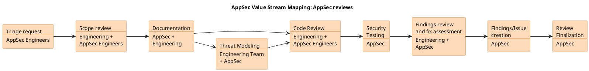

<!-- markdownlint-disable MD052 -->

このページでは、AppSecエンジニア向けのアプリケーションセキュリティレビュープロセスについて詳しく説明します。
アプリケーションセキュリティレビューの目的は、リスクを軽減し、最終的に会社のミッションを成功させるために、GitLabが開発またはデプロイしたアプリケーションの脆弱性を予防的に発見し緩和することです。

アプリケーションセキュリティレビューには、以下のすべてまたは一部のステージが含まれる場合があります。

- 脅威モデリング
- 詳細なコードレビュー
- 動的テスト

各ステージの結果は、次のステージで実施するレビューに反映されます。
理想的には、すべての新機能が何らかの脅威モデリングを受け、後者2つのステージはリスクプロファイルに基づいて実施されます。すでに開発中または本番環境にある機能もAppSecレビューを受けることができます。実施されるテストは状況に依存します。

### プロセス概要

### 機能を所有するチームにとってアプリケーションセキュリティレビューはどういう意味を持つか?

アプリケーションセキュリティチームによって行われるセキュリティレビューはノンブロッキングです。
つまり、機能を所有するチームは引き続き開発計画を進めるべきであり、想定される時間投資は質問に非同期で回答するために必要な時間に限定されます。

セキュリティ上の問題が発見された場合は、[標準プロセス](/handbook/security/product-security/security-platforms-architecture/application-security/runbooks/)に従ってトリアージされます。
アプリケーションセキュリティレビューにより、第三者によって発見される前にGitLabに存在する脆弱性を発見できます。新機能のレビューが行われる場合、リリースに含まれる前に脆弱性を捕捉できる可能性もあります。リスクを減らし、特定の機能の脅威モデルをよりよく理解し、脆弱性を予防的に緩和できるようになります。

## 何をレビューすべきか?

アプリケーションセキュリティレビューキューは、セキュリティレビューのためのアプリケーション機能の優先キューです。優先度は `priority::1` (Critical)から `priority::4` (Low/Backlog)までの範囲があります。

キューに追加する機能のいくつかのガイドラインは以下のとおりです。

- すべての主要な新機能
- 繰り返し脆弱性が発生した機能
- 認可または認証に関連する機能
- [Red または Orangeデータ](https://docs.google.com/document/d/15eNKGA3zyZazsJMldqTBFbYMnVUSQSpU14lo22JMZQY/edit)を扱う機能
- 暗号やその他のデータ保護ソリューションを扱う機能
- [secure coding guidelines](https://docs.gitlab.com/ee/development/secure_coding_guidelines.html)で言及されているトピックに触れる機能

考え方は、脆弱性のリスクが高いと判断された機能を捕捉することです。すべての機能、特に `priority::4` のIssueがフルレビューを受けることはおそらくないでしょう。しかし、リスクの高いものを捕捉することで、追加の統計情報を追跡できます。例えば、bug bountyプログラムで報告された関連する脆弱性の数などです。このデータは、優先度のイテレーションに役立ちます。

### 単一のIssue/MRのPing

トリアージローテーションのエンジニアが対応できる単一のIssue/MRのPingについては、別のIssueは必要ありません。このプロセスは主に時間経過に伴う機能を追跡するためのものです。それを念頭に置いて、Pingが追加のレビューを必要とする場合は、Issueを作成してください。

### キューへの機能追加 / セキュリティレビューのリクエスト

アプリケーションセキュリティレビュープロセスを追跡するために別のIssueが使用されます。このプロセスは、元のIssue/マージリクエストよりも長く続く可能性があるためです。

プロセスは、AppSecエンジニアがバックログに何かを追加する場合と、チームメンバーがGitLab機能のレビューをリクエストする場合で同じです。

1. [Appsec Reviews Issueトラッカー](https://gitlab.com/gitlab-com/gl-security/product-security/appsec/appsec-reviews/issues)で、[AppSecレビューテンプレート](https://gitlab.com/gitlab-com/gl-security/product-security/appsec/appsec-reviews/-/issues/new?issueable_tempalte=AppSec%20Review)を使用してIssueを作成します
    1. タイトルを機能のユニークな名前に設定する
1. テンプレートの説明に従ってください

### 優先度の割り当て

各Issueには、チームメンバーがテストの計画を立てるのに役立つ優先度が割り当てられている必要があります。優先度の決定は、Issueを作成するアプリケーションセキュリティエンジニアが利用可能なデータに基づいて行います。適切な優先度がわからない場合は、保守的に判断し、より高い優先度を割り当ててください。他のチームメンバーからのフィードバックがあれば、いつでも調整できます。

優先度のガイドライン(網羅的ではないので、追加してください)

| 優先度 | 基準 |
|----------|----------|
| priority::1       | Redデータ、AuthN/AuthZ、暗号、severity::1単独、severity::2の繰り返し脆弱性 |
| priority::2       | Orangeデータ、severity::2単独 |
| priority::3       | Yellowデータ |
| priority::4       | 標準的なセキュアプラクティスのみが必要 |

### レビューに脅威モデリングを含める

レビュー中に[脅威モデリング](threat-modeling)を行うべき場合は、元のIssueまたはエピックとAppSecレビューIssueに `threat model::needed` ラベルを追加してください。これにより、GitLab全体で脅威モデリングの採用を追跡できます。脅威モデリングのステップが完了したら、関連するすべてのIssueとエピックに `threat model::done` ラベルを追加する必要があります。脅威モデリングのプロセスは[専用のハンドブックページ](runbooks/threat-modeling)でさらに定義されています。

### 対話の定量化

エンジニアリングチームは、アプリケーションセキュリティチームメンバーが行った対話を定量化し、これらの対話のステータスを追跡するために、複数のラベルを作成しました。
アプリケーションセキュリティチームメンバーは、以下の条件に従って対話のステータスに応じて適切なラベルを追加する必要があります。

- `~sec-planning::in-progress`: IssueまたはMRがレビュー中。
- `~sec-planning::pending-followup`: アプリケーションセキュリティがレビューのフォローアップを期待。
- `~sec-planning::complete`: コメント付きでレビュー完了。
- `~sec-planning::no-action`: レビュー完了でアクション不要。

## 内部アプリケーションセキュリティレビュー

顧客や他の機密データを保有する部門によって構築(または大幅に変更)されたシステムについて、Securityチームはシステムが堅牢化されていることを保証するために、該当するアプリケーションセキュリティレビューを実行する必要があります。セキュリティレビューは、脆弱性を減らし、よりセキュアな製品を作成するのに役立つことを目的としています。

### セキュリティレビューをいつリクエストすべきか?

以下の短いアンケートは、[アプリケーションセキュリティチーム](https://gitlab.com/gitlab-com/gl-security/product-security/appsec)に関与してもらうべきかをすばやく判断するのに役立ちます。

変更が以下のいずれかを行う場合:

1. あらゆる種類の[REDまたはORANGEデータ](/handbook/security/policies_and_standards/data-classification-standard/)の処理、保存、または転送
1. 変更の目的が、機密性、整合性、認証、否認防止などの**暗号機能**を必要とする場合、[アプリケーションセキュリティチーム](https://gitlab.com/gitlab-com/gl-security/product-security/appsec)によってレビューされる*べき*です。
1. 顧客向けアプリケーションを新しい環境にデプロイ
1. 既存のセキュリティコントロールへの変更
1. パイプラインのセキュリティチェックまたはスキャンの変更
1. 新しい認証メカニズム
1. 認証モデル、トークン、またはセッションに触れるコードの追加
1. ユーザー提供データを扱う
1. 暗号機能に触れる。詳細は[GitLab Cryptography Standard](/handbook/security/policies_and_standards/cryptographic-standard/)を参照
1. 権限モデルに触れる
1. 新しいセキュリティコントロールの実装(例: 特定の保護のための新しいライブラリ、HTTPヘッダーなど)
1. 新しいAPIエンドポイントの公開、または既存のものの変更
1. 新しいデータベースクエリの導入
1. 以下のために正規表現を使用する:

   - ユーザー提供データの検証
   - 認可および認証に関連する判断

1. 機密データ(PIIなど)を操作または表示できる新機能。詳細は[Data Classification Standard](/handbook/security/policies_and_standards/data-classification-standard/)を参照
1. トークン、暗号鍵、認証情報、PIIなどの機密データを一時ストレージ/ファイル/DBに永続化、機密データ(PIIなど)の操作または表示。詳細は[Data Classification Standard](/handbook/security/policies_and_standards/data-classification-standard/)を参照

`@gitlab-com/gl-security/product-security/appsec` に依頼してください。

### セキュリティレビューをどのようにリクエストするか?

変更の重要度に応じて、セキュリティレビューをリクエストする方法は2つあります。個別のマージリクエストと、より大規模なイニシアチブに分かれます。

#### 個別のマージリクエストまたはIssue

マージリクエストやIssueで `/cc @gitlab-com/gl-security/product-security/appsec` でアプリケーションセキュリティチームを巻き込んでください。

これらのレビューは、より速く、より軽量で、参入障壁が低いことを意図しています。

#### 大規模なイニシアチブ

開始するには、[内部アプリケーションセキュリティレビューリポジトリ](https://gitlab.com/gitlab-com/gl-security/product-security/appsec/appsec-reviews/issues)に[Appsec Reviewテンプレート](https://gitlab.com/gitlab-com/gl-security/product-security/appsec/appsec-reviews/-/issues/new?issueable_tempalte=AppSec%20Review)を使用してIssueを作成してください。完全なプロセスは[こちら](/handbook/security/product-security/security-platforms-architecture/application-security/appsec-reviews/)で確認できます。

これのいくつかのユースケースは、エピック、マイルストーン、コードベース全体での共通のセキュリティ脆弱性のレビュー、またはより大きな機能のためのものです。

### 進めるためにセキュリティ承認は必要か?

いいえ、コード変更の進行には、セキュリティ承認は*必要ありません*。ノンブロッキングレビューは、コードを高速にリリースし続ける自由を可能にし、[イテレーションと効率性](/handbook/values/#iteration)の価値観により近く沿うものです。これらはゲートではなくガードレールとして機能します。

### セキュリティレビューをリクエストする際に何を提供すべきか?

レビューを高速化するため、以下のすべてまたは一部を提供することを推奨します。

- 行われている変更の背景とコンテキスト。
- 目的と使用例の明確な理解を提供するのに役立つドキュメントや図。
- 処理または保存しているデータの種類。
- データのセキュリティ要件。
- セキュリティ上の懸念と発生しうる最悪のシナリオ。
- テスト環境。

### セキュリティプロセスはどのようなものか?

大規模な内部アプリケーションセキュリティレビューの現在のプロセスは[こちら](/handbook/security/product-security/security-platforms-architecture/application-security/appsec-reviews/)で確認できます

### 私の変更はセキュリティによってレビューされたが、私のプロジェクトは今セキュアか?

セキュリティレビューは、コード変更がセキュアであることの証明や認定ではありません。これらはベストエフォートであり、レビュー後にも追加の脆弱性が存在する可能性があります。

ここで重要なのは、アプリケーションセキュリティレビューは一度きりのものではなく、レビュー対象のアプリケーションが進化するにつれて継続的に行われる可能性があるということです。

### サードパーティライブラリを使用しているか?

サードパーティライブラリを使用している場合は、以下を確認してください。

1. 最新の安定した利用可能なバージョンを使用している
1. あなたのチームがセキュリティパッチが公開された際にこのライブラリをサポートおよびアップグレードする能力を持っている
1. メンテナーがセキュリティポリシーを持っている

### MRレビューガイドライン

マージリクエストのレビューを完了する際は、何をカバーしたか、レビューしたアイテムに関する結論をドキュメント化してください。

実施したステップ、懸念事項、カバレッジの要約があると、他のレビュアーとのコラボレーションに役立ちます。

1. **カバレッジ**: コードのどの側面をレビューしたかを明確に概要にする。これには以下が含まれる場合があります:
   - 検査した特定のファイルやモジュール
   - 評価した機能変更
   - 考慮したセキュリティへの影響

2. **実施したステップ**: レビュープロセスの簡単な概要を提供する。例:
   - コードの読解と分析
   - ローカルテストまたはコード実行
   - 自動化ツールやリンターの使用
   - 関連するIssueやドキュメントとの相互参照

3. **懸念と観察**: レビュー中に特定した問題、潜在的な問題、改善の余地のある領域をドキュメント化する。これには以下が含まれます:
   - セキュリティ脆弱性
   - コード品質の問題
   - 潜在的なバグまたはエッジケース
   - 最適化の提案

4. **結論**: レビューしたアイテムの全体的な評価を要約する。以下を含む:
   - 変更が意図された要件を満たしているかどうか
   - 対処が必要なブロッカーや重大な問題
   - さらなるアクションや改善のための推奨事項

レビュープロセス、懸念事項、カバレッジの包括的な要約を提供することで、以下が促進されます。

- 他のレビュアーとのコラボレーションの向上
- 特定された問題のフォローアップが容易になる
- 将来の参照のためのレビュープロセスの明確な記録
- レビュー中に提起された懸念や質問のより効率的な解決

十分に文書化されたMRレビューは、即時のコードレビュープロセスを助けるだけでなく、長期的にプロジェクトの全体的な品質と保守性に貢献します。
