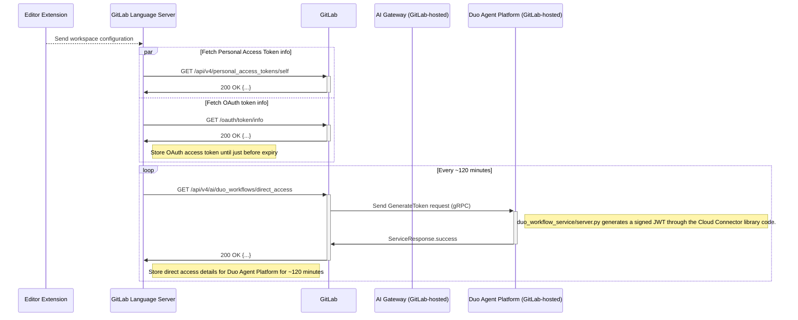

セキュリティ Issue や MR を評価する際、問題を再現したり、根本原因を掘り下げたり、さらなる影響を調べたりする手段を持っておくと役立ちます。これはオンボーディングの最初の数週間で GitLab に慣れるためのよい方法でもあります。ここでは便利なヒントとコツを紹介します。

## ローカル GDK 環境のセットアップ方法

1. [チームメンバーライセンス](/handbook/support/internal-support/#unlock-premiumultimate-features-on-self-managed--gdk-for-team-members) 100 シートをリクエストします（これにより、インストール時に GDK にすでに追加されている約 50 ユーザーを削除せずに済みます）。
1. 既存のローカル GDK インストールを置き換える、または [geo](https://gitlab.com/gitlab-org/gitlab-development-kit/-/blob/main/doc/howto/geo.md) のセットアップを行う予定がある場合は、まず既存の gdk フォルダで `gdk kill` を実行します。これにより、プロセスが停止し、さまざまなサービスが使用しているポートが解放されます。
1. gdk のインストール手順に関する一般的な情報は [gitlab-development-kit](https://gitlab.com/gitlab-org/gitlab-development-kit/-/blob/main/doc/_index.md) で確認できます。
   - `curl "https://gitlab.com/gitlab-org/gitlab-development-kit/-/raw/main/support/install" | bash` で [one line install](https://gitlab.com/gitlab-org/gitlab-development-kit/-/blob/main/doc/_index.md#one-line-installation ) を開始します。
   - gdk にインストールするか、フォルダ名を選択します。
   - `mise` を使ってインストールします。
   - インストールが完了したら、すべてのサービスが起動したことを確認するために `gdk restart` を実行します。
1. インストールが完了したら、`root` / `5iveL!fe` でログインし、デフォルトのパスワードを変更します。
1. ライセンスを適用します。[admin/settings/addlicense](http://localhost:3333/admin/application_settings/general#js-add-license-toggle) 経由、または [rails console](https://docs.gitlab.com/administration/license_file/#add-a-license-through-the-console) を使用します。
1. [admin/subscription](http://localhost:3000/admin/subscription) でライセンスが正しく適用されたか確認します。

## GDK で GitLab Duo を有効化する

 ローカルの Duo インスタンスでローカル GDK を構成するには、以下の公式 wiki に従ってください。

1. [こちら](https://gitlab-org.gitlab.io/gitlab-development-kit/howto/ai/#prerequisites)の手順に従って、ローカル GDK で Duo をセットアップおよび構成します。
2. [こちら](https://gitlab-org.gitlab.io/gitlab-development-kit/howto/ai/#verify-your-setup)の手順に従って、セットアップを検証します。

[こちら](https://gitlab-org.gitlab.io/gitlab-development-kit/howto/ai/#additional-resources)の Additional Resources セクションには、トラブルシューティング用のドキュメントが用意されています。

## VS code で Duo を有効化する

1. AI 機能へのアクセス権を持つユーザーで、API アクセス権を持つ PAT を作成します。
1. [VS code](https://code.visualstudio.com/) をダウンロードしてインストールします。
1. Extensions から GitLab をインストールします。
1. GDK 用の [VS code プロファイル](https://code.visualstudio.com/docs/configure/profiles)を構成します。Code > Settings > Profiles > New Profile に移動します。
1. VS code で Command Palette（Command + Shift + P）を開き、「GitLab: Validate GitLab Accounts」を選択して GDK アカウントに切り替えます。ここで PAT を追加する必要があります。
1. GitLab Agent が左側のツールバーに追加されているはずです。

## VS Code Duo 拡張機能を Language Server にリンクする

以下のシーケンスは、IDE 拡張機能が GitLab インスタンスと、その後 Duo Agent Platform に対してどのように認証を行うかを示しています。



注: これらの手順は[ドキュメントの既存の手順](https://gitlab.com/gitlab-org/editor-extensions/gitlab-lsp/-/blob/main/README.md#connect-to-ls-in-the-vs-code-extension)を拡張したものです。

以下のすべての手順は GitLab ユーザープロファイルとして完了します。

1. [gitlab-vscode-extension](https://gitlab.com/gitlab-org/gitlab-vscode-extension/-/tree/main?ref_type=heads) プロジェクトをクローンします。
1. [gitlab-lsp](https://gitlab.com/gitlab-org/editor-extensions/gitlab-lsp) プロジェクトを、VS Code 拡張機能プロジェクトと同じパスにクローンします。例えば、以下のようにします。
   - LSP は /Users/<USERNAME>/Projects/gitlab-lsp にあります。
   - vscode 拡張機能は /Users/<USERNAME>/Projects/gitlab-vscode-extension にあります。
1. セットアップを容易にするため、2 つのプロジェクトをターミナルで並べて開いておきます。
1. gitlab-vscode-extension プロジェクトについては、以下の手順に従います。
   - 実行: `npm install`
   - 拡張機能を dev モードで実行します。
       1. vscode でプロジェクトを開きます。
       1. View: Show Run and Debug コマンド（Cmd+Shift+P）を実行します。
       1. Run Extension コマンドが選択されていることを確認します。
       1. 緑色の再生アイコンを選択するか、F5 を押します。
1. gitlab-lsp プロジェクトについては、以下の手順に従います。
    1. vscode でプロジェクトを開きます。
    1. `npm install` を実行します。
    1. `npm run build` を実行します。
    1. `GITLAB_WORKFLOW_PATH=/Users/<USERNAME>/Projects/gitlab-vscode-extension code .` を実行します。
    1. Attach to VS Code Extension の起動タスクを実行します。
    1. `npm run watch -- --editor=vscode --packages agentic-duo-chat webview-duo-workflow duo-chat duo-chat-v2 webview-duo-chat webview-duo-chat-v2 webview-vuln-details` を実行します。
1. 検証: 動作することを確認するには、まず Duo Workflow 拡張機能の設定で GitLab デバッグオプションを有効にしていることを確認し、デバッグログを確認できるように拡張機能を再起動します。


## Duo 開発のためにローカル GDK の変更を LS に接続する

1. GDK プロファイルをセットアップします。
1. [ドキュメント](https://gitlab.com/gitlab-org/editor-extensions/gitlab-lsp#connect-ls-with-local-gdk-changes-for-duo-development)に概説された 2 つの手順に従います。

VSCode で、出力ペインの "GitLab Language Server" ログを確認し、エラーがないか確認します。以下のようなトークンエラーが発生した場合は、GitLab Workflow 拡張機能の設定に移動し、ignore TLS/SSL cert errors オプションにチェックが入っていることを確認してください。

```bash
2025-08-20T10:54:14:972 [warning]: Both PAT and OAuth token checks failed: PAT Token: {"valid":false,"reason":"unknown","message":"Token validation failed: Error: request to https://gdk.test:3443/api/v4/personal_access_tokens/self failed, reason: unable to verify the first certificate"}, OAuth Token: {"valid":false,"reason":"unknown","message":"Token validation failed: Error: request to https://gdk.test:3443/oauth/token/info failed, reason: unable to verify the first certificate"}
2025-08-20T10:54:14:973 [info]: [CodeSuggestionsInstanceTelemetry] Instance Telemetry: GitLab Duo Code Suggestions telemetry is always enabled in self-managed instances.
2025-08-20T10:54:14:973 [warning]: Token is invalid. Token validation failed: Error: request to https://gdk.test:3443/api/v4/personal_access_tokens/self failed, reason: unable to verify the first certificate. Reason: unknown
2025-08-20T10:54:14:973 [warning]: Token is invalid. No token provided. Reason: invalid_token
```


1. 拡張機能を再起動し、動作するか確認するために、GDK フォルダを開き（GDK プロジェクトをローカルに git clone し、Duo が有効になっていることを確認します）、ログにエラーがないか確認します。動作している agentic ワークフローログの例:

```bash
2025-08-20T11:13:46:002 [info]: [Duo Agentic Chat Plugin] Received new event
2025-08-20T11:13:46:002 [debug]: [WebviewInstanceMessageBus:agentic-duo-chat:8327ccee-1b85-48ba-abd6-eb4cfb5e3f1f] Sending notification: workflowCheckpoint
2025-08-20T11:13:46:002 [debug]: [WebviewInstanceMessageBus:agentic-duo-chat:8327ccee-1b85-48ba-abd6-eb4cfb5e3f1f] Sending notification: workflowStatus
2025-08-20T11:13:46:503 [debug]: [WorkflowTokenService] Reusing existing valid token for workflow "3"
2025-08-20T11:13:46:503 [debug]: [DuoWorkflowNodeExecutor][3] Received new checkpoint: {"workflowStatus":"RUNNING"}
```

## AI Gateway と Duo Agent Platform Service の異なるブランチを実行する

[AI Gateway](https://gitlab.com/gitlab-org/modelops/applied-ml/code-suggestions/ai-assist) で MR をレビューする際、[README.md](https://gitlab.com/gitlab-org/modelops/applied-ml/code-suggestions/ai-assist/-/blob/main/README.md?ref_type=heads) のセットアップ手順に従う代わりに、AppSec エンジニアは多くの場合、特定のブランチでの変更をテストするために以下の[手順](https://gitlab.com/gitlab-org/gitlab-development-kit/-/blob/main/doc/howto/gitlab_ai_gateway.md#optional-run-a-different-branch-of-ai-gateway-and-duo-agent-platform-service)に従うだけで済みます。

## AI Catalog 開発のための GDK のセットアップ

詳細な手順については、この [wiki ページ](https://gitlab.com/gitlab-org/ai-powered/ai-catalog/team-tasks/-/wikis/Setting-up-GDK-for-AI-Catalog-Development)の手順に従ってください。

### 実行チェーンをステップ実行する

Web または API リクエストの一部として実行されるコードを確認したい場合、インタラクティブデバッガが役立つツールになります。[Pry & Thin を構成する](https://gitlab.com/gitlab-org/gitlab-development-kit/-/blob/main/doc/howto/pry.md#using-thin)方法はこちらです。

典型的なワークフローは、リクエストを開始する `Controller` アクション（`create` や `update` のようなメソッドが有力候補です）を見つけ、`binding.pry` を追加し、ファイルを保存してから、そのリクエストをブラウザで実行することです。実行が停止し、ターミナルで IRB を使って現在の状態を検査できます。メソッドの中に入るには `step`、次のステートメントに進むには `next`、次のブレークポイントおよび/または完了までリクエストを実行させるには `continue` を入力します。

ログを監視すると役立つことがあります: `tail -f gitlab/log/development.log`。

## テスト用プロキシのインストール

あなたの役割では「ペネトレーションテスト」が必要ないかもしれませんが、リクエストを傍受して操作できるテスト用プロキシにアクセスできると、HackerOne の Issue を再現するのに役立ちます。

AppSec チームは [Burp Suite Professional](https://portswigger.net/burp/pro) のマルチユーザーライセンスを持っています。ライセンスの取得については `#security_help` で AppSec チームに尋ねてください（[最新の安定版はこちらからダウンロード](https://portswigger.net/burp/releases)できます）。無料でオープンソースの [OWASP ZAP](https://www.zaproxy.org/) を使用することもできます。

これらのツールは、ウェブサイトに簡単に損害を与えたり、アクティブスキャンで CPU を消費したりする可能性があります。OWASP Zap では、悪意のある可能性のあるリクエストを防ぐために "Safe" モードを使用してください。Burp Suite では、ライブの "audit" スキャンを無効にしてください。

## ブラウザプロファイル

複数のユーザーを使用するテストが必要な場合、シークレット / プライベートタブが簡単な選択肢です。「セッションサンドボックス」を提供するために、[サインインしていない Chrome プロファイル](https://support.google.com/chrome/answer/2364824)や [Firefox Multi-Account Containers](https://support.mozilla.org/en-US/kb/containers) を作成して使用することもできます。これらは（シークレットタブとは異なり）ウィンドウを閉じても保持され、視覚的な区別を助けるために色分けできます。

## モックサーバー / トンネル

ローカルマシンをインターネットからアクセス可能にすることは許可されていないため、`ngrok` や `localtunnel` のようなツールは使用できません。代わりに GitLab の [Sandbox Cloud](/handbook/company/infrastructure-standards/realms/sandbox) を使ってモックサーバーをホストしてください。Sandbox Cloud のテスト環境を保護する方法については、[セキュアなクラウドテスト環境](/handbook/support/workflows/test_env/#securing-cloud-testing-environments)を参照してください。

## デバッグと GDK のヒント

- `gdk update` Git からアプリケーションの変更をプルする
- `gdk tail` すべてのサービスのログを tail する
- `gdk tail gitlab-ai-gateway` AI サービスのログを tail する
- `gdk doctor` GDK で診断を実行する
- gitlab フォルダで実行: `bundle exec rake gitlab:duo:verify_self_hosted_setup` [ローカルセットアップを検証する](https://docs.gitlab.com/administration/gitlab_duo_self_hosted/troubleshooting/#verify-gitlab-setup)
- `gdk kill` サービスを強制終了する - サービスがポートをハングさせたとき、またはアップグレードするときに便利
- [フィーチャーフラグ](https://docs.gitlab.com/operations/feature_flags/) は `http://127.0.0.1:3000/rails/features` で有効化できます。
