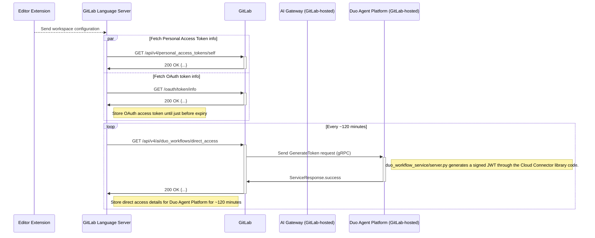

セキュリティ Issue や MR を評価する際、Issue を再現したり、根本原因を深掘りしたり、さらなる影響を調査する方法を持っていると役立ちます。これはオンボーディング最初の数週間で GitLab に慣れるための優れた方法でもあります。以下に便利なヒントとコツを紹介します。

## ローカル GDK 環境のセットアップ方法

1. [チームメンバー用ライセンス](/handbook/support/internal-support/#gitlab-plan-or-license-for-team-members)を 100 シートでリクエストしてください（これにより、GDK のインストール時にすでに追加されている約 50 ユーザーを削除する必要がなくなります）。
1. 既存のローカル GDK インストールを置き換える予定の場合や、[geo](https://gitlab.com/gitlab-org/gitlab-development-kit/-/blob/main/doc/howto/geo.md) のセットアップを行う場合、まず既存の gdk フォルダで `gdk kill` を実行します。これによりプロセスが停止し、各種サービスで使用されているポートが解放されます。
1. gdk のインストール手順に関する一般的な情報は [gitlab-development-kit](https://gitlab.com/gitlab-org/gitlab-development-kit/-/blob/main/doc/_index.md) で確認できます
   - [ワンラインインストール](https://gitlab.com/gitlab-org/gitlab-development-kit/-/blob/main/doc/_index.md#one-line-installation )を `curl "https://gitlab.com/gitlab-org/gitlab-development-kit/-/raw/main/support/install" | bash` で開始します
   - gdk にインストールするか、フォルダ名を選択します
   - `mise` でインストールします
   - インストールが完了したら、すべてのサービスが起動していることを確認するために `gdk restart` を実行してください
1. インストールが完了したら、`root` / `5iveL!fe` でログインし、デフォルトパスワードを変更します
1. ライセンスを適用します。[admin/settings/addlicense](http://localhost:3333/admin/application_settings/general#js-add-license-toggle) からか、[Rails コンソール](https://docs.gitlab.com/administration/license_file/#add-a-license-through-the-console)を使用します。
1. ライセンスが正しく適用されたかを [admin/subscription](http://localhost:3000/admin/subscription) で確認します

## GDK で GitLab Duo を有効化する

 ローカル GDK を Duo のローカルインスタンスで構成するには、以下の公式 wiki に従ってください。

1. [こちら](https://gitlab-org.gitlab.io/gitlab-development-kit/howto/ai/#prerequisites)の手順に従って、ローカル GDK で Duo をセットアップして構成します
2. [こちら](https://gitlab-org.gitlab.io/gitlab-development-kit/howto/ai/#verify-your-setup)の手順に従ってセットアップを確認します。

[こちら](https://gitlab-org.gitlab.io/gitlab-development-kit/howto/ai/#additional-resources)の Additional Resources セクションには、トラブルシューティングのドキュメントがあります。

## VS code で Duo を有効化する

1. AI 機能にアクセスできるユーザーで、API アクセス権を持つ PAT を作成します
1. [VS code](https://code.visualstudio.com/) をダウンロードしてインストールします
1. Extensions から GitLab をインストールします
1. GDK 用の [VS code プロファイル](https://code.visualstudio.com/docs/configure/profiles)を構成します。Code > Settings > Profiles > New Profile に進みます
1. VS code でコマンドパレット（Command + Shift + P）を開き、"GitLab: Validate GitLab Accounts" を選択して GDK アカウントに切り替えます。ここで PAT を追加してください。
1. GitLab Agent が左のツールバーに追加されているはずです

## VS Code Duo 拡張機能を Language Server とリンクする

以下のシーケンスは、IDE 拡張機能が GitLab インスタンスおよび後で Duo Agent Platform でどのように認証されるかを示しています。



注: これらの手順は、[ドキュメントの既存手順](https://gitlab.com/gitlab-org/editor-extensions/gitlab-lsp/-/blob/main/README.md#connect-to-ls-in-the-vs-code-extension)を拡張したものです。

以下のすべてのステップは、GitLab ユーザープロファイルとして実行されます:

1. [gitlab-vscode-extension](https://gitlab.com/gitlab-org/gitlab-vscode-extension/-/tree/main?ref_type=heads) プロジェクトをクローンします。
1. VS Code 拡張機能プロジェクトと同じパスに [gitlab-lsp](https://gitlab.com/gitlab-org/editor-extensions/gitlab-lsp) プロジェクトをクローンします。例:
   - LSP が /Users/<USERNAME>/Projects/gitlab-lsp にある
   - vscode 拡張機能が /Users/<USERNAME>/Projects/gitlab-vscode-extension にある
1. セットアップを容易にするため、ターミナルで両方のプロジェクトを並べて開きます。
1. gitlab-vscode-extension プロジェクトについては、以下の手順に従ってください:
   - 実行: `npm install`
   - 開発モードで拡張機能を実行する:
       1. プロジェクトを vscode で開きます
       1. View: Show Run and Debug コマンド（Cmd+Shift+P）を実行します。
       1. Run Extension コマンドが選択されていることを確認します。
       1. 緑の再生アイコンを選択するか、F5 を押します。
1. gitlab-lsp プロジェクトについては、以下の手順に従ってください:
    1. プロジェクトを vscode で開きます
    1. `npm install` を実行します
    1. `npm run build` を実行します
    1. `GITLAB_WORKFLOW_PATH=/Users/<USERNAME>/Projects/gitlab-vscode-extension code .` を実行します
    1. Attach to VS Code Extension 起動タスクを実行します。
    1. `npm run watch -- --editor=vscode --packages agentic-duo-chat webview-duo-workflow duo-chat duo-chat-v2 webview-duo-chat webview-duo-chat-v2 webview-vuln-details` を実行します
1. 検証: 動作確認のため、まず Duo Workflow 拡張機能の設定で GitLab デバッグオプションを有効にし、デバッグログが見えるよう拡張機能を再起動します:


## Duo 開発のため LS をローカル GDK の変更に接続する

1. GDK プロファイルをセットアップします
1. [doc](https://gitlab.com/gitlab-org/editor-extensions/gitlab-lsp#connect-ls-with-local-gdk-changes-for-duo-development) で示されている 2 つのステップに従います

VSCode で、output ペインの "GitLab Language Server" のログを確認し、エラーがないか見てください。下記のようなトークンエラーが出る場合は、GitLab Workflow 拡張機能の設定に行き、TLS/SSL 証明書エラーを無視するオプションがチェックされていることを確認してください:

```bash
2025-08-20T10:54:14:972 [warning]: Both PAT and OAuth token checks failed: PAT Token: {"valid":false,"reason":"unknown","message":"Token validation failed: Error: request to https://gdk.test:3443/api/v4/personal_access_tokens/self failed, reason: unable to verify the first certificate"}, OAuth Token: {"valid":false,"reason":"unknown","message":"Token validation failed: Error: request to https://gdk.test:3443/oauth/token/info failed, reason: unable to verify the first certificate"}
2025-08-20T10:54:14:973 [info]: [CodeSuggestionsInstanceTelemetry] Instance Telemetry: GitLab Duo Code Suggestions telemetry is always enabled in self-managed instances.
2025-08-20T10:54:14:973 [warning]: Token is invalid. Token validation failed: Error: request to https://gdk.test:3443/api/v4/personal_access_tokens/self failed, reason: unable to verify the first certificate. Reason: unknown
2025-08-20T10:54:14:973 [warning]: Token is invalid. No token provided. Reason: invalid_token
```


1. 拡張機能を再起動して動作を確認するには、GDK フォルダ（GDK プロジェクトをローカルに git clone し、Duo が有効になっていることを確認）を開いてログにエラーがないか確認します。動作中のエージェントワークフローログの例:

```bash
2025-08-20T11:13:46:002 [info]: [Duo Agentic Chat Plugin] Received new event
2025-08-20T11:13:46:002 [debug]: [WebviewInstanceMessageBus:agentic-duo-chat:8327ccee-1b85-48ba-abd6-eb4cfb5e3f1f] Sending notification: workflowCheckpoint
2025-08-20T11:13:46:002 [debug]: [WebviewInstanceMessageBus:agentic-duo-chat:8327ccee-1b85-48ba-abd6-eb4cfb5e3f1f] Sending notification: workflowStatus
2025-08-20T11:13:46:503 [debug]: [WorkflowTokenService] Reusing existing valid token for workflow "3"
2025-08-20T11:13:46:503 [debug]: [DuoWorkflowNodeExecutor][3] Received new checkpoint: {"workflowStatus":"RUNNING"}
```

## AI Gateway と Duo Agent Platform Service の異なるブランチを実行する

[AI Gateway](https://gitlab.com/gitlab-org/modelops/applied-ml/code-suggestions/ai-assist) で MR をレビューする際、[README.md](https://gitlab.com/gitlab-org/modelops/applied-ml/code-suggestions/ai-assist/-/blob/main/README.md?ref_type=heads) のセットアップ手順に従う代わりに、AppSec エンジニアはしばしば[こちらの手順](https://gitlab.com/gitlab-org/gitlab-development-kit/-/blob/main/doc/howto/gitlab_ai_gateway.md#optional-run-a-different-branch-of-ai-gateway-and-duo-agent-platform-service)に従って特定のブランチで変更をテストするだけで済みます。

## AI Catalog 開発のための GDK のセットアップ

詳細な手順はこの [wiki ページ](https://gitlab.com/gitlab-org/ai-powered/workflow-catalog/team-tasks/-/wikis/Setting-up-GDK-for-Workflow-Catalog-Development)に従ってください。

### 実行チェーンをステップ実行する

Web または API リクエストの一部として実行されたコードを確認したい場合、対話型デバッガーが便利なツールになる可能性があります。[Pry と Thin の構成方法はこちら](https://gitlab.com/gitlab-org/gitlab-development-kit/-/blob/main/doc/howto/pry.md#using-thin)です。

典型的なワークフローは、リクエストを開始する `Controller` アクションを見つけ（`create` や `update` などのメソッドが良い候補です）、`binding.pry` を追加し、ファイルを保存し、ブラウザでそのリクエストを実行することです。実行が停止し、ターミナルで IRB を使用して現在の状態を検査でき、`step` でメソッドの中に入り、`next` で次のステートメントに進み、`continue` でリクエストを次のブレークポイントまでまたは完了まで実行できます。

ログを確認することも役立ちます: `tail -f gitlab/log/development.log`。

## テストプロキシのインストール

役職によっては「ペネトレーションテスト」を行う必要はないかもしれませんが、リクエストを傍受・操作できるテストプロキシへのアクセスを持つことは、HackerOne の Issue を再現する際に役立ちます。

AppSec チームは [Burp Suite Professional](https://portswigger.net/burp/pro) のマルチユーザーライセンスを持っています。ライセンス取得については `#security_help` で AppSec チームに問い合わせてください（[最新の安定版はこちらからダウンロード](https://portswigger.net/burp/releases)）。無料でオープンソースの [OWASP ZAP](https://www.zaproxy.org/) も使用できます。

これらのツールは Web サイトに簡単にダメージを与えたり、アクティブスキャンで CPU を消費したりする可能性があります。OWASP Zap では、潜在的に悪意のあるリクエストを防ぐために "Safe" モードを使用してください。Burp Suite では、ライブの "audit" スキャンを無効にしてください。

## ブラウザプロファイル

複数のユーザーを使ってテストする必要がある場合、シークレット / プライベートタブが簡単な選択肢です。サインインしていない [Chrome プロファイル](https://support.google.com/chrome/answer/2364824)や [Firefox Multi-Account Containers](https://support.mozilla.org/en-US/kb/containers) を作成して使用することで「セッションサンドボックス」を提供できます。これらはウィンドウを閉じても永続化され（シークレットタブとは異なります）、視覚的な区別のために色分けすることもできます。

## サーバー / トンネルのモッキング

ローカルマシンをインターネットからアクセス可能にすることは許可されていないため、`ngrok` や `localtunnel` のようなツールは使用できません。代わりに、GitLab の [Sandbox Cloud](/handbook/company/infrastructure-standards/realms/sandbox) を使用してモックサーバーをホストしてください。Sandbox Cloud のテスト環境をセキュアにする方法のアドバイスについては [Secure Cloud testing environments](/handbook/support/workflows/test_env/#securing-cloud-testing-environments) を参照してください。

## デバッグと GDK のヒント

- `gdk update` Git からアプリケーションの変更をプル
- `gdk tail` 全サービスのログを tail
- `gdk tail gitlab-ai-gateway` AI サービスのログを tail
- `gdk doctor` GDK の診断を実行
- gitlab フォルダで実行: `bundle exec rake gitlab:duo:verify_self_hosted_setup` で[ローカルセットアップを検証](https://docs.gitlab.com/administration/gitlab_duo_self_hosted/troubleshooting/#verify-gitlab-setup)
- `gdk kill` サービスを強制終了 - サービスがポートをハングさせている場合やアップグレードする際に便利
- [フィーチャーフラグ](https://docs.gitlab.com/operations/feature_flags/) は `http://127.0.0.1:3000/rails/features` から有効化できます
