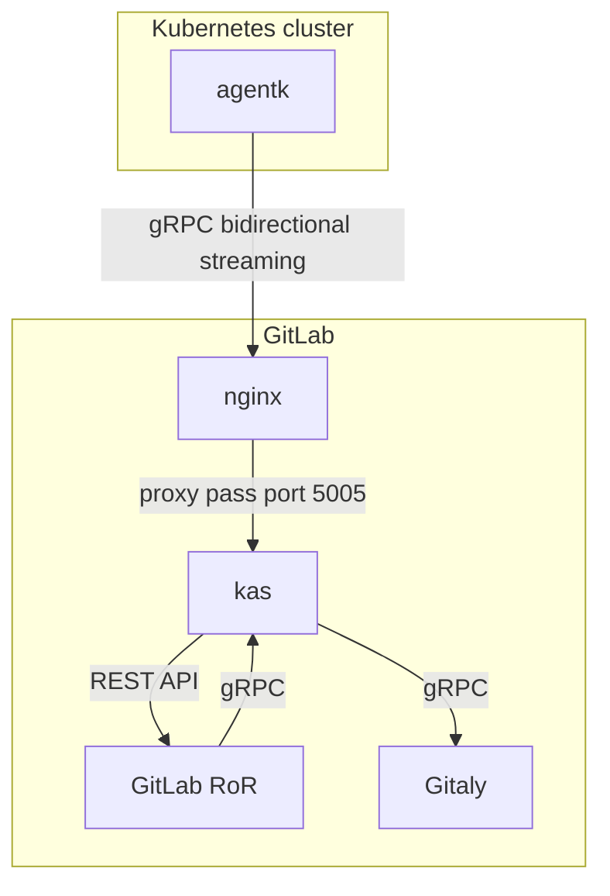
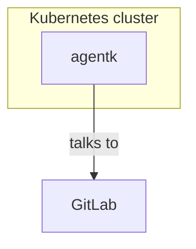

## TL;DR

非常に短くまとめると:

脅威モデリングは開発プロセスのほぼあらゆる時点で行うべきであり、また行うことができますが、本当はプロセスの早い段階で始めるべきです。「何が起こりうるか」あるいは攻撃者のメンタリティを取り入れて、自分の機能に適用してください。

せっかちな方のために、おそらく最も短い脅威モデリングガイドを示します:

- 機能のダイアグラムを描き、次の点を指摘します:
  - 信頼できない入力はどこから来ますか？
  - 異なる信頼レベルのゾーンはどこにあり、それらの間の信頼境界はどこですか？
- 攻撃者の視点を取り、最悪のケースを想定して脅威を定義します。
  - 最も発生しやすく影響力のある脅威から順に並べてみてください。
- 脅威を文書化し、機能にマップします。直接的に責任を持つ個人と期日を定めたフォローアップ Issue を作成します。

{}
私たちの要件をカバーし、新しい脅威モデルの作成や脅威モデルが完全で妥当かどうかのチェックなど、プロセス全体を通じてあなたを導く脅威モデルを作成するために、[脅威モデルエージェント](#threat-model-agent) を使用することをお勧めします。
{}

## 脅威モデリングとは何か

私たちの[脅威モデリングのハンドブック](_index.md) ページから最初の文を取って、ここでは短くシンプルに保ちましょう:

> 脅威モデリングとは、確立されたまたは新しい手順を取り上げ、それを潜在的なリスクについて評価するプロセスです。

これはおそらく脅威モデリングの最もハイレベルで抽象的な記述です。それでは、それを実用的に使ってみましょう。私たちは**何か**、つまり確立されたまたは新しいプロセスを取ります。本当に何でも構いません。私たち自身の[アセスメントツール](https://gitlab.com/gitlab-com/people-group/peopleops-eng/assessment-tool/-/blob/master/threat-model.md)、[スタンドアロンの GitLab インスタンス](https://gitlab.com/gitlab-com/gl-security/security-research/gitlab-standalone-instance/-/tree/master#gitlab-standalone-instance) や、[新しいインフラ](https://gitlab.com/gitlab-com/gl-security/product-security/appsec/appsec-reviews/-/issues/79)（内部リンク）のようなものです。

このハウツーの残りの部分では、脅威モデルを作成しようとしている**もの**を**機能 (feature)** と呼びます。GitLab における脅威モデリングのほとんどが、製品の機能、または SaaS オファリングのインフラの機能について行われるからです。

脅威モデルが行うこと、それは見ている機能を分解し、より多かれ少なかれ形式化された方法で、機能とそのコンポーネントに対する**脅威**を**特定**し記述できるようにすることです。この記述はこれまで非常に形式的に聞こえ、実際に脅威モデルを思いつくのに役立たないかもしれません。何が達成されるべきか（**脅威の特定**）の漠然とした基準として捉え、ここからどうやってそこに至るかを見ていきましょう。

[GitLab で使用される正式なフレームワークは PASTA と呼ばれています](_index.md)。このガイドは、PASTA の原則を、あらゆる GitLab チームメンバーが従うときに最大限の効果を発揮するために、軽量な方法で適用するのに役立ちます。

## いつ、どこから始めるか

「実装しようと計画している機能の脅威モデリングはいつ始めるべきか？」と疑問に思うかもしれません。実際には明らかではありませんが、幸いにも、現在開発中または使用中のあらゆる機能に対して脅威モデルを作成するのに、遅すぎることも早すぎることもありません。また、セキュリティのすべてと同様に、これは固定された永遠の状態というよりは、プロセスです。脅威モデルは、機能が変更された場合、または機能は同じままでも異なるコンテキストや環境で使用される場合に、適応・洗練される必要があります。なので、はい、これはある意味で「追加」の作業です。適切な脅威モデルが自然に生まれるわけではないからです。しかし、それらの追加のステップは、「**何が起こりうるか**」のモーメント、つまり**脅威**としても知られているもの、についてさらに洞察をもたらすことで、すぐに報われるでしょう。決して遅すぎることはありませんが、プロセスを早く始め、機能の追加や変更に対して脅威モデルを最新の状態に保つほど、より報われるでしょう。これは、安全でない設計上の決定の修正がかなり複雑で、[破壊的](https://gitlab.com/gitlab-com/gl-infra/delivery/-/issues/1518)（内部リンク）であることもあるからです。

## ツール: 🔨と🧠

ほとんどの脅威モデリングフレームワークは、いくつかのダイアグラムが描かれることに依存しており、その周りには非常に重いツールがたくさんあります。そのようなツールは、データフロー図 (DFD) を取り、それが何であるかに基づいて特定のコンポーネントに特定の脅威を自動的にマッピングするでしょう。これは場合によっては非常に有用ですが、GitLab ではより柔軟性が必要です。私たちが見ている機能は、例えば [STRIDE](https://en.wikipedia.org/wiki/STRIDE_(security)) ベースの脅威モデリングのような厳格なスキーマにうまく収まらないことが多く、結果として意味のある脅威があまり得られないかもしれません。

### ダイアグラムを描く

ダイアグラムにはほぼ無限の可能性があります。GitLab 内での簡単で統合された使用には、私たちの[サポートされているダイアグラムツール](https://docs.gitlab.com/ee/user/markdown.html#diagrams-and-flowcharts) のいずれかを使うことをお勧めします。ただ、柔軟で正確に保つために、慣れているダイアグラム作成ツールを何でも使えます。機能の正確なダイアグラムを提供できればよいのです。例えば、私たちの [Kubernetes Agent](https://docs.gitlab.com/ee/user/clusters/agent/) のこの mermaid ダイアグラムは、出発点として完全に十分です。これは、すべての関係するコンポーネントを、依然として理解可能で意味のあるレベルで、それらの相互作用と共に示しています。

これをあまりに単純にしてしまうと:

それでも間違いではないでしょうが、これからあまり詳細な脅威を導き出すことはできません。

### 信頼と境界

典型的なアーキテクチャダイアグラムには通常含まれない注目すべきコンポーネントは、**信頼境界 (trust boundary)** です。信頼境界は Kubernetes Agent ダイアグラムにも明示的には描かれていませんが、私たちはそれを推測できます。信頼境界は、ダイアグラム内で異なるレベルの信頼を持つ部分を分離するものです。Kubernetes Agent のケースでは、これがはっきりと見えます。Kubernetes クラスタはどこにでもあり、誰によっても制御される可能性があり、本当に信頼できるものではありません。しかし、GitLab 制御コンポーネントは GitLab によって制御されており、したがって非常に信頼できます。なので結論として、ダイアグラムのこれら 2 つの部分の間に**信頼境界**があります。これが実際の脅威が登場する部分です。脅威は通常、これらの信頼境界で現れます。この信頼境界を見ただけで思いつく可能性のある最初の脅威:

- `agentk` と `kas` 間の通信は暗号化されていない可能性がある

これは考慮するには非常に単純で一般的なものですが、依然として正当な懸念であり、脅威モデルの最初のステップです。

### 脅威を見つける

より多くの脅威の領域をカバーするために、私たちは「最悪のケース」または「何が起こりうるか」の態度に少し視点をシフトする必要があります。これは一般的により多くの脅威シナリオを見つけるのに大いに役立ちます。非常に形式化された `STRIDE` のアプローチでは、実際の脅威クラスは次のとおりです:

- `S`poofing （なりすまし）
  - 何か、または誰かになりすますこと
- `T`ampering （改ざん）
  - データやコードを変更すること
- `R`epudiation （否認）
  - アクションを実行していないと主張すること
- `I`nformation disclosure （情報開示）
  - 見ることが許可されていない誰かに情報を公開すること
- `D`enial of Service （サービス拒否）
  - ユーザーへのサービスを拒否したり低下させたりすること
- `E`levation of Privilege （権限昇格）
  - 適切な認可なく能力を獲得すること

そのため `STRIDE` という名前です。私たちは正式な STRIDE フレームワークを使用しませんが、これらの脅威クラスを使用してモデル内の具体的な脅威を定義する際に何を考慮すべきかのアイデアを得ることができます。

なので、Kubernetes Agent の例におけるなりすましは、ある `agentk` が別のものになりすますことができることに現れるかもしれません。上記の「`agentk` と `kas` 間の通信は暗号化されていない可能性がある」の例は、例えば情報開示の脅威クラスに当てはまります。ここで起こりうるあらゆる単一のことについて考えるのは問題ではありません。可能性のある膨大で、むしろ obscure な脅威を簡単に思いつくことができますが、それは非常に気を散らし、脅威モデルのポイントを見失うかもしれません。私たちは主に、発生する可能性が高そうな脅威と、発生したときに本当に影響力のある脅威を狙いたいのです。

### .com と self-managed の両方を考慮する

少し枠の外を考えてみてください: 特定の機能は `GitLab.com` ではうまく動作するが、私たちの SaaS プラットフォームとは異なる方法でセットアップされた self-managed 環境ではトラブルや停止を引き起こす可能性があります。これも脅威となり得て、機能の環境的変化によって引き起こされます。これは結論として、機能が使用される環境を常に考慮するべきだということを意味します。その環境は時間とともに、または異なるデプロイメントシナリオで変わる可能性があり、最初から常にフレンドリーで信頼できるとは限りません。

### 不正使用とプラットフォーム悪用を考慮する

無料リソース（コンピューティング分、ストレージ、トライアル延長、レート制限の引き上げ、または何らかのクォータ割り当て）へのアクセスを導入または拡大する機能や製品には、固有の不正使用の表面があります。悪意のあるアクターは、支払うことなく大規模にリソースを取得する方法を積極的に探っています。レビューされている機能が次のいずれかに触れる場合、リソース取得、コスト回避、またはプラットフォーム操作のために悪用される可能性があるかどうかを検討してください:

- 無料層の制限またはトライアル資格ロジック
- CI/CD パイプラインリソース（コンピューティング分、Runner、並列ジョブ）
- AI トークンや LLM クォータの不正使用を可能にする可能性のある DAP 機能フロー（例: 割り当てられた推論クレジットをサードパーティや意図しない LLM 使用にプロキシまたはリダイレクトすること）
- CI 分、プロジェクト/名前空間の作成、または DAP クレジット/トライアルなどのリソース副作用を持つ招待または紹介メカニズム

これらのいずれかの領域で不正使用の可能性を特定した場合は、Trust and Safety チームを早期に巻き込んでください。Slack の `#abuse` で連絡するか、Issue や MR で `@gitlab-com/gl-security/security-operations/trust-and-safety` をタグ付けします。彼らは不正使用のリスクを評価し、検出シグナルに取り組み、必要に応じてローンチ後の計画を調整できます。

### 検出策を考慮する

Signals Engineering は、GitLab SaaS プラットフォーム、クラウド環境、企業システムやアプリケーションを含む GitLab 環境の悪用試行や成功した悪用を特定するための脅威検出を構築する責任があります。脅威モデリング演習中にサイバー脅威リスクが特定された場合、検出事項を Signals Engineering と調整することで、Signals Engineering チームによって構築されたプロアクティブな脅威検出を通じて既知のリスクを軽減するのに役立ちます。

Signals Engineering に連絡する価値のある特定のリスクには以下が含まれます:

- GitLab.com の主要なインフラや機能への根本的な変更
- GitLab 内の新しいクラスの機能/機能性（Duo Agent Platform など）
- 新しいインフラスタック/技術上で動作する新しい GitLab 機能
- 外部統合/攻撃面を導入する新しい GitLab 機能

Signals Engineering に連絡する価値のあるリスクを特定した場合、内部 Slack（`#security_help` で `@signals_engineering` をタグ付け）で連絡するか、[新しい検出バックログ Issue](https://gitlab.com/gitlab-com/gl-security/security-operations/signal-engineering/detection-backlog/-/work_items/new?related_item_id=undefined&type=ISSUE&initialCreationContext=list-route&description_template=New_Detection_Template) （内部リンク）を提出してください。

## 次は何ですか？

最初のステップが完了し、よく考えられた最初の一連の脅威ができたら、機能の開発中にこのリストを使って、私たちが脅威と最悪のケースシナリオと判断したものを軽減できます。

### 脅威モデルの文書化

脅威モデルは [AppSec の脅威モデルリポジトリ](https://gitlab.com/gitlab-com/gl-security/product-security/appsec/threat-models)（内部リンク）に追加されます。これには、Issue や Epic で誰でも使用できる脅威モデリングのテンプレートも含まれます。

### 脅威の所有権の確保

脅威モデルが更新されるたびに、それを要約する生きた説明と、各脅威に対する Issue へのリンクを持つ Issue を作成することを検討してください。次のような形です:

| 脅威                                                       | コメント                                                     | テスト / Issue                                                        |
| ------------------------------------------------------------ | ------------------------------------------------------------ | ------------------------------------------------------------ |
| `agentk` と `kas` 間の暗号化されていない通信         |                                                              | ✅ gRPC 通信は TLS 暗号化された WebSocket 経由で行われます (#123 を参照) |
| `agentk` が別のクラスタの `agentk` になりすますことができる可能性がある |                                                              | 認可をレビューするための Issue #124                                   |
| `gitaly` レベルへの攻撃                                    | `agentk` は `kas` 経由で `gitaly` に間接的にアクセスでき、これは Injection や [IDOR](https://en.wikipedia.org/wiki/Insecure_direct_object_reference) 攻撃に悪用される可能性があります | Issue #125 - `agentk` から `gitaly` に向かうデータフローを確認        |

各脅威には、回避、防止、検出、または回復の提案がチームによって議論される Issue が作成されるべきです。これらの Issue にはアサイニーとマイルストーンまたは期日があるべきです。当初、アサイニーはプロジェクトマネージャーであり、Issue を優先順位付けし、適切に再アサインします。アプリケーションセキュリティエンジニアの役割は、その提案の作成を支援し、チームが Issue を理解して対処できるよう助け、マージ前に脅威がどのように軽減されているかをレビューすることです。

また、現在実装されているリスクを記述していない場合は、これらの Issue を公開することを検討してください。実装のセキュリティ姿勢を改善する方法について議論する Issue は、[デフォルトで公開](/handbook/communication/confidentiality-levels/#internal) にできます。

### イテレーション

脅威モデルは決して本当に完了することはありません。チームは脅威モデルに精通するべきで、新しい機能や変更が発生したら別の AppSec レビューや脅威モデルの更新を要請するべきです。アプリケーションセキュリティエンジニアは、新しい脅威モデルが必要になるときも特定するために、チームと密接に協力するべきです。

### 自分でやる

このガイドの言語の多くは、アプリケーションセキュリティエンジニアがチームと脅威モデリングをどのように行うべきかを記述していますが、そうである必要はありません！セキュリティはみんなの責任で、**あなた**も脅威モデリングできます！助けが必要なら Slack の `#security_help` に連絡してください。

## 脅威モデルエージェント {#threat-model-agent}

### 目的

脅威モデルエージェントは、GitLab チームメンバーが自分自身で脅威モデルの作成、レビュー、改善を行うのを助ける、AI 搭載のアプリケーションセキュリティアシスタントです。エビデンス駆動の PASTA フレームワークを STRIDE 分類と 22 ポイントのコンプライアンスチェックリストと共に適用し、3 つのワークフローをサポートします:

- 新しい脅威モデルをゼロから作成する
- 既存の脅威モデルをレビューしエンリッチする
- 既存の脅威モデルを承認のために検証する

完成した脅威モデルは [threat-models リポジトリ](https://gitlab.com/gitlab-com/gl-security/product-security/appsec/threat-models) に保存されます。

{}
LLM ベースのエージェントは脅威モデルの作成や評価に貴重な資産になり得ますが、それは脅威モデリングプロセスのイネーブラーやサポートツールとして見るべきで、人間の判断の代替ではありません。脅威は自動化された方法だけでは特定するのが悪名高く難しい場合がありますが、このアプローチはチームメンバーがゼロから始める必要が決してないことを保証します。また、脅威モデルが私たちのドキュメント要件を一貫して満たし、組織全体で統一された標準を維持することも保証します。さらに、迅速な初期結果を提供し、それを時間とともに反復的に洗練することができます。
そうは言っても、エージェントの出力は常にチームによってレビューおよび検証されるべきです。エージェントが特定していない可能性のある追加の脅威を加えることを強くお勧めします。
{}

### 利用可能性

エージェントは現在、[threat-models リポジトリ](https://gitlab.com/gitlab-com/gl-security/product-security/appsec/threat-models) 内でのみ有効になっています。これは初期ロールアウト中の意図的な設計上の決定です。他の GitLab プロジェクトからのアクセスは将来計画されています。

### セッションの開始

[threat-models リポジトリ](https://gitlab.com/gitlab-com/gl-security/product-security/appsec/threat-models) で脅威モデルエージェントを選択し、目標を記述することで会話を開始します。例えば:

- 「機能 X の新しい脅威モデルを作成したい。」
- 「この既存の脅威モデルをレビューしてください: 」

完全なセッションにコミットすることなく、最初に概念的な質問もできます（例: 「要件 D5b は何を意味しますか？」）。プロセス、要件、または用語について不明な点があれば、エージェントに直接尋ねてください。エージェントは個々の要件、エージェントが推定した重大度分類、STRIDE のカテゴリー、または機能のスコープ設定方法を説明できます。

### ゼロから脅威モデルを作成する

エージェントに新しい脅威モデルを作成したいことを伝えます。エージェントは構造化された発見ダイアログを通じてあなたを導き、機能に関するコンテキストを尋ね、Mermaid データフロー図、脅威表、データ分類を含むドラフトドキュメントを生成します。各脅威を含める前に、あなたが確認します。

### 既存の脅威モデルに取り組む

脅威モデルをテキスト、リンク、またはファイルとして共有し、検証またはコンプライアンスチェックを希望するかをエージェントに伝えます。エージェントは弱いまたは重複した脅威にフラグを立て、欠けているものを提案し、優先順位付けされた改善とともにカバレッジスコアを返します。

### 検証とレビュー

ドラフトまたはエンリッチした後、エージェントはコラボレーティブな refinement ループに入り、何かが完成する前に偽陽性を削除したり、仮定に挑戦したり、コンテキストを追加したりできます。すべての refinement は同じ会話内で行われます。

### 保存場所: 必ず確認する

エージェントは、プロジェクトの名前空間と機能タイプに基づいて、threat-models リポジトリ内の脅威モデルファイルが保存される場所を自動的に決定します。選択は通常正しいですが、最終的な Draft MR でファイルパスを必ず再確認してください。場所が間違っている場合は、どこに置くべきかをエージェントに伝えれば、同じブランチでファイルを移動します。

### Draft MR でのポーズと再開

任意の時点でプロセスを中断し、後で続けることができます。チャットセッションがまだアクティブであるか、脅威モデルでの作業をスタッシュするための (Draft) MR が作成されている場合です。MR は常に Draft モードで作成され、明示的に確認した後にのみ作成されます。

ポーズと再開のワークフロー:

1. **セッション中に一時停止する**: 必要なときにいつでも会話を停止します。チャットセッションが開いている限り、部分的な回答と確認された脅威は失われません。
2. **Draft MR として作業をスタッシュする**: 保存するのに十分なコンテンツができたら、threat-models リポジトリで Draft MR を作成するようエージェントに依頼します。エージェントはプロジェクトのデフォルトブランチを検出し、ドキュメントを正しい名前空間ミラーパスに保存し、起源となる Issue をリンクし、セッションメトリクスブロックを MR の説明に追加します。マージ前に選択されたパスを確認してください。
3. **後で再開する**: エージェントとの新しいチャットを開き、Draft MR のリンクを共有します。エージェントは既存のドキュメントから取り上げ、それをさらなる検証または refinement のための入力として扱います。
4. **同じブランチでイテレーション**: さらなる変更を行うとき、エージェントは新しいブランチを作成したり MR をクローズ/再オープンしたりせず、同じブランチに修正したりコミットを追加したりします。これによりレビュー履歴がクリーンに保たれます。
5. **完成させる**: ドキュメントが完成したら、MR を脅威モデルの作成者にアサインし、Draft ステータスを削除し、AppSec のレビューを依頼します。

Draft MR は進行中の脅威モデルの永続的なストレージとして機能するため、機能設計が進化するにつれて再び戻ってくることができます。
