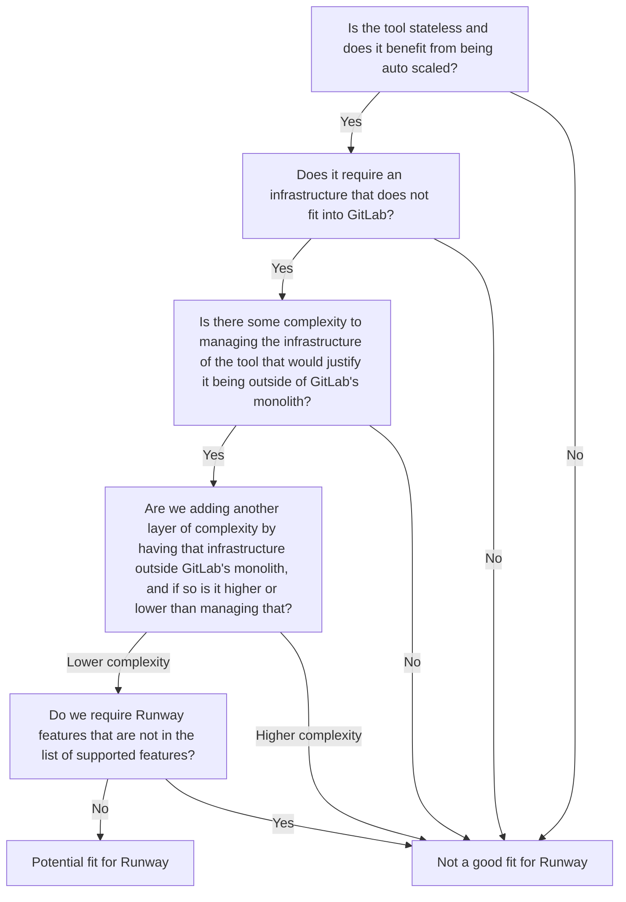

## Runwayツーリングガイドライン

このRunbookは、ツールが [Runway](/handbook/engineering/infrastructure-platforms/tools/runway.md) に適しているかを判断するためのものです。場合によっては、[ツーリング統合作業](/handbook/security/product-security/security-platforms-architecture/product-security-engineering/detailed-workflow#tooling-integration)を容易にするためにRunwayを使用することが有益な場合があります。

## Runwayとは何か?

[設計ドキュメントの提案](/handbook/engineering/architecture/design-documents/runway/#proposal)では、Runwayが現在どのようなものかが要約されています。

> Runwayは、Dockerイメージとしてパッケージ化されたサービスを本番環境にデプロイするための手段です。これを実現するために、GitLab CI/CDやその他のGitLab製品機能を活用しています。

## なぜRunwayなのか?

Runwayブループリントの[エグゼクティブサマリー](/handbook/engineering/architecture/design-documents/gitlab_ml_experiments/)に、その背景にある動機が分かりやすく説明されています。

> 本ドキュメントは、GitLab内部のチームがAI、ML、データ技術を活用した新しいアプリケーション機能を迅速に構築できるようにするインフラを構築するための、サービス統合アプローチを提案します。[...] 現在のアプリケーションアーキテクチャでは、ほとんどのGitLabアプリケーション機能がRubyで実行されています。しかし、多くのML/AI実験では、異なるリソースやツールが必要であり、異なる言語で実装され、必ずしも相性のよくない巨大なライブラリを必要とし、ハードウェア要件も異なります。これらすべての機能を既存のインフラに追加すると、GitLabアプリケーションコンテナのサイズが急速に増大し、起動時間が遅くなり、依存関係が増加し、セキュリティリスクが高まり、開発速度に悪影響を及ぼし、異なるハードウェア要件による複雑さも増します。代替案として、GitLabのメインワークロードに過負荷をかけないようにサービスを追加することを提案します。これらのサービスは、独立したリソースと依存関係で個別に実行されます。サービスを追加することで、GitLabはGitLab.comの可用性とセキュリティを維持しながら、エンジニアが新しいML/AI実験を迅速にイテレーションできるようになります。

ML/AIの部分を除外し、機能のためにRubyとは異なるリソースやツールを必要とするあらゆるツールに置き換えると、Runwayの利点は、適切な場合にGitLab内で通常使用されているものとは異なる技術を使用できる点であることが明らかになります。
Runwayの設計ドキュメントの目標セクションには、次のように記載されています。

> サービスのデプロイを目指す開発チームは、インフラ管理、スケーリング、モニタリングについてあまり気にする必要がなくなります。
> ステートレスでオートスケール可能なサテライトサービスに焦点を当てています。
> 既存のGitLab機能やツールと統合することで、合理化されたエクスペリエンスを提供することを目指しています。

以下の質問リストは、ツールがRunwayに適合する可能性があるかを判断するのに役立ちます。

1. ツールはステートレスで、オートスケールから恩恵を受けられますか?
1. GitLabに収まらないインフラを必要としていますか?
1. GitLabのモノリス外に置くことを正当化できるような、ツールのインフラ管理の複雑さがありますか?
1. そのインフラをGitLabのモノリス外に置くことで別の複雑さの層を追加していないか、その場合、その複雑さは管理する複雑さよりも高いですか低いですか?
1. [サポートされている機能](https://docs.runway.gitlab.com/runtimes/cloud-run/supported-features/)のリストにないRunway機能が必要ですか?
1. [ツールのハンドオーバー](/handbook/security/product-security/security-platforms-architecture/product-security-engineering/detailed-workflow#tooling-handover-epics)の観点で、チームにRunwayの経験があり、その方法でデプロイされた場合に引き継ぐ意欲がありますか?

これは以下のmermaid図として可視化できます。

## Runwayの始め方は?

[Candidate Services for Runway Deployment Issue](https://gitlab.com/gitlab-com/gl-infra/platform/runway/team/-/issues/48)がまだ存在する場合は、コメントを残してチームとチャットを設定し、Runwayが意図した目的に実際に適しているかを議論してください。その後、[ドキュメント](https://docs.runway.gitlab.com/guides/onboarding/)に優れたオンボーディングガイドが用意されています。

ツールを将来的に所有することになるチームと、[ツールハンドオーバーエピック](/handbook/security/product-security/security-platforms-architecture/product-security-engineering/detailed-workflow#tooling-handover-epics)の一環としてツールとしてRunwayを使用することについて、会話を始める必要があります。
