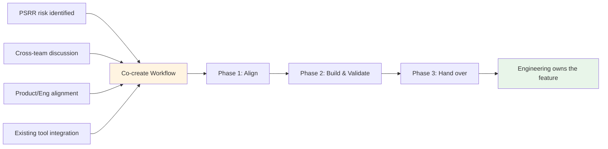

## 概要

Product Security Engineering (ProdSecEng) は Product および Engineering と直接連携し、セキュリティ機能を GitLab 製品へ出荷します。co-create workflow は、そのための進め方です。ProdSecEng が開発作業に貢献し、完成した機能は長期所有権のために Engineering チームへ引き継がれます。

このプロセスは [Security Interlock](/handbook/security/product-security/security-platforms-architecture/security-interlock/) イニシアチブをサポートします。Product Security は、高リスクな問題に対応するために必要な製品変更や機能を特定することがよくあります。すでにロードマップが埋まっている Engineering チームへその作業を渡すのではなく、ProdSecEng が Product および Engineering と整合した専任のセキュリティエンジニアリング能力を提供します。これにより、作業を提供し、GitLab が製品を進める必要のある方向に適合することを確認できます。

> **移行メモ (2026 年 7 月 1 日発効)**
>
> 2026 年 7 月以前、このページではカスタムセキュリティツールのライフサイクル全体をカバーする 4 つの相互接続されたワークフロー (Intake、Maintenance、Co-create、Transition & Sunset) を説明していました。GitLab の Act 2 operating model の変更の一環として、ProdSecEng のミッションは製品への貢献を直接出荷することへ重点を移しました。現在は co-create workflow が主要なプロセスです。
>
> Intake と Maintenance のワークフローは新しい作業を受け付けていません。既存のカスタムツールに関するコミットメントは移行中です。移行計画は最終化されつつあり、[内部ハンドブックのツールインベントリ](https://internal.gitlab.com/handbook/security/product_security/product_security_engineering/) (GitLab チームメンバーのみアクセス可能) に文書化されています。レガシーワークフローのドキュメントは、移行中の参照用として下記の [Existing tooling workflows](#existing-tooling-workflows) セクションに保持されています。

## 共創ワークフロー {#co-create-workflow}

### 共創の始まり方

co-create の作業は、いくつかの場所から始まります。

1. **PSRR リスク**: [Product Security Risk Register](/handbook/security/product-security/security-platforms-architecture/risk-register/) のリスクが、製品ソリューションを必要とするものとして特定される。
1. **クロスチームの議論**: ProdSec チームが製品機能で対応できるギャップを特定し、ProdSecEng と協力して作業をスコープする。
1. **Product と Engineering との整合**: 共同計画によって製品ロードマップに適合するセキュリティ機能が明らかになり、ProdSecEng が開発作業を引き受ける。
1. **既存ツールの統合**: 内部ツールの path-forward category が **Integrate** に設定され (既存ツールセクションの [Path-forward categories](#path-forward-categories) を参照)、そのツールの機能が製品に組み込まれる。

機能が所有 Engineering チームに引き継がれた時点で、co-create は完了します。継続的な統合の取り組み (複数機能を持つツールなど) の場合、より広い移行が続く中で個別の co-create サイクルが完了することがあります。

### プロセス概要

co-create は 3 つのフェーズに従います。

1. **[Product と Engineering との整合](#phase-1-align-with-product-and-engineering)** — 何を構築するか、製品にどう適合するか、誰が関与するかについて合意する。
1. **[構築と検証](#phase-2-build-and-validate)** — 機能を開発し、テストし、必要に応じて Customer Zero として内部ユーザーで検証する。
1. **[Engineering への引き継ぎ](#phase-3-hand-over-to-engineering)** — 機能の所有権を、長期的にメンテナンスする Engineering チームへ移管する。

### フェーズ 1: Product と Engineering との整合 {#phase-1-align-with-product-and-engineering}

開発作業を開始する前に、ProdSecEng は Product および Engineering とアプローチと期待される成果について整合します。この整合は重要です。ProdSecEng はこれらの機能を長期的に所有しないため、所有チームが、何を構築し、それが製品にどう適合するかに合意している必要があります。

**主要な活動:**

- 関連する Product Manager を関与させ、ユースケースを検証して製品適合を確認する。作業が PSRR エントリやクロスチームの議論から始まる場合は、そのコンテキストを出発点として使用する。
- 関連する Engineering Manager を関与させ、技術的アプローチを検証し、チームがレビューと最終的な所有権をサポートできることを確認する。
- 重複する既存または計画中の作業について [R&D Interlock roadmap](/handbook/product-development/how-we-work/r-and-d-interlock/) を確認する。既存のコミットメントがある場合、ProdSecEng は別作業を提案するのではなく、それらの取り組みに貢献できる。
- 機能をフィーチャーフラグの背後で出荷するか、PoC フェーズを経るか、直接一般提供を目指すかを含め、スコープに合意する。
- ロールアウトアプローチと、ロールアウト期間中のインシデント所有権について合意する (Phase 2 の [ロールアウトとインシデント所有権](#rollout-and-incident-ownership) を参照)。

**整合の記録**

整合は co-create エピックに文書化する必要があります。ProdSecEng は PM または EM に、スコープとアプローチに関する整合を確認する明示的なコメントを日付付きでエピックに残すよう依頼する必要があります。これにより、後で整合に疑問が生じた場合の明確な監査証跡が作成されます。開発中にスコープが変わる場合は、再整合を求め、同じ方法で文書化する必要があります。

**アウトプット**

1. 作業計画、リスク、依存関係、ステークホルダー (RACI 付き) を含む co-create エピックが作成される
1. PM および/または EM の整合が確認され、エピックに文書化される
1. 開発作業の Issue が作成またはリンクされる

### フェーズ 2: 構築と検証 {#phase-2-build-and-validate}

#### 習熟

開発を開始する前に、チームは作業対象のコードベースを理解する時間を投資する必要があります。作業に既存の内部ツールの統合が含まれる場合、チームはそのツールが現在どのように問題を解決しているかも理解する必要があります。これはタイムボックス化し、Work Item として追跡することで、開発中に情報に基づく判断ができるようにします。例として [この以前の Work Item](https://gitlab.com/gitlab-com/gl-security/product-security/product-security-engineering/product-security-engineering-team/-/work_items/367) を使用できます。

#### 開発

ProdSecEng は [GitLab の標準開発プロセス](https://docs.gitlab.com/development/) に従って機能を開発します。このフェーズは反復的になる場合があります。Phase 1 で合意した内容に応じて、プロダクション対応の機能の前に、概念実証やフィーチャーフラグ付きの実装が行われることがあります。

**主要な活動**

1. テストとドキュメントを含めて機能を実装する
1. マージリクエストを提出し、所有 Engineering チームとのコードレビューでイテレーションする
1. パフォーマンスを検証し、機能が品質基準を満たすことを確認する
1. 最終的に機能を所有するチームと知識を共有する (ディープダイブセッション、ドキュメント)
1. 必要に応じて [Customer Zero](/handbook/product/product-processes/customer-0/) として内部ユーザーで機能を検証し、その機能がワークフローに関係する ProdSec チームからフィードバックを収集する
1. [ADR テンプレート](https://gitlab.com/gitlab-com/gl-security/product-security/product-security-engineering/product-security-engineering-team/-/blob/main/development_templates/adr_template.md) を使用して、重要な設計判断を記録する

#### ロールアウトとインシデント所有権 {#rollout-and-incident-ownership}

開発作業に段階的なロールアウト (フィーチャーフラグ、段階的アクセス) が含まれる場合、ロールアウト計画は Phase 1 で合意し、co-create エピックに文書化する必要があります。

ロールアウト中:

- **ProdSecEng はロールアウト判断の DRI です**。発生した Issue に基づいてロールアウトを一時停止、戻す、または調整するかどうかを含みます。ProdSecEng は、検討すべきより広範なリスクや懸念がある場合に備えて、所有 Engineering チームに相談する必要があります。
- **ProdSecEng はその機能に関するインシデントの SME です**。[GitLab のインシデントプロセス](/handbook/engineering/infrastructure-platforms/incident-management/) の一部として SME エスカレーションに対応します。所有 Engineering チームは相談を受け、潜在的なナレッジギャップがあるため、複雑な Issue に対応するには追加のサポート、リソース、コンテキストが必要になる可能性があることを理解しておく必要があります。所有 Engineering チームは、その専門知識またはキャパシティによってより早い解決が可能な場合、明示的にインシデント所有権を引き継ぐことができます。

これらの責任は Phase 1 で事前に明確化し、co-create エピックに文書化する必要があります。

#### 整合の維持

co-create エピックでステークホルダーに定期的な (通常は週次の) ステータス更新を提供します。これにより Product と Engineering が進捗を把握でき、GitLab の優先順位や計画が変わる場合に、ProdSecEng はそれが作業に影響する前に把握できます。スコープやアプローチを変更する必要がある場合は、PM または EM と再整合し、エピックに文書化します。

**アウトプット**

1. 機能が出荷される (合意どおり、フィーチャーフラグの背後または一般提供)
1. ドキュメントが公開される
1. パフォーマンスと品質が検証される
1. Customer Zero フィードバックが収集され、対処される (該当する場合)

### フェーズ 3: Engineering への引き継ぎ {#phase-3-hand-over-to-engineering}

ProdSecEng は機能を、長期的に所有する Engineering チームへ引き継ぎます。引き継ぎのタイミングとスコープは、Phase 1 で合意された内容によって異なります。引き継ぎは、フィーチャーフラグが削除され機能が一般提供になった後に行われることもあれば、所有チームが引き継ぐ準備ができている場合はそれより早く行われることもあります。

製品機能が既存の内部ツールの機能を置き換える場合、そのツールの [Transition & Sunset workflow](#transition-and-sunset-workflow) は co-create 中に始まることがあります。この場合、co-create と移行は連続ではなく並行して進みます。内部ツールの完全な廃止は、複数の co-create サイクルが完了するまで行われない場合があります。

**主要な活動:**

1. 機能が長期所有権に関する標準を満たしていることを、所有 Engineering チームと確認する
1. 機能がフィーチャーフラグの背後で出荷された場合、フラグ削除と一般提供の計画について所有チームと協働する
1. 残りのコンテキストを移管する: ドキュメント、ADR、既知の Issue、パフォーマンスデータ
1. 該当する場合、その機能が製品に統合されたことを反映するために [ツールインベントリ](https://internal.gitlab.com/handbook/security/product_security/product_security_engineering/) を更新する

**アウトプット**

1. 機能が Engineering チームによって所有・メンテナンスされる
1. 該当する場合、ProdSecEng の内部ツールが更新される、または [transition and sunset](#transition-and-sunset-workflow) の予定に入る
1. ツールインベントリが更新される (該当する場合)

### 主要な考慮事項

1. **機能パリティ**: 製品機能は (該当する場合) 内部ツールの機能の 100% と一致する必要はありません。Phase 1 で「十分に良い」とは何かに合意し、必要に応じて Phase 2 で再確認します。
1. **反復的な提供**: co-create では、機能が一般提供の準備が整うまでに、PoC、フィーチャーフラグ付き提供、Customer Zero テスト、再整合が複数回行われることがあります。これは想定どおりです。
1. **整合は継続的**: 整合は 1 回限りのゲートではありません。GitLab の優先順位は変わる可能性があり、定期的なステータス更新とステークホルダーコミュニケーションにより、ProdSecEng の作業を Product と Engineering の方向性に合わせ続けられます。
1. **ProdSecEng は製品機能を所有しない**: co-create を通じて構築されるすべての機能は Engineering チームに引き継がれます。所有チームとの早期の整合と継続的なコミュニケーションによって、これを実現します。

---

## 既存ツールのワークフロー {#existing-tooling-workflows}

以下のワークフローは、ProdSecEng の既存のカスタムツールに関するコミットメントに適用されます。2026 年 7 月 1 日時点で、新しいカスタムツールのリクエストは受け付けていません。これらのワークフローは、移行期間中の参照用としてここに保持されています。チームの現在のミッションについては、[ProdSecEng チームチャーター](/handbook/security/product-security/security-platforms-architecture/product-security-engineering/) を参照してください。

### インテークワークフロー

インテークワークフローは、チームが ProdSecEng の支援を求めていたツールおよび自動化作業のエントリーポイントでした。新規ツールリクエストと既存ツールの引き継ぎを対象としていました。ProdSecEng は各リクエストを評価し、構築、延期、リダイレクト、廃止のいずれにするかを判断し、その判断を記録しました。

> **このワークフローは新しいリクエストを受け付けていません。** 既存ツールについて質問があるチームは、Slack の [`#security_help`](https://gitlab.enterprise.slack.com/archives/C094L6F5D2A) で連絡してください。

### メンテナンスとインベントリ優先順位付けワークフロー

#### 目的

メンテナンスワークフローは、ProdSecEng がメンテナンスするツールについて、インテークが完了した瞬間からツールが transition and sunset workflow に入るまで継続的に実行されていました。

#### 主要な活動

アクティブな間、メンテナンスワークフローは次をカバーしていました。

1. 定義された SLO/RTO 内で **Issue に応答する**
1. **ツールを運用可能に保つ**: アップタイムを監視し、障害に対処し、セキュリティパッチを適用する
1. **作業の優先順位付け**: 重要度、製品準備状況、戦略的整合に基づいて、どのツールを co-create へ移すべきかを評価する
1. **保守性の改善**: ツールを段階的に [Good/Better/Best standard](https://internal.gitlab.com/handbook/security/product_security/product_security_engineering/automation_best_practices/) (GitLab チームメンバーのみアクセス可能) へ引き上げる
1. **インベントリのレビューと再評価**: ニーズが変化したツールがリソースを消費し続けることを防ぐ

#### 今後の道筋カテゴリ {#path-forward-categories}

ツールは以下のいずれかにカテゴリ分けされていました。これらのカテゴリは、移行中のツールについて [内部ハンドブックのツールインベントリ](https://internal.gitlab.com/handbook/security/product_security/product_security_engineering/) で引き続き参照されています。

- **Integrate**: 明確な製品適合、顧客価値、運用モデルの整合がある。エピックが存在し、今後のマイルストーンが適用されている。
- **Maintain (KTLO)**: ツールの文書化された SLO と RTO を満たしながら運用を維持する。機能リクエストは受け付けない。貢献のピアレビューは受け付ける。
- **Improve, then Integrate** または **Improve, then Maintain**: ツールを別のカテゴリへ移すための作業が必要。機能リクエストは積極的にトリアージされ、バックログに入れられるかクローズされる。
- **Sunset**: transition and sunset workflow を積極的に進行中。削除されるまでは「KTLO」として扱う。
- **Redirect**: 所有権を別のチームへ移管する必要がある。機能リクエストは受け付けない。SLO と RTO は「Low」を上限とする。

#### SLO/RTO コミットメント

ProdSecEng は、ツールの重要度に基づいて異なるレベルのサポートを提供していました。これらのコミットメントは、移行中にメンテナンスされているツールについて引き続き参照されています。

| 重要度 | SLO (応答時間) | RTO (回復時間) | 例 |
|-------------|---------------------|---------------------|---------|
| **Critical** | < 4 営業時間 | < 12 営業時間 | セキュリティリリースまたはインシデント対応をブロックするツール |
| **High** | < 1 営業日 | < 2 営業日 | 日次のセキュリティ運用をサポートするツール |
| **Medium** | < 3 営業日 | < 2 週間 | 週次または月次で使用されるツール |
| **Low** | ベストエフォート | ベストエフォート | 実験的またはまれに使用されるツール |

注:

- Service Level Objective (SLO): オープンな Issue をトリアージしてアサインすることを目指す時間。Recovery Time Objective (RTO): ツールを機能する状態に戻すことを目指す時間。いずれの場合も、Issue が開かれた時点から時間を計測します。
- これらは目標コミットメントであり、チームのキャパシティや競合する優先事項によって変わる場合があります。
- これらの時間は、ツールの適切な機能を妨げる Issue にのみ適用されます。
- 「営業時間」は ProdSecEng チームメンバーがオンラインの時間です。チームは通常、週末を除くすべてのタイムゾーンで 9〜5 のカバレッジを持っています。ProdSecEng は「on-call」ではありません。
- 私たちは Recovery Point Objective (RPO) にはコミットしません。

### 移行と廃止ワークフロー {#transition-and-sunset-workflow}

#### 目的

移行と廃止ワークフローは、内部ツールから製品機能への内部ユーザーの移行と、不要になった内部ツールの廃止を管理します。

#### 移行と廃止を使うタイミング

Act 2 operating model の変更の一環として、ProdSecEng のインベントリにあるすべての既存ツールは、移行または廃止のどちらかになります。

#### 主要な活動

[新しい Sunset Tooling issue を開きます](https://gitlab.com/gitlab-com/gl-security/product-security/product-security-engineering/product-security-engineering-team/-/issues/new?description_template=sunset_tooling)。これにより、次の活動がガイドされます。

1. 関連チームと transition または sunset の判断を検証する
1. 代替ソリューションを特定する: ユーザーが代わりに何を使うべきか (製品機能、別のツールなど) を文書化する
1. ユーザーを製品機能へ移行する場合、ProdSec チームと協力してワークフローを移行し、機能パリティを検証する
1. タイムラインを伝える: 内部ツールがいつ廃止されるかを明確に通知する
1. インフラを廃止する: 内部ツールのインフラをシャットダウンし、リポジトリをアーカイブし、ドキュメントを更新する

#### 直接廃止の代替案: 移管

ProdSecEng がツールをメンテナンスしなくなり廃止する予定でも、別のチームが代わりに所有およびメンテナンスする意思を持つ場合があります。別の所有者が見つかった場合は、[transfer tooling issue](https://gitlab.com/gitlab-com/gl-security/product-security/product-security-engineering/product-security-engineering-team/-/issues/new?description_template=transfer_tooling) を開いてください。

## 関連リソース

- [Product Security Engineering](/handbook/security/product-security/security-platforms-architecture/product-security-engineering/)
- [Security Interlock](/handbook/security/product-security/security-platforms-architecture/security-interlock/)
