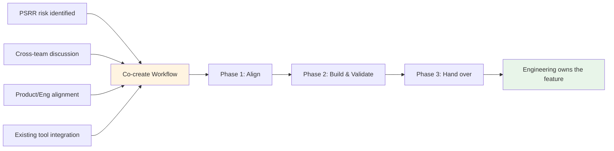

## 概要

Product Security Engineering (ProdSecEng) は、Product と Engineering と直接協働し、セキュリティ機能を GitLab 製品へ届けます。共創ワークフローは、これを実現する方法です。ProdSecEng が開発作業を担い、完成した機能は長期的な所有権のために Engineering チームへ引き継がれます。

このプロセスは、[Security Interlock](/handbook/security/product-security/security-platforms-architecture/security-interlock/) イニシアチブを支援します。Product Security は、高リスクの問題に対処するために必要な製品変更や機能をしばしば特定します。その作業を、すでにロードマップが埋まっている Engineering チームへ渡すのではなく、ProdSecEng が Product と Engineering と整合を保つ専任のセキュリティエンジニアリング体制を提供します。これにより、私たちは作業を届け、GitLab が製品を進めるべき方向に適合するようにできます。

> **移行に関する注記（2026 年 7 月 1 日発効）**
>
> 2026 年 7 月より前、このページではカスタムセキュリティツールのライフサイクル全体を扱う 4 つの相互接続されたワークフロー、つまり Intake、Maintenance、Co-create、Transition & Sunset を説明していました。GitLab の Act 2 operating model 変更の一環として、ProdSecEng のミッションは製品コントリビューションを直接出荷することに集中するよう移行しました。現在、共創ワークフローが主要なプロセスです。
>
> Intake および Maintenance ワークフローは、新しい作業を受け付けていません。既存のカスタムツールに関するコミットメントは移行中です。移行計画は確定されつつあり、[内部ハンドブックのツールインベントリ](https://internal.gitlab.com/handbook/security/product_security/product_security_engineering/)（GitLab チームメンバーのみアクセス可能）に文書化されています。移行中の参照用として、レガシーワークフローのドキュメントは以下の[既存ツールのワークフロー](#existing-tooling-workflows)セクションに保持されています。

## 共創ワークフロー

### 共創が始まるきっかけ

共創作業は、複数の場所から始まる可能性があります。

1. **PSRR リスク**: [Product Security Risk Register](/handbook/security/product-security/security-platforms-architecture/risk-register/) 内のリスクが、製品ソリューションを必要とするものとして特定される。
1. **チーム横断の議論**: ProdSec チームが製品機能で対処できるギャップを特定し、ProdSecEng と協働して作業範囲を定める。
1. **Product と Engineering の整合**: 共同計画によって、製品ロードマップに適合するセキュリティ機能が明らかになり、ProdSecEng が開発作業を引き受ける。
1. **既存ツールの統合**: 内部ツールの今後の道筋カテゴリが **Integrate** に設定され（既存ツールセクションの[今後の道筋カテゴリ](#path-forward-categories)を参照）、そのツールの機能が製品へ組み込まれている。

機能が所有する Engineering チームへ引き継がれると、共創は完了です。継続中の統合作業（複数の機能を持つツールなど）では、より広範な移行が続いている間に、個別の共創サイクルが完了する場合があります。

### プロセス概要

共創は 3 つのフェーズに従います。

1. **[Product と Engineering との整合](#phase-1-align-with-product-and-engineering)** — 何を構築するか、製品にどう適合するか、誰が関与するかについて合意します。
1. **[構築と検証](#phase-2-build-and-validate)** — 機能を開発し、テストし、適切な場合は Customer Zero として内部ユーザーで検証します。
1. **[Engineering への引き継ぎ](#phase-3-hand-over-to-engineering)** — 機能の所有権を、長期的にメンテナンスする Engineering チームへ移管します。

### フェーズ 1: Product と Engineering との整合 {#phase-1-align-with-product-and-engineering}

開発作業を始める前に、ProdSecEng はアプローチと期待される成果について Product および Engineering と整合を取ります。この整合は重要です。ProdSecEng はこれらの機能を長期的に所有しないため、所有チームは何を構築するのか、それが製品にどう適合するのかについて合意しなければなりません。

**主な活動:**

- 関連する Product Manager と関わり、ユースケースを検証し、製品適合を確認します。作業が PSRR エントリやチーム横断の議論に由来する場合は、そのコンテキストを出発点として使用します。
- 関連する Engineering Manager と関わり、技術的アプローチを検証し、チームがレビューと最終的な所有権を支援できることを確認します。
- 重複する既存または計画中の作業がないか、[R&D Interlock roadmap](/handbook/product-development/how-we-work/r-and-d-interlock/) を確認します。すでにコミットメントがある場合、ProdSecEng は別個の作業を提案するのではなく、それらの取り組みに貢献できます。
- 機能をフィーチャーフラグの背後で出荷するか、PoC フェーズを経るか、一般提供を直接目指すかを含め、スコープについて合意します。
- ロールアウトアプローチと、ロールアウト期間中のインシデントオーナーシップについて合意します（フェーズ 2 の[ロールアウトとインシデントオーナーシップ](#rollout-and-incident-ownership)を参照）。

**整合内容の記録**

整合内容は共創エピックに文書化するべきです。ProdSecEng は、PM または EM に対し、日付を含めて、スコープとアプローチについて整合したことを明示するコメントをエピックに残すよう依頼するべきです。これにより、後で整合内容が問われた場合に明確な監査証跡が残ります。開発中にスコープが変わる場合は、同じ方法で再度整合を取り、文書化するべきです。

**成果物**

1. 作業計画、リスク、依存関係、ステークホルダー（RACI 付き）を含む共創エピックが作成されている
1. PM および / または EM との整合が確認され、エピックに文書化されている
1. 開発作業用の Issue が作成またはリンクされている

### フェーズ 2: 構築と検証 {#phase-2-build-and-validate}

#### 事前把握

開発を始める前に、チームは作業対象となるコードベースを理解する時間を投資するべきです。既存の内部ツールを統合する作業を含む場合、チームはそのツールが現在どのように問題を解決しているかも理解するべきです。これはタイムボックス化し、作業項目として追跡することで、開発中に情報に基づく判断ができるようにするべきです。例として、[この過去の作業項目](https://gitlab.com/gitlab-com/gl-security/product-security/product-security-engineering/product-security-engineering-team/-/work_items/367)を使用できます。

#### 開発

ProdSecEng は、[GitLab の標準的な開発プロセス](https://docs.gitlab.com/development/)に従って機能を開発します。このフェーズはイテレーション形式になる場合があります。フェーズ 1 で合意した内容に応じて、本番対応の機能の前に、PoC またはフィーチャーフラグ付き実装が来ることがあります。

**主な活動**

1. テストとドキュメントを含めて機能を実装します
1. マージリクエストを提出し、所有する Engineering チームとコードレビューでイテレーションします
1. パフォーマンスを検証し、機能が品質基準を満たしていることを確認します
1. 最終的に機能を所有するチームと知識を共有します（深掘りセッション、ドキュメント）
1. 適切な場合は [Customer Zero](/handbook/product/product-processes/customer-0/) として内部ユーザーで機能を検証し、その機能がワークフローに関連する ProdSec チームからフィードバックを収集します
1. [ADR テンプレート](https://gitlab.com/gitlab-com/gl-security/product-security/product-security-engineering/product-security-engineering-team/-/blob/main/development_templates/adr_template.md)を使用して、重要な設計判断を記録します

#### ロールアウトとインシデントオーナーシップ {#rollout-and-incident-ownership}

開発作業が段階的なロールアウト（フィーチャーフラグ、段階的アクセス）を伴う場合、ロールアウト計画はフェーズ 1 で合意し、共創エピックに文書化するべきです。

ロールアウト中:

- **ProdSecEng はロールアウト判断の DRI です**。発生した問題に基づいてロールアウトを一時停止、リバート、または調整するかどうかを含みます。より広範なリスクや懸念を考慮する必要がある場合、ProdSecEng は所有する Engineering チームに相談するべきです。
- **ProdSecEng はこの機能に関するインシデントの SME です**。[GitLab のインシデントプロセス](/handbook/engineering/infrastructure-platforms/incident-management/)の一環として、SME エスカレーションに対応します。所有する Engineering チームには相談し、潜在的な知識ギャップを踏まえると、複雑な問題に対処するために追加の支援、リソース、コンテキストが必要になる場合があることを理解しておくべきです。所有する Engineering チームは、自分たちの専門知識やキャパシティにより迅速な解決が可能な場合、明示的にインシデントオーナーシップを引き継ぐことがあります。

これらの責任はフェーズ 1 で事前に明確化し、共創エピックに文書化するべきです。

#### 整合の維持

共創エピックで、ステークホルダーに対して定期的な（通常は週次の）ステータス更新を提供します。これにより、Product と Engineering が進捗を把握し続け、GitLab の優先事項や計画が変わった場合でも、それが作業に影響する前に ProdSecEng が把握できます。スコープやアプローチを変える必要がある場合は、PM または EM と再度整合を取り、それをエピックに文書化してください。

**成果物**

1. 機能が出荷されている（合意に応じて、フィーチャーフラグの背後または一般提供）
1. ドキュメントが公開されている
1. パフォーマンスと品質が検証されている
1. Customer Zero フィードバックが収集され、対応されている（該当する場合）

### フェーズ 3: Engineering への引き継ぎ {#phase-3-hand-over-to-engineering}

ProdSecEng は、長期的に機能を所有する Engineering チームへ機能を引き継ぎます。引き継ぎのタイミングとスコープは、フェーズ 1 で合意した内容によって異なります。引き継ぎは、フィーチャーフラグが削除され機能が一般提供された後に行われる場合もあれば、所有チームが引き継ぐ準備ができていれば、より早く行われる場合もあります。

製品機能が既存の内部ツールの機能を置き換える場合、そのツールの[移行と廃止ワークフロー](#transition-and-sunset-workflow)が共創中に始まることがあります。これらのケースでは、共創と移行は連続的ではなく並行して進みます。内部ツールの完全な廃止は、複数の共創サイクルが完了するまで起きない場合があります。

**主な活動:**

1. 機能が長期的な所有権に関する所有 Engineering チームの基準を満たしていることを、そのチームと確認します
1. 機能がフィーチャーフラグの背後で出荷された場合、フラグ削除と一般提供の計画について所有チームと協働します
1. 残っているコンテキストを移管します。ドキュメント、ADR、既知の Issue、パフォーマンスデータなどです
1. 該当する場合、機能が製品へ統合されたことを反映するため、[ツールインベントリ](https://internal.gitlab.com/handbook/security/product_security/product_security_engineering/)を更新します

**成果物**

1. 機能が Engineering チームによって所有され、メンテナンスされている
1. 該当する場合、ProdSecEng の内部ツールが更新されている、または[移行と廃止](#transition-and-sunset-workflow)の予定に入っている
1. ツールインベントリが更新されている（該当する場合）

### 主な考慮事項

1. **機能の同等性**: 製品機能は、内部ツールの機能を 100% 一致させる必要はありません（該当する場合）。フェーズ 1 で「十分に良い」とは何かについて合意し、必要に応じてフェーズ 2 で再検討します。
1. **イテレーションによる提供**: 共創では、機能が一般提供の準備が整うまでに、PoC、フィーチャーフラグ付き提供、Customer Zero テスト、再整合を複数回行う場合があります。これは想定内です。
1. **整合は継続的なものです**: 整合は一度きりのゲートではありません。GitLab の優先事項は変わり得るため、定期的なステータス更新とステークホルダーとのコミュニケーションにより、ProdSecEng の作業を Product と Engineering の方向性に沿わせ続けます。
1. **ProdSecEng は製品機能を所有しません**: 共創を通じて構築されたすべての機能は Engineering チームへ引き継がれます。早期の整合と所有チームとの継続的なコミュニケーションによって、これが機能します。

---

## 既存ツールのワークフロー {#existing-tooling-workflows}

以下のワークフローは、ProdSecEng の既存のカスタムツールに関するコミットメントに適用されます。2026 年 7 月 1 日時点で、新しいカスタムツールリクエストは受け付けていません。これらのワークフローは、移行期間中の参照用としてここに保持されています。チームの現在のミッションについては、[ProdSecEng team charter](/handbook/security/product-security/security-platforms-architecture/product-security-engineering/)を参照してください。

### インテークワークフロー

インテークワークフローは、チームが ProdSecEng の支援を求めるツールや自動化作業のエントリーポイントでした。完全に新しいツールリクエストと既存ツールの引き継ぎを対象としていました。ProdSecEng は各リクエストを評価し、構築、延期、リダイレクト、廃止のいずれにするかを判断し、その決定を記録しました。

> **このワークフローは新しいリクエストを受け付けていません。** 既存ツールについて質問があるチームは、Slack の [`#security_help`](https://gitlab.enterprise.slack.com/archives/C094L6F5D2A) で連絡してください。

### メンテナンスとインベントリ優先順位付けワークフロー

#### 目的

メンテナンスワークフローは、インテークが完了した時点から、ツールが移行と廃止ワークフローに入るまで、ProdSecEng がメンテナンスするツールに対して継続的に実行されていました。

#### 主な活動

アクティブな間、メンテナンスワークフローは次のことを対象としていました。

1. **Issue への対応**: 定義された SLO/RTO 内で対応する
1. **ツールの運用維持**: 稼働状況を監視し、障害に対応し、セキュリティパッチを適用する
1. **作業の優先順位付け**: 重要度、製品準備状況、戦略的整合性に基づき、どのツールを共創へ移すべきかを評価する
1. **保守性の向上**: ツールを段階的に [Good/Better/Best standard](https://internal.gitlab.com/handbook/security/product_security/product_security_engineering/automation_best_practices/)（GitLab チームメンバーのみアクセス可能）へ近づける
1. **インベントリのレビューと再評価**: ニーズが変わったツールがリソースを消費し続けないようにする

#### 今後の道筋カテゴリ {#path-forward-categories}

ツールは次のいずれかに分類されていました。これらのカテゴリは、移行中のツールについて[内部ハンドブックのツールインベントリ](https://internal.gitlab.com/handbook/security/product_security/product_security_engineering/)で引き続き参照されています。

- **Integrate**: 明確な製品適合、顧客価値、運用モデル整合があります。エピックが存在し、今後のマイルストーンが適用されています。
- **Maintain (KTLO)**: ツールで文書化された SLO & RTO を満たしながら運用を維持します。機能リクエストは受け付けません。コントリビューションのピアレビューは受け付けます。
- **Improve, then Integrate** または **Improve, then Maintain**: ツールを別のカテゴリへ移すために作業が必要です。機能リクエストは積極的にトリアージされ、バックログに入れられるかクローズされます。
- **Sunset**: 移行と廃止ワークフローが進行中です。削除されるまでは「KTLO」として扱われます。
- **Redirect**: 所有権を別のチームへ移管しなければなりません。機能リクエストは受け付けません。SLO & RTO は「Low」を上限とします。

#### SLO/RTO コミットメント

ProdSecEng は、ツールの重要度に基づいて異なるレベルのサポートを提供していました。これらのコミットメントは、移行中にメンテナンスされているツールについて引き続き参照されています。

| 重要度 | SLO (Response Time) | RTO (Recovery Time) | 例 |
|-------------|---------------------|---------------------|---------|
| **Critical** | < 4 営業時間 | < 12 営業時間 | セキュリティリリースまたはインシデント対応をブロックするツール |
| **High** | < 1 営業日 | < 2 営業日 | 日常的なセキュリティ運用を支援するツール |
| **Medium** | < 3 営業日 | < 2 週間 | 週次または月次で使われるツール |
| **Low** | Best effort | Best effort | 実験的またはほとんど使われないツール |

注記:

- Service Level Objective (SLO): 開いている Issue をトリアージして割り当てることを目指す時間。Recovery Time Objective (RTO): ツールを機能する状態へ戻すことを目指す時間。どちらの場合も、Issue が開かれた時点から時間を計測します。
- これらは目標コミットメントであり、チームのキャパシティや競合する優先事項によって変わる場合があります。
- これらの時間は、ツールの正常な機能を妨げる Issue にのみ適用されます。
- 「営業時間」は ProdSecEng チームメンバーがオンラインである時間です。チームは通常、週末を除き、すべてのタイムゾーンで 9–5 の時間帯をカバーしています。ProdSecEng は「on-call」ではありません。
- 私たちは Recovery Point Objective (RPO) にはコミットしません。

### 移行と廃止ワークフロー {#transition-and-sunset-workflow}

#### 目的

移行と廃止ワークフローは、内部ユーザーを内部ツールから製品機能へ移行すること、および不要になった内部ツールを廃止することを管理します。

#### 移行と廃止を使うタイミング

Act 2 operating model 変更の一環として、ProdSecEng のインベントリにあるすべての既存ツールは、移行または廃止されます。

#### 主な活動

[新しい Sunset Tooling Issue を開く](https://gitlab.com/gitlab-com/gl-security/product-security/product-security-engineering/product-security-engineering-team/-/issues/new?description_template=sunset_tooling)と、次の活動を進めるためのガイドが表示されます。

1. 関連チームと移行または廃止の判断を検証します
1. 代替ソリューションを特定します。ユーザーが代わりに何を使うべきか（製品機能、別のツールなど）を文書化します
1. ユーザーを製品機能へ移行する場合は、ProdSec チームと協働してワークフローを移行し、機能の同等性を検証します
1. タイムラインを伝達します。内部ツールがいつ廃止されるかについて明確に通知します
1. インフラを廃止します。内部ツールのインフラを停止し、リポジトリをアーカイブし、ドキュメントを更新します

#### 直接廃止の代替案: 移管

ProdSecEng がツールを今後メンテナンスせず廃止する予定の場合でも、別のチームが代わりに所有しメンテナンスする意思を持つことがあります。別の所有者が見つかった場合は、[ツール移管 Issue](https://gitlab.com/gitlab-com/gl-security/product-security/product-security-engineering/product-security-engineering-team/-/issues/new?description_template=transfer_tooling)を開きます。

## 関連リソース

- [Product Security Engineering](/handbook/security/product-security/security-platforms-architecture/product-security-engineering/)
- [Security Interlock](/handbook/security/product-security/security-platforms-architecture/security-interlock/)
