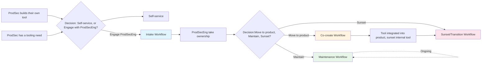

## 概要

Product Security Engineering (ProdSecEng) は Product Security (ProdSec) 内の自動化とツールの管理人として機能し、内部ツールを GitLab 製品へと導く使命を担っています。

このページでは、ProdSecEng がセキュリティツールと自動化のライフサイクルを効果的に管理するための、4 つの相互接続されたワークフローを説明します。

これらのワークフローは [Security Interlock](/handbook/security/product-security/security-platforms-architecture/security-interlock/) イニシアチブをサポートします。Security チームが GitLab 製品のギャップに対応するため独自のツールを構築し、私たちのような他の顧客に明確に適合する場合、ProdSecEng はそれらの内部ツールを製品機能に導きます。これにより、Security 部門は私たち自身の製品をドッグフードでき、GitLab は顧客のセキュリティチームをよりよくサポートできるようになります。

チームは ProdSecEng と関わる代わりに、自分で直接製品に貢献することも常に歓迎されています。ただし、チームがサポートを必要とする場合、ProdSecEng は実証されたフレームワークと専用キャパシティを提供して、必要に応じて支援します。

## 4 つのワークフロー

ProdSecEng は、セキュリティツールと自動化の完全なライフサイクルを管理するために連携する 4 つの補完的なワークフローを運営しています。

| # | ワークフロー | 目的 |
|---|----------|---------|
| 1 | **[インテーク](#intake-workflow)** | ProdSecEng がツール／自動化作業をどのように受領、評価、受け入れるか |
| 2 | **[メンテナンスとインベントリ優先順位付け](#maintenance-and-inventory-prioritisation-workflow)** | 製品統合または廃止までの既存ツールの継続的なメンテナンス |
| 3 | **[共創](#co-create-workflow)** | Product と Engineering との直接の協業; 製品検証 → 製品統合 |
| 4 | **[移行と廃止](#transition-and-sunset-workflow)** | 内部ユーザーを製品機能に移行し、内部ツールを廃止 |

### ワークフローのつながり

## インテークワークフロー {#intake-workflow}

### 目的

インテークワークフローは、チームが ProdSecEng の支援を希望するツールおよび自動化作業 (リクエスト、アイデア、既存ツールの引き継ぎを含む) のエントリーポイントです。これにより、所有権をコミットする前にリクエストとツール移管を評価する明確で繰り返し可能なプロセスを確保し、私たちの顧客 (ProdSec) は今後のメンテナンスに対する明確な期待値を持つことができます。

このワークフローの意図は、技術的アセスメント (ユーザーニーズ、保守性、アーキテクチャ、テックスタックを理解するため) と戦略的ビジネスアセスメント (そのニーズが GitLab 製品で満たせるかとどう満たせるかを理解するため) を完了させることです。

### インテークを使うタイミング

以下の場合にインテークワークフローを使用します。

- ProdSec チームが新しいツールまたは自動化を構築する必要があり、サポートが必要なとき
- 既存のツールまたは自動化が所有権のために ProdSecEng に移管されるとき
- チームが構築前に、ツールアイデアが製品機能と整合するかを検証したいとき

### 関わり方

1. **新規リクエストの場合:** [新しいツール／自動化リクエストを開く](https://gitlab.com/gitlab-com/gl-security/product-security/product-security-engineering/product-security-engineering-team/-/issues/new?description_template=new_tooling_automation_request)
1. **所有権移管の場合:** [引き継ぎリクエストを開く](https://gitlab.com/gitlab-com/gl-security/product-security/product-security-engineering/product-security-engineering-team/-/issues/new?description_template=existing_tooling_automation_handover)
1. **その他のリクエストの場合:** [リクエストを開く](https://gitlab.com/gitlab-com/gl-security/product-security/product-security-engineering/product-security-engineering-team/-/issues/new)
1. **一般的な質問の場合:** `#security-capabilities-engineering` Slack チャンネルで連絡し、`@product-security-engineering` をタグ付け

### インテークパス

2 つの異なるインテークパスがあり、それぞれに異なる評価基準があります。

#### 1. 新規ツール／自動化リクエスト

**使用するとき:** チームがニーズを特定したがソリューションをまだ構築していないとき、または構築する前にツールアイデアが製品機能と整合するかを検証したいとき。

このインテークパスは、問題を理解し、既存のソリューション (GitLab 内またはその他) でニーズを満たせるかを評価し、最良の道筋を決定することに焦点を当てます。新しいツールを構築するか、製品開発を待つか、既存のソリューションにリダイレクトするかを判断します。

##### プロセス概要

新規インテークは以下のステップに従います。

1. **[問題とニーズを理解する](#step-1-understand-the-problem-and-need)** — どのような問題を解決する必要があり、誰が影響を受け、何がすでに探索されたか?
1. **[今後の道筋を決定する](#step-2-determine-the-path-forward)** — 構築する、待つ、リダイレクトする、または延期するかどうか? 構築する場合、製品に直接入れるべきか、最初に内部ツールとして構築するべきか?
1. **[内部ツールを計画する (該当する場合)](#step-3-plan-internal-tooling-if-applicable)** — 内部ツールのみ: 設計の判断は何か、ProdSecEng がコミットできるメンテナンスのレベルは?
1. **[判断を記録し、次のステップを計画する](#step-4-record-decision-and-plan-next-steps)** — インテーク判断を最終化し、作業を計画する。

リクエストチームは、[新規リクエスト Work Item テンプレート](https://gitlab.com/gitlab-com/gl-security/product-security/product-security-engineering/product-security-engineering-team/-/issues/new?description_template=new_tooling_automation_request) を完成させてプロセスを開始します。これにより ProdSecEng は各ステップを進めるのに必要な情報を提供します。判断に至るためには、ProdSecEng とリクエストチームの間でコラボレーションが必要です。

##### ステップ 1: 問題とニーズを理解する {#step-1-understand-the-problem-and-need}

リクエストチームは、ProdSecEng が解決される問題と既に探索されたものを理解するために十分な情報を提供する必要があります。これは [新規リクエスト Work Item テンプレート](https://gitlab.com/gitlab-com/gl-security/product-security/product-security-engineering/product-security-engineering-team/-/issues/new?description_template=new_tooling_automation_request) を通してキャプチャされ、問題ステートメント、ユーザー要件、探索された代替案、ビジネスケースをカバーします。

議論と判断は Work Item 内でキャプチャされます。

##### ステップ 2: 今後の道筋を決定する {#step-2-determine-the-path-forward}

構築を決定する前に、ProdSecEng は既存または計画中の製品機能でそのニーズを満たせるかを評価します。これにより、すでに進行中の製品開発と重複または競合する内部ツールの構築を防ぎます。

このステップで考えられる結果は次のとおりです: **製品に直接構築する**、**最初に内部ツールとして構築する**、来たる製品開発を **待つ**、既存ソリューションに **リダイレクトする**、キャパシティのために **延期する**、またはオプションの ProdSecEng アドバイザリーサポートで **リクエストチームがセルフサーブする**。

結果が内部ツールとして構築することなら、設計と保守性の判断のためにステップ 3 に進みます。それ以外の結果については、直接ステップ 4 に進みます。

このステップの終わりまでに、以下が決定されます。

| 判断 | 根拠 | 説明 |
|----------|-------|-------------|
| **製品に構築 vs. 内部に構築 vs. 待つ vs. リダイレクト** | Work Item テンプレートの応答にマップ - 製品適合、ロードマップとの整合、ニーズの緊急性に基づく | ProdSecEng がソリューションを今構築すべきか、来たる製品開発を待つべきか、既存のツールや購入にリダイレクトするべきか |
| **今後の道筋カテゴリ** (内部に構築する場合) | Work Item テンプレートの応答にマップ - 製品適合、顧客価値、運用モデル整合に基づく | 内部に構築すると決めた場合、製品への将来の道筋は何か (なぜ延期しているか)。Maintenance ワークフローの [今後の道筋カテゴリ](#path-forward-categories) を参照 |
| **共創インプット** | リクエストでキャプチャされたユースケースと要件に基づく | 製品統合を開始する場合に考慮すべき有用な情報 |

##### ステップ 3: 内部ツールを計画する (該当する場合) {#step-3-plan-internal-tooling-if-applicable}

このステップは、ステップ 2 の結果が **内部ツールとして構築する** 場合にのみ適用されます。それ以外の結果はすべてステップ 4 に直接スキップします。

ProdSecEng は、ツールが必要とするサポートのレベルを評価し、[自動化ガイダンスのための Good/Better/Best プラクティス](https://internal.gitlab.com/handbook/security/product_security/product_security_engineering/automation_best_practices/) (GitLab チームメンバーのみアクセス可能) に基づいて重要な設計判断を事前に行います。

このステップの終わりまでに、以下が決定されます。

| 判断 | 根拠 | 説明 |
|----------|-------|-------------|
| **重要度** | Work Item テンプレートの応答にマップ | ソリューションがチームとビジネスにとってどれだけ重要か。Maintenance ワークフローの [優先順位付けフレームワーク](#prioritization-framework) を参照 |
| **SLO/RTO** | 期待される重要度に基づく | ツールが運用可能になった時点で ProdSecEng がコミットする応答時間 (SLO) と回復時間 (RTO)。Maintenance ワークフローの [SLO/RTO コミットメント](#slorto-commitments) を参照 |
| **設計判断** | [自動化ベストプラクティス](https://internal.gitlab.com/handbook/security/product_security/product_security_engineering/automation_best_practices/) とリクエストからの要件に基づく | 言語選択、デプロイメントモデル、データ処理、セキュリティ考慮事項を含む主要な技術判断。判断は [ADR テンプレート](https://gitlab.com/gitlab-com/gl-security/product-security/product-security-engineering/product-security-engineering-team/-/blob/main/development_templates/adr_template.md) を使用して記録すべき |

##### ステップ 4: 判断を記録し、次のステップを計画する {#step-4-record-decision-and-plan-next-steps}

アセスメントが完了したら、ProdSecEng はインテーク判断を最終化して記録します。このステップにより、リクエストが正式に追跡され、すべてのステークホルダーが次に何が起こるかについて共通の理解を持つことが保証されます。

インテーク判断は次のいずれかになる可能性があります。

| 判断 | 誰が決定するか | 注記 |
|----------|-------------|-------|
| 製品に直接構築する | ProdSecEng、Product と Engineering との整合付き | [共創ワークフロー](#co-create-workflow) に移行; 内部ツールフェーズなし |
| 内部ツールとして構築する | ProdSecEng | 設計判断、重要度、SLO/RTO が文書化され; ツールが運用可能になったら Maintenance ワークフローに入る |
| 製品開発を待つ | ProdSecEng、リクエストチームの合意付き | ニーズが文書化され; ProdSecEng は製品ロードマップの進捗を監視し、タイムラインが変わった場合に再訪する |
| 既存ソリューションにリダイレクトする | ProdSecEng | ProdSecEng はリクエストチームが既存ソリューションを採用するのを助けるかもしれない; 新しいツールは構築されない |
| キャパシティのために延期する | ProdSecEng、リーダーシップとステークホルダーの認識付き | リクエストは有効だが今は対応できない; 文書化され、優先順位付けの準備ができたとき、または状況が変化したときに再アセスされる |
| リクエストチームがセルフサーブする | リクエストチーム、ProdSecEng のガイダンス付き | リクエストチームが自身で構築する、オプションで ProdSecEng アドバイザリーサポート付き |

このステップの終わりまでに、以下が完了します。

| アクション | 説明 |
|--------|-------------|
| **インテーク判断の記録** | インテークの結果が、判断と任意の条件を含めて Work Item に文書化される |
| **インベントリへのツール追加 (内部ツール構築の場合)** | ProdSecEng が内部ツールを構築する場合、それは重要度、今後の道筋カテゴリ、計画された設計判断とともに彼らの [ツールインベントリ](https://internal.gitlab.com/handbook/security/product_security/product_security_engineering/) に追加される |
| **作業の計画** | 作業は Work Item にスコープされ、来たるマイルストーンのために優先順位付けされる - 内部ツールまたは共創貢献として |
| **ステークホルダーへの通知** | リクエストチームと関連するステークホルダーに判断と次のステップが知らされる |

内部ツールとして構築された場合、ツールは運用可能になったら [Maintenance ワークフロー](#maintenance-and-inventory-prioritisation-workflow) に入ります。製品に直接構築された場合、作業は [共創ワークフロー](#co-create-workflow) に従います。

#### 2. 既存ツール／所有権移管

**使用するとき:** ツールが既に存在し、所有チームが ProdSecEng に移管したいとき。

このインテークパスは、ProdSecEng が継承するものを理解し、ツールが最低限の開発標準バーを満たすかを評価し、今後の道筋を決定することに焦点を当てます。

##### プロセス概要

所有権移管インテークは以下のステップに従います。

1. **[ツールとそのコンテキストを理解する](#step-1-understand-the-tool-and-its-context)** — このツールは何をして、誰が使用し、どのように動作するか?
1. **[短期保守性をアセスする](#step-2-assess-short-term-maintainability)** — ProdSecEng はこのツールを現実的にメンテナンスできるか、どのレベルで?
1. **[製品への道筋を理解する](#step-3-understand-the-path-to-product)** — これは GitLab 製品機能になる可能性があるか?
1. **[判断を記録しインベントリに追加する](#step-4-record-decision-and-add-to-inventory)** — インテーク判断を最終化し、ProdSecEng のツールインベントリにツールを追加する。

移管チームは [引き継ぎ Work Item テンプレート](https://gitlab.com/gitlab-com/gl-security/product-security/product-security-engineering/product-security-engineering-team/-/issues/new?description_template=existing_tooling_automation_handover) を完成させてプロセスを開始します。これにより ProdSecEng は各ステップを進めるのに必要な情報を提供します。判断に至るためには、ProdSecEng と移管チームの間でコラボレーションが必要です。

##### ステップ 1: ツールとそのコンテキストを理解する {#step-1-understand-the-tool-and-its-context}

移管チームは、ProdSecEng が解決される問題、ツールの動作方法、そして誰が依存しているかを理解するために十分な情報を提供する必要があります。これは [引き継ぎ Work Item テンプレート](https://gitlab.com/gitlab-com/gl-security/product-security/product-security-engineering/product-security-engineering-team/-/issues/new?description_template=existing_tooling_automation_handover) を通してキャプチャされ、顧客の問題とビジネスプロセス、現在の機能とユーザー、技術とアーキテクチャの理解をカバーします。アーキテクチャ判断記録 (ADR) がまだ存在しない場合、移管チームは [ADR テンプレート](https://gitlab.com/gitlab-com/gl-security/product-security/product-security-engineering/product-security-engineering-team/-/blob/main/development_templates/adr_template.md) を使用して重要な判断を事後的に文書化すべきです。

ステップでの議論と判断はこの Work Item 内で議論されます。ツールが ProdSecEng に移管された場合、詳細と判断は彼らの [プロジェクトインベントリ](https://internal.gitlab.com/handbook/security/product_security/product_security_engineering/) (GitLab チームメンバーのみアクセス可能) に記録されます。

##### ステップ 2: 短期保守性をアセスする {#step-2-assess-short-term-maintainability}

ProdSecEng はツールが短期または近期に必要とするサポートのレベルと、チームが現実的にメンテナンスにコミットできるかを理解する必要があります。このアセスメントは、ツールの重要度評価と関連する SLO/RTO を決定します (Maintenance ワークフローの [SLO/RTO コミットメント](#slorto-commitments) 参照)。

このステップの終わりまでに、以下が決定されます。

| 判断 | 根拠 | 説明 |
|----------|-------|-------------|
| **重要度** | 引き継ぎチェックリストの応答にマップ | このツールはチームとビジネスにとってどれだけ重要か? 利用不可能になった場合の影響は? Maintenance ワークフローの [優先順位付けフレームワーク](#prioritization-framework) を参照 |
| **SLO/RTO** | ツールの重要度に基づく | このツールに対して ProdSecEng がコミットする応答時間 (SLO) と回復時間 (RTO)。Maintenance ワークフローの [SLO/RTO コミットメント](#slorto-commitments) を参照 |
| **現状 vs. 最低限のバー／健全性** | [自動化ガイダンスのための Good/Better/Best プラクティス](https://internal.gitlab.com/handbook/security/product_security/product_security_engineering/automation_best_practices/) (GitLab チームメンバーのみアクセス可能) に基づく | ツールがモデルに対してどう測定され、どのような改善が必要か |

一般的に、ツールが満たす基準が多いほど、ProdSecEng が提供できる SLO/RTO コミットメントは強くなります。

##### ステップ 3: 製品への道筋を理解する {#step-3-understand-the-path-to-product}

インテーク時にも、ProdSecEng はツールの機能が GitLab 製品の一部になり得るかとどうなり得るかを理解するための開始情報をキャプチャします。この情報は、ツールが統合のために選択された場合に [共創ワークフロー](#co-create-workflow) に直接フィードされます。

このステップの終わりまでに、以下が決定されます。

| 判断 | 根拠 | 説明 |
|----------|-------|-------------|
| **今後の道筋カテゴリ** | 引き継ぎチェックリストにマップ - 製品適合、顧客価値、Product と Engineering ロードマップとの運用モデル整合に基づく | 顧客価値提案がどれだけ強いか。Maintenance ワークフローの [今後の道筋カテゴリ](#path-forward-categories) を参照 |
| **共創インプット** | 引き継ぎチェックリストでキャプチャされたアーキテクチャ判断とユースケースに基づく | 統合を開始する場合に考慮すべき有用な情報 (ADR、以前に提起された Work Item や PoC など) |

##### ステップ 4: 判断を記録しインベントリに追加する {#step-4-record-decision-and-add-to-inventory}

アセスメントが完了したら、ProdSecEng はインテーク判断を最終化して記録します。このステップにより、ツールが正式に追跡され、すべてのステークホルダーが行われたコミットメントについて共通の理解を持つことが保証されます。

インテーク判断は次のいずれかになる可能性があります。

| 判断 | 誰が決定するか | 注記 |
|----------|-------------|-------|
| 移管を受け入れる — ツールが「Good」以上を満たす | ProdSecEng | 標準的なインテーク結果; SLO/RTO は重要度に基づく |
| 改善計画付きで移管を受け入れる | ProdSecEng | ギャップが Work Item に文書化され優先順位付けされる; 改善が提供されるまで SLO/RTO は低い |
| ベストエフォートサポート — ギャップが不明確または重大 | ProdSecEng、リーダーシップとステークホルダーの認識付き | ProdSecEng は代替ソリューションを再エンジニアリングするかどうかを評価しながらベストエフォートサポートを提供する |
| 既存ツールのメンテナンスの代わりに代替ソリューションを提案する | ProdSecEng、移管チームとリーダーシップの合意付き | ProdSecEng はチームと協力して、より良い保守性と製品適合で同じ問題に対処する新しいソリューションをスコープする |
| 移管に対応するため ProdSecEng の既存コミットメントを再優先順位付けする | ProdSec リーダーシップ | リーダーシップは既存の作業を再優先順位付けして場所を作るかもしれない; 他のコミットメントへの影響が文書化される |

このステップの終わりまでに、以下が完了します。

| アクション | 説明 |
|--------|-------------|
| **インテーク判断の記録** | インテークの結果が、任意の条件 (例: 改善計画、ベストエフォートサポート) を含めて Work Item に文書化される |
| **インベントリへのツール追加** | ツールが重要度、今後の道筋カテゴリ、健全性とともに ProdSecEng の [ツールインベントリ](https://internal.gitlab.com/handbook/security/product_security/product_security_engineering/) に追加される |
| **改善作業の作成 (該当する場合)** | ツールが「Good」未満で対応可能なギャップがある場合、特定の改善が Work Item に文書化されて優先順位付けされる |
| **ステークホルダーへの通知とドキュメント更新** | 移管チームと関連するステークホルダーに判断と次のステップが知らされ、README やその他のドキュメントが所有権変更を反映するように更新される |

その後、ツールは割り当てられた今後の道筋カテゴリに基づいて [Maintenance ワークフロー](#maintenance-and-inventory-prioritisation-workflow) に入ります。

## メンテナンスとインベントリ優先順位付けワークフロー {#maintenance-and-inventory-prioritisation-workflow}

### 目的

メンテナンスワークフローは、インテーク後、廃止前に継続的に動く基盤的なループです。これにより、ProdSecEng は製品統合に向けて作業を優先順位付けしながら、既存のツールと自動化を効果的にサポートできるようになります。

### メンテナンスが適用されるとき

メンテナンスは、インテークが完了した瞬間からツールが [移行と廃止ワークフロー](#transition-and-sunset-workflow) に入るまで、ProdSecEng がメンテナンスするすべてのツールと自動化に適用されます。

### 主要な活動

- **Issue への応答:** 定義された SLO/RTO 内でサポートを提供する
- **ツールの運用維持:** アップタイムを監視し、障害に対処し、セキュリティパッチを適用する
- **作業の優先順位付け:** どのツールが共創に移行すべきかを、重要度、製品の準備状況、戦略的整合に基づいて継続的に評価する
- **保守性の改善:** ツールを段階的に [Good/Better/Best 標準](https://internal.gitlab.com/handbook/security/product_security/product_security_engineering/automation_best_practices/) に引き上げる
- **キャパシティの報告:** チームのキャパシティ制約がツールを運用可能に保つ能力や段階的に改善する能力に影響を与える場合に報告する
- **インベントリのレビューと再評価:** これにより、ステークホルダーが代替ソリューションに移行した際に「ゾンビツール」がリソースを消費するのを防ぐ。

### 優先順位付けフレームワーク {#prioritization-framework}

ProdSecEng は、メンテナンス作業と共創移行を優先順位付けするために以下の基準を使用します。

| 基準 | 質問 |
|----------|-----------|
| **重要度** | このツールは ProdSec または GitLab のビジネスにとってどれだけ重要か? ダウンするとどうなるか? |
| **製品適合** | これは GitLab の製品ロードマップとどう整合するか? アクティブな Product/Engineering の関心はあるか? |
| **保守性** | このツールを運用可能に保つためにどれだけの労力が必要か? 保守不可能になるリスクがあるか? |
| **戦略的整合** | これは Security 部門または GitLab の優先順位をサポートするか? |
| **顧客価値** | 顧客は製品でこの機能から恩恵を受けるか? |

### 今後の道筋カテゴリ {#path-forward-categories}

ツールは以下の今後の道筋カテゴリのいずれかにカテゴリ分けされます。

- **Integrate:** 明確な製品適合、顧客価値、運用モデルの整合。Epic が存在し、来たるマイルストーンが適用される。
- **Maintain (KTLO):** ツールの文書化された SLO と RTO を満たしながら運用維持。機能リクエストは受け入れない。貢献のピアレビューは受け入れる。
- **Improve, then Integrate** または **Improve, then Maintain** ツールを別のカテゴリに移すために作業が必要な場合。機能リクエストは積極的にトリアージされ、バックログに置かれるかクローズされる。
- **Sunset:** 移行と廃止ワークフローを積極的に実施中。削除されるまで「KTLO」として扱われる。
- **Redirect:** 所有権を別のチームに移管する必要がある。機能リクエストは受け入れない。SLO と RTO は「Low」を上限とする。

### SLO/RTO コミットメント {#slorto-commitments}

ProdSecEng はツールの重要度に基づいて異なるレベルのサポートを提供します。

| 重要度 | SLO (応答時間) | RTO (回復時間) | 例 |
|-------------|---------------------|---------------------|---------|
| **Critical** | < 4 営業時間 | < 12 営業時間 | セキュリティリリースまたはインシデント対応をブロックするツール |
| **High** | < 1 営業日 | < 2 営業日 | 日常のセキュリティ運用をサポートするツール |
| **Medium** | < 3 営業日 | < 2 週間 | 週次または月次で使用されるツール |
| **Low** | ベストエフォート | ベストエフォート | 実験的またはまれに使用されるツール |

注:

- 定義:
  - サービスレベル目標 (SLO): オープンな Issue をトリアージしてアサインすることを目指す時間。
  - 回復時間目標 (RTO): ツールを機能性に戻すことを目指す時間。
  - 両方の場合とも、Issue が開かれたときにクロックがスタートします。
- これらは目標コミットメントであり、チームのキャパシティと競合する優先順位に基づいて変動する可能性があります。
- これらの時間は、ツールの適切な機能を妨げる Issue にのみ適用されます
- 「営業時間」は ProdSecEng チームメンバーがオンラインの時間です。チームは通常、週末を除くすべてのタイムゾーンで 9〜5 のカバレッジを持っています。ProdSecEng は「オンコール」ではありません。
- SLO や RTO の達成に繰り返し失敗することは、以下のいずれかのシグナルとして機能します。
  - メンテナンスと回復をしやすくするためにツールを「Improve」今後の道筋カテゴリに移行する、または
  - 現在の SLO と RTO が部門の優先順位と整合しない場合、その重要度を下方調整する。
- 私たちは目標復旧時点 (RPO) にコミットしません - 任意の量の「データ損失」は暗黙的に許容されます。

## 共創ワークフロー {#co-create-workflow}

### 目的

共創ワークフローは、ProdSecEng が Product と Engineering と協力して、内部セキュリティツール機能を GitLab 製品に統合する方法を定義します。ProdSecEng は開発作業に貢献し、完成した機能は長期所有権のために Engineering チームに引き継がれます。

このワークフローは [Security Interlock](/handbook/security/product-security/security-platforms-architecture/security-interlock/) イニシアチブの一部であり、ProdSec が [Customer 0](/handbook/product/product-processes/customer-0/) として行動し、より広範なリリース前に自身のユースケースのために製品機能を検証します。

### 共創が適用されるとき

1. ツールの今後の道筋カテゴリが [インテーク](#path-forward-categories) または [メンテナンス優先順位付け](#maintenance-and-inventory-prioritisation-workflow) 中に **Integrate** に設定されたとき、または
1. 新規リクエストの結果が **製品に直接構築する** であるとき ([インテークステップ 2](#step-2-determine-the-path-forward) から)

機能が所有 Engineering チームに引き継がれた時点で共創は完了します。継続的な統合の取り組み (例: マルチ機能ツール) の場合、より広い移行が続いている間に個別の共創サイクルが完了する可能性があります。

### プロセス概要

共創は 3 つのフェーズに従います。

1. **[Product と Engineering との整合](#phase-1-align-with-product-and-engineering)** - 何を構築するか、どう製品に適合するか、誰が関与するかについて合意する。
1. **[構築と検証](#phase-2-build-and-validate)** - 機能を開発し、テストし、Customer 0 として内部ユーザーで検証する。
1. **[Engineering への引き継ぎ](#phase-3-hand-over-to-engineering)** - 機能の所有権を、長期的にメンテナンスする Engineering チームに移管する。

### フェーズ 1: Product と Engineering との整合 {#phase-1-align-with-product-and-engineering}

開発作業を開始する前に、ProdSecEng は Product と Engineering とアプローチおよび期待される結果について整合します。この整合は重要です — ProdSecEng がこれらの機能を長期的に所有することは決してないため、所有チームは何が構築されているかとどう製品に適合するかについて合意する必要があります。

**主要な活動:**

- 関連するプロダクトマネージャーを関与させ、ユースケースを検証して製品適合を確認する。インテーク Issue からの製品適合サマリーと共創インプットを出発点として使用する。
- 関連するエンジニアリングマネージャーを関与させ、技術的アプローチを検証し、チームがレビューと最終的な所有権をサポートできることを確認する。
- 重複する既存または計画中の作業について [R&D Interlock ロードマップ](/handbook/product-development/how-we-work/r-and-d-interlock/) を確認する。コミットメントが既に存在する場合、ProdSecEng は別の作業を提案する代わりに、それらの取り組みに貢献できる。
- 機能がフィーチャーフラグの後ろで出荷されるか、PoC フェーズを経るか、直接 GA を狙うかを含む、スコープに合意する。
- 機能がどのように収益化されるか、またはアクセス可能になるかについて合意する (例: ティア、フィーチャーフラグ、内部のみ)。
- ロールアウトアプローチとロールアウト期間中のインシデント所有権について合意する (フェーズ 2 の [ロールアウトとインシデント所有権](#rollout-and-incident-ownership) を参照)。

**整合の記録**

整合は共創 Epic に文書化されるべきです。ProdSecEng は、PM または EM に Epic で整合をスコープとアプローチについて確認する明示的なコメントを残すように依頼すべきです。これにより、整合が後で疑問視された場合に明確な監査証跡が作成されます。開発中にスコープが変わる場合は、再整合を求め、同じ方法で文書化すべきです。

**アウトプット**

1. 作業計画、リスク、依存関係、ステークホルダー (RACI 付き) を含む共創 Epic が作成される
2. PM および/または EM の整合が Epic で確認・文書化される
3. 開発作業のための Issue が作成またはリンクされる

### フェーズ 2: 構築と検証 {#phase-2-build-and-validate}

#### 親しみ

開発を開始する前に、チームは作業するコードベースと統合する内部ツール (該当する場合) を理解する時間を投資すべきです。これはタイムボックス化され、Work Item として追跡されるべきです。目標は、チームが製品が現在どう動作するかと、内部ツールが今日問題をどう解決するかを理解することで、開発中に情報に基づいた判断を下せるようにすることです。例として [この以前の Work Item](https://gitlab.com/gitlab-com/gl-security/product-security/product-security-engineering/product-security-engineering-team/-/work_items/367) を使用できます。

#### 開発

ProdSecEng は [GitLab 標準開発プロセス](https://docs.gitlab.com/development/) に従って機能を開発します。このフェーズは反復的になる可能性があります; プロダクション対応機能の前に、概念実証またはフィーチャーフラグ実装が来る可能性があり、フェーズ 1 で合意されたものに依存します。

**主要な活動**

- テストとドキュメントを含む機能を実装する
- マージリクエストを提出し、所有 Engineering チームとコードレビューでイテレーションする
- パフォーマンスを検証し、機能が品質基準を満たすことを確認する
- 最終的に機能を所有するチームと知識を共有する (例: ディープダイブセッション、ドキュメント)
- [Customer 0](/handbook/product/product-processes/customer-0/) として内部ユーザーで機能を検証する — たとえば、新しい製品機能と内部ツールを統合し、それに依存する ProdSec チームからフィードバックを収集する
- [ADR テンプレート](https://gitlab.com/gitlab-com/gl-security/product-security/product-security-engineering/product-security-engineering-team/-/blob/main/development_templates/adr_template.md) を使用して重要な設計判断を記録する

#### ロールアウトとインシデント所有権 {#rollout-and-incident-ownership}

開発作業がフェーズドロールアウト (例: フィーチャーフラグ、ステージドアクセス) を含む場合、ロールアウト計画はフェーズ 1 で合意され、共創 Epic に文書化されるべきです。

ロールアウト中:

- **ProdSecEng はロールアウト判断の DRI です** - 発生する Issue に基づいてロールアウトを一時停止、戻す、または調整するかどうかを含めて。ProdSecEng は、考慮すべきより広いリスクや懸念がある場合に備えて、所有 Engineering チームに相談すべきです。
- **ProdSecEng は機能を含むインシデントの SME です** - [GitLab のインシデントプロセス](/handbook/engineering/infrastructure-platforms/incident-management/) の一部として SME エスカレーションに対応します。所有 Engineering チームは相談を受け、知識のギャップが潜在的にあるため複雑な Issue に対処するには追加のサポート、リソース、コンテキストが必要かもしれないことを理解すべきです。所有 Engineering チームは、その専門知識やキャパシティがより速い解決を可能にする場合、明示的にインシデント所有権を引き継ぐことができます。

これらの責任はフェーズ 1 で事前に明確にされ、共創 Epic に文書化されるべきです。

#### 整合の維持

共創 Epic でステークホルダーに定期的 (通常は週次) のステータス更新を提供します。これにより、Product と Engineering が進捗を認識でき、GitLab の優先順位や計画が変わる場合、ProdSecEng は作業に影響を与える前に認識できます。スコープやアプローチが変わる必要がある場合は、PM または EM と再整合を求め、Epic に文書化します。

**アウトプット**

1. 機能が出荷される (合意されたとおり、フィーチャーフラグの後ろまたは GA で)
2. ドキュメントが公開される
3. パフォーマンスと品質が検証される
4. Customer 0 フィードバックが収集され対処される

### フェーズ 3: Engineering への引き継ぎ {#phase-3-hand-over-to-engineering}

ProdSecEng は機能を、長期的に所有する Engineering チームに引き継ぎます。引き継ぎのタイミングとスコープは、フェーズ 1 で合意されたものに依存します。たとえば、引き継ぎはフィーチャーフラグが削除されて機能が GA になった後に発生する可能性があり、または所有チームが引き継ぐ準備ができている場合はもっと早く発生する可能性があります。

製品機能が内部ツールの機能の一部のみを置き換えるツール (例: 多くの中の 1 つの機能) の場合、内部ツールの [移行と廃止ワークフロー](#transition-and-sunset-workflow) は共創中に始まる可能性があります。たとえば、新しい製品エンドポイントと内部ツールを統合し、その統合を Customer 0 検証ステップとして使用することによってです。これらのケースでは、共創と移行が連続的にではなく並行して動きます。内部ツールの完全な廃止は、複数の共創サイクルが完了するまで起きないかもしれません。

**主要な活動:**

- 機能が長期所有権の標準を満たすことを所有 Engineering チームと確認する
- 機能をどのようにアクセス可能にするかを決定するために Product と協働する (ティア、フィーチャーフラグ削除、認可モデル)
- 残りのコンテキストを移管する — ドキュメント、ADR、既知の Issue、パフォーマンスデータ
- 機能が製品に統合されたことを反映するように [ツールインベントリ](https://internal.gitlab.com/handbook/security/product_security/product_security_engineering/) を更新する

**アウトプット**

1. 機能が Engineering チームによって所有・メンテナンスされる
2. ProdSecEng の内部ツールが更新される、または [移行と廃止](#transition-and-sunset-workflow) のために予定される (製品機能が内部ツール機能を置き換える場合)
3. ツールインベントリが更新される

### 主要な考慮事項

- **機能パリティ:** 製品機能は内部ツールの機能の 100% に一致する必要はありません。フェーズ 1 で「十分に良い」がどのように見えるかについて合意し、フェーズ 2 中に必要に応じて再訪します。
- **反復的な提供:** 共創には、機能が GA の準備ができる前に PoC、フィーチャーフラグ提供、Customer 0 テスト、再整合の複数のラウンドが含まれる可能性があります。これは予想され健全です。
- **整合は継続的:** 整合はワンタイムゲートではありません。GitLab の優先順位は変わる可能性があり、定期的なステータス更新とステークホルダーとのコミュニケーションは、ProdSecEng の作業が Product と Engineering の方向性と整合し続けることを保証するのに役立ちます。
- **ProdSecEng は製品機能を所有しない:** 共創を通じて構築されるすべての機能は Engineering チームに引き継がれます。これが、所有チームとの早期の整合と継続的なコミュニケーションが不可欠な理由です。

## 移行と廃止ワークフロー {#transition-and-sunset-workflow}

### 目的

移行と廃止ワークフローは、内部ツールから製品機能への内部ユーザーの移行と、もう必要なくなった内部ツールの廃止を管理します。

### 移行と廃止を使うタイミング

このワークフローは以下の場合にトリガーできます。

1. **共創成功後:** 製品機能が出荷され、内部ユーザーが内部ツールから製品機能に移行する必要がある
2. **直接廃止:** ツールがもはや必要ない (既存の製品機能に置き換えられた、ビジネスニーズが変わった、またはツールがもはや使用されていない)
3. **部分的なツール統合のための共創中:** 製品機能が内部ツールの機能の一部のみを置き換えるツールの場合、[共創](#co-create-workflow) がまだ進行中の間に移行が始まる可能性があります。たとえば、ProdSecEng は Customer 0 検証ステップとして新しい製品エンドポイントと内部ツールを統合する一方、他の機能で共創作業が継続する可能性があります。内部ツールの完全な廃止は、複数の共創サイクルが完了するまで起きないかもしれません。

### 主要な活動

[新しい廃止ツール Issue を開きます](https://gitlab.com/gitlab-com/gl-security/product-security/product-security-engineering/product-security-engineering-team/-/issues/new?description_template=sunset_tooling)。これは以下の活動をガイドします。

#### 共創後の移行の場合

- **移行の計画:** 移行のタイムライン、コミュニケーション計画、成功基準を定義する
- **内部ユーザーの移行:** ProdSec チームと協力して、ワークフローを製品機能を使用するように移行する
- **機能パリティの検証:** 製品機能が内部ユーザーのニーズを満たすことを確認する; 必要に応じてギャップに対処する
- **採用の監視:** 製品機能と内部ツールの使用を追跡する
- **廃止タイムラインのコミュニケーション:** 内部ツールが廃止される時期について、ステークホルダーに明確な通知を提供する
- **インフラの廃止:** 内部ツールインフラをシャットダウンし、リポジトリをアーカイブし、ドキュメントを更新する

#### 直接廃止の場合

- **廃止判断の検証:** ツールがもはや必要ないことをステークホルダーと確認する。
- **代替ソリューションの特定:** ユーザーが代わりに何をすべきかを文書化する (既存の製品機能を使用、別のツールを使用など)
- **廃止タイムラインのコミュニケーション:** ステークホルダーに明確な通知を提供する
- **インフラの廃止:** インフラをシャットダウンし、リポジトリをアーカイブし、ドキュメントを更新する

### 主要な考慮事項

- **機能パリティ:** 製品機能は「十分に良い」のか、対処が必要な重要なギャップはあるか?
- **タイムライン:** ProdSec や他の内部ユーザーにはどれだけの通知が必要か? 最初に対処する必要がある内部ツールへの依存関係はあるか?
- **ロールバック計画:** 製品機能に重大な Issue がある場合、内部ツールを一時的に動作させ続けることはできるか?

### アウトプット

- 内部ツールが廃止され、インフラが廃止される
- ProdSec チームが製品機能を使用する (共創後の移行の場合)
- 新しいワークフローを反映するためにドキュメントが更新される
- 教訓が文書化される

### 直接廃止の代替案: 移管

ProdSecEng がツールをメンテナンスしなくなり廃止する予定で、代わりに別のチームが所有とメンテナンスを希望する場合があります。別の所有者が見つかった場合は、[ツール移管 Issue を開いてください](https://gitlab.com/gitlab-com/gl-security/product-security/product-security-engineering/product-security-engineering-team/-/issues/new?description_template=transfer_tooling)。

## 関連リソース

- [Product Security Engineering Mission](/handbook/security/product-security/security-platforms-architecture/product-security-engineering/)
- [Security Interlock](/handbook/security/product-security/security-platforms-architecture/security-interlock/)
