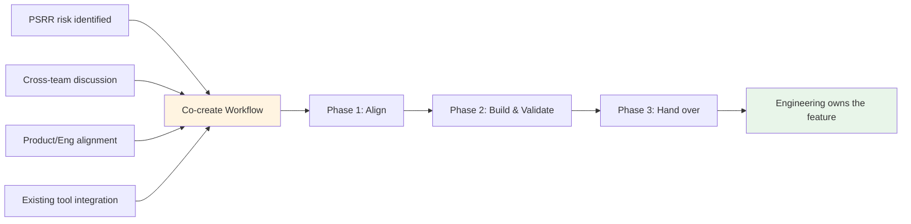

## 概要

Product Security Engineering（ProdSecEng）は、Product および Engineering と直接連携して、GitLab 製品にセキュリティ機能を出荷します。これは共創ワークフローを通じて行われます。ProdSecEng が開発作業に貢献し、完成した機能は長期的な所有のために Engineering チームへ引き継がれます。

このプロセスは [Security Interlock](/handbook/security/product-security/security-platforms-architecture/security-interlock/) イニシアチブを支援します。Product Security は、高リスクの問題に対処するために必要な製品変更や機能を特定することがよくあります。すでにロードマップがいっぱいの Engineering チームへその作業を渡す代わりに、ProdSecEng は Product および Engineering と整合した専任のセキュリティエンジニアリング能力を提供します。これにより、私たちは作業を提供し、GitLab が製品を進める必要のある方向に適合させられます。

> **移行に関する注記（2026 年 7 月 1 日発効）**
>
> 2026 年 7 月より前、このページではカスタムセキュリティツールのライフサイクル全体を対象とする、インテーク、メンテナンス、共創、移行と廃止という 4 つの相互に関連するワークフローについて説明していました。GitLab の Act 2 オペレーティングモデル変更の一環として、ProdSecEng のミッションは製品への貢献を直接出荷することに重点を置くよう変わりました。現在、共創ワークフローが主要なプロセスです。
>
> インテークおよびメンテナンスワークフローでは、新しい作業を受け付けていません。既存のカスタムツールに関するコミットメントは移行中です。移行計画は最終決定され、[社内ハンドブックのツールインベントリ](https://internal.gitlab.com/handbook/security/product_security/product_security_engineering/)（GitLab チームメンバーのみアクセス可能）に文書化されています。移行中に参照できるよう、従来のワークフロードキュメントは以下の[既存ツールのワークフロー](#existing-tooling-workflows)セクションに保持されています。

## 共創ワークフロー

### 共創の開始方法

共創作業は、いくつかの経路から始まります。

1. **PSRR リスク**: [Product Security Risk Register](/handbook/security/product-security/security-platforms-architecture/risk-register/) のリスクについて、製品による解決が必要だと特定された場合。
1. **チーム横断の議論**: ProdSec チームが製品機能で対処できるギャップを特定し、ProdSecEng と協力して作業範囲を定める場合。
1. **Product および Engineering との整合**: 共同計画によって製品ロードマップに適合するセキュリティ機能が明らかになり、ProdSecEng が開発作業を引き受ける場合。
1. **既存ツールの統合**: 内部ツールの今後の道筋カテゴリが **Integrate** に設定され（既存ツールセクションの[今後の道筋カテゴリ](#path-forward-categories)を参照）、そのツールの機能を製品に組み込む場合。

機能が所有する Engineering チームに引き継がれた時点で、共創は完了します。継続的な統合の取り組み（複数の機能を持つツールなど）では、より広範な移行が続いている間に、個々の共創サイクルが完了する場合があります。

### プロセス概要

共創は 3 つのフェーズで進みます。

1. **[Product および Engineering と整合する](#phase-1-align-with-product-and-engineering)** — 何を構築するか、それが製品にどう適合するか、誰が関与するかについて合意します。
1. **[構築して検証する](#phase-2-build-and-validate)** — 機能を開発およびテストし、必要に応じて Customer Zero として内部ユーザーで検証します。
1. **[Engineering へ引き継ぐ](#phase-3-hand-over-to-engineering)** — 機能の所有権を、長期的にメンテナンスする Engineering チームへ移管します。

### フェーズ 1: Product および Engineering と整合する {#phase-1-align-with-product-and-engineering}

開発作業を開始する前に、ProdSecEng はアプローチと期待される成果について Product および Engineering と整合します。この整合は極めて重要です。ProdSecEng はこれらの機能を長期的に所有しないため、所有チームは何を構築するか、そしてそれが製品にどう適合するかについて合意する必要があります。

**主要な活動:**

- 関連する Product Manager に参加してもらい、ユースケースを検証して製品との適合を確認します。作業が PSRR エントリまたはチーム横断の議論から始まった場合は、そのコンテキストを出発点として使用します。
- 関連する Engineering Manager に参加してもらい、技術的アプローチを検証し、チームがレビューと最終的な所有を支援できることを確認します。
- 重複する既存または計画中の作業について、[R&D Interlock ロードマップ](/handbook/product-development/how-we-work/r-and-d-interlock/)を確認します。すでにコミットメントが存在する場合、ProdSecEng は別の作業を提案するのではなく、その取り組みに貢献できます。
- 機能をフィーチャーフラグの背後で出荷するか、PoC フェーズを経るか、一般提供を直接目指すかなど、スコープについて合意します。
- ロールアウトのアプローチと、ロールアウト期間中のインシデント所有について合意します（フェーズ 2 の[ロールアウトとインシデント所有](#rollout-and-incident-ownership)を参照）。

**整合の記録**

整合は共創エピックに文書化する必要があります。ProdSecEng は PM または EM に、日付を含め、スコープとアプローチについての整合を明示的に確認するコメントをエピックへ残すよう依頼する必要があります。これにより、整合について後から疑問が生じた場合にも、明確な監査証跡が残ります。開発中にスコープが変更された場合は、再び整合を図り、同じ方法で文書化する必要があります。

**アウトプット**

1. 作業計画、リスク、依存関係、ステークホルダー（RACI 付き）を含む共創エピックが作成される
1. PM および／または EM との整合が確認され、エピックに文書化される
1. 開発作業の Issue が作成またはリンクされる

### フェーズ 2: 構築して検証する {#phase-2-build-and-validate}

#### 習熟

開発を始める前に、チームは作業対象のコードベースを理解するための時間を確保する必要があります。既存の内部ツールを統合する作業の場合、現在そのツールがどのように問題を解決しているかについても理解する必要があります。開発中に情報に基づいた判断を下せるよう、この作業にはタイムボックスを設け、Work Item として追跡する必要があります。例として[過去の Work Item](https://gitlab.com/gitlab-com/gl-security/product-security/product-security-engineering/product-security-engineering-team/-/work_items/367)を使用できます。

#### 開発

ProdSecEng は [GitLab の標準開発プロセス](https://docs.gitlab.com/development/)に従って機能を開発します。このフェーズは反復的になる場合があります。フェーズ 1 での合意内容によっては、プロダクション対応の機能よりも先に、概念実証やフィーチャーフラグを使用した実装を行う場合があります。

**主要な活動**

1. テストとドキュメントを含め、機能を実装する
1. マージリクエストを提出し、所有する Engineering チームとのコードレビューでイテレーションする
1. パフォーマンスを検証し、機能が品質基準を満たすことを確認する
1. 最終的に機能を所有するチームと知識を共有する（詳細説明セッション、ドキュメント）
1. 必要に応じて [Customer Zero](/handbook/product/product-processes/customer-0/) として内部ユーザーで機能を検証し、その機能がワークフローに関連する ProdSec チームからフィードバックを収集する
1. [ADR テンプレート](https://gitlab.com/gitlab-com/gl-security/product-security/product-security-engineering/product-security-engineering-team/-/blob/main/development_templates/adr_template.md)を使用して、重要な設計判断を記録する

#### ロールアウトとインシデント所有 {#rollout-and-incident-ownership}

開発作業に段階的なロールアウト（フィーチャーフラグ、段階的なアクセス）が含まれる場合、ロールアウト計画についてフェーズ 1 で合意し、共創エピックに文書化する必要があります。

ロールアウト中:

- **ProdSecEng はロールアウト判断の DRI です**。発生した問題に基づいて、ロールアウトを一時停止、元に戻す、または調整するかどうかの判断も含まれます。考慮すべきより広範なリスクや懸念がある場合に備え、ProdSecEng は所有する Engineering チームに相談する必要があります。
- **ProdSecEng は機能に関するインシデントの SME です**。[GitLab のインシデントプロセス](/handbook/engineering/infrastructure-platforms/incident-management/)の一環として、SME エスカレーションに対応します。所有する Engineering チームにも相談します。また、知識にギャップがある可能性を踏まえ、複雑な問題に対処するには追加の支援、リソース、コンテキストが必要となる場合があることを、そのチームも理解する必要があります。所有する Engineering チームは、その専門知識やキャパシティにより迅速に解決できる場合、インシデントの所有を明示的に引き継ぐことができます。

これらの責任はフェーズ 1 で事前に明確にし、共創エピックに文書化する必要があります。

#### 整合の維持

共創エピックで、ステークホルダーに定期的（通常は週次）なステータス更新を提供します。これにより Product と Engineering は進捗を把握でき、GitLab の優先順位や計画が変更された場合でも、作業に影響が及ぶ前に ProdSecEng がそれを把握できます。スコープやアプローチを変更する必要がある場合は、PM または EM と再び整合を図り、エピックに文書化します。

**アウトプット**

1. 機能が出荷される（合意に従い、フィーチャーフラグの背後または一般提供として）
1. ドキュメントが公開される
1. パフォーマンスと品質が検証される
1. Customer Zero からのフィードバックが収集され、対応される（該当する場合）

### フェーズ 3: Engineering へ引き継ぐ {#phase-3-hand-over-to-engineering}

ProdSecEng は、機能を長期的に所有する Engineering チームへ引き継ぎます。引き継ぎのタイミングとスコープは、フェーズ 1 での合意内容によって異なります。引き継ぎは、フィーチャーフラグが削除され、機能が一般提供された後に行う場合もあれば、所有チームに引き継ぐ準備ができていれば、それより早く行う場合もあります。

製品機能が既存の内部ツールの機能を置き換える場合、そのツールの[移行と廃止ワークフロー](#transition-and-sunset-workflow)を共創中に開始する場合があります。この場合、共創と移行は順番にではなく並行して進みます。内部ツールの完全な廃止は、複数の共創サイクルが完了するまで行われない場合があります。

**主要な活動:**

1. 機能が長期的な所有の基準を満たしていることを、所有する Engineering チームと確認する
1. 機能をフィーチャーフラグの背後で出荷した場合、フラグの削除と一般提供の計画について所有チームと連携する
1. 残りのコンテキスト（ドキュメント、ADR、既知の Issue、パフォーマンスデータ）を移管する
1. 該当する場合は、機能が製品に統合されたことを反映するように[ツールインベントリ](https://internal.gitlab.com/handbook/security/product_security/product_security_engineering/)を更新する

**アウトプット**

1. 機能が Engineering チームによって所有およびメンテナンスされる
1. 該当する場合、ProdSecEng の内部ツールが更新されるか、[移行と廃止](#transition-and-sunset-workflow)の予定に組み込まれる
1. ツールインベントリが更新される（該当する場合）

### 主な考慮事項

1. **機能パリティ**: 製品機能は、該当する場合でも内部ツールの機能と 100% 一致する必要はありません。フェーズ 1 で「十分に良い」状態について合意し、必要に応じてフェーズ 2 で見直します。
1. **反復的な提供**: 共創では、機能が一般提供できる状態になるまでに、PoC、フィーチャーフラグを使用した提供、Customer Zero テスト、再整合を複数回行う場合があります。これは想定されたことです。
1. **整合は継続的**: 整合は一度限りのゲートではありません。GitLab の優先順位は変わる場合があり、定期的なステータス更新とステークホルダーとのコミュニケーションにより、ProdSecEng の作業を Product および Engineering の方向性と整合させ続けられます。
1. **ProdSecEng は製品機能を所有しない**: 共創を通じて構築されるすべての機能は、Engineering チームへ引き継がれます。所有チームとの早期の整合と継続的なコミュニケーションにより、この仕組みが成り立ちます。

---

## 既存ツールのワークフロー {#existing-tooling-workflows}

以下のワークフローは、ProdSecEng の既存のカスタムツールに関するコミットメントに適用されます。2026 年 7 月 1 日以降、新しいカスタムツールのリクエストは受け付けていません。これらのワークフローは、移行期間中の参照用としてここに保持されています。チームの現在のミッションについては、[ProdSecEng チーム憲章](/handbook/security/product-security/security-platforms-architecture/product-security-engineering/)を参照してください。

### インテークワークフロー

インテークワークフローは、チームが ProdSecEng の支援を求めるツールおよび自動化作業の入口でした。新規ツールのリクエストと、既存ツールの引き継ぎを対象としていました。ProdSecEng は各リクエストを評価し、構築、延期、リダイレクト、廃止のいずれを行うかを判断して、その判断を記録していました。

> **このワークフローでは新しいリクエストを受け付けていません。** 既存ツールについて質問があるチームは、Slack の [`#security_help`](https://gitlab.enterprise.slack.com/archives/C094L6F5D2A) でお問い合わせください。

### メンテナンスとインベントリ優先順位付けワークフロー

#### 目的

メンテナンスワークフローは、ProdSecEng がメンテナンスするツールに対して、インテークが完了した時点から、そのツールが移行と廃止ワークフローに入るまで継続的に実行されていました。

#### 主な活動

このワークフローが有効だった間、メンテナンスワークフローは以下を対象としていました。

1. 定義された SLO/RTO 内での **Issue への対応**
1. **ツールの稼働維持**: アップタイムの監視、障害への対応、セキュリティパッチの適用
1. **作業の優先順位付け**: 重要度、製品の準備状況、戦略的整合性に基づき、どのツールを共創へ移行すべきか評価
1. **メンテナンス性の改善**: ツールを段階的に [Good/Better/Best 基準](https://internal.gitlab.com/handbook/security/product_security/product_security_engineering/automation_best_practices/)（GitLab チームメンバーのみアクセス可能）へ引き上げる
1. **インベントリのレビューと再評価**: ニーズが変化した後もツールがリソースを消費し続けることを防止

#### 今後の道筋カテゴリ {#path-forward-categories}

ツールは以下のいずれかに分類されていました。移行中のツールについては、[社内ハンドブックのツールインベントリ](https://internal.gitlab.com/handbook/security/product_security/product_security_engineering/)で現在もこれらのカテゴリを参照しています。

- **Integrate**: 製品との適合、顧客価値、オペレーティングモデルとの整合が明確です。エピックが存在し、今後のマイルストーンが適用されています。
- **Maintain (KTLO)**: ツールに文書化された SLO と RTO を満たしながら、稼働を維持します。機能リクエストは受け付けません。コントリビューションのピアレビューは受け付けます。
- **Improve, then Integrate** または **Improve, then Maintain**: ツールを別のカテゴリへ移すための作業が必要です。機能リクエストを積極的にトリアージし、バックログに追加するかクローズします。
- **Sunset**: 移行と廃止ワークフローを積極的に進めています。削除されるまでは「KTLO」として扱います。
- **Redirect**: 所有権を別のチームへ移管する必要があります。機能リクエストは受け付けません。SLO と RTO の上限は「Low」です。

#### SLO/RTO コミットメント

ProdSecEng はツールの重要度に基づき、異なるレベルのサポートを提供していました。移行中にメンテナンスされているツールでは、現在もこれらのコミットメントを参照しています。

| 重要度 | SLO（応答時間） | RTO（復旧時間） | 例 |
|-------------|---------------------|---------------------|---------|
| **Critical** | < 4 営業時間 | < 12 営業時間 | セキュリティリリースまたはインシデント対応を妨げるツール |
| **High** | < 1 営業日 | < 2 営業日 | 日々のセキュリティ業務を支援するツール |
| **Medium** | < 3 営業日 | < 2 週間 | 毎週または毎月使用するツール |
| **Low** | ベストエフォート | ベストエフォート | 実験的またはほとんど使用されないツール |

注記:

- Service Level Objective（SLO）は、オープンされた Issue をトリアージしてアサインするまでの目標時間です。Recovery Time Objective（RTO）は、ツールを機能する状態に戻すまでの目標時間です。どちらの場合も、Issue がオープンされた時点から計測を開始します。
- これらは目標とするコミットメントであり、チームのキャパシティや競合する優先事項によって変わる場合があります。
- これらの時間は、ツールが正しく機能することを妨げる Issue にのみ適用されます。
- 「営業時間」とは、ProdSecEng チームメンバーがオンラインになっている時間です。チームは通常、週末を除き、すべてのタイムゾーンで 9〜5 時をカバーしています。ProdSecEng は「オンコール」ではありません。
- 私たちは Recovery Point Objective（RPO）をコミットしません。

### 移行と廃止ワークフロー {#transition-and-sunset-workflow}

#### 目的

移行と廃止ワークフローは、内部ユーザーを内部ツールから製品機能へ移行する作業と、不要になった内部ツールの廃止を管理します。

#### 移行と廃止を使用するタイミング

Act 2 オペレーティングモデル変更の一環として、ProdSecEng のインベントリにある既存ツールはすべて、移行または廃止されます。

#### 主な活動

[新しい Sunset Tooling Issue をオープン](https://gitlab.com/gitlab-com/gl-security/product-security/product-security-engineering/product-security-engineering-team/-/issues/new?description_template=sunset_tooling)すると、以下の活動が案内されます。

1. 関連チームと移行または廃止の判断を検証する
1. 代替ソリューションを特定する。ユーザーが代わりに使用すべきもの（製品機能、別のツールなど）を文書化する
1. ユーザーを製品機能へ移行する場合、ProdSec チームと連携してワークフローを移行し、機能パリティを検証する
1. タイムラインを伝える。内部ツールを廃止する時期を明確に通知する
1. インフラストラクチャを廃止する。内部ツールのインフラストラクチャをシャットダウンし、リポジトリをアーカイブして、ドキュメントを更新する

#### 直接廃止の代替案: 移管

ProdSecEng がツールのメンテナンスを終了して廃止する予定でも、代わりに別のチームが所有してメンテナンスする意思を持つ場合があります。別の所有者が見つかった場合は、[ツール移管 Issue](https://gitlab.com/gitlab-com/gl-security/product-security/product-security-engineering/product-security-engineering-team/-/issues/new?description_template=transfer_tooling)をオープンします。

## 関連リソース

- [Product Security Engineering](/handbook/security/product-security/security-platforms-architecture/product-security-engineering/)
- [Security Interlock](/handbook/security/product-security/security-platforms-architecture/security-interlock/)
