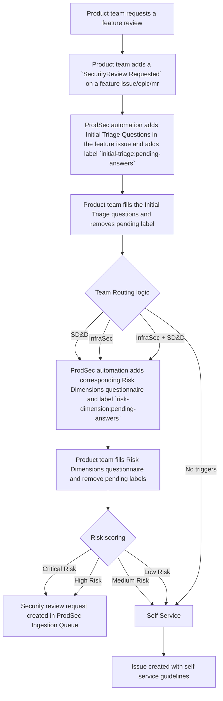

## セキュリティレビューフレームワーク

> [!WARNING]
> このプロセスは DRAFT であり、変更される可能性があります。セキュリティレビューのリクエストについては、[AppSec レビュープロセス](./security-platforms-architecture/application-security/appsec-reviews/) を使用してください。

このセキュリティレビューフレームワークは、GitLab のプロダクトチームがセキュリティ評価を効率化されたアプローチで実施できるようにし、機能のニーズ・リスクプロファイル・[Go-to-market tier](https://gitlab.com/groups/gitlab-org/gitlab-rd-planning/-/wikis/R&D-Interlock-Process#labels-guide) に基づいて適切なセキュリティパートナーと連携しやすくします。
開発速度を維持しつつ適切なセキュリティカバレッジを確保するように設計されており、フレームワークは最初にシンプルなチームルーティングプロセスを通じて、最も適切なセキュリティ専門家と直接つなげます。これは [Secure Design and Development](./security-platforms-architecture/application-security/appsec-operations/sdd-services/) または
[Infrastructure Security](./infrastructure-security/) のいずれかであり、High または Critical のリスクスコアを持つ機能については、[Security Platforms and Architecture (SPA)](./security-platforms-architecture/) や [Data Security チーム](./data-security/) からの追加の専門サポートも提供されます。この集中したアプローチにより、不要なプロセスのオーバーヘッドなく、タイムリーで的を絞ったセキュリティガイダンスを受けることができます。

セキュリティレビューフレームワークは、[プロダクト開発フロー](/handbook/product-development/how-we-work/product-development-flow/) と連携して動作するように設計されています。
機能のセキュリティレビューを実施する理想的なトリガーポイントは設計フェーズです
（Issue 上で `workflow::design` ラベルで示される [Validation phase 4: Design](/handbook/product-development/how-we-work/product-development-flow/#validation-phase-4-design)）。
設計フェーズに関わる [主要参加者](/handbook/product-development/how-we-work/roles-and-responsibilities/) は、セキュリティレビューフレームワークを活用して、機能にセキュリティレビューが必要かどうかを判断することが推奨されます。

### SRF のスコープ

1. 機能のエンドツーエンドのセキュリティレビュー
2. 設計レビュー

#### ユースケース例

1. プロダクトデザイナーとして、新機能の設計がすべてのセキュリティのベストプラクティスを考慮していることを確認したい。
2. 新機能の実装に向けて潜在的な設計を作成している開発者として、その設計が顧客データの機密性や完全性の喪失につながらないか、または GitLab インスタンスの可用性に悪影響を及ぼさないかを確認したい。
3. エンジニアリングマネージャーとして、新機能の新しい設計をレビューしている際に、設計上の選択がセキュリティ上の問題を引き起こす可能性があると疑い、セキュリティチームに確認したい。
4. プロダクトマネージャーとして、[GTM Tier-0](https://docs.google.com/spreadsheets/d/1Pis-VRUYTlitNjoKmDKNQMIf-4bWBo5XjPyWOYo0R54/edit?gid=838006198#gid=838006198&range=B20) 機能に取り組んでいる際に、その機能が顧客に対してセキュリティリスクをもたらさないことを確認したい。

#### 以下の種類のリクエストは SRF のスコープ外です

1. アドホックな MR レビュー依頼（その機能がすでに SRF によりレビューされている場合を除く）
2. 一般的なアプリケーションセキュリティに関する質問

セキュリティレビューフレームワークがプロダクトチームのワークフローにどう適合するかを次のセクションで図示しています。

## プロセス全体のフロー



### フレームワークの目的

1. プロダクトセキュリティチームによるセキュリティレビューが必要な GitLab の機能を特定する。
1. プロダクトセキュリティチームから、どのタイプの [セキュリティレビュー](#3-review-process-by-team-and-risk-level) が必要か。
1. セキュリティレビューに関与する必要があるプロダクトセキュリティチーム。
1. プロダクトおよびエンジニアリングが、各種セキュリティレビューから期待できる成果物。

### チームの責任

| チーム | 重点領域 | 関与基準 |
| ----- | ----- | ----- |
| [Secure Design and Development](/handbook/security/product-security/security-platforms-architecture/application-security/appsec-operations/sdd-services/) | コードの脆弱性、脅威モデリング、開発者教育、認証、認可、入力検証 | 機密データの取り扱い、認証関連の変更、新しいテクノロジー、サードパーティ統合、顧客向け機能 |
| [Infrastructure Security](/handbook/security/product-security/infrastructure-security/) | インフラ設定、ネットワークセキュリティ、デプロイ、クラウドセキュリティ、コンテナオーケストレーション、Infrastructure-as-Code | 新規インフラ、デプロイ変更、ネットワーク変更、クラウドプロバイダー設定、コンテナセキュリティ |
| [Data Security](/handbook/security/product-security/data-security/) | データアクセス制御、データインフラ、データライフサイクル、暗号化、鍵管理、サードパーティサービス | 重点領域に関わる高リスクまたは複雑な変更全般に関与します。不確かな場合は私たちにタグ付けするか、`#security-datasec` で連絡してください |
| [SPA](/handbook/security/product-security/security-platforms-architecture/) | システム設計、データフロー、アーキテクチャパターン、信頼境界、コンポーネント間の相互作用 | InfraSec および SD&D チームからエスカレーションされたレビュー、特に以下の場合: <br>- プロダクトの開発・ビルド・デプロイ・実行方法に体系的な影響を及ぼす重大なアーキテクチャ変更（例: Dedicated, Cells, Runway）<br>- アプリケーションまたはインフラレベルでの認証/認可への重要な変更<br>- ソフトウェアサプライチェーンに大きな影響を与えるビルド/配布実践の変更<br>- 年間のビジネス目標に不可欠な機能のアーキテクチャ変更 |

## 1: セキュリティチームのルーティング

最初のステップは、機能のセキュリティレビューに関与すべきセキュリティチームを判断することです。このルーティングは詳細なリスク評価の前に実施され、各チームが自分の領域に関連する質問のみに答えるようにします。

### 初期トリアージの質問 {#initial-triage-questions}

プロダクトチームが [機能](#security-review-phase-1-initial-triage) を開始する際、チームルーティングを判断するために初期トリアージを実施します。

#### Secure Design and Development トリガー

* この機能は顧客のリポジトリ、認証情報、PII データを扱いますか？(Y/N)
* この機能は認証、認可または暗号化に関連するコアメカニズムを追加または変更しますか？(Y/N)
* この機能はサードパーティサービスと連携しますか？(Y/N)
* この機能は [新しいサービスコンポーネント](https://docs.gitlab.com/development/adding_service_component/) を追加しますか？(Y/N)
* この変更は認証、認可または暗号化に関連するコアメカニズムに間接的に影響しますか？(Y/N)

#### Infrastructure Security トリガー

* この機能は新しいクラウドインフラコンポーネントを必要としますか？(Y/N)
* この機能はコンテナ化やオーケストレーションの設定を変更しますか？(Y/N)
* この機能はネットワークアーキテクチャまたはセキュリティグループを変更しますか？(Y/N)
* この機能は Infrastructure-as-Code の実装を変更しますか？(Y/N)
* この機能は本番デプロイプロセスを変更しますか？(Y/N)
* この機能は新しいデータストア（例: クラウドストレージバケット、データベース、キャッシュ）を導入しますか？(Y/N)
* この機能はシークレット管理または認証情報処理を変更しますか？(Y/N)

### チームルーティングロジック

これらのトリアージ質問への回答に基づき、システムはレビューを適切なチームにルーティングします:

```text
IF ANY Secure Design and Development Trigger is YES
    THEN engage Secure Design and Development Team
IF ANY Infrastructure Security Trigger is YES
    THEN engage Infrastructure Security Team
```

複数の領域にまたがるトリガーを持つ複雑な機能では、複数のチームが関与する場合があります。

## 2: チーム別リスク評価モデル

関与すべきチームを特定した後、関与する各チームは領域固有のリスク評価を行ってレビューの深さを決定します。

### Secure Design and Development リスク次元

| 次元 | 説明 | スコア範囲 |
| ----- | ----- | ----- |
| データ処理影響 | 機密データへのアクセスまたは処理のレベル | 1-4 |
| 機能露出度 | 機能のアクセス可能範囲 | 1-5 |
| アーキテクチャ影響 | システムアーキテクチャに対する変更の度合い | 1-4 |
| 実装複雑度 | 実装の技術的複雑さ | 2-3 |
| Launch Tier 影響 | [Launch tier](https://docs.google.com/spreadsheets/d/1Pis-VRUYTlitNjoKmDKNQMIf-4bWBo5XjPyWOYo0R54/edit?gid=838006198#gid=838006198&range=B20) は機能のローンチに伴うアナウンスの種類を示します | 0-3 |
| 過去のセキュリティ問題 | この機能が過去のセキュリティ問題に関与したかどうか | 0-5 |

### Infrastructure Security リスク次元

| 次元 | 説明 | スコア範囲 |
| ----- | ----- | ----- |
| インフラスコープ | 影響を受けるインフラの広さ | 1-5 |
| 環境クリティカリティ | 影響を受ける環境の重要度 | 1-5 |
| 構成複雑度 | インフラ変更の複雑さ | 1-4 |
| 自動化レベル | インフラ自動化のレベル | 1-3 |
| Launch Tier 影響 | [Launch tier](https://docs.google.com/spreadsheets/d/1Pis-VRUYTlitNjoKmDKNQMIf-4bWBo5XjPyWOYo0R54/edit?gid=838006198#gid=838006198&range=B20) は機能のローンチに伴うアナウンスの種類を示します | 0-3 |

### 詳細スコアリング基準

#### Secure Design and Development リスク次元

##### データ処理影響 (1-4) {#data-processing-impact-1-4}

* 4: 顧客リポジトリ、認証情報、PII データへの直接アクセス/変更。
* 3: 信頼されたコンポーネントから来るデータであっても、信頼されていないデータを処理する。
* 2: プロジェクト/パイプラインに関するメタデータへのアクセス。
* 1: 機密データへのアクセスがない、または表示のみの機能。

##### 機能露出度 (1-5)

* 5: 認証なしでアクセス可能なパブリック向け API または Web インターフェース。
* 4: すべての認証済みユーザーに利用可能な機能。
* 3: 適切なロール権限が必要だが広く利用される機能。
* 2: 管理者専用機能、または特定のユーザーロールに限定される機能。
* 1: 顧客に公開されない内部ツール。

##### アーキテクチャ影響 (1-4) {#architecture-impact-1-4}

* 4: コア認証、認可、またはシステムアーキテクチャの変更。
* 3: 現在のアプリケーションの信頼境界外にある新しいサービス（GitLab またはサードパーティ）統合。
* 2: 現在のアプリケーションの信頼境界内での機能追加。
* 1: バックエンドへの影響がない UI 変更。

##### 実装複雑度 (2-3)

* 3: 新機能の実装。
* 2: 既存機能の拡張。

##### Launch Tier 影響 (0-3)

* 3: Tier 0
* 2: Tier 1
* 1: Tier 2
* 0: Tier 3

**Note:** Launch tier は GitLab tiers (Free/Premium/Ultimate) とは異なります。Launch tier は機能のローンチに伴うイベント/アナウンスの種類を示します。定義は
[この Google Sheet](https://docs.google.com/spreadsheets/d/1Pis-VRUYTlitNjoKmDKNQMIf-4bWBo5XjPyWOYo0R54/edit?gid=838006198#gid=838006198&range=B20)（社内）にあります。

**Note:** `~"group::[group-name]"`、`~"severity::1/2/3"`、`~"bug::vulnerability"` ラベルの組み合わせを使ってプロジェクトの Issue トラッカーを検索することで、これを特定できます。

#### Infrastructure Security リスク次元

##### インフラスコープ (1-5)

* 5: 複数のプロダクト提供で使用される本番インフラに影響を与える。
* 4: 単一のプロダクト提供で使用される本番インフラに影響を与える。
* 3: 単一のプロダクト提供の本番インフラの一部で、顧客への影響が最小限の部分に影響を与える。
* 2: 他のシステムが依存する非本番インフラに影響を与える（例: 自動テスト環境）。
* 1: 他のシステムが依存しない非本番インフラに影響を与える（例: サンドボックス環境）。

##### 環境クリティカリティ (1-5)

* 5: 顧客データを伴う本番環境コンポーネント。
* 4: 直接的な顧客データを伴わない本番環境コンポーネント。
* 3: プリプロダクション/ステージング環境。
* 2: テスト環境。
* 1: 開発環境のみ。

##### 構成複雑度 (1-4)

* 4: 複数のサービスを伴う複雑な Infrastructure-as-Code。
* 3: いくつかの依存関係を伴う中程度のインフラ変更。
* 2: シンプルなインフラ変更。
* 1: 設定ファイル変更のみ。

##### 自動化レベル (1-3)

* 3: 手動でのインフラ変更が必要。
* 2: 部分的に自動化されたインフラ変更。
* 1: 完全に自動化された Infrastructure-as-Code 実装。

##### Launch Tier 影響 (0-3)

* 3: Tier 0
* 2: Tier 1
* 1: Tier 2
* 0: Tier 3

**Note:** Launch tier は GitLab tiers (Free/Premium/Ultimate) とは異なります。Launch tier は機能のローンチに伴うイベント/アナウンスの種類を示します。定義は
[この Google Sheet](https://docs.google.com/spreadsheets/d/1Pis-VRUYTlitNjoKmDKNQMIf-4bWBo5XjPyWOYo0R54/edit?gid=838006198#gid=838006198&range=B20) にあります。

### リスクスコアの計算

関与する各チームは、領域固有の次元を使用してリスクスコアを計算します:

```text
Secure Design and Development Risk Score = Data Processing Impact + Feature Exposure + Architecture Impact + Implementation Complexity + Launch Tier Impact
Infrastructure Security Risk Score = Infrastructure Scope + Environment Criticality + Configuration Complexity + Automation Level + Launch Tier Impact
```

### リスク分類 {#risk-categorization}

各チームは領域固有のスコアに基づいてリスクを分類します:

#### Secure Design and Development

* スコア ≥ 15: Critical Risk
* スコア 12-14: High Risk
* スコア 8-11: Medium Risk
* スコア < 8: Low Risk

各リスクレベルのセキュリティレビュープロセスは [Secure Design and Development Review Process](#secure-design-and-development-review-process) セクションで詳述されています。

#### Infrastructure Security

* スコア ≥ 15: Critical Risk
* スコア 12-14: High Risk
* スコア 8-11: Medium Risk
* スコア < 8: Low Risk

各リスクレベルのセキュリティレビュープロセスは [Infrastructure Security Review Process](#infrastructure-security-review-process) セクションで詳述されています。

### セキュリティレビューの優先度

セキュリティレビューの優先度は、機能の [ロードマップ優先度](https://gitlab.com/groups/gitlab-org/gitlab-rd-planning/-/wikis/R&D-Interlock-Process/#labels-guide)（`Interlock Priority::P1`、`Interlock Priority::P2`、`Interlock Priority::P3`）と機能の [リスクスコア](#risk-categorization) を考慮して決定されます。

|#| (リスクスコア) <br>Critical | High | Medium | Low |
| ------ | ------ | ------ |--|--|
| (ロードマップ優先度) <br> P1     |  Review-Priority:1      |    Review-Priority:2    |Review-Priority:3 | Self-Service|
|    P2   |  Review-Priority:2      |   Review-Priority:3     |Review-Priority:4 | Self-Service|
|     P3   |  Review-Priority:3      |  Review-Priority:4      | Review-Priority:4|Self-Service |

### SPA および Data Security チームの関与基準

#### Secure Design and Development レビューについて

リスクスコア計算中に、大きなアーキテクチャ影響またはデータ処理影響が特定された場合、機能はアーキテクチャレビューおよび/またはデータセキュリティレビューにフラグ付けされます。

```text
IF Architecture Impact >= 4
    THEN Flag the feature for Architecture review by SPA team
IF Data Processing Impact >= 4 then
    THEN Flag the feature for Data Security review by Data Security team.
```

#### InfraSec レビューについて

```text
IF Infrastructure Scope >= 4
   THEN Flag the feature for SPA review
IF Environment Criticality>=4
   THEN Flag the feature for Data Security review
```

機能が SPA または Data Security レビューにフラグ付けされた場合、レビューリクエストに追加されたラベルでそれが示されます。

## 3: チームとリスクレベル別のレビュープロセス {#3-review-process-by-team-and-risk-level}

### Secure Design and Development レビュープロセス {#secure-design-and-development-review-process}

* **SDX Reviews DRI:** SD&D チーム
* **Data Security Review DRI:** Data Security チーム。_リソース制約があるため、このレビューはベストエフォートで実施されます。_
* **SPA Security Review DRI:** SPA チーム。_リソース制約があるため、このレビューはベストエフォートで実施されます。_

> [!WARNING]
> SDX Design review、SDX Code review、SDX Verify に記載されているステップは、 https://gitlab.com/groups/gitlab-com/gl-security/product-security/appsec/-/epics/75 の結果に基づいて変更される可能性があります。

#### Critical Risk レビュー

##### SDX Design review

* **脅威モデリング**
  * **DRI:** [SD&D](/handbook/security/product-security/security-platforms-architecture/application-security/appsec-operations/sdd-services/)
  * **成果物:** 設計レベルのセキュリティ評価と特定された脅威を含む脅威モデル。
* **機能設計レビュー**
  * **DRI:** SD&D
  * **成果物:** 設計はベストプラクティスに照らして検証され、推奨事項が提供されます。
* **SPA レビュー** (_IF [`Architecture Impact`](#architecture-impact-1-4) >= 4_)
  * **DRI:** [SPA](/handbook/security/product-security/security-platforms-architecture/)
  * **成果物:** システム設計、データフロー、アーキテクチャパターン、信頼境界、コンポーネント間の相互作用がベストプラクティスに照らして検証され、推奨事項が提供されます。
* **Data Security レビュー** (_IF [`Data Processing Impact`](#data-processing-impact-1-4) >= 4_)
  * **DRI:** [Data Security](/handbook/security/product-security/data-security/)
  * **成果物:** データアクセス制御、データインフラ、データライフサイクル、暗号化、鍵管理、サードパーティサービスがベストプラクティスに照らして検証され、推奨事項が提供されます。

##### SDX Code review

* **マージリクエストレビュー**
  * **DRI:** SD&D
  * **成果物:** MR は実装レベルのセキュリティ問題についてレビューされます。
* **[Secure Coding Guidelines](https://docs.gitlab.com/development/secure_coding_guidelines/) の遵守確認**
  * **DRI:** SD&D
  * **成果物:** [Secure Coding Guidelines](https://docs.gitlab.com/development/secure_coding_guidelines/) に従っているかをチェックするために MR がレビューされます。
* **静的解析**
  * **DRI:** SD&D
  * **成果物:** SD&D は [Dependency scanning](https://docs.gitlab.com/user/application_security/dependency_scanning/)、[Container Scanning](https://docs.gitlab.com/user/application_security/container_scanning/) ツール、および [SAST tools](https://docs.gitlab.com/user/application_security/sast/) を使用してソフトウェアコンポジション分析を実行します。

##### SDX Verify 最終セキュリティレビュー

* **動的解析**
  * **DRI:** SD&D
  * **成果物:** SD&D は [DAST tools](https://docs.gitlab.com/user/application_security/dast/) を使用して動的解析を実行します。
* **侵入テスト**
  * **DRI:** SD&D
  * **成果物:** SD&D は侵入テストを実行し、特定された問題を共有します。
* **発見された問題のチェック**
  * **DRI:** SD&D
  * **成果物:** 他のレビューで特定された重大な脆弱性が修正されているかチェックします。

#### High Risk レビュー

##### SDX Design review

* **変更にフォーカスした脅威モデリング**
  * **DRI:** SD&D
  * **成果物:** 設計レベルのセキュリティ評価と特定された脅威を含む脅威モデル。
* **変更にフォーカスした設計レビュー**
  * **DRI:** SD&D
  * **成果物:** 設計はベストプラクティスに照らして検証され、推奨事項が提供されます。
* **SPA レビュー** (_IF [`Architecture Impact`](#architecture-impact-1-4) >= 4_)
  * **DRI:** SPA
  * **成果物:** システム設計、データフロー、アーキテクチャパターン、信頼境界、コンポーネント間の相互作用がベストプラクティスに照らして検証され、推奨事項が提供されます。
* **Data Security レビュー** (_IF [`Data Processing Impact`](#data-processing-impact-1-4) >= 4_)
  * **DRI:** Data Security
  * **成果物:** データアクセス制御、データインフラ、データライフサイクル、暗号化、鍵管理、サードパーティサービスがベストプラクティスに照らして検証され、推奨事項が提供されます。

##### SDX Code review

* **マージリクエストレビュー**
  * **DRI:** SD&D
  * **成果物:** MR は実装レベルのセキュリティ問題についてレビューされます。
* **[Secure Coding Guidelines](https://docs.gitlab.com/development/secure_coding_guidelines/) の遵守確認**
  * **DRI:** SD&D
  * **成果物:** [Secure Coding Guidelines](https://docs.gitlab.com/development/secure_coding_guidelines/) に従っているかをチェックするために MR がレビューされます。
* **静的解析**
  * **DRI:** SD&D
  * **成果物:** SD&D は [Dependency scanning](https://docs.gitlab.com/user/application_security/dependency_scanning/)、[Container Scanning](https://docs.gitlab.com/user/application_security/container_scanning/) ツール、および [SAST](https://docs.gitlab.com/user/application_security/sast/) ツールを使用してソフトウェアコンポジション分析を実行します。

##### SDX Verify 最終セキュリティレビュー

* **動的解析**
  * **DRI:** SD&D
  * **成果物:** SD&D は [DAST tools](https://docs.gitlab.com/user/application_security/dast/) を使用して動的解析を実行します。
* **侵入テスト**
  * **DRI:** SD&D
  * **成果物:** SD&D は侵入テストを実行し、特定された問題を共有します。
* **発見された問題のチェック**
  * **DRI:** SD&D
  * **成果物:** 他のレビューで特定された重大な脆弱性が修正されているかチェックします。

#### Medium Risk レビュー

##### セキュリティチェックリストの完了

* **DRI:** プロダクトチーム
* **成果物:**
  * [セキュリティ標準](/handbook/security/policies_and_standards/) が満たされているかチェックします。
  * [Secure Coding Guidelines](https://docs.gitlab.com/development/secure_coding_guidelines/) に従っているかチェックします。

##### 自動セキュリティスキャン

* **DRI:** プロダクトチーム
* **成果物:**
  * [Dependency scanning](https://docs.gitlab.com/user/application_security/dependency_scanning/)、[Container Scanning](https://docs.gitlab.com/user/application_security/container_scanning/) を使用したソフトウェアコンポジション分析で特定された問題を修正します。
  * [SAST tools](https://docs.gitlab.com/user/application_security/sast/) で特定された問題が有効化されていることを修正します。
  * [DAST tools](https://docs.gitlab.com/user/application_security/dast/) のようなツールを使用した動的解析で特定された問題を修正します。

#### Low Risk レビュー

##### セキュリティガイドラインに対する自己評価

* **DRI:** プロダクトチーム
* **成果物:**
  * [セキュリティ標準](/handbook/security/policies_and_standards/) が満たされているかチェックします。
  * [Secure Coding Guidelines](https://docs.gitlab.com/development/secure_coding_guidelines/) に従っているかチェックします。

##### 自動セキュリティスキャン

* **DRI:** プロダクトチーム
* **成果物:**
  * [Dependency scanning](https://docs.gitlab.com/user/application_security/dependency_scanning/)、[Container Scanning](https://docs.gitlab.com/user/application_security/container_scanning/) を使用したソフトウェアコンポジション分析で特定された問題を修正します。
  * [SAST tools](https://docs.gitlab.com/user/application_security/sast/) で特定された問題が有効化されていることを修正します。
  * [DAST tools](https://docs.gitlab.com/user/application_security/dast/) のようなツールを使用した動的解析で特定された問題を修正します。

### レビュー SLO

これらは初期見積もりであり、フレームワークの採用に伴って変更される可能性があります。

Note: _Low リスクレベルはここに記載されていません。プロダクトチームがそれらのレビューの DRI であるためです。_

|レビュー種別 | Critical Risk Level| High Risk Level|Medium Risk level|
|--|--|--|--|
|SDX Design Review|10 日|5 日|--|
|SDX Code Review (MR の数によって延長される可能性あり)|10 日|5 日 |--|
|SDX Verify|10 日|5 日|--|
|セキュリティチェックリストの完了 |--|--|5 日|

#### レビューはどの程度早く提出する必要があるか？

次のマイルストーン開始の少なくとも 10 暦日前に受け取ったレビューリクエストは、次のマイルストーンにスコープされます。

次のマイルストーン開始の 10 日前より遅く受け取ったリクエストは、マイルストーン+2 にスコープされます。

SLO は計画されたマイルストーンの開始日から開始されます。

### Infrastructure Security レビュープロセス {#infrastructure-security-review-process}

Note: _このセクションに記載されているレビューのリストは例であり、網羅的ではなく、また常に適用されるわけではありません。_

* InfraSec Reviews DRI: InfraSec チーム
* Data Security Review DRI: Data Security チーム。_リソース制約があるため、このレビューはベストエフォートで実施されます。_
* SPA Security Review DRI: SPA チーム。_リソース制約があるため、このレビューはベストエフォートで実施されます。_

#### Critical Risk レビュー

* 共同のアーキテクチャおよびインフラレビュー
* 包括的なインフラセキュリティレビュー
* クラウド設定監査
* ネットワークセキュリティ分析
* コンテナセキュリティレビュー
* Infrastructure-as-Code セキュリティ分析
* 複数のセキュリティエンジニアが関与
* 実装後の検証
* タイムライン: TBD（機能の設計と実装の間にギャップが存在する可能性があるため、複数のマイルストーンにまたがる場合があります）

#### High Risk レビュー

* 共同のアーキテクチャレビュー
* 重点を絞ったインフラレビュー
* 主要設定の検証
* セキュリティグループ分析
* セキュリティアーキテクトとインフラセキュリティエンジニアの協働
* タイムライン: TBD（機能の設計と実装の間にギャップが存在する可能性があるため、複数のマイルストーンにまたがる場合があります）

#### Medium Risk レビュー

* インフラセキュリティチェックリストの完了
* 主要コンポーネントの設定検証
* タイムライン: 3〜5 営業日

#### Low Risk レビュー

* インフラセキュリティガイドラインに対する自己評価
* [GitLab IaC scanning](https://docs.gitlab.com/user/application_security/iac_scanning/) または `Checkov` を使用した自動設定チェック

### 例外ワークフロー

セキュリティレビューフレームワーク (SRF) はドライラン段階にあり、まだロールアウトされていないため、例外ワークフローは現時点で適用できません。SRF がロールアウトされた後、セキュリティレビューが機能リリースに対して必須となる前に、必要なセキュリティレビューを完了せずに機能をリリースするような状況をカバーするため、適切な [例外ワークフロー](https://gitlab.com/gitlab-com/gl-security/product-security/appsec/appsec-team/-/issues/1294) が SRF に追加されます。

## 4. 実装

### セキュリティレビュー Phase 1: 初期トリアージ {#security-review-phase-1-initial-triage}

1. セキュリティレビュープロセスは、プロダクトチームが機能のセキュリティレビューをリクエストすることから始まります。リクエストの理想的なタイミングは設計が準備できた [設計フェーズ](/handbook/product-development/how-we-work/product-development-flow/#validation-phase-4-design) です（設計フェーズの前に AppSec または InfraSec の質問がある場合は、それぞれ [Contacting us](./security-platforms-architecture/application-security/#contacting-us) と [Working With Us](./infrastructure-security/#working-with-us) に従ってください）。これは、機能の Issue または Epic (`~"type::feature"`) にラベル `SecurityReview::Requested` を追加することで行われます。
1. ProdSec オートメーションは、この機能 Issue に初期トリアージのアンケートを追加し、レビュー開始者に完了を促し、ラベル `initial-triage:pending-answers` を追加します。[初期トリアージのアンケート](#initial-triage-questions) は、この機能が Secure Design and Development (SD&D, SPA) または InfraSec からのレビューが必要かどうかを判断するための Yes/No の質問のセットです。
1. Phase 1 のアンケートが完了したら、レビュー開始者は `initial-triage:pending-answers` ラベルを削除します。

### セキュリティレビュー Phase 2: リスクスコアの決定

1. ProdSec オートメーションは、その後 Team Routing Logic を実行して、機能のセキュリティレビューを実施する必要があるチームを決定し、対応する Risk Dimensions のアンケートを機能 Issue に追加します。レビュー開始者は質問の完了を促され、ラベル `risk-dimension:pending-answers` も Issue に追加されます。
1. アンケートが完了したら、レビュー開始者は `risk-dimension:pending-answers` ラベルを削除します。
1. ProdSec オートメーションは、その後リスクスコアを計算し、レビュー種別と推奨タイムラインを決定します。続いて、ProdSec のインジェスチョンキューに ProdSec オートメーションによってセキュリティレビューリクエスト Issue が開かれます。

ProdSec インジェスチョンキューのセキュリティレビューリクエスト Issue には、以下の詳細が含まれ、ProdSec のインジェスチョントリアージプロセスがリクエストをチームメンバーにリダイレクトできます。

1. 初期トリアージのアンケートとその回答
2. Secure Design and Development リスク次元のアンケートとその回答
3. Infrastructure Security リスク次元とその回答（該当する場合）
4. Secure Design and Development リスクスコア
5. Infrastructure Security リスクスコア（該当する場合）
6. 推奨セキュリティレビュー種別
7. 推奨セキュリティレビューチーム (SD&D, SPA, InfraSec)

### セキュリティレビュー Phase 3: セキュリティレビューの実施

リスクスコアに基づき、ProdSec は Critical、High、または Medium レベルのセキュリティレビューを実施します。
