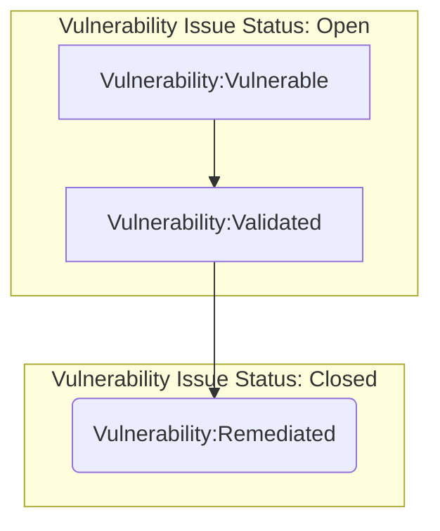
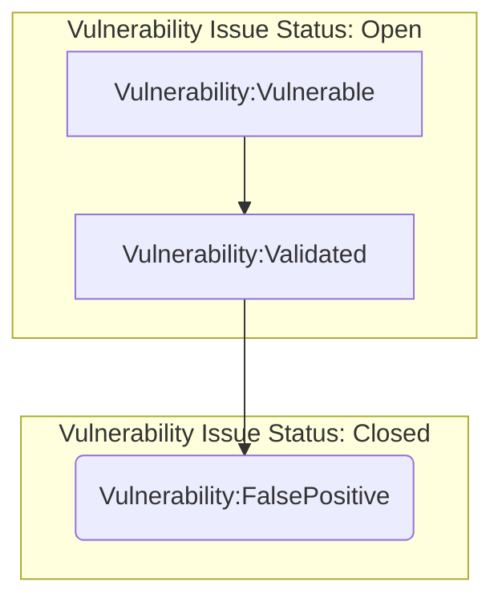
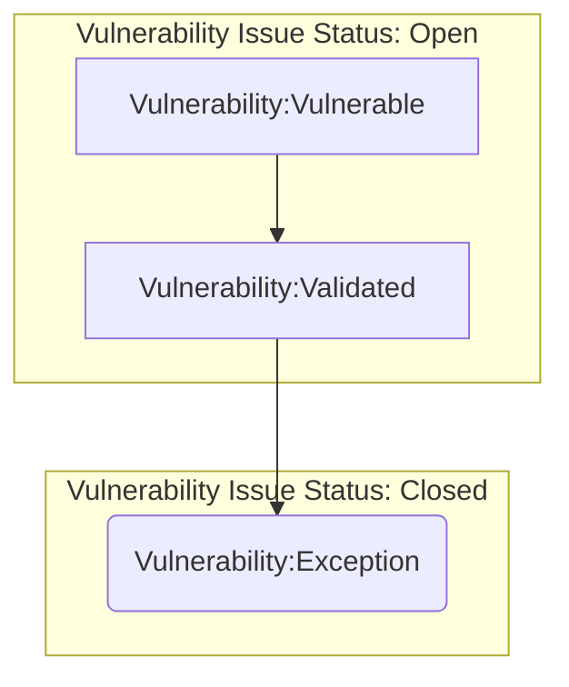
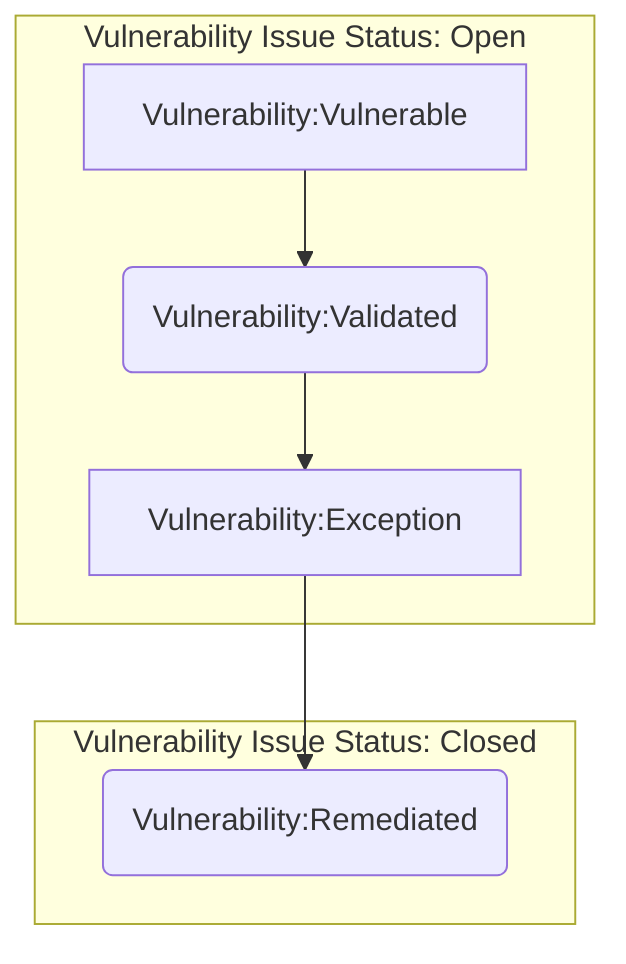
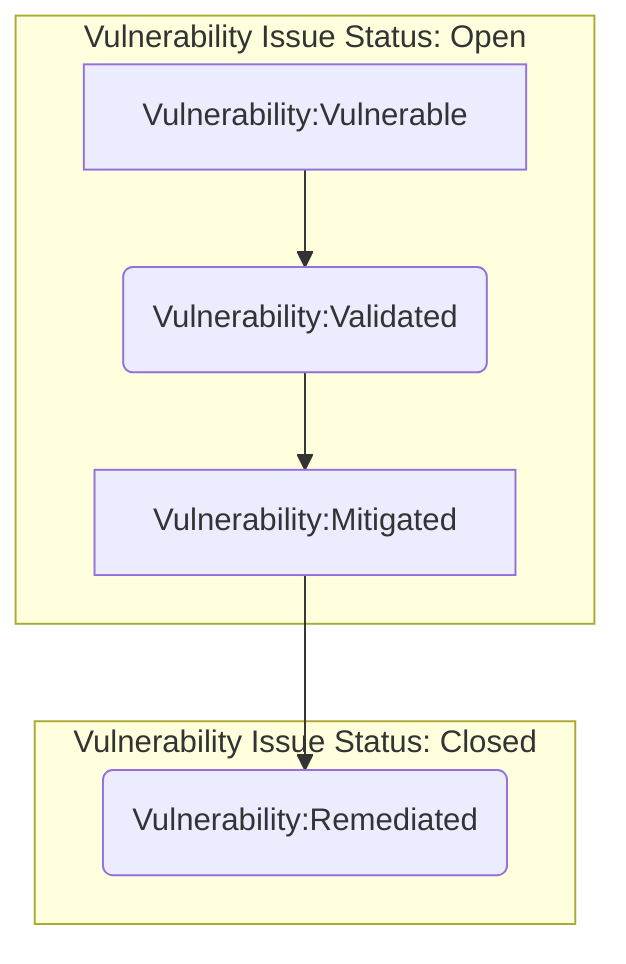

この手順は GitLab の本番インフラで特定された脆弱性に適用され、[脆弱性管理標準](/handbook/security/product-security/vulnerability-management) の実装を保証します。この手順は、私たちの環境に対する洞察を提供し、健全なパッチ管理を含むその他の予防的なベストプラクティスを促進し、リスクを修正するように設計されています。すべては、私たちの環境とプロダクトをよりよく保護するという最終目標のためです。

## スコープ

セキュリティとインフラはパートナーシップを組んで、すべての重要な環境とシステムがデプロイ時にカバーされるようにスコープを設定しました。GitLab.com および GitLab Dedicated 本番環境の現在 `スコープ内` にある環境は以下の通りです:

| 環境  | プロジェクト/アカウント        | 本番  | デプロイ済み |
| :---         | :----                  | :---        | :---     |
| GCP          | gitlab-production      | yes         | yes      |
| GCP          | gitlab-ops             | yes         | yes      |
| GCP          | gs-production          | yes         | yes      |
| GCP          | env-zero               | yes         | yes      |
| GCP          | gemnasium-production   | yes         | yes      |
| GCP          | service-prod           | yes         | yes      |
| GCP          | gitlab-ci              | limited     | yes      |
| AWS          | gitlab-com             | yes         | yes      |
| Azure        | GitLab                 | yes         | no       |

>Note: 自分が責任を持つシステムが脆弱性管理プロセスに含まれるべきだと考える場合、Security Vulnerability Management チームに [連絡](/handbook/security/product-security/vulnerability-management#contact) してください。

これらの環境がスコープアウトされ、Wiz コネクタが準備できたら、脆弱性管理プロセスを開始できます。脆弱性管理はフィードバックループであることを念頭に置いてください。脆弱性検出は、検出された脆弱性を緩和・修正するために分析・取り込みされる脆弱性データを提供します。このプロセスからのフィードバックは、私たちの環境をさらに保護する予防的なイニシアチブにフィードされます。

アプリケーション層の脆弱性はスコープ外であり、[Application Vulnerability Management Procedure](/handbook/security/product-security/security-platforms-architecture/application-security/vulnerability-management) によって管理されます。

## ロールと責任

| ロール | 責任 |
| -----| -------------|
| Vulnerability Management チーム | この脆弱性管理手順の実装と維持に責任を持ちます |
| Infrastructure | 手順に従って脆弱性を修正する責任を持ちます |
| Security Leadership | リスク受容（例外）の最終決定を行う責任を持ちます |

## 手順

現在、私たちは脆弱性管理を以下のステップに分解しています:

### 1. 脆弱性検出

これは、私たちの環境に対して検出ワークロードを実行して脆弱性を特定するステップです。コネクタが構成されたら、ワークロードはコンプライアンスフレームワーク要件を満たすか上回る定期的なケイデンスで実行されます。**脆弱性修正の [SLA 期間](/handbook/security/product-security/vulnerability-management/sla/) は、ワークロードによって脆弱性が発見されるとすぐに開始されます**

### 2. 取り込み/自動トリアージ

脆弱性所見は `wiz.io provider` を使用して Wiz.io から VulnMapper に取り込まれます。このプロバイダーは、ある程度の正規化を提供し、他のプロバイダーが消費するためにローカル DB 内に脆弱性所見を保存します。

VulnMapper の `gitlab-provider` は、VulnMapper と GitLab 間の重い処理を行います。これは脆弱性とリンクされた脆弱性追跡 Issue の両方を作成し、自動トリアージと GitLab への状態同期を行います。
Note: 脆弱性の作成は準備されていますが、現在の GitLab GraphQL の制約のために無効になっています。

[脆弱性および追跡 Issue プロジェクト](https://gitlab.com/gitlab-com/gl-security/security-operations/infrastructure-security/projects/infrastructure-vulnerability-management/)

脆弱性修正 Issue には `vulnerability` タイプラベルでタグ付けされるべきです。これらは GitLab の [スコープ付きラベル機能](https://docs.gitlab.com/ee/user/project/labels.html#scoped-labels) を活用しています。脆弱性修正ワークフローを追跡するために以下のラベルが存在します:

- `~vulnerability::vulnerable`: このラベルは、脆弱性がオープンされたが検証されておらず、割り当てられた優先度ラベルに従って私たちの環境に影響があると見なされていることを識別します。このラベルがあると、脆弱性 Issue はクローズされるべきではありません。
- `~vulnerability::validated`: このラベルは、脆弱性が正当なものとして検証され、緩和または修正がスケジュールされていることを識別します。このラベルがあると、脆弱性 Issue はクローズされるべきではありません。
- `~vulnerability::falsepositive`: このラベルは、脆弱性が誤検知として検証され、私たちの環境にもはや影響がないことを識別します。このラベルがあると、脆弱性 Issue をクローズできます。
- `~vulnerability::exception`: このラベルは、脆弱性が正当なものとして検証され、ビジネス上のニーズを考慮した承認済みの例外 Issue があることを識別します。極端な状況では、脆弱性 Issue を例外でクローズできます。
- `~vulnerability::mitigated`: このラベルは、脆弱性が検証およびトリアージされたことを識別します。影響は補償的制御を通じて削減されましたが、修正されていません（脆弱性スキャンで引き続きアクティブに識別されています）。このラベルがあると、脆弱性 Issue はクローズされるべきではありません。
- `~vulnerability::remediated`: このラベルは、脆弱性が修正され、修正が検証されたことを識別します。このラベルがあると、脆弱性 Issue をクローズできます。

[脆弱性管理 Issue ボード](https://gitlab.com/gitlab-com/gl-security/security-operations/sirt/infrastructure-vulnerability-management/-/boards/1573615) で Issue をスコープ化するため、すべての脆弱性 Issue に `VM` ラベルも追加します。

### 3. 検証

検証は脆弱性管理の重要な部分です。これは、報告されている脆弱性が適切に特定されていることを確認するために調査するところです。

脆弱性は、ワークロード中に特定されることがありますが、実際にはシステム上にない場合があります。これはいくつかの理由で発生する可能性がありますが、最も一般的なのは、誤ってフラグ付けされたポートやサービスの結果です。これらは誤検知として分類され、[誤検知としてクローズするプロセス](/handbook/security/product-security/vulnerability-management/infrastructure-vulnerability-procedure/#closed-as-false-positive) を経ます。

### 4. 修正

修正は、検証された脆弱性が修正されるプロセスの部分です。修正プロセスは、対応する [追跡 Issue](https://gitlab.com/gitlab-com/gl-security/security-operations/infrastructure-security/projects/infrastructure-vulnerability-management/) で追跡されます。SLA は、重大度に基づいて脆弱性を優先順位付けするのに役立ちます。**[脆弱性修正 SLA 期間](https://gitlab.com/-/ide/project/gitlab-com/www-gitlab-com/edit/master/-/sites/handbook/source/handbook/security/product-security/vulnerability-management/index.html.md?_gl=1%2a1gibb41%2a_ga%2aMTQ0NzQ5OTk5NS4xNjU0MTI3MTUz%2a_ga_ENFH3X7M5Y%2aMTY2ODUyMTA2My4yOTguMS4xNjY4NTIxOTc3LjAuMC4w#L216) は、ワークロードによって脆弱性が検出されるとすぐに開始されます。** 脆弱性が修正されると、Wiz.io は脆弱性を解決済みとしてマークし、これは通常の取り込みパスを通じて GitLab に同期されます。

[インフラ Issue トラッカー](https://gitlab.com/gitlab-com/gl-infra/infrastructure/issues) で修正 Issue のエスカレーションパスを実装しており、修正 Issue が [SLA](/handbook/security/product-security/vulnerability-management/sla/) に近づいているか過ぎている場合に VM DRI とバックアップを自動的にタグ付けします。

修正 Issue の追跡を改善するため、私たちは GitLab Epic を使用しています。[修正 Epic](https://gitlab.com/groups/gitlab-com/gl-security/security-operations/sirt/-/epics/1) には、その月の修正進捗を追跡する月次サブ Epic が含まれています。修正 SLA がその月内に脆弱性を修正することを必要としない場合、修正されるか期限が過ぎるまで、次のサブ Epic にロールオーバーされます。

### 脆弱性 Issue ワークフロー

脆弱性 Issue をクローズする方法はいくつかあります。以下は、`vulnerability` ラベルを参考にしたいくつかの一般的な脆弱性ワークフローです:

#### 修正済みとしてクローズ {#closed-as-remediated}

最も一般的なワークフローは、脆弱性 Issue を `Remediated` としてクローズすることです。これは、脆弱性が検証され、修正が行われたことを意味します。以下がワークフローです:

#### 誤検知としてクローズ {#closed-as-false-positive}

脆弱性は常に検証される必要がありますが、検証によって脆弱性が誤検知であることが証明されることがあります。以下がワークフローです:

#### 例外としてクローズ {#closed-as-exception}

そうでなければ脆弱性が修正または緩和されるのを妨げる Issue が発生することがあります。一般的に、これらはオープンな `Exception` 脆弱性 Issue ステータスをもたらしますが、Issue を例外としてクローズできるユニークなケースもあります。以下がワークフローです:

#### 例外としてオープン {#open-as-exception}

`Exception` プロセスを介してクローズされた Issue は非常にまれです。一般的に、例外は、修正が必要な SLA 内に行われない不可避の状況のために、脆弱性に対するリスクを引き受ける非永続的な方法です。以下が記述されたワークフローです:

#### 緩和としてオープン {#open-as-mitigated}

別の一般的なワークフローは、脆弱性が検証され、修正が将来のいつか（SLA 内）にスケジュールされている場合です。可能な場合、脆弱性からのリスクを削減するために中間的に緩和を実施します。以下が記述されたワークフローです:

### 6. フィードバック

最後のステップは、脆弱性管理チーム、セキュリティインシデント対応チーム、インフラが、修正された各脆弱性から何を学べるかを判断することです。これは脆弱性管理プロセス自体の改善か、繰り返される脆弱性タイプに対する予防メカニズムの確立かもしれません。このフィードバックは脆弱性 Issue に文書化され、追加の Issue が開かれる結果となる可能性があります。

上記のとおり、このプロセスは循環的なループです。脆弱性検出は繰り返し行われ、新しい脆弱性データを提供します。これは新しい脆弱性修正および例外 Issue にフィードされ、その後オープン Issue/プロセスの更新/エスカレーションに役立ちます。

### 脆弱性検出ワークロードのスケジュール

脆弱性検出ワークロードは、私たちの [スコープされた環境](/handbook/security/product-security/vulnerability-management/infrastructure-vulnerability-procedure/#scope) で日次未満のベースで発生します。設定されたスケジュールはなく、これは継続的検出と見なされるべきです。

{}
詳細については、Slack の `#g_security_vulnmgmt_notifications` チャネルを参照してください。参照ドキュメントへのリンクがあります。
{}

## 例外

[脆弱性管理標準のリスク受容（例外）](_index.md) を参照してください

## 参考資料

- [脆弱性管理チーム](/handbook/security/product-security/vulnerability-management/)
- [脆弱性管理標準](_index.md)
- [Application Vulnerability Management Procedure](/handbook/security/product-security/security-platforms-architecture/application-security/vulnerability-management)
