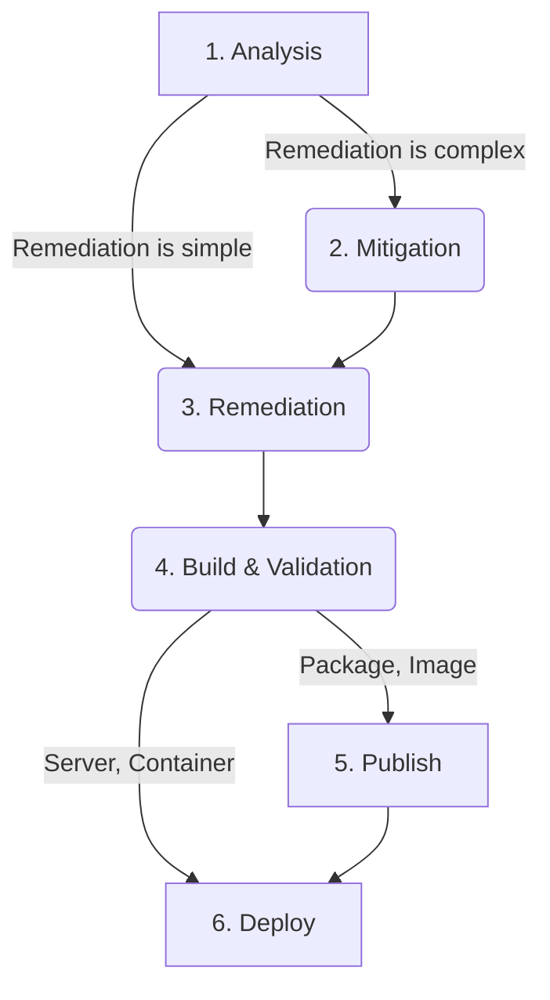

## 概要

このランブックの目的は、脆弱性検出に対処する際の各ステージを明確に定義することです。
全体として、このプロセスは以下のフロー図の番号付きステージで示すように、いくつかの主要なフェーズに分かれています。
番号付きの各フェーズはこのランブックのセクションでさらに詳しく説明します。
脆弱性検出を完全に修正するために必要な作業は実際の検出結果によって異なるため、すべてのフェーズがすべての検出結果に当てはまるわけではありません。
脆弱性が検出された環境、修正の複雑さ、検出されたアセットの種類（コンテナ、パッケージ、イメージなど）によって、必要なステップが異なる場合があります。

## 修正フロー

## 脆弱性修正のフェーズ／ステップ

### 1. 分析

このフェーズでは、脆弱性が検出されたコード、パッケージ、イメージ、またはインフラストラクチャの文脈における影響を評価します。
脆弱性検出を最初に通知される人によって、これは GitLab Security または他の GitLab チームメンバーが最初に実施する場合があります。

このステップの目的は次の点を理解することです。

- 脆弱性を悪用するために必要なもの
- 悪用が可能かどうか、およびその可能性
- 悪用が成功した場合の影響
- 悪用を防ぐために必要な変更の一般的な複雑さ

脆弱性検出を分析した結果悪用できないと判明した場合でも、検出結果に対処する必要がなくなるわけではありません。これは検出の影響を下げ、結果として脆弱性検出の解決に関する SLA を調整するために使用できます。詳細については、[なぜ脆弱性を修正すべきか?](../why-should-we-fix-vulnerabilities.md) ハンドブックページを参照してください。

影響評価で支援が必要な場合は、[Product Security](/handbook/security/product-security/vulnerability-management/_index.md#contact) に連絡してください。

影響が把握できたら、検出された脆弱性を追跡するために使用される関連 GitLab Issue に、完全に修正するための高レベルの計画を文書化する必要があります。

### 2. 緩和

このステップは、ほとんどの脆弱性検出には通常必要ありません。通常は、検出結果の修正に集中します。

緩和とは、脆弱性検出の悪用リスクを軽減または除去するためのシステム、コンテナ、ビルド済みイメージ、パッケージ、コードへの変更です。これは脆弱性自体を取り除かない点で、修正とは異なります。建物を改修してより安全なドアロックを追加することを考えると、緩和は修正作業（ロックのアップグレード）の間に建物の周囲に大きな壁を建てることに相当します。緩和はリスク対応として追加することに意味がある場合にのみ意味を持ちます。リスクがすでに低い場合や、修正がシンプルで素早く実施できる場合は、修正作業に直接労力を投入する方が理にかなっている場合があるためです。

脆弱性検出の修正が複雑な場合や、完全に修正することにロジスティック上の課題がある場合は、悪用を防ぐ、または悪用のリスクや影響を許容可能なレベルに低減する緩和を追加することが適切な場合があります。脆弱性検出を適切な [SLA](../sla.md) 内に修正できない場合は、緩和を実施すべきかどうかを判断するのに良いタイミングです。

### 3. 修正

修正とは、脆弱性検出の原因が検出されたシステム、コンテナ、イメージ、パッケージ、またはコードから完全に取り除くために必要な作業を指します。実際に必要な作業は、脆弱性検出の内容と検出された場所によって異なります。

外部または内部の調査から得られる多くの検出結果については、脆弱性を修正するためにコード変更が必要になります。
特定のスキャナータイプや特定の検出タイプの修正に関するアドバイスについては、[脆弱性の修正](fixing-vulnerabilities.md) ランブックを参照してください。

修正は、緩和が実施されている場合でも常に実行すべきです。なぜなら、脆弱なコードパスや依存関係がコード、イメージ、またはシステムに残ったままになるリスクを低減し、将来的に [エクスプロイトチェーン](https://en.wikipedia.org/wiki/Exploit_(computer_security)#Classification) の有用な一部として活用される可能性を防ぐためです。

検出結果やスキャナータイプに基づくより具体的な情報については、[脆弱性の修正](fixing-vulnerabilities.md) ランブックを参照してください。

### 4. ビルドと検証

影響を受けたアセット（コンテナイメージ、実行中コンテナ、サーバー、パッケージ、コード）と検出結果に応じて、修正が正しく適用されたことを検証する手順は異なります。検証の目的は、変更が効果的で、脆弱性検出が再検出されないことをどう確認するかを確認することです。通常、これには影響を受けたイメージやパッケージの再ビルドが必要となり、更新されたイメージまたはパッケージをテストできるようにします。

コンテナイメージのスキャンの場合、検証はイメージ内のパッケージや基盤イメージ自体を更新した後で、イメージに対してスキャナーを手動で再実行するか、最初に検出を生成したパイプラインを再実行するだけでシンプルに済む場合があります。

依存関係スキャンの場合、検証には更新されたブランチをプッシュするか、依存関係スキャンツールを直接実行して、影響を受けたライブラリを更新した後に検出結果が再検出されないことを確認することが含まれます。

デプロイ済みのサーバーやコンテナでは、最初にテストサーバーやテスト用 Kubernetes 環境でアップグレードをテストし、影響を受けたコンポーネントが再検出されないことを確認する必要がある場合があります。Wiz などのインフラストラクチャスキャンツールから検出結果が来た場合は、変更を検証しているテスト環境を確認して、検出結果が再検出されないことを確認する必要があるかもしれません。本番システムへの変更は、変更や更新をデプロイする前に、検証の一形態としてテスト環境でテストすることが推奨されます。

### 5. 修正の公開と 6. デプロイ

GitLab のコードやイメージで修正されてリリースされるセキュリティ Issue については、[GitLab Security Release Project](https://gitlab.com/gitlab-org/release/docs/-/tree/master/general/security) で GitLab リリースプロセスに従う方法に関する追加のドキュメントとガイダンスも参照してください。

修正が検証されたら、影響を受けたアセット（サーバー、コンテナ、コンテナイメージ、パッケージ、またはコード）の種類に基づいて、ビルド済みアーティファクト（コンテナイメージ、パッケージ）について新しいバージョンを修正と共に公開する必要があるのが一般的です。これは他のソフトウェアバグと同様で、通常のビルドと公開のステップに従って、修正されたアセットをイメージまたはパッケージのユーザーが利用できるようにする必要があります。検出結果がデプロイ済みサーバーやコンテナで検出された場合も、ビルド済みアセットの公開は通常、影響を受けたサーバーまたは実行中コンテナへ変更をデプロイするための前提ステップとなるため、公開済みコンテナイメージまたはパッケージの公開も必要になる可能性があります。

コンテナイメージやパッケージなど公開済みアセットの場合、新しいリリースが作成されてユーザーが修正にアクセスできるようにアップグレードできるようになるため、通常はこの公開でプロセスは終了します。

デプロイ済みのシステムや環境の場合、影響を受けたサーバーやコンテナへ更新されたコード、パッケージ、イメージをデプロイするためのデプロイメントタスクが必要となり、必要に応じて変更管理も実施します。GitLab 所有のコード、イメージ、パッケージにおける脆弱性の場合、通常はデプロイ前にそれらのアセットが公開されることに依存します。サードパーティ依存関係における OS とコンテナベースイメージの脆弱性検出の場合は、新しいイメージやパッケージを公開する必要がないため公開ステップをスキップでき、代わりに（OS パッケージマネージャーなどの）組み込みアップデート機構を使用して脆弱な依存関係を直接更新することが可能な場合があります。

これらのステップが適切に完了すると、検出結果はもはやスキャナーまたはそれを報告した内部・外部のレポーターによって検出されなくなり、それが検証されると、脆弱性検出は完全に修正されたとみなしてクローズすることができます。
