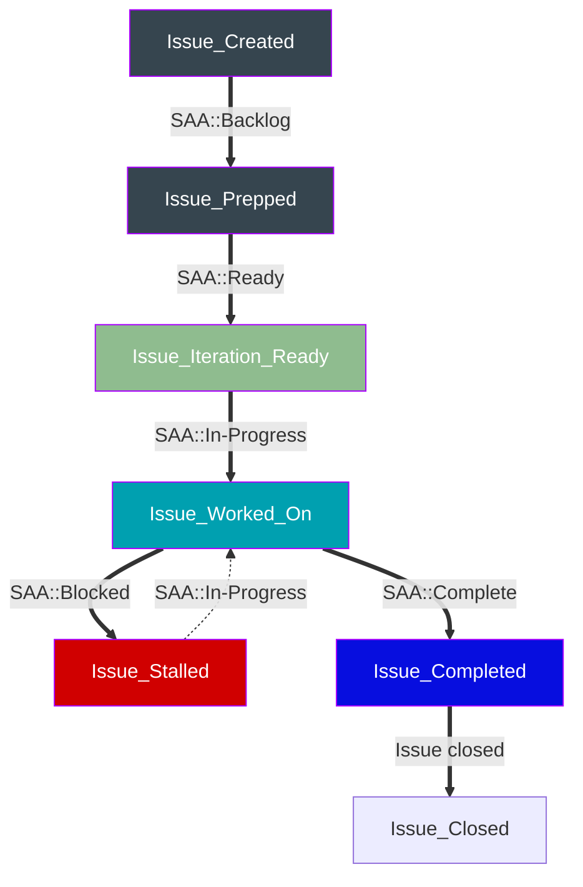

## Security Assurance の成長を支えるチーム

Security Assurance プログラムは、その幅、人員数、複雑さ、スコープのいずれにおいても絶えず拡大しています。Assurance 部門は、異なるプロセス、データセット、目標を持つ多数のチームで構成されています。ソフトウェアを通じて効率化を生み出すことに専念する単一のチームを持つことで、部門はより速くスケールでき、個々のプログラムの成長と影響をサポートできます。

私たちは Security Assurance 部門に対して、スクリプトの開発、ソリューションの構築、修正の実装を通じてプロセスを自動化する能力を提供します。専任のリソースにより、カスタムソリューションを構築・将来にわたって保守でき、継続的な付加価値を提供できます。

## Security Assurance Automation チームはどのように運営されているか?

### インテークプロセス

Security Assurance Automation チームと協業するには、以下の自分のチームに該当するリンクから Issue を作成してください。

| [Risk](https://gitlab.com/gitlab-com/gl-security/security-assurance/governance-and-field-security/governance/security-assurance-automation-subgroup/issue-landing/-/issues/new?issuable_template=risk_request)| [Compliance](https://gitlab.com/gitlab-com/gl-security/security-assurance/governance-and-field-security/governance/security-assurance-automation-subgroup/issue-landing/-/issues/new?issuable_template=compliance_request)| [Field Security](https://gitlab.com/gitlab-com/gl-security/security-assurance/governance-and-field-security/governance/security-assurance-automation-subgroup/issue-landing/-/issues/new?issuable_template=field_security_request)| [Governance](https://gitlab.com/gitlab-com/gl-security/security-assurance/governance-and-field-security/governance/security-assurance-automation-subgroup/issue-landing/-/issues/new?issuable_template=governance_request)| [その他のチーム](https://gitlab.com/gitlab-com/gl-security/security-assurance/governance-and-field-security/governance/security-assurance-automation-subgroup/issue-landing/-/issues/new?issuable_template=ad-hoc_request) |
|-|-|-|-|-|

リクエストに関連する作業は、専用の Issue 内で実行されます。作業を追跡するために Epic が必要な場合 (Issue では大きすぎる場合。Issue は通常 1 イテレーションつまり 2 週間以内に完了する範囲にスコープされる)、Issue は Epic に昇格され、ステークホルダーはそこから作業を追跡できます。

### ラベル

GitLab には、チームメンバーが作業を追跡し、現在のステータスを報告し、他のことの中でも特にベロシティのダッシュボードを表示できるネイティブ機能があります。

現在の制約は、GitLab の外側、つまり BI ツール (Tableau) でデータが見えるようにする方法がラベル経由ということです。GitLab にはネイティブの weight や stage 機能があるとはいえ、ラベルを使うことでレポーティングが容易になります。

これらの Tableau ダッシュボードでは、チームが完了した作業、リクエストの発信元、ベロシティが表示されます。そのデータに基づくより高度なメトリクスも作成されます。

ラベルはまた、すべての Issue がカテゴリーに収まるように Issue ボードを整理するのにも役立ち、チームメンバーの貴重な作業が追跡されないままにならないようにします。

#### すべての Issue で

`team::SAA` は、Security Assurance Automation チームが取り扱うすべての Issue に追加されます。

#### Stages (ステージ)

[プロジェクトライフサイクル](https://gitlab.com/groups/gitlab-com/gl-security/security-assurance/governance-and-field-security/governance/security-assurance-automation-subgroup/-/boards/7578600?iteration_id=Current)の一部として Issue の現在のステータスを追跡するために使用されます。これらのラベルは、Tableau ダッシュボードの主要な入力として Weight と組み合わせてベロシティを追跡するのにも役立ちます。

すべての `SAA::Ready` の作業には、トリアージ/グルーミングプロセスの一環として weight が割り当てられている必要があります。

作業が完了したら `SAA::Complete` を追加するのを忘れないでください。Issue は、まだオープンしているすべての `SAA::Complete` Issue をクローズすることで、イテレーションの終わりにクローズされます。

イテレーション開始後にイテレーションに追加された Issue には、`Unplanned` ラベルを追加してください。これは、計画外の作業がベロシティとキャパシティにどのように影響するかを追跡するのに役立ちます。

| ラベル名 | 意味 |
| --- | --- |
| `SAA::Backlog` | すべての新規 Issue はこのラベルから始まる |
| `SAA::Ready` | グルーミングおよびレビューが終わると、これらの Issue はイテレーション中にピックアップ可能 |
| `SAA::In-Progress` | Issue が活発に作業されている |
| `SAA::Blocked` | 作業は開始されたが、依存関係により進捗が妨げられている |
| `SAA::Complete` | すべての作業が完了している |
| `Unplanned` | これらの Issue はイテレーションに計画されていなかったが、ピックアップされた |

#### Type (種別)

Type ラベルを使って、その作業が何についてのものかを判別します。カテゴリーは可能な限り識別性を高め、チームメンバーが行われている作業の性質を素早く理解できるようにしています。

これらのカテゴリーは、作業項目に応じて変更または拡張可能であり、目標は常に SAA チームメンバーが取り組んでいる内容を正確に捉えることです。

| ラベル名 | 意味 |
| --- | --- |
| `SAA-Type::Planning` | プロジェクト管理活動 |
| `SAA-Type::Documentation` | ドキュメントの執筆、刷新、改善 |
| `SAA-Type::Maintenance` | 現在の自動化の保守に関する Issue |
| `SAA-Type::Metrics` | ダッシュボード、レポーティング、メトリクスに関する作業 |
| `SAA-Type::Testing` | QA、テスト作成、コードレビュー |
| `SAA-Type::API-Integration` | システム間統合 |
| `SAA-Type::Process-Automation` | 手動のチームプロセスの自動化 |
| `SAA-Type::Control-Automation` | コントロールテストの特定の自動化 |

#### Source (ソース)

Source ラベルを使って、作業項目がどこから来たのかを判別します。その外部チームから派生した追加の Issue は、最初の Issue が直接来たものであっても常に同じソースになります。

`SAA-Source::Assurance-Automation` は、直接の外部ステークホルダー/依存関係が存在しない内部作業のために予約されています。このラベルは、何らかの作業の v1 がすでに納品された後にも使用できます。

| ラベル名 | 意味 |
| --- | --- |
| `SAA-Source::Risk` | Risk からのリクエスト |
| `SAA-Source::Governance` | Governance からのリクエスト |
| `SAA-Source::Compliance` | Compliance からのリクエスト |
| `SAA-Source::Field-Security` | Field Security からのリクエスト |
| `SAA-Source::Assurance-Automation` | 内部作業 |
| `SAA-Source::Ad-Hoc` | 上記以外のチーム (リーダーシップなど) からのリクエスト |

### Security Assurance Automation は何をオーナーとして持つか?

Security Assurance Automation チームは、手動プロセスに対する新しい自動化ソリューションを継続的にエンジニアリングしています。以下は、チームが保守しているプロジェクトの一部です。

#### Feedback Bot

[Feedback Bot](https://gitlab.com/gitlab-com/gl-security/security-assurance/feedback-bot) - チームメンバーが Slack を通じて他のチームメンバーにプライベートなフィードバックを送信できるようにするボットです。

#### Escalation Engine

[Escalation engine](https://gitlab.com/gitlab-com/gl-security/engineering-and-research/automation-team/escalator) - ユーザーが事前に定義された一連の基準に基づいて Issue 上で自動アクションを実行できるエンジンです。エンジンはスケジュールされた CI パイプラインで実行されます。

#### ダッシュボード

[Tableau Dashboarding](https://10az.online.tableau.com/#/site/gitlab/views/DRAFTZenGRCObservations/ZenGRCObservationsDashboard) - GitLab 全体のデータソースと統合される分析ツールを使用したカスタムダッシュボード。

[Insight Dashboarding](https://docs.gitlab.com/ee/user/project/insights/index.html#configure-your-insights) - GitLab ネイティブのカスタム Issue 分析ダッシュボード。

#### コンプライアンスコントロールの監視と証拠収集の自動化

手動のコンプライアンスコントロール監視と証拠収集プロセスの、部分的または完全に自動化されたプロセスへの変換。これにより時間が節約され、コントロールフレームワークが拡大するにつれて人為的エラーや見落としの機会が減少します。

[User Access Review Automations](https://gitlab.com/gitlab-com/gl-security/security-assurance/governance-and-field-security/governance/security-assurance-automation-subgroup/user-access-review-pipelines) - UAR 証拠リクエスト周りの自動化 (非ダイレクト同期) と、変更リクエスト受信時のアクセスリクエスト自動作成周りの自動化。

[GitLab Project Testing and Populations](https://gitlab.com/gitlab-com/gl-security/security-assurance/governance-and-field-security/governance/security-assurance-automation-subgroup/gitlab-testing-and-populations) - GitLab.com 周りの、証拠収集と自動テスト実行の自動化。

## ソフトウェア開発ライフサイクル

### 計画

計画段階は、1:1、隔週のスプリント計画ミーティング、Slack の会話、エピック/Issue のコメント、その他のコミュニケーションチャネルで発生します。この段階で、対応する Issue または Epic に以下の情報を収集・記録します。

- 自動化プロジェクトを誰がリクエストしているか?
- 何をリクエストしているか?
- なぜこのプロジェクトをリクエストしているのか?
  - どのような効率化が得られるか?
  - どれだけの時間が節約できるか?
- このプロジェクトはいつまでに完了する予定か?
- 自動化はどのように機能することが期待されているか?
- 期待される時間節約はどれくらいか? (該当する場合)

計画段階の結果として、特定のプロジェクトの実現可能性を判断し、完了に向けたおおまかなロードマップを描こうと試みます。

### 分析

分析段階では、承認されたプロジェクトをサポートするための詳細を引き続き収集します。プロジェクトはアジャイル開発アプローチをサポートするために個別のコンポーネントに分解されます。これらの個別のコンポーネントは、プロジェクトエピックの下の子 Issue として、または小規模な作業の場合は関連するタスク/Issue として表現されます。

合意されたスケールは、weight 1 が営業日 1 日に等しいというものです。これは、各イテレーションでチームメンバーが 10 ポイント以上の作業を割り当てられないことを意味します。

これにより、計画外の作業や繰り越された Issue を効果的に追跡し、大きな作業のかたまりをより小さな管理可能な Issue に分割する機会を考慮できます。

このアプローチは、チームが Issue に割り当てる適切な weight を測ることに貴重なエンジニアリング時間を費やさないように、十分に柔軟です。

作業が 1 営業日未満で済む場合でも、シンプルさのために weight 1 が使用されます。

| Weight | 工数レベル |
| -------- | ---------- |
| 1 | Basic - シンプル、通常は最小限の労力で解決でき、シンプルな解決策を持つサブ Issue。通常、依存関係はない。 |
| 2 | Intermediate - 中程度の複雑さの Issue で、いくつかの依存関係 (AR、特殊な知識、API 接続) があるか、チームメンバー間である程度の調整を必要とするもの。 |
| 3 | Advanced - 多くの依存関係があり、完了するためにチーム間の調整を必要とする、より複雑な Issue。これらの Issue は解決にもっと時間がかかる。 |
| 5 | Challenging - ある程度の複雑さを持つより大きな Issue で、特殊な知識または実質的な問題解決を必要とするもの。アーキテクチャ設計と意思決定を含む可能性がある。これらの Issue は通常、より小さなサブ Issue に分割される。 |
| 8 | Complex - より大きく、より複雑な Issue で、アーキテクチャ設計と意思決定を必要とするもの。これらの Issue は複雑で、複雑な API を含むか、広範な変更を必要とする。これらの Issue は、より小さなサブ Issue に分割される。 |

### 設計

設計段階では、以下を達成することを目指します。

- 自動化プロジェクトの要件を満たす最小実用製品 (MVP) ソリューションの設計を作成する
- モジュール式のコンポーネントを設計する
- 将来の開発プロジェクトを加速するために再利用可能なコンポーネントを設計する

### 開発とテスト

この段階では、特定のプロジェクトの要件を満たすためにコードが書かれます。開発は、多くの小さな変更を通じて反復的な方法で達成されます。コードを書いている間、プロジェクトの期待との継続的な整合性を確保するために、プロジェクトステークホルダーが相談に応じる場合があります。

Security Assurance Automation エンジニアは、バグ、脆弱性、ユーザビリティ上の競合を特定するために自分のコードに対してテストを実行します。

#### コーディング標準

ソフトウェアを開発するとき、私たちの高レベルの目的は [The Zen of Python](https://en.wikipedia.org/wiki/Zen_of_Python) に従うことです。これは Python のコアの一部であり、`this` モジュールをインポートするだけでアクセスできます。たとえば CLI で次を実行します: `python -c "import this"`。

技術要件、スコープ、顧客の期日に基づいて、私たちの標準は 2 つのカテゴリーにグループ分けされます: `Scripts` と `Modules` です。高レベルから見ると、`script` は直接実行することを意図した `.py` ファイルであり、一方 `module` は PyPi レジストリに公開され、より深い機能を提供するために `scripts` にインポートされる `.py` ファイル (またはファイルセット) です。

一般的な哲学は、新しいリクエストを [scripts リポジトリ](https://gitlab.com/gitlab-com/gl-security/security-assurance/governance-and-field-security/governance/security-assurance-automation-subgroup/scripts) に置かれるスクリプトで解決し、複数のスクリプト間で十分な共通性が見られるようになったら、その機能を独立したリポジトリのモジュールに変換することです。

これらそれぞれのテンプレートは、[SAA Project Templates](https://gitlab.com/gitlab-com/gl-security/security-assurance/governance-and-field-security/governance/security-assurance-automation-subgroup/project-templates) サブグループの下にあります。

モジュールリポジトリの `.gitlab-ci.yml` は、コードをテストおよびパッケージ化し、GitLab の [PyPi Registry](https://docs.gitlab.com/ee/user/packages/pypi_repository/) に公開するために使用されます。一方、scripts リポジトリでは、LINT とセキュリティスキャンが焦点になります。最後に、スケジュールされた / 定期的な実行は、SAA の [schedules](https://gitlab.com/gitlab-com/gl-security/security-assurance/governance-and-field-security/governance/security-assurance-automation-subgroup/schedules) サブグループの下に作成されたプロジェクトで管理する必要があります。

以下は、標準化を支援するために使用するライブラリのリストです。

  1) すべてのプロジェクト
     - GitLab REST API 接続: [python-gitlab](https://python-gitlab.readthedocs.io/en/stable/)
     - ロギング: [loguru](https://loguru.readthedocs.io/en/stable/)
     - テストフレームワーク: [pytest](https://docs.pytest.org/en/stable/)
     - テストカバレッジ: [coverage](https://coverage.readthedocs.io/en/coverage-5.3/)
        - テストカバレッジ (バッジ): [coverage-badge](https://pypi.org/project/coverage-badge/)
     - LINT & コードフォーマット: [ruff](https://docs.astral.sh/ruff/configuration/#pyprojecttoml-discovery)
     - [Pre-Commit Hooks](https://gitlab.com/groups/gitlab-com/gl-security/security-assurance/governance-and-field-security/governance/security-assurance-automation-subgroup/-/wikis/Pre-Commit-Hooks)
  2) Scripts
     - 依存関係管理: [Pipenv](https://pipenv.pypa.io/en/latest/)
     - CLI: [argparse](https://docs.python.org/3/library/argparse.html)
  3) Modules
     - 依存関係管理: [PDM](https://pdm-project.org/en/latest/)
        - [PDM](https://pdm-project.org/latest/) は、[PEP 621](https://peps.python.org/pep-0621/)、[PEP631](https://peps.python.org/pep-0631/)、[PEP 517](https://peps.python.org/pep-0517/) を直接サポートしているため、[Poetry](https://python-poetry.org/) より選択された
     - CLI: [click](https://click.palletsprojects.com/en/stable/)

`Simple is better than complex.` ということで、この標準定義は最小限のままにとどめます。

### 実装

この段階では、コードは Sec Auto Dev パイプラインから Sec Auto Live パイプラインに移動されます。自動化リクエストが Web ホスティングまたはサーバーを必要とする場合、その自動化は Sec Auto Live のプライベート GCP インスタンスに置かれます。

コードが最終レビューの準備ができたら、Security Assurance のチームメンバーがコードをレビューし、ブランチをマージします。ソリューションが自動化されたプライベートパイプラインで動作するようになると、プロジェクトは「Done」状態に移行されます。

### 保守

自動化されたコントロールおよびプロセスのルーティンおよびブレイクフィックス保守は、サブ部門に関連する自動化について、Security Assurance Automation エンジニアによって実行されます。保守の事前リクエストは、[Security Assurance Automation プロジェクト](https://gitlab.com/gitlab-com/gl-security/security-assurance/governance/security-assurance-automation/-/issues/new?issuable_template=new_automation_issue)を通じて提出できます。

保守タスクは、他のすべての自動化タスクと同様に GitLab Issue を介して追跡されます。

## 成熟度モデル - (非コントロール自動化)

成熟度モデル 1: この段階では、主な目的は自動化機能の基礎的な側面を確立することです。プロセスは手動と自動化のステップの組み合わせを含みます。データ取得は通常、ソースからの手動プルに依存し、しばしば .csv ファイルを利用します。基本的なスクリプトとツールがタスクを実行するために使用されます。

成熟度モデル 2: このフェーズでは、より洗練されたコンポーネントを統合することによってワークフロー自動化を進めることに重点が置かれます。限定的な手動データ抽出が残るかもしれませんが、強化されたスクリプティングとツールの活用に焦点がシフトします。この段階は、まだセルフサービスではなく、手動の開始を必要とする可能性のあるセミ自動化プロセスによって特徴付けられます。

成熟度モデル 3: この高度な段階では、主な目的は手動データ抽出への依存を減らしながら高レベルの自動化を達成することです。手動介入を排除するためには、API との統合が極めて重要です。ソリューションはセルフサービスになり、プロセスはスケジュールされた間隔でパイプライン内でシームレスに実行されます。

## コントロール自動化の成熟度

`現在の状態` および `潜在的な状態` におけるコントロール自動化の成熟度を評価することは、コントロールテストおよび監視を状態的にどこに移行したいか、純粋に時間節約の観点からどれだけのメリットが見込めるかを検討する際に役立ちます。これを評価するには、一般的な定性的および定量的な定義を使用できます。

`現在` 対 `潜在` を考慮するとき、自動化を可能にするためにコントロールプロセスやコントロールテストプロセスの調整が必要になる可能性があることを念頭に置くことが重要です。たとえば、現在のプロセスが一貫性のないワークフローと記録管理で運用方法に高い変動性がある場合、コントロールの設計と運用を手動で評価する際にはこれを考慮できるかもしれません。しかし、これは後の成熟度段階へのテストの自動化に対する障壁であり、コントロール監視において手動の監督を重要なステップとして残します (*高度に変動性のあるプロセスは、おそらく適切に運用するのが難しく、コントロールが意図したとおりに運用されないリスクが大きいという明らかな懸念に加えて*)。

### コントロール自動化成熟度スケール

| レベル | 定性的定義                                                                                                                                                                                                                                                                                  | 定量的定義         | スケーラビリティの可能性 |
|-------|----------------------------------------------------------------------------------------------------------------------------------------------------------------------------------------------------------------------------------------------------------------------------------------------|---------------------------------|-----------------------|
| 1     | テストプロセスの大部分が手動であり、証拠収集を含む。                                                                                                                                                                                                                                                       | テストワークロードの 10% 未満が自動化 | 低                   |
| 2     | 軽微な自動化が行われている (例: ほとんどの証拠が自動的にまたは簡単なセルフサービスリクエストで収集される)。                                                                                                                                                                                                                            | テストワークロードの約 30% が自動化 | 低                   |
| 3     | 中程度の自動化が行われている (例: 証拠はほぼ完全にスケジュールされたまたはセルフサービスの自動化を通じて収集・コンパイルされる。テストの判断は完全に人間が行う)。                                                                                                                                                                                                | テストワークロードの約 60% が自動化 | 中                |
| 4     | コントロールの一部のコンポーネントについて意思決定の段階まで自動化されている (例: 証拠が自動的にレビュー用に収集・コンパイルされる。コンパイルされた証拠への信頼度 100% のテストの一部は自動的に実行され、残りのテストは人間が実行する)。 | テストワークロードの約 80% が自動化 | 高                  |
| 5     | コントロールは、軽微な領域に対する人間のレビューの段階まで完全に自動化されている (例: 証拠がテスト結果とともに収集・コンパイルされ、ごくわずかな記録だけが手動レビューを必要とし、コンパイルされたテストはレビュアーが検討するための洞察を提供する)。                                                                                          | テストワークロードの約 90% が自動化 | 優秀             |
| 6     | コントロールは最大限まで自動化されている。アラートがコントロール有効性の通知の主要な形式となる。テストドキュメントは、コンパイルされたテストではなく出力されたレポートの形で行われる。                                                                                                                                                       | テストワークロードの約 95% が自動化 | 優秀             |

### スケールの使い方

評価されたレベルは、技術的なインプットと実現可能性評価のために Security Assurance Automation のメンバーから、また現在の状態の理解とコンプライアンスプログラムが将来優先する場所の知識のために Security Compliance のメンバーからのインプットによって形成されることを意図しています。

このスケールはコントロール全体に適用できますが、より正確で、ありそうなのは、多くのコントロールが環境に応じて異なる設計と運用がされるため、システム/コントロールの組み合わせ全体に適用されるということです。

#### 現在のレベルの評価

コントロール自動化の成熟度を評価するとき、最初のステップは現在の成熟度の状態を評価することです。これにはある程度の主観性があるかもしれませんが、定性的定義は評価された現在のレベルを伝えるのに役立つはずです。一般に、このレベルは、重大なコントロール変更があるか、現在のコントロール自動化のレベルを進める作業が完了しない限り変わりません。

現在のレベルが評価されたら、エピック/Issue にスコープラベル `ControlAutomationCurrentLevel::Level-X` を追加してください。

#### 潜在レベルの評価

次に、潜在レベルを評価する必要があります。この評価には必然的に主観性があります。これは、コントロールのテスト/監視がどこまで成熟可能と私たちが考えるかについての、現実的でありながら野心的な評価を意図しています。コントロールの潜在レベルを決定するとき、簡単な正当化を追加すると、その評価決定を支える助けになります。オープンされたコントロール自動化 Issue の「最終フェーズ」のようなものには、これが私たちが目指している最終状態であるため、すでにこの情報があるはずですが、まだ存在しない場合は、評価を簡単に正当化してください。

潜在的な評価は、テクノロジーの変更、プロセスの変更などを通じて変わる可能性があります (願わくは良い方向に)。すべてのコントロールがすぐに潜在評価 6 になるわけではなく、それで構いません。より高い成熟度レベル (4+) に到達するためには、コントロール運用者および評価者の観点からのプロセス変更を適応させる必要があるかもしれません。

現在のレベルが評価されたら、エピック/Issue にスコープラベル `ControlAutomationPotentialLevel::Level-X` を追加してください。

 *注意: 潜在を評価するときは、現実的でありながら野心的になるよう努めてください。プロセスが現在運用されているプラットフォーム全体が変更されればプロセスはレベル 6 に到達できるが、それ以外の場合は潜在レベルがレベル 3 だと考えるためにレベル 6 と評価しているのであれば、それは適切な評価ではないかもしれません。一方で、コントロールを運用するチームがプロセスを適度に適応させればレベル 6 になると考える場合は、それは適切な評価かもしれません。*

## <i class="fas fa-id-card" style="color:rgb(110,73,203)" aria-hidden="true"></i> チームへの連絡

[Donovan Felton](https://gitlab.com/dfelton)、@dfelton、Security Assurance Engineer, Automation

- [自動化の設計、開発、実装](/handbook/security/security-assurance/governance/security-assurance-automation/)
- [GRC アプリケーション管理](/handbook/security/security-assurance/#i-idbiz-tech-icons-classfar-fa-newspaperi-core-tools-and-systems)
