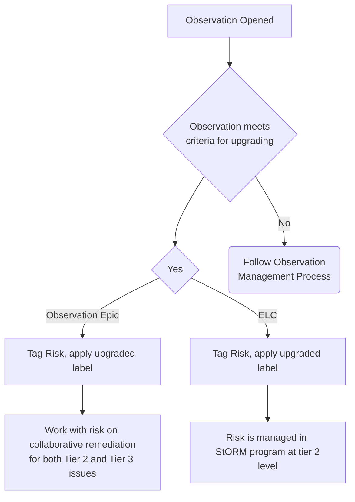
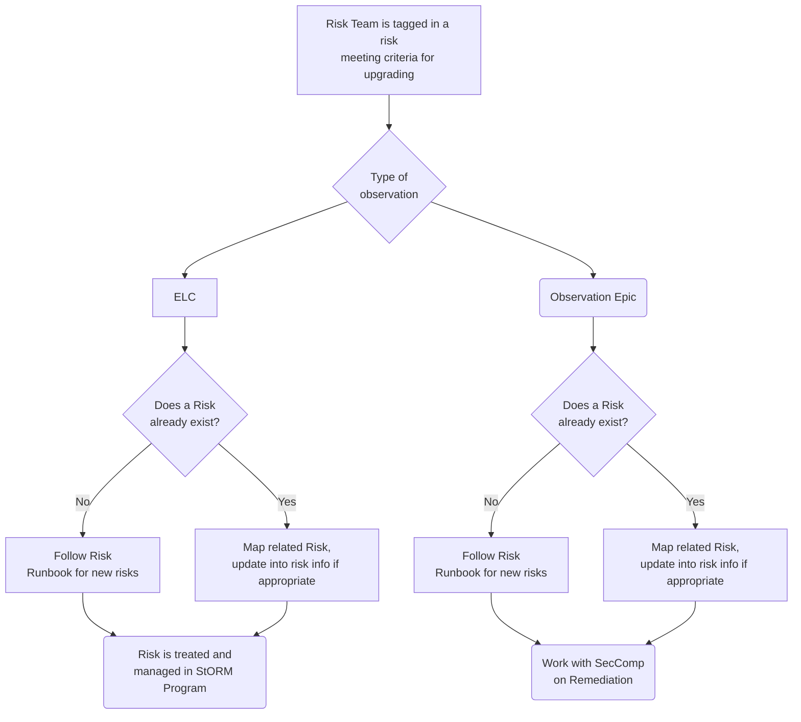

## 目的

GitLab の観察事項管理プログラムは、コンプライアンス運用のアウトプット、または、システム固有のリスクの自己特定など、チームメンバーによるその他のメカニズムにより特定された Tier 3 情報システムリスクに関する所見、例外、不備を特定、追跡、是正し、リスクレーティングを提供するために使用されます。

本手順は、観察事項の作成プロセスについて詳述します。

## 範囲

情報システムまたはビジネスプロセスレベルで特定された Tier 3 リスクまたは観察事項

## 役割と責任

| 役割 | 責任  |
| ---- | ------ |
| Finding Coordinator | 観察事項のライフサイクルを通じて、法的および規制要件を満たすために推奨される是正計画の検証と微調整を含む観察事項の DRI として責任を負います。 |
| Remediation Owner | 観察事項を検証し、担当者と期限を確認し、是正計画を最終決定し、定義された [是正 SLA](/handbook/security/security-assurance/observation-management-procedure/#remediation-sla) に基づいて是正活動を実施します。 |
| マネージャーから経営幹部 | 必要に応じてエスカレーションし、是正活動のためにリソースを割り当てる責任を負います。 |

## 手順

観察事項は、より広範な Unified Risk Management (USRM) 手順内のリスクソースの 1 つです。プログラム構造とワークフローの包括的な概要については、[USRM ハンドブックページ](/handbook/security/security-observations-risk-management/#procedure) を参照してください。本ページでは、観察事項の独自の側面と、それらが標準手順から逸脱する可能性のある方法に焦点を当てています。

### Unified Risk Management (USRM) ワークフローラベル

ワークフローと必須ラベルについては、[USRM ハンドブックページ](/handbook/security/security-observations-risk-management/#required-labels) を参照してください。

### 観察事項カテゴリラベル

このセットのラベルは、メトリクスとレポート、およびチーム間のコラボレーションのために Issue を分類するために使用されます。

| ラベル | 説明 |
| ------ | ------ |
| Department::***   | 是正の責任を負う部門  |
| RiskRating:: Critical| セキュリティコンプライアンス観察事項のリスクレーティング - Critical|
| RiskRating:: High| セキュリティコンプライアンス観察事項のリスクレーティング - High|
| RiskRating:: Moderate| セキュリティコンプライアンス観察事項のリスクレーティング - Moderate|
| RiskRating::Low | セキュリティコンプライアンス観察事項のリスクレーティング - Low|
| Finding Coordinator::*** | ライフサイクルを通じて観察事項を管理する GitLab チームメンバー。 |
| Blocked:: Awaiting Remediation Owner Input    | このフラグは、観察事項マネージャーが remediation owner からの応答を待っていることを示します。   |
| Blocked:: Awaiting Observation Manager Input  | これは、SecAssurance チームの観察事項マネージャー宛の Issue にフラグを立てます                                                                                       |
| Blocked:: New tool implementation in progress | これは、新しいツールの完了待ちの Issue にフラグを立てます                                                                                                     |
| Upgraded::StORM-Managed                       | このラベルは、観察事項が tier 2 リスクにアップグレードされ、StORM プログラムで管理される際に活用されます                                    |
| Upgraded::StORM-Shared                        | このラベルは、観察事項が tier 2 リスクにアップグレードされ、是正が Security Risk チームと Security Compliance チームで共有される際に活用されます |
| NIST CSF Function:*** | NIST CSF function 内の観察事項を識別します|
| NIST CSF Category:*** | NIST CSF category 内の観察事項を識別します|
| seccomp program:***| 観察事項の影響を受けるプログラムまたは外部認証を識別します|
| system::***| 観察事項の影響を受けるシステムを識別します|

### 観察事項の特定

観察事項は、次のチャネルを通じて特定できます。

1. セキュリティコントロールテスト活動（CCM）
1. ビジネスインパクト分析（BIA）活動
1. 外部監査活動
1. ギャップ評価活動
1. アドホックな Issue

### リスクレーティング

Tier 3 情報システムのリスクレーティングは、以下の式に基づいています。

> リスクレーティング = 発生可能性 x 影響度

#### 観察事項の再発の発生可能性の判定

GitLab では、観察事項の再発の可能性および/またはコントロールが観察事項を生成した頻度に基づいて、観察事項を評価します。

| 定性   スコア |  スコアリングガイドライン |
| :--------------------: |  ------------------ |
| **4** | **Persistent/Systemic:** コントロールが複数年にわたって繰り返し観察事項を持っている、または、観察事項がコントロールの根本的な設計上の欠陥に起因しています。 |
| **3** | **Frequent:** コントロールが現在の評価期間（12 か月）内に複数の観察事項を生成しています。 |
| **2** | **Occasional:** 不十分な経営監視がこの観察事項につながっており、再発の可能性があります。これは、現在の評価期間におけるこのコントロールの唯一の観察事項です。  |
| **1** | **Rare:** 非典型的な状況による孤立したインシデント。対処されると再発する可能性は低いです。 |

#### 観察事項の影響度の判定

*注: 監査の影響と是正努力のスコアが異なる場合、十分な注意とリソースを確保するために、より高いスコアを使用してください。*

| 定性スコア | 外部監査の影響 | 是正努力 |
|---|---|---|
| 4 | **Critical**: 文書化された監査所見に *なる* | **Executive レベル**: C-suite のスポンサーシップと部門間の調整が必要 |
| 3 | **High**: 文書化された監査所見になる *可能性が高い* | **Director レベル**: ディレクターのスポンサーシップと専用リソースが必要|
| 2 | **Medium**: 文書化された監査所見になる *可能性は低い* | **Manager レベル**: 経営監視、プロセス更新、部門内の調整が必要 |
| 1 | **Low**: 監査所見に *ならない* | **Individual Contributor レベル**: 既存プロセスの単純な強化または軽微な手順の明確化 |

#### リスクレーティングの判定

発生可能性と影響度のスコアが判定されたら、次の表を使用して観察事項のリスクレーティングを判定できます。

|リスクレーティング|リスクスコア範囲|
|:---------:|:--------------:|
|Critical|16|
|High|12-15|
|Medium|4-11|
|Low|1-3|

### 観察事項の是正

すべての是正活動が完了したら、Remediation Owner は観察事項 Issue で Finding Coordinator をタグ付けする責任があります。Finding Coordinator が割り当てられていない場合は、観察事項 Issue で `@gitlab-com/gl-security/security-assurance/security-compliance` をタグ付けします。

マイルストーン、作業の進捗、是正活動の検証を追跡するのは Finding Coordinator の責任です。Finding Coordinator は、その後、是正活動の完全性を検証し、観察事項を再テストし（該当する場合）、観察事項 Issue をクローズします。再テストが完全に有効な結論につながらない場合、観察事項の説明と是正の推奨事項が、新しい所見と必要な是正タスクを反映するように更新される可能性があります。

### 是正 SLA {#remediation-sla}

観察事項の是正 SLA は、個々の観察事項のリスクレーティングによって決定されます。次の表は、合意された是正計画で別途定義されていない限り、各リスクレーティングの SLA を示しています。

| リスクレーティング | 是正 SLA |
| :---: | :---: |
| Critical | 3 か月|
| High | 6 か月|
| Medium | 12 か月|
| Low | 18 か月|

### 観察事項を Tier 2 リスクにアップグレードするための基準

基準と手順

観察事項プログラムは、tier 2 のセキュリティオペレーショナルリスクを管理する [StORM プログラム](/handbook/security/security-assurance/security-risk/storm-program) への重要なインプットです。以下の基準が満たされた場合、より大きなリスクが存在することを示し、tier 2 のオペレーショナルリスクにアップグレードされ、したがって StORM プログラムに含められます。この基準は次のとおりです。

- エンティティレベルコントロールの観察事項
- 複数の観察事項が共通の根本原因を共有し、観察事項エピックでグループ化されている場合。観察事項エピックは、共通の根本原因と是正パスを持つ複数のシステムにまたがる観察事項のグループです。

### Security Compliance ワークフロー

### Security Risk ワークフロー

詳細な記述:

1. [Observation Intake runbook](https://gitlab.com/gitlab-com/gl-security/security-assurance/security-compliance-commercial-and-dedicated/observation-management/-/blob/master/runbooks/1_Observation%20Intake%20and%20Management.md?ref_type=heads)（社内のみ）に従って観察事項をオープンします。
1. 観察事項がアップグレードの基準を満たしている場合、[StORM DRI](/handbook/security/security-assurance/security-risk/#storm) をタグ付けし、ELC の場合はラベル ~upgraded::storm-managed を、観察事項エピックに追加されている場合は ~upgraded:storm-shared を適用します。
    1. ラベルの定義:
        1. `Upgraded::StORM-Managed`: StORM のリスクマネージャーが是正活動の追跡について単独で責任を負います
        1. `Upgraded::StORM-Shared`: 観察事項とリスクの是正は、StORM のリスクマネージャーと観察事項マネージャーで共有されます。StORM のリスクマネージャーは、共通のイニシアチブを通じて複数のシステムにまたがる是正活動を追跡できますが、観察事項マネージャーは、特定のシステムの是正に責任を負います。詳細については、[コラボレーティブな是正](#collaborative-remediation) セクションを参照してください。
1. Security Risk チームがタグ付けされたら、そのチームの誰かが、基準を満たす観察事項に対して表現されているリスクがあるかどうかを判断します。
    1. 既存のリスクがある場合、彼らは観察事項をリスクにマッピングし、透明性のために GitLab Issue にコメントを残します。
    1. 既存のリスクがない場合、彼らは [STORM Risk Intake runbook](https://gitlab.com/gitlab-com/gl-security/security-assurance/security-risk-team/storm/-/blob/master/runbooks/storm-risk-intake-gl.md?ref_type=heads)（社内のみ）に従って新しいリスクをオープンします。
1. エンティティレベルコントロールの場合、観察事項は完全に StORM プログラムによって tier 2 リスクレベルで管理され、`Upgraded::StORM-Managed` ラベルで表現されます。
1. 観察事項がエンティティレベルコントロールでない場合、Security Compliance は Security Risk と協力して、remediation owner と共にコラボレーティブな是正を行います。

#### コラボレーティブな是正 {#collaborative-remediation}

Security Compliance と Security Risk は、集約された/共通のコントロールを通じて是正する機会を探すべきです。観察事項が共通のコントロールまたは実装を通じて是正できる場合、活動は Security Risk チームによって追跡できます。たとえば、パスワード要件を満たしていないシステムがあり、複数のシステムにわたる是正に Okta との統合が含まれる場合、このロールアウトは Security Risk によって追跡できます。是正がシステム固有の場合、是正活動は Security Compliance によって追跡できます。是正テストは、[Security Compliance remediation runbook](https://gitlab.com/gitlab-com/gl-security/security-assurance/security-compliance-commercial-and-dedicated/observation-management/-/blob/master/runbooks/2_Remediation%20and%20Closeout.md) を使用して、是正活動を追跡しているチームによって完了されます。

### ステータスラベル

以下に定義されているのは、観察事項の是正管理プロセスを支援するステータスラベルです。

| ラベル| 定義|
|--|--|
|`Blocked:: Awaiting Remediation Owner Input`| このフラグは、観察事項マネージャーが remediation owner からの応答を待っていることを示します。 |
|`Blocked:: Awaiting Observation Manager Input`| これは、SecAssurance チームの観察事項マネージャー宛の Issue にフラグを立てます|
|`Blocked:: New tool implementation in progress` |これは、新しいツールの完了待ちの Issue にフラグを立てます|
|`Upgraded::StORM-Managed` | このラベルは、観察事項が tier 2 リスクにアップグレードされ、StORM プログラムで管理される際に活用されます|
|`Upgraded::StORM-Shared` | このラベルは、観察事項が tier 2 リスクにアップグレードされ、是正が Security Risk チームと Security Compliance チームで共有される際に活用されます|

## メトリクスとレポート

リスク、ステータス、部門ごとのすべての観察事項の詳細については、[observation management project](https://gitlab.com/gitlab-com/gl-security/security-assurance/security-compliance-commercial-and-dedicated/observation-management) の [Issue ボード](https://gitlab.com/gitlab-com/gl-security/security-assurance/security-compliance-commercial-and-dedicated/observation-management/-/boards/5659373?label_name[]=Department%3A%3ASecurity%20Compliance) を参照してください。観察事項プログラムの運用メトリクスについては、[Tableau ダッシュボード](https://10az.online.tableau.com/#/site/gitlab/views/ObservationMetrics/SecCompOperationalMetrics?:iid=1) を参照してください。

## 例外

例外は、相互に合意された是正期日に違反した観察事項、SLA 違反、または Remediation Owner が観察事項が是正されないことを確認した場合に作成されます。

この手順に対する例外は、[Information Security Policy Exception Management Process](/handbook/security/controlled-document-procedure/#exceptions) に従って追跡されます。

## 参考文献

- [GCF Control Lifecycle](/handbook/security/security-assurance/security-compliance/security-control-lifecycle/)
- [Observation Management Project](https://gitlab.com/gitlab-com/gl-security/security-assurance/observation-management)
- [Unified Risk Management](/handbook/security/security-observations-risk-management/#procedure)

## 連絡先とフィードバック

観察事項管理プロセスに関する質問やフィードバックがある場合は、[GitLab Security Assurance チームに連絡してください](/handbook/security/security-assurance/#i-idbiz-tech-icons-classfas-fa-usersicontacting-the-team)。
