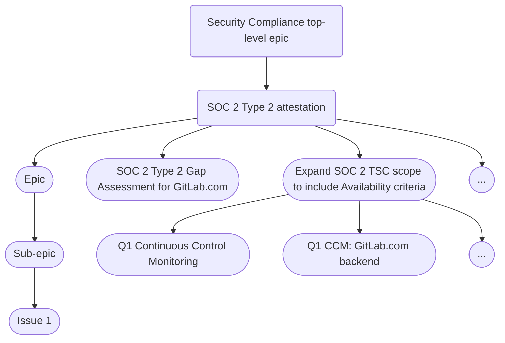

### セキュリティコンプライアンスチームチャーター

最終更新日: 2025-03-20

## ミッションステートメント

セキュリティコンプライアンスチームは、厳格な認証管理とリスク・コントロール監視を通じて、業界で最も信頼される DevSecOps プラットフォームとしての GitLab のポジションを守ります。私たちは、コンプライアンス要件を競争上の優位性に変え、自社製品を活用してセキュリティの卓越性を示すことで、顧客を守ります。

## バリュープロポジション

セキュリティコンプライアンスは、認証の維持と拡張を通じて顧客に保証を提供し、セールスを支援することで、最も信頼される DevSecOps プラットフォームとしての GitLab のポジションを維持します。

## コアコンピテンシー

1. [セキュリティ認証および認定](../security-compliance/certifications/)
   - ギャップ分析プログラム: 認証拡張のための実現可能性分析
   - 外部監査の調整と実施

1. [GitLab のセキュリティコントロールの継続的監視](/handbook/security/security-assurance/security-compliance/sec-controls/)。これらのコントロールは、適用される規制要件、および私たちがコミットしているセキュリティ認証/フレームワークにマッピングされています。

- [Policy-as-code](policy-as-code.md)
- [自動化された証拠収集とコントロールテスト](automated-control-testing.md)
- [ユーザーアクセスレビュー](access-reviews.md)
- [リスクベースのコントロールテスト](risk-based-compliance.md)
- [PCI 内部統制レビュー](pci-internal-control-review.md)
- [FedRAMP 継続的監視](fedramp-compliance.md)

1. [観察事項と是正の管理](../observation-management-procedure.md)

- コントロールの弱点とギャップ（観察事項）を特定する
- 是正の推奨事項とガイダンスを提供する
- 是正の完了までを追跡する

1. 業界および規制の監視と洞察
   - 関連する法律、大統領令、指令、規制、ポリシー、標準、ガイドラインのドラフトおよび変更を監視する。
   - 関連する RFI、RFQ、RFP、パブリックコメント要請への回答に協力する。
   - パブリックセクターのセキュリティとコンプライアンス姿勢に影響を与える可能性のある政府契約言語の変更を監視する。

1. ドッグフーディング
    - 私たちはコアコンピテンシーを実行するために GitLab 製品を使用します
    - 私たちは観察事項を是正しリスクを低減するための GitLab 機能ソリューションを推奨します
    - 私たちは[コンプライアンスペルソナ](/handbook/product/personas/_index.md#cameron-compliance-manager)を体現することで製品にフィードバックを提供します。

## 運用モデル

私たちは、目標に向けて継続的にイテレーションしながら可能な限り効率的になることを目標に、アジャイルプログラムマネジメントとプロジェクトマネジメントのベストプラクティスを使用して作業を整理します。セキュリティコンプライアンスチームメンバーは、私たちの仕事の進め方をどのように改善できるかについて定期的にフィードバックを提供することが奨励されており、これは毎週のチームミーティングのアジェンダの常設トピックです。

### コアプロセス

進行中のすべての作業の唯一の情報源は、セキュリティコンプライアンスの[チームトップレベルエピック](https://gitlab.com/groups/gitlab-com/gl-security/security-assurance/-/epics/289)であり、ここには詳細なステータス更新が含まれます。また、[チームエピックボード](https://gitlab.com/groups/gitlab-com/-/epic_boards/1063538?label_name[]=seccomp-roadmap)を使用してワークフローのステータスを可視化し、[ロードマップ](https://docs.google.com/presentation/d/1TEJzAkdoi_U-ubg7qhj1ZUpi2_VQYNF5DTOT5Mj1Mqo/edit?usp=sharing)と比較しています。ロードマップに直接関連するすべての作業はこれらの中で行われ、Issue は[セキュリティコンプライアンスチーム Issue トラッカープロジェクト](https://gitlab.com/gitlab-com/gl-security/security-assurance/security-compliance/team)で起票されるべきです。これは2つの理由で重要です。堅牢なラベリングスキームを使用して単一の場所で作業を集中・整理することで効率的に作業できること、そしてさまざまな運用メトリクス（パフォーマンス指標）について報告できることです。

[FedRAMP 認可プログラム](/handbook/security/security-assurance/security-compliance/fedramp-compliance/)に関連する私たちの作業の多くは、残念ながら私たちのコントロール外の規制上の義務により、GitLab の他の部門には見えません。可能な限り透明性と可視性を私たちの作業にもたらし、基本的なメトリクスの追跡を継続するためには、認可境界内の詳細な Issue へのリンクを伴うハイレベルなタスクを追跡するためであっても、エピックボードと Issue トラッカーを可能な限り使用し続けることが重要です。

### 私たちの働き方

<details><summary>私たちの働き方</summary>

#### エピック階層

私たちのチームトップレベルエピックは単に、エピックの担当者 / 直接責任者 (DRI) のステータス更新の SSOT です。直近の子エピックには `seccomp-roadmap` ラベルが付けられ、エピックボードに表示され、事実上私たちのロードマップを構成します。

1. サブエピックは、言及されたアイテムを提供するために必要なタスクをグループ化します
1. サブエピックはロードマップのアイテムを表し、特定のフェーズで提供されます
1. サブエピックは複数月にまたがることがありますが、その終了日は追加されたロードマップフェーズの「予定完了日」と一致するべきです。

以下の図は、完全な階層をたどる例を示しています。



#### エピック担当者の責任

各エピックには、プロジェクトの提供に最終的な責任を持つ単一の DRI がいます。これは彼らがすべての作業を行うという意味ではなく、作業が進行していること、ブロッカーが迅速に対処またはエスカレーションされていること、そして毎週ステータスを報告していることを保証するという意味です。

DRI は次のことを行う必要があります。

1. 他者と連携して、Issue をボードを横断して移動させる（例えば、トリアージから進行中、完了へ）
1. エピックおよびネストされた子エピックと Issue が適切なラベルを使用していることを保証する
1. エピックがエピック構造（次のセクション）で概説されている基準を満たしていることを保証する
1. 達成事項、次のステップ、全体的な健全性ステータス、ブロッカーを含む、エピックのステータス更新を毎週提供する

#### エピック構造

私たちのトップレベルチームエピック直下の各子エピックには以下を含める必要があります（必要に応じてクイックアクションを調整してください）。

```markdown
## Background

## Objective

## Exit criteria
- [ ]

<!--Edit Labels-->

/label ~"FY27-Q1" ~"seccomp-function::gap assessments"  ~"seccomp workflow::triage" ~"team::security compliance" ~"seccomp-roadmap" ~"ciso-workflow::process"
/health_status on_track
/due YYYY-MM-DD
/assign me
/set_parent &289

-----------
<!--DO NOT EDIT BELOW THIS LINE-->

<!--STATUS NOTE START-->

<!--STATUS NOTE END-->
```

下部のステータスノートコメントは、これらのエピックとチームエピックに[ステータス更新](#status-updates)を自動投稿するために使用されるため重要です。

**含めるべきエピックメタデータ**

1. **担当者** は DRI であり、エピックが `seccomp workflow::in progress` に移動した時点で記入する必要があります
1. **開始日** は予想開始日に設定され、プロジェクトが開始されたら実際の開始日に更新されます
1. **期日** は予想終了日に設定されます
    1. 期日はロードマップに基づいて設定されます
    1. プロジェクトが実際に終了した日付は、エピックがクローズされた日付から取られます
1. **健全性ステータス** は最新の状態に保たれるべきです（順調、注意が必要、リスクあり）

ラベルは[ラベルセクション](https://gitlab.com/gitlab-com/gl-security/security-assurance/security-compliance/team#labels)で説明されています。

#### ロードマップ

すべてのエピックと Issue には、公式の[ロードマップ](https://docs.google.com/presentation/d/1TEJzAkdoi_U-ubg7qhj1ZUpi2_VQYNF5DTOT5Mj1Mqo/edit?usp=sharing)に従って期日が設定されます。

エピックの期日 / ロードマップアイテムを更新するプロセス:

1. 各月末後、セキュリティコンプライアンスマネジメントはエピックの（予想される）期日をレビューし、エピックが計画されたフェーズを超える場合、エピックの担当者 / DRI と協力してロードマップの変更を判断します。
1. その後マネジメントはロードマップの調整を判断し、未完了の作業をシフトさせた後も将来のフェーズで計画されている作業が現実的であるようにします。
1. ロードマップの変更は次の週次同期で共有されます。

### ステータス更新

私たちは、チームメンバーがステータス更新を一度だけ提供すればよく、マネジメントはそれをレビューするために常に1か所だけに行けばよいことを保証するために、自動化を活用しています。これは GitLab で歴史的に大きな問題でした。エピックと Issue がさまざまなサブグループとプロジェクトに分散していたためです。

セキュリティコンプライアンスロードマップに関連するすべての作業のステータスは、一目で見えるように[トップレベルチームエピック](https://gitlab.com/groups/gitlab-com/gl-security/security-assurance/-/epics/289)の説明に保持されます。

#### 週次ステータス更新プロセス

DRI は次のプロセスに従って DRI のエピックの週次更新を提供する必要があります。

1. **毎週木曜日午後**、*アクティブな*エピック（`seccomp workflow::triage` 以外のもの）のエピック担当者 / DRI は、エピックのコメントで @メンションされ、ステータス更新で返信するよう求められます。
1. **金曜日 17:00 UTC / 12:00 PM ET まで**に、*アクティブな*エピックの DRI（DRI が OOO の場合はカバーする人）は、子エピックと Issue の関連する詳細を含むエピックのステータスに関する更新を、エピックの[説明のステータスセクション](#epic-structure)に提供します。
   - 子エピックの DRI がエピック DRI と異なる場合、エピック DRI は子エピック DRI から更新を取得する責任があります。
     - 週次更新のフォーマットは、以下の3つの項目それぞれについての簡潔な更新（〜1文または2〜3個の箇条書き）であるべきです。
       - **前回更新からの進捗** - 本番環境にデプロイされた変更、解消されたブロッカー、その他達成された進捗。
       - **リスクと信頼度** - 新たに特定されたブロッカーや、継続している既存のブロッカーはありますか？現在または近い将来のその他の課題はありますか？これらのブロッカーや課題は、ロードマップによる予定期日までに完了することへの私たちの信頼度にどう影響しますか？
       - **緩和策** - 特定された課題やブロッカーを克服するために何が必要ですか？これは他のチームメンバー、チーム、エグゼクティブ、またはドメインエキスパートにエスカレートすべきですか？
   - **ワークフローと健全性ラベルを更新する** - 各ステータス更新後、ワークフローラベルと健全性ステータスを更新する必要があります。ラベル構造の詳細については、[SecComp チーム Issue トラッカー Readme](https://gitlab.com/gitlab-com/gl-security/security-assurance/security-compliance/team/-/blob/main/README.md?ref_type=heads) を参照してください。
1. **トップレベルエピックステータス更新**[自動化](https://gitlab.com/gitlab-com/gl-infra/epic-issue-summaries)は定期的に DRI のステータス更新返信コメントから更新を統合し、自動的にそのエピックとトップレベルチームエピックにステータスを記入します。
1. 効率を確保するために、Slack でのブロードキャストを含む、他の部門、ディビジョン、または OKR ステータス更新でも同じステータス更新を使用します。

### バックログリファインメント

新しい四半期の開始前に、チームはエピックバックログのリファインメントに時間を費やします。このプロセスはチームマネージャーが主導し、ロードマップに従って次の四半期にターゲットされたエピックを確認し、各エピックに以下の情報が含まれていることを保証します（必要に応じて異なるステークホルダーを引き入れて詳細を埋めます）。

- 背景（例: コンテキストとこの作業の目的を提供する。それは何で、なぜ関連するのか？）
- 目的（計画/解決策を説明する SMART な目標: Specific, Measurable, Achievable, Relevant, Time-bound）
- 終了基準（作業をより小さな論理的なチャンクに分割し、依存関係と前提条件を強調する）

上記の情報が追加されると、エピックは Triage から Ready ステータスに移動します。目標は、その四半期の計画されたロードマップアイテムを Ready リストに含めて各四半期を開始することです。

</details>

### エンゲージメントモデル

- Slack
  - セキュリティコンプライアンスチーム全体に届くように、`@sec-compliance-team` をタグ付けして自由にお問い合わせください
  - 私たちのチームに関する質問には、`#security-help` または `#security-discuss` Slack チャンネルが最適です（@security-assurance をタグ付けすることもできます）
- GitLab でタグ付け
  - `@gitlab-com/gl-security/security-assurance/security-compliance`

## 成功メトリクス

| **主要メトリクス** | **なぜ重要か** | **計算方法** | **目標しきい値** | **測定頻度** | **報告メカニズム** | **追加注記** |
| ------ | ------ | ------ | ------ | ------ | ------ | ------ |
| 平均是正時間 | このメトリクスは、SLA と比較したコンプライアンス観察事項を是正する私たちの能力を追跡します。 | 各リスクレベルおよび四半期ごとに分けられた、[観察事項プロジェクト](https://gitlab.com/gitlab-com/gl-security/security-assurance/security-compliance-commercial-and-dedicated/observation-management) 内で Issue が作成されてからクローズされるまでの時間の計算。 | 是正 SLA: Critical = 3 か月、High = 6 か月、Medium = 1 年、Low = 1.5 年 | 四半期 | [Tableau ダッシュボード](https://10az.online.tableau.com/#/site/gitlab/views/ObservationKPI/ObservationKPIs?:iid=1) | 観察事項は、次の基準が満たされた場合にマネジメントにエスカレートされます: 観察事項が Critical または High リスクであり、かつ観察事項が SRQ/StORM プログラム内のトップ5リスクに関連しており、割り当てられた是正オーナーまたは完了予定タイムラインがない場合。 |
| 認証別の新規ビジネス機会の TCV / ARR | このメトリクスは、製品とエンジニアリングとの取り組みの優先順位付けのために、認証への需要（$）を追跡します | 顧客の認証リクエストを取得するためのドロップダウンフィールドを Salesforce に追加することに取り組んでいます。 | TBD | TBD | TBD | これは未完了です。これを可能にするためにセールスチームと協力しています。 |
| NIST CSF 機能およびカテゴリ別のコンプライアンス姿勢（合格コントロールの%） | 各機能/カテゴリにおけるコントロールの有効性のレベルを示し、マネジメントがどの領域が強いか、または改善が必要かを理解するのに役立ちます。 | 各 NIST CSF カテゴリと機能領域について、会計年度に完了したアセスメントのテスト結論を活用します。 | 各機能とカテゴリで 90% 以上が合格 | 四半期 | tbd | これはまだ完了していません。Hyperproof と GAS GRC ツールの移行、および GCFv4 への移行を考慮すると、FY26 のデータについてまだ完了していません。完了予定: Q3 初旬。 |
| Fresh なコンプライアンス所見（観察事項）の数 | このメトリクスは、私たちの認証とセキュリティ姿勢に影響を与える是正オーナーやアクティビティとのエンゲージメントを維持する能力を捉えます。 | これは観察事項管理リポジトリのオープン Issue の最終更新日を見ています。 | Issue の 80% が fresh | リアルタイム | [Tableau ダッシュボード](https://10az.online.tableau.com/#/site/gitlab/views/ObservationMetrics/SecCompOperationalMetrics?:iid=1) | n/a |

## FY26 戦略的イニシアチブ

### 主要なフォーカス領域

| # | 目的 | 主要な成果物 | タイムライン |
|:-:| :-------- | :--------------- | :------: |
| 1| FedRamp ATO | - Agency ATO 取得 <br> - FedRAMP マーケットプレイスでの FedRAMP Authorized <br>| FY26 を通じて継続中 |
| 2| 認証拡張 | - ISO 42001 および ISMAP のギャップ評価を実施 <br> - 認証に向けた私たちの姿勢と準備状況に関する監査レポートを準備し共有する <br> - 特定されたギャップの是正をサポート <br>| 評価とレポート - Q1FY26 末 <br> 是正 - FY26 を通じて継続中 |
| 3| コントロールフレームワークの洗練 | - コンプライアンスカバレッジを拡大し、コントロール管理を自動化し、ドキュメントを強化することで、GitLab のコントロールフレームワーク実装を合理化し、将来のスケーラビリティをサポートする。 | FY26 を通じて継続中 |

### レビューと更新

このチャーターは、以下との整合性を確保するために四半期ごとにレビュー・更新されます。

1. GitLab 戦略
1. [セキュリティ部門のミッションとビジョン](/handbook/security/#i-classfas-fa-rocket-idbiz-tech-iconsi-security-vision-and-mission)
1. [セキュリティの複数年戦略](https://internal.gitlab.com/handbook/security/information_security_goals_and_priorities/)（社内のみ）
1. [セキュリティアシュアランスのミッションとビジョン](/handbook/security/security-assurance/#i-classfas-fa-rocket-idbiz-tech-iconsi-security-assurance-mission-and-vision)
1. [セキュリティアシュアランスの複数年戦略](https://internal.gitlab.com/handbook/security/security-assurance/security_assurance_strategy/)

次回スケジュールされたレビュー: [2025-07-31]

## 参照

- [セキュリティ認証](../security-compliance/certifications/)
- [GCF セキュリティコントロールライフサイクル](/handbook/security/security-assurance/security-compliance/security-control-lifecycle/)
- [GCF セキュリティコントロール](/handbook/security/security-assurance/security-compliance/sec-controls/)
- [ユーザーアクセスレビュー](/handbook/security/security-assurance/security-compliance/access-reviews/)
- [観察方法論](/handbook/security/security-assurance/observation-management-procedure/)
- [ギャップ分析プログラム](/handbook/security/security-assurance/security-compliance/gap-analysis-program/)

<a href="/handbook/security/security-assurance/" class="btn bg-primary text-white btn-lg">セキュリティアシュアランスホームページに戻る</a>
