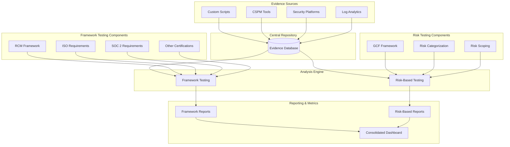

## 目的

自動化された証拠収集とコントロールテストプログラムは、以下を目指しています。

* 自動化を通じてコントロール証拠の収集と検証を合理化する
* コンプライアンス要件とセキュリティリスクの両方の包括的なカバレッジを保証する
* コントロールテストと証拠収集における手作業の労力を削減する
* コントロールの有効性とコンプライアンスステータスへのリアルタイムの可視性を提供する
* セキュリティとコンプライアンスの優先順位に関するデータ駆動型の意思決定を可能にする
* 認証維持と動的なセキュリティニーズの両方をサポートする

## エグゼクティブサマリー

GitLab の自動化された証拠収集とコントロールテストシステムは、以下で構成されます。

* 証拠収集:

  * 複数ソース統合（スクリプト、CSPM、セキュリティプラットフォーム、ログ分析）
  * 集中化された証拠リポジトリ
  * 自動化された収集と検証

* デュアルテストフレームワーク:

  * フレームワークベース: ISO、SOC 2、その他の認証要件のために RCM を使用
  * リスクベース: リスクの分類とスコーピングと共に GCF を使用

* アウトプット:

  * フレームワークコンプライアンスレポート
  * リスクベース分析
  * 統合メトリクスダッシュボード

## システム概要

## 証拠収集インフラストラクチャ

### ソースと統合

私たちのコントロールテストプログラムの基盤は、自動化された手段を通じて複数のデータソースを統合する堅牢な証拠収集システムです。

1. クラウドセキュリティポスチャマネジメント (CSPM):

    * クラウドインフラストラクチャセキュリティ評価とコンプライアンス監視のための Wiz
    * Google Cloud 環境のセキュリティのための GCP Security Command Center
    * AWS 環境構成監視のための AWS Config

2. Infrastructure as Code (IaC) セキュリティ:

    * Terraform 構成の静的解析のための Checkov
    * パイプライン統合セキュリティチェックのための GitLab IaC スキャン
    * 構成検証のためのカスタムパーサー

3. カスタム証拠収集:

    * API ベースのデータ収集のための Python スクリプト
    * Linux システム証拠収集のための Bash スクリプト
    * 内部ツールおよびサービスとのカスタム統合

4. セキュリティ情報管理:

    * ログ集約と分析
    * メトリクス収集
    * 特定のアプリケーション証拠のためのカスタムログパーサー

各ソースは、特定のデータ変換と共に、標準化された API または収集メカニズムを通じて統合されます。

* 一貫性のための JSON 形式のアウトプット
* 標準化されたタイムスタンプ形式 (UTC)
* コントロールマッピングのための統一されたメタデータタギング
* 構造化された証拠分類

### 中央リポジトリ

収集されたすべての証拠は、安全な保管と効率的な取得のために設計された集中リポジトリに流れ込みます。リポジトリは、証拠の完全性を維持するために、厳格なアクセスコントロール、バージョン追跡、保持ポリシーを実装しています。各証拠には、以下を含む必須メタデータがタグ付けされます。

* ソース識別
* 収集タイムスタンプ
* コントロールマッピング
* データ分類
* 検証ステータス

## 分析エンジン

### フレームワークベースのテスト

フレームワークベースのテストコンポーネントは、特定の認証要件に対して証拠を評価するために、私たちの Requirements and Controls Matrix (RCM) を活用します。

#### 認証カバレッジ

私たちのテストフレームワークは、特に以下に対応しています。

* ISO 27001:2013 認証要件 (Annex A コントロールを含む)
* SOC 2 Type 2 Trust Services Criteria（セキュリティ、可用性、機密性）
* 業界固有の標準 (TISAX、Cyber Essentials)
* 該当する場合の PCI DSS 要件

#### テスト実装

証拠評価は自動化された手段を通じて実施されます。

1. Wiz コンプライアンスモジュール:

    * リアルタイムのクラウドインフラストラクチャコンプライアンス評価
    * クラウドコントロールのための自動化された証拠収集
    * 継続的なコンプライアンス監視とアラート

2. インフラストラクチャテスト:

    * インフラストラクチャコンプライアンスのための AWS Config Rules
    * GCP Security Command Center コンプライアンスチェック

3. アプリケーションセキュリティ:

    * GitLab セキュリティスキャン結果
    * コンテナセキュリティスキャン
    * 依存関係スキャン結果

4. カスタムコントロールテスト:

    * コントロール検証のための自動化されたスクリプト実行
    * API ベースのコントロールステータスチェック
    * スケジュールされた証拠収集タスク

テストは、認証サイクルに合わせて事前定義されたスケジュールに従います。

* 日次の自動化されたコントロール検証
* 週次の包括的なコンプライアンスチェック
* 月次の詳細なコントロール評価
* 四半期の完全なフレームワーク評価

### リスクベースのテスト

リスクベースのテストは、基本的なコンプライアンス要件を超える包括的なセキュリティカバレッジを提供するために、GitLab Control Framework (GCF) と動的なリスク評価を組み合わせて活用します。

#### テスト戦略

リスクベースのアプローチは以下を実装します。

1. 継続的なセキュリティ検証:

    * Wiz リアルタイムセキュリティポスチャ監視
    * クラウドインフラストラクチャセキュリティ評価
    * 構成ドリフト検出
    * 脆弱性の特定と追跡

2. 動的リスク評価:

    * 以下に基づいた週次の自動化されたリスクスコアリング:
        * 脅威インテリジェンスフィード
        * 脆弱性スキャン結果
        * セキュリティインシデントデータ
        * 資産重要度評価
    * リスクスコアに基づいたテスト頻度の自動調整
    * StORM リスク管理プログラムとの統合

3. 運用セキュリティテスト:

    * 日次セキュリティベースラインチェック
    * 自動化されたセキュリティコントロール検証
    * セキュリティインシデント管理との統合
    * カスタムコントロール有効性測定

4. 強化されたコントロールカバレッジ:

    * 認証範囲を超えたコントロールのテスト
    * カスタムセキュリティ要件の検証
    * 業界固有のセキュリティチェック
    * GitLab 固有のセキュリティコントロール

## 分析と報告

### フレームワークコンプライアンスレポート

フレームワークコンプライアンスレポートは、認証準備状況とコントロールの有効性に対する明確な可視性を提供します。これらのレポートには以下が含まれます。

* コントロールテストステータス
* 証拠の網羅性
* コンプライアンスギャップ
* [観察事項管理](../observation-management-procedure.md)
* 監査準備メトリクス

### リスクベース分析

リスクベース分析レポートは、セキュリティ姿勢とリスク緩和の有効性に焦点を当てます。主要なコンポーネントには以下が含まれます。

* コントロール有効性のトレンド
* リスクレベル指標
* 脅威エクスポージャーメトリクス
* コントロールカバレッジ分析
* 是正の優先順位

### 統合ダッシュボード

統合ダッシュボードは、コンプライアンスステータスとリスク姿勢の両方の統一されたビューを提供します。この統合により、以下が可能になります。

* 全体的なコントロール有効性監視
* リソース割り当ての最適化
* フレームワーク全体のトレンド分析
* エグゼクティブレベルのレポート
* 運用メトリクスの追跡

## 実装と保守

### 自動化開発

私たちの自動化フレームワークは、効率とカバレッジを改善するために継続的に進化しています。開発の優先事項には以下が含まれます。

* 新しいソースの統合
* テスト手順の自動化
* レポート生成の強化
* ダッシュボードのカスタマイズ
* 分析エンジンの最適化

### 品質保証

私たちのテストプログラムの信頼性を維持するために、私たちは以下を実装します。

* 自動化スクリプトの定期的な検証
* 証拠品質の監視
* テスト手順のレビュー
* 結果の検証
* システムパフォーマンスの最適化

## 結論

自動化された証拠収集とコントロールテストへのこの包括的なアプローチは、コンプライアンス要件とセキュリティリスクの両方の効率的なカバレッジを GitLab に提供します。RCM および GCF フレームワークの統合は、堅牢な証拠収集と分析機能によってサポートされており、私たちのコンプライアンスとセキュリティ姿勢の効果的な管理を保証します。自動化機能の継続的な開発と定期的なシステム最適化は、要件が進化するにつれてプログラムの有効性を維持します。
