## 概要

Federal Risk and Authorization Management Program (FedRAMP) は、[FedRAMP Authorization Act](https://www.congress.gov/117/bills/hr7776/BILLS-117hr7776enr.pdf#page=1055)、[FISMA](https://www.congress.gov/bill/113th-congress/senate-bill/2521)、および [OMB Circular A-130](https://www.cio.gov/policies-and-priorities/circular-a-130/) に従って、クラウドサービスの認可および継続的なサイバーセキュリティのセキュリティ要件を標準化する米国政府全体のプログラムです。要するに、連邦機関は FedRAMP 認可されたクラウドサービスを調達することが義務付けられており、クラウドサービスプロバイダーは連邦機関に販売し、彼らのデータを取り扱うために FedRAMP 認可される必要があります。[FedRAMP.gov](https://www.fedramp.gov/program-basics/) には、認可プロセス、マーケットプレイス、その他の役立つリソースを含む、プログラムに関する詳細情報があります。

FedRAMP 認可には、クラウドサービスに保存、処理、または送信されるデータの機密性に基づいて、3 つのレベル（low、moderate、high）があります。これらのレベルには、実装する必要があるさまざまな程度のコントロール（セキュリティ要件）があります。コントロールは [NIST 800-53](https://csrc.nist.gov/projects/cprt/catalog#/cprt/framework/version/SP_800_53_5_1_1/home) から選択されます。

## FedRAMP 認可プロセス

GitLab は、Joint Authorization Board ではなく Agency Authorization プロセスに従っており、これは次のようになります。

```mermaid
graph TD
    subgraph Continuous Monitoring Phase
        P(Post-Authorization) --> Q(Ongoing Continuous Monitoring Deliverables)
        P --> R(Annual Assessment)
    end

    subgraph Agency Authorization Phase
        I(Agency Review of Security Authorization Package) --> J(SAR Debrief)
        J -->|Remediation| K(Agency Final Review)
        K --> L(Agency Issues ATO)
        L --> M(FedRAMP PMO Review)
        M -->|Remediation| N(FedRAMP Marketplace Designation - Authorized)
    end

    subgraph Security Authorization Assessment Phase
        F[Prepare for Security Authorization Assessment] --> |Documentation Package|G(Security Authorization Assessment)
        G --> |"Security Assessment Report (SAR) and Plan of Action & Milestones (POA&M)"|H[Secrity Authorization Package Submission]
    end

    subgraph Pre-Authorization Phase
        B(Partnership Establishment) --> |Agency Sponsor|C(Authorization Planning)
        C --> D(Kickoff Meeting)
        D --> E(FedRAMP Marketplace Designation - In Process)
    end
```

スポンサーするエージェンシーと FedRAMP Program Management Office によって判断される、許容可能なレベルの残留リスクをもたらすセキュリティ評価は、Authorization to Operate (ATO) をもたらします。この評価と ATO の結果は、その後、各顧客に対して評価および認可プロセスを繰り返すのではなく、FedRAMP 認可されたクラウドサービスを必要とする他のエージェンシー/顧客が依拠し、再利用できます。

## GitLab の FedRAMP イニシアチブ

GitLab は、新しいガバメントコミュニティクラウド Software-as-a-Service (SaaS) 製品の FedRAMP Moderate 認可を追求しています。ガバメントコミュニティクラウドは、米国連邦、州、地方、部族、領土の顧客、および連邦政府が資金提供する研究センター (FFRDCs)、政府を代表して働く請負業者またはサービスプロバイダー、および研究機関による使用を意図しています。

FedRAMP は GitLab で最重要のクロスファンクショナルなイニシアチブであり、少なくとも月次で開催される[ワーキンググループ](/handbook/company/working-groups/fedramp-execution/)があります。[セキュリティコンプライアンス (Dedicated Markets) チーム](/handbook/security/security-assurance/dedicated-compliance/)は、FedRAMP 要件を組織のために翻訳・明確化し、アドバイスとコンサルテーションを提供し、最終的にコンプライアンスを達成・維持する責任を負います。

残念ながら、GitLab は現時点では、特定のタイムラインや主要なマイルストーンの進捗を公開できません。社内のチームメンバーは[こちら](https://internal.gitlab.com/handbook/engineering/fedramp-compliance/#-keeping-fedramp-safe)で詳細を学べます。

## FedRAMP 要件（セキュリティコントロール）にはどのようなものがあるか?

FedRAMP 認可は非常に困難で、組織、システム、プロセスレベルで規範的なセキュリティコントロールを実装する必要があります。数百ある要件のうちのいくつかは以下を含みます。

- システム内（送受信、内部）のすべての保管中および転送中のデータに対する [FIPS 140-2 検証済み暗号化](https://csrc.nist.gov/projects/cryptographic-module-validation-program)
- すべてのホスト、Web アプリケーション、コンテナ、データベースの脆弱性スキャン
- CIS および STIG 準拠のためのホスト OS とコンテナの [SCAP](/handbook/security/security-assurance/security-compliance/scap-scanning.md) スキャン
- 規定の SLA 内でのすべての脆弱性の是正、および逸脱リクエストプロセス
- 脆弱性の姿勢、完全な資産インベントリ、システムまたは製品への重要な変更の報告
- セキュリティ更新/パッチのタイムリーな適用
- 認証と認可、監査ログ、セッション処理に関するさまざまな製品機能
- ソフトウェアのデジタル署名と完全性検証
- システム構成のハードニング
- ネットワークセキュリティ要件と規範的なアーキテクチャ（他の FedRAMP 認可されたクラウドサービスにのみ接続可能）
- DNSSEC、DMARC、SPF、DKIM
- キー、証明書、シークレット管理要件
- セキュリティイベント監視とインシデント対応機能
- 災害復旧計画とテスト手順
- ファイル完全性監視、侵入およびアンチマルウェア検出
- サプライチェーンリスク管理手順
- セキュリティトレーニング
- 人事セキュリティと採用慣行
- システムセキュリティプラン（数百ページ）、補助文書、詳細なアーキテクチャ／データフロー図を含むドキュメントパッケージ

## FedRAMP は他のセキュリティ/コンプライアンスフレームワーク、認定、認証とどう比較されるか?

FedRAMP は、複数のセキュリティドメインにわたる広範な要件のセットの実装を必要とし、コントロールの設計と運用の有効性に関する意見を提示する独立した監査人を必要とするという点で、他のセキュリティコンプライアンス「認証」と類似点があります。ただし、FedRAMP の違いは、要件の規範性、維持する必要があるドキュメント、および 3rd Party Assessment Organization (3PAO/監査人) と FedRAMP Program Management Office が果たす役割です。

例を見てみましょう: 開発予定

## FedRAMP 認可された IaaS プロバイダーはどう関わるか? 私たちのシステムをそこにホストするだけで十分か?

SaaS 製品は、必要なコントロールの一部（部分的または完全に）を FedRAMP 認可されたインフラストラクチャ・アズ・ア・サービス (IaaS) プロバイダーから継承できます。これらは通常、物理的および環境的コントロール、物理的メディア保護、ローカルメンテナンスコントロールに限定されます。IaaS プロバイダーから他のマネージドサービス（database-as-a-service、サーバーレスコンピュート、マネージドセキュリティサービスなど）を活用することで、コントロール実装のための追加の責任を移転することは可能ですが、これらでさえ要件のフルセットを部分的にしか満たしません。要件の大多数は依然として SaaS プロバイダーが実装する必要があり、継承できません。

## 連絡先

要件やプロセスに関する質問については、Slack の `# sec-assurance` または `# wg_fedramp` チャンネルで `@dedicated_compliance` にお問い合わせください。製品固有の事項を含むその他の質問については、`# wg_fedramp` チャンネルに連絡するか、[US Public Sector Services プロダクトグループ](/handbook/product/categories/#us-public-sector-services-group)のメンバーにお問い合わせください。
