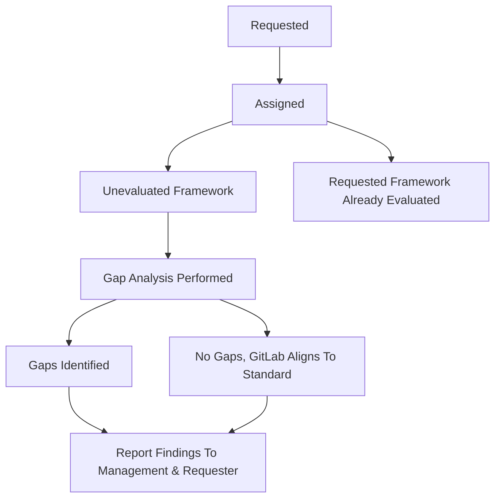

## 目的

セキュリティコンプライアンスに関連するギャップ分析とは、組織が情報セキュリティの現状と、採用または整合させたい特定のセキュリティ標準（SOC 2 Type 2 Availability Criteria、ISO 27018、BSIMM など）との差異を判断するのに役立つ詳細なレビューを指します。ギャップ分析手順を完了した結果は、マネジメント向けのレポートです。

1. GitLab の現状と新しい標準との間にどのようなギャップが存在するか
1. その新しい標準を追求するかどうかについての推奨事項
1. その新しい標準を追求しない場合の影響
1. その新しい標準が追求された場合の影響

## 範囲

セキュリティコンプライアンスチームが実施するギャップ分析手順の範囲は、情報セキュリティおよびコンプライアンス関連の規制標準とフレームワークに限定されます。

## 役割と責任

| 役割 | 責任 |
| ---- | ------ |
| ギャップ分析オーナー | 分析ライフサイクル全体を通じてギャップ分析の DRI として、ギャップ分析の実施、および特定されたギャップに対処するためのコントロールのマッピング/形式化を行う責任を持つ、個々のセキュリティコンプライアンスチームメンバー。 |
| ギャップ分析リクエスター | ギャップ分析の実施をリクエストする個々の GitLab チームメンバー。任意の GitLab チームメンバーがセキュリティコンプライアンスチームにギャップ分析をリクエストできます。 |
| ギャップ分析プログラム DRI | プログラムの健全性とステークホルダーへのレポート提供の定期的なレビューに責任を持つ |

## ギャップ分析フェーズ概要

## 手順

以下のフェーズはギャップ分析ライフサイクルを順を追って説明します。

### ギャップ分析リクエスト

ギャップ分析リクエストは、任意の GitLab チームメンバーからセキュリティコンプライアンスチームに提出できます。ギャップ分析リクエストを提出するには、'GapAnalysisRequest' Issue テンプレートを使用して [Gap Analysis プロジェクトに Issue を提出](https://gitlab.com/gitlab-com/gl-security/security-assurance/team-commercial-compliance/gap-analysis/-/issues/new?issuable_template=GapAnalysisRequest)します。セキュリティコンプライアンスチームは、提出されたすべてのギャップ分析リクエストをレビューし、ギャップ分析の優先順位付けプロセスを開始します。リクエストされたフレームワークがすでに評価されている場合、ギャップ分析オーナーはギャップ分析リクエスターに通知し、実施されたギャップ分析に関する関連詳細を提供します。ギャップ分析リクエストがレビューされ優先順位付けされると、ギャップ分析 DRI は、提出されたリクエスト Issue でリクエスターに、全体的なギャップ分析キュー内のリクエストステータスを通知します。

### ギャップ分析の実施

ギャップ分析リクエストを受領後、セキュリティコンプライアンスチームのメンバーが GAS を使用してギャップ分析を管理/実施します。これには、コントロールギャップの特定、既存のコントロールをリクエストされたフレームワーク要件にマッピング、および[コントロール評価ガイド](https://gitlab.com/gitlab-com/gl-security/security-assurance/security-compliance-commercial-and-dedicated/gcf/-/blob/main/runbooks/assessment_testing_manual.md)を使用した、マッピング/作成されたコントロールの設計および運用の有効性の評価が含まれます。セキュリティコンプライアンスチームがギャップ分析を実施する方法の詳細については、この[ギャップ分析ランブック](https://gitlab.com/gitlab-com/gl-security/security-assurance/team-commercial-compliance/gap-analysis/-/blob/main/runbooks/Gap_Assessment_Manual.md)を参照してください。

### ギャップ分析結果の報告

ギャップ分析が完了し、すべての関連するギャップが特定されると、ギャップ分析オーナーは、分析結果、特定されたギャップ/観察事項、観察事項クローズおよび新しいポリシー/手順/コントロール形式化のための推奨事項を概説する[ギャップ分析監査レポート](https://docs.google.com/presentation/d/1XB8cVvE7weZZuXSaXuX-dlcsyd0bRnI10pG1m7WJEJY/edit#slide=id.p1)を作成します。ギャップ分析監査レポートがセキュリティコンプライアンスマネージャーおよびセキュリティアシュアランスディレクターによってレビューおよび承認されると、ギャップ分析オーナーは、評価されたフレームワークにマッピングされる既存のコントロールで特定された観察事項を、[観察事項のインテイクと管理](https://gitlab.com/gitlab-com/gl-security/security-assurance/security-compliance-commercial-and-dedicated/observation-management/-/blob/master/runbooks/1_Observation%20Intake%20and%20Management.md)手順に従って、是正のための関連ステークホルダーに割り当てるプロセスを開始するとともに、特定されたギャップを埋める新しいポリシー/手順/コントロールを形式化するプロセスを開始します。さらに、ギャップ分析の実施中に、GitLab がすでに評価されている標準/フレームワークと整合していると判断される場合があります。そのような場合、これは[ギャップ分析監査レポート](https://docs.google.com/presentation/d/1XB8cVvE7weZZuXSaXuX-dlcsyd0bRnI10pG1m7WJEJY/edit#slide=id.p1)に報告され、マネジメントとギャップ分析リクエスターに利用可能になります。

## SLA/優先順位付け

ギャップ分析リクエストは、受領から 2 週間以内にセキュリティコンプライアンスリーダーシップの支援を得て、ギャップ分析プログラム DRI によって優先順位付けされます。外部要件、内部イニシアチブ、既存の義務、必要な成果物、顧客フィードバックに基づく重要性のレベルなどの要因が優先順位付けに使用されます。各ギャップ分析には、優先度レベル 1、2、3、または 4 が割り当てられます。優先度レベルと関連する完了 SLA は以下にあります。表記されている SLA は、ギャップ分析リクエストの優先順位付けから最終的なギャップ分析監査レポートが完了するまでの時間を含みます。

| 優先度レベル | 完了 SLA |
| ---- | ------ |
| Priority 1 | ギャップ分析は、短期的な要件/リクエストを満たすための最高優先度です。完了 SLA: 1〜3 か月 |
| Priority 2 | ギャップ分析は即時の要件ではないが、高い重要性を持ちます。完了 SLA: 3〜9 か月 |
| Priority 3 | ギャップ分析は中程度の重要性で、現会計年度内に完了する必要があります。完了 SLA: 9〜12 か月 |
| Priority 4 | ギャップ分析は「あったら良い」と考えられるが、現在は重要性/影響が低いです。完了 SLA: 12〜24 か月またはギャップ分析リクエストが次にキューに入った時。 |

## 参照

- [GCF コントロールライフサイクル](/handbook/security/security-assurance/security-compliance/security-control-lifecycle/)
- [GitLab のセキュリティコンプライアンスコントロール](/handbook/security/security-assurance/security-compliance/sec-controls/)

## 連絡先

セキュリティコンプライアンスギャップ分析プロセスについての質問やフィードバックがある場合は、[GitLab セキュリティコンプライアンスチームにお問い合わせください](_index.md)。

<a href="/handbook/security/security-assurance/" class="btn bg-primary text-white btn-lg">セキュリティアシュアランスホームページに戻る</a>
