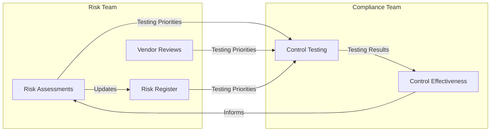

## このページについて

- [概要](#overview)
- [リスクベースのコントロールテスト](#risk-based-control-testing)
- [私たちのアプローチの進化](#evolution-of-our-approach)
- [業界からの裏付け](#industry-validation)
- [リスクとコンプライアンスの連携](#risk-and-compliance-collaboration)
- [外部監査と規制コンプライアンスへの影響](#impact-on-external-audits-and-regulatory-compliance)
- [追加リソース](#additional-resources)

## 概要 {#overview}

リスクベースコンプライアンスとは、すべてのコンプライアンス要件を一律に扱うのではなく、リスクインテリジェンスを活用してコンプライアンス活動とテストの優先順位を決定する戦略的アプローチです。GitLabではこれを、SaaSプラットフォームの認証・アテステーションを維持するための継続的モニタリングと区別するために、リスクベースのコントロールテストと呼ぶこともあります。この戦略は、すべてのシステム、ベンダー、コントロールが組織にとって同じレベルのリスクを伴うわけではないという認識に基づいています。

## リスクベースのコントロールテスト {#risk-based-control-testing}

リスクベースのコントロールテストは、内部統制が緩和するリスクに基づいて、その有効性を評価することに焦点を当てます。よりリスクの高い機能に関連するコントロールに集中することで、低リスク機能に対して不必要なリソースを費やすことなく、重要なコントロールが正しく機能していることを保証します。

### 主要な側面

1. **コントロールの特定:** 特定されたリスクを緩和するためにどのコントロールが整備されているかを判断する
1. **テストの優先順位付け:** 最も重大なリスクに対応するコントロールにテスト工数を割り当てる
1. **証跡の収集:** コントロールの有効性を評価するために十分な証跡を収集し、よりリスクの高いコントロールにはより厳格なテストを実施する

## 私たちのアプローチの進化 {#evolution-of-our-approach}

SaaSプラットフォームの認証取得と維持はチームの中核的な優先事項であり続けますが、効果的なセキュリティコンプライアンスプログラムは、認証や監査結果を超えた視点を持たなければなりません。私たちの最も機密性の高いデータや重要なシステムの一部は、従来のコンプライアンス境界の外側にあります。この現実は、セキュリティポリシー、標準、ベストプラクティスを企業全体で包括的に実装することを要求します。

リソースが有限であるため、私たちは取り組みを最適化するためにリスクベースのフレームワークを採用しました。このアプローチによって、以下が可能になります。

- 認証要件の維持
- [Crown Jewels](https://internal.gitlab.com/handbook/security/security_operations/threat_intelligence/crown-jewels/)および[顧客（RED）データ](/handbook/security/policies_and_standards/data-classification-standard/#red)に対する適切な保護策の確保
- 実際のリスクエクスポージャーに基づいたリソース配分
- 新たな脅威や環境変化への迅速な対応

従来のコンプライアンスからリスクベースコンプライアンスへの進化は、監査人のために単に「チェックボックスを埋める」のではなく、意義あるセキュリティ成果に対する私たちのコミットメントを反映しています。

## 業界からの裏付け {#industry-validation}

このシフトを支持する業界トレンドおよびベストプラクティスは以下のとおりです。

- チェックボックス型コンプライアンスから、リスクに基づいたテストへの移行
- 自動化された継続的コントロールモニタリングの利用拡大
- データに基づく優先順位付けの重視
- リスクベースアプローチによるコンプライアンス管理を採用する組織の増加
- リスクとコンプライアンスを共通化したタクソノミーの開発
- リスクとコンプライアンスの定期的な合同ワーキングセッション

## リスクとコンプライアンスの連携 {#risk-and-compliance-collaboration}

リスクとコンプライアンスが連携することで、美しい相乗効果とフィードバックループが生まれます。私たちは完全に独立したチームで、それぞれ異なる焦点を持っていますが、リスクベースコンプライアンスプログラムによって以下が可能になります。

- 公式な調整プロセスの確立
- データとインサイトの体系的な共有
- 発見事項の定期的な合同レビュー
- リーダーシップへの統一されたレポーティングの提供

### フィードバックループ

#### リスクチームからコンプライアンスへのインプット

- [リスク評価](/handbook/security/security-assurance/security-risk/storm-program/#risks-identified-during-risk-assessments)によって、最も高い運用リスク（テストの優先事項）が特定される
- [TPRMアセスメント](/handbook/security/security-assurance/security-risk/third-party-risk-management/#procedures)によって、重要なサードパーティとの関係が浮き彫りになる
- [リスクレジスター](https://gitlab.com/gitlab-com/gl-security/security-assurance/security-risk-team/storm-risk-register/-/issues)が、組織全体の運用リスクをテーマ別に俯瞰する視点を提供する

#### コンプライアンスチームからリスクへのインプット

- コントロールテスト結果がギャップや弱点を特定する
- コンプライアンス上の発見事項は、[リスク対応計画](/handbook/security/security-assurance/security-risk/storm-program/#remediate-the-risk)を含むリスクレジスター項目にマッピングされる
- テストカバレッジデータは[リスク対応の意思決定](/handbook/security/security-assurance/security-risk/storm-program/#risk-response)に役立てられる
- コントロールの有効性メトリクスは、[四半期リスクレポート](/handbook/security/security-assurance/security-risk/storm-program/#storm-reporting-schedule)における主要リスク指標（KRI）として活用される

### 統合のメリット

- 最もリスクの高い機能に焦点を当てた、より効率的なリソース配分
- 進化する脅威や規制変更への迅速な適応力
- コンプライアンス活動に対するより強固な根拠付け
- リスクレポートの精度を高め、リスクに関する意思決定を支援するためのより良いデータ
- 組織のセキュリティ体制をより包括的に俯瞰する視点
- 評価活動における重複の削減

## 外部監査と規制コンプライアンスへの影響 {#impact-on-external-audits-and-regulatory-compliance}

私たちのリスクベースコンプライアンスプログラムは、公式な監査・認証義務と対立するのではなく、それを補完するものです。このアプローチは、規制対象の活動に明確な境界を維持しつつ、セキュリティ体制を強化するように慎重に設計されています。

私たちは以下の間に厳格な分離を維持します。

- SOXコンプライアンス活動および関連するセクション302レポーティング
- 既存の認証・アテステーション要件（SOC 2、ISO 27001など）
- 企業セキュリティに焦点を当てたリスクベースコンプライアンス活動

SOXおよびその他の認証・アテステーションの対象範囲のシステムとコントロールをテスト範囲から明示的に除外することで、リスクベースのテストが公式の監査活動と干渉したり混乱を招いたりしないようにしています。各領域について、独立したドキュメント、テストスケジュール、レポーティングプロセスを維持しています。

私たちの発見事項とメトリクスはセキュリティ組織の内部にとどめ、継続的改善活動の参考にしています。これらは以下には使用されません。

- 内部監査への報告
- 外部監査人との共有
- 規制コンプライアンス目的での使用
- 公式アテステーションへの組み込み

注意: プログラムの発見事項は内部のセキュリティ用途ですが、テストによってアクティブなセキュリティインシデントが特定された場合は、標準のインシデントレポート義務が引き続き適用されます。

## 追加リソース {#additional-resources}

セキュリティコンプライアンスチームは、このプログラムをどのように実行しているかの詳細を[チームのIssueトラッカー](https://gitlab.com/gitlab-com/gl-security/security-assurance/security-compliance/team)で管理しています。そこでは、私たちが以下をどのように行っているかを学べます。

- どのシステムとアプリケーションをテストするかの優先順位付け
- どのコントロールが重要であるかの判断
- [セキュリティリスク](/handbook/security/security-assurance/security-risk/)との連携
- チーム間でのインプットとアウトプットの共有
