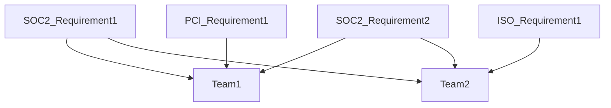
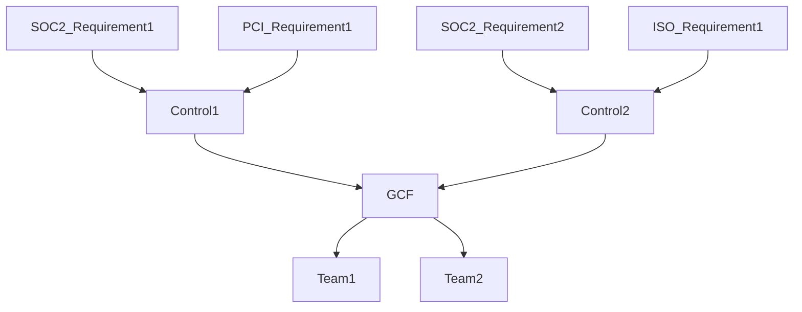
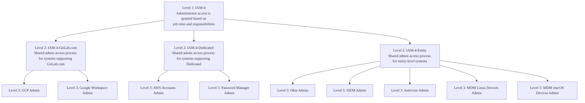



## セキュリティコントロールとは何か？

セキュリティコントロールは、組織の資産およびデータに対するリスクを軽減または緩和するために実装される保護策と対策です。

**コントロールの説明:**

コントロールの説明は、特定のセキュリティ要件または活動を定義する明確で簡潔な記述です。GCFで適切に書かれたコントロールの説明は、以下の特徴があります。

- 能動的でプロフェッショナルな言葉を使用する
- 何をすべきか、またはどのようなセキュリティ対策が整備されているかを記述する
- ベンダー固有の用語を含まず一般的に書かれている（再利用可能でベンダー中立性を維持するため）
- 監査人による実行とテストが可能である
- 目的を明確に伝える

**例:**

- EPM-12: ノートパソコンは、データ流出を緩和するためにポータブルストレージデバイスの使用を防止するようデフォルトで構成されており、例外は文書化されマネジメントによって承認されます。
- PSM-6: セキュリティ意識向上トレーニングは、入社時およびその後年1回チームメンバーが完了することが求められます。トレーニングは、組織のセキュリティポリシー、業界のセキュリティベストプラクティス、職務上の責任に関連する脅威の状況などのトピックをカバーします。
- AIM-6: AIシステムは、精度、性能、品質基準が満たされることを保証するために、定義された基準とテスト方法論を使用して検証および妥当性確認されます。

## コントロールのオーナーシップ

コントロールが効果的に運用されるためには、明確なオーナーシップとアカウンタビリティが確立される必要があります。コントロールの設計、運用、証跡収集について、2つの主要な役割が責任を負います。

**コントロールオーナー**

- コントロール全体およびそれが緩和するリスクに対するアカウンタビリティを持つ
- コントロール上の不備および監査での発見事項について、コントロールが監査対応可能な状態になるよう修正する責任を持つ
- コントロールの実行をスチュワードや責任者に委任することはできるが、最終的なアカウンタビリティを保持する
- コントロール設計の変更および主要な運用調整を承認する

**プロセスオーナー**

- コントロールが実際にどのように運用されているかを理解する専門家
- コンプライアンスチームと連携して証跡を提供し、コントロールの実装を説明する
- 技術的な詳細、システムアクセス、またはテストのための運用上の文脈を提供することがある
- 多くの場合、実際にコントロール活動を実行または監督する人物

**注:** コントロールオーナーとプロセスオーナーは同一人物の場合もあります。

## GitLab Control Framework (GCF)

私たちは現在および将来のセキュリティコンプライアンスニーズに対して包括的なアプローチを取ります。古い大企業は各セキュリティコンプライアンス要件を個別に扱う傾向があり、その結果、独立したセキュリティコンプライアンスチームが内部チームに対して重複した複数のリクエストを送ってしまいます。たとえば、そのような会社では、特定のデータベースがどのように暗号化されているかについて、SOC2要件に基づいて1人のデータベースエンジニアに証跡提出を求め、次にISO要件で再度求め、さらにPCI要件で再度求めるといったことが起こります。

これに対処するため、私たちは**GitLab Control Framework (GCF)** と呼ばれる共通コントロールフレームワークを開発しました。このアプローチは以下のように可視化できます。

GitLabの効率性価値を踏まえ、私たちは複数の基礎要件に1つのコントロールで対応するセキュリティおよびAIコントロールのセットを作成しました。これにより、セキュリティコンプライアンスチームはコントロールオーナーへのリクエストを減らし、さまざまな監査に必要なすべての証跡を一度に効率的に収集できます。このアプローチは以下のように可視化できます。

### GCFの方法論

セキュリティコンプライアンスの目標と要件が進化するにつれて、セキュリティコントロールフレームワークに関連する要件と制約も進化してきました。私たちのGCFは、GitLab独自のインフラストラクチャ、ビジネスモデル、セキュリティ体制のために特別に開発された独自のコントロールセットです。

GCFは以下の包括的な分析プロセスを通じて開発されました。

1. 私たちが維持し、また取得を目指している認証およびアテステーション（SOC 2、ISO 27001、ISO 42001、PCI DSS、FedRAMPなど）からの**コンプライアンス要件を分析**
2. 業界のベストプラクティスに沿うことを保証するために、NIST Cybersecurity Framework (CSF)、NIST SP 800-53、Secure Controls Framework (SCF) などの**業界フレームワークと比較**
3. GitLabのオールリモート、クラウドネイティブ、AI駆動型のDevSecOps環境に合わせた**カスタムコントロールドメインとコントロールを作成**

このアプローチにより、無関係なコントロールを排除し、必要に応じてGitLab固有のコントロールを追加しながら、すべてのコンプライアンス要件へのマッピングを維持できます。フレームワークはカスタマイズ可能でスケーラブルになるよう設計されており、追加の認証を追求する際やビジネスが進化する際に、新しいドメインやコントロールを作成できます。

#### GCFの範囲とアセスメントアプローチ

GCFには、外部認証の対象範囲を超えるコントロールが含まれており、コンプライアンス必須コントロールとリスク駆動型コントロールの両方をカバーします。毎年、コントロールをテストおよびモニターするためのアセスメントスケジュールが作成され、四半期ごとにアセスメントがグループ化されてコンプライアンスチームのメンバーに割り当てられます。

- **コンプライアンスコントロール:** 外部認証に必須。少なくとも年1回テストされる
- **リスクベースコントロール:** システムの重要度（Tier 1/2）またはデータの機密性（RED/ORANGE）によって駆動される。キャパシティとリスク優先度に基づいてテストされる

### GCFの構造とデータ

従来のコントロールフレームワークは通常、コントロールID、説明、オーナーといった最小限の情報を追跡します。GCFはより包括的なアプローチを取り、コントロール実装の詳細、コントロールがマッピングされている要件、コントロールの範囲（コントロールに含まれる資産とプロセス）、その他関連する詳細を以下の[コントロールフィールド](#gcf-control-fields)に文書化することで、コントロールに関する文脈を提供する広範なデータをキャプチャします。

GitLab Control Frameworkは、私たちのGRCソリューションであるGAS (GitLab Assurance Solution) で管理されています。この一元化されたリポジトリにより、効率的なコントロール管理、コントロール関係マッピングの可視化、監査準備、GitLabのセキュリティ体制の継続的モニタリングが可能になります。

#### GCFコントロールドメイン

業界フレームワークとコンプライアンス要件の分析を通じて、GitLabのセキュリティプログラムの構造と運用モデルに沿った論理的なファミリーにコントロールを整理するカスタムコントロールドメインを作成しました。

| 略語 | ドメイン | 説明 |
|--------------|--------|-------------|
| AAM | Audit & Accountability Management | システム活動のロギング、モニタリング、監査証跡の維持に関するコントロール |
| AIM | Artificial Intelligence Management | AIシステムの開発、デプロイ、ガバナンスに固有のコントロール |
| ASM | Asset Management | 組織資産の特定、追跡、管理に関するコントロール |
| BCA | Backups, Contingency, and Availability Management | 事業継続、災害復旧、システム可用性に関するコントロール |
| CHM | Change Management | システム、アプリケーション、インフラストラクチャの変更管理に関するコントロール |
| CSR | Customer Security Relationship Management | 顧客とのコミュニケーション、透明性、セキュリティコミットメントに関するコントロール |
| DPM | Data Protection Management | データの機密性、完全性、プライバシーの保護に関するコントロール |
| EPM | Endpoint Management | エンドユーザーデバイスとワークステーションのセキュリティに関するコントロール |
| GPM | Governance & Program Management | セキュリティガバナンス、ポリシー、プログラム監督に関するコントロール |
| IAM | Identity, Authentication, and Access Management | ユーザーアイデンティティ、認証メカニズム、アクセスコントロールに関するコントロール |
| INC | Incident Management | セキュリティインシデントの検知、対応、復旧に関するコントロール |
| ISM | Infrastructure Security Management | ネットワーク、サーバー、基盤インフラストラクチャのセキュリティに関するコントロール |
| PSM | People Security Management | 人的セキュリティ、トレーニング、意識向上に関するコントロール |
| PAS | Product and Application Security Management | ブランチ保護やコードセキュリティスキャンなど、GitLabの開発を保護するためにドッグフードされているGitLab製品に組み込まれたセキュリティ機能に関するコントロール |
| SDL | Software Development & Acquisition Life Cycle Management | セキュアなSDLCプラクティスとサードパーティソフトウェアの調達に関するコントロール |
| SRM | Security Risk Management | リスク評価、対応、管理に関するコントロール |
| TPR | Third Party Risk Management | ベンダーおよびサプライヤーからのセキュリティリスク管理に関するコントロール |
| TVM | Threat & Vulnerability Management | セキュリティ脆弱性の特定と修正に関するコントロール |

#### GCFコントロールフィールド {#gcf-control-fields}

GCFは、コントロールごとに以下のフィールドを追跡し、コンテキストの提供、効率的な管理の実現、監査活動のサポートを行います。

<b>コアコントロール情報</b>

**コントロールID**

- コントロールに対する一意の識別子
- フォーマットはコントロールレベルによって異なる:

  - **レベル1:** `[Domain]-[Number]`（例: IAM-4）
  - **レベル2:** `[Domain]-[Number]-[Environment]`（例: IAM-4-GitLab.com、IAM-4-Dedicated、IAM-4-Entity）
  - **レベル3:** `[Domain]-[Number]-[Environment]-[Asset]`（例: IAM-4-GitLab.com-GCP、IAM-4-Entity-Okta）
- コントロール階層全体で一貫した追跡と参照を可能にする

GitLabは複数の製品デプロイメント（GCP上のGitLab.com、AWS上のGitLab Dedicated）を運営しており、コンプライアンス要件は通常、製品オファリングごとにスコープされています。コントロールIDの環境コンポーネントは、顧客データが維持・管理される場所に基づいて、製品固有のコントロールと組織全体のコントロールを区別します。資産コンポーネントは製品を構成する特定のシステムを識別します。

**コントロール名**

- コントロールの本質を示す高レベルのサマリ
- コントロールの目的を一目で理解できるようにする
- 例: 「Audit Logging Policy」、「Multi-Factor Authentication」、「AI System Verification and Validation」

**説明**

- コントロールの実装または活動に関する記述
- コントロールが何をするか、それが達成するセキュリティ目標を定義する
- ベンダー固有の参照を含まない、明確で実行可能な言葉で書かれる

**ドメイン**

- 関連するコントロールを整理するコントロールファミリーまたはカテゴリ
- 例: Audit & Accountability Management、Identity Authentication and Access Management、Artificial Intelligence Management
- コントロール関係のナビゲートと理解に役立つ

<b>コントロール実装の詳細</b>

**ステータス**

- コントロールの現在の状態
- 値: `In Existence` または `Gap`
- コントロールが運用中であるか、修正が必要な確認済みまたは潜在的なコントロール上の不備を表しているかを示す

**実装の詳細**

- GitLabの環境内でコントロールがどのように実装されているかについての具体的な詳細
- システム固有の構成、責任チーム、または運用手順を含む場合がある
- 実用的な実装アプローチに関する文脈を提供する

**オーナー**

- コントロールに責任を負う個人
- コントロールの設計、運用、修正に対するアカウンタビリティを保証する
- コントロールオーナーは証跡を提供し、監査リクエストに対応する

**環境**

- コントロールが対応するエンティティまたは製品/サービスオファリング
- 値: `Entity`（組織全体）、`GitLab.com`（マルチテナントSaaS）、`GitLab Dedicated`（シングルテナント）
- 異なるデプロイメントモデルにおけるコントロールの適用範囲を定義する

注: 「RBCT」も、コンプライアンス目的でテストされていないコントロールを区別するための「環境」として使用されます。

<b>コントロールの特性</b>

**分類**

- コントロールがスコープに含まれる理由と、コントロールが適用されるシステムや要件の種類を示す
- リスクおよびコンプライアンス要因に基づいて、コントロールテストとリソース配分の優先順位付けに役立つ
- 値:

| 値 | 説明 |
|-------|-------------|
| `External` | コントロールは外部認証およびアテステーションのスコープに含まれる |
| `Internal` | コントロールはリスク駆動型で、システム固有（データの機密性または重要度に基づく）または組織のリスク評価で特定されたリスクに対処するもの |

内部コントロールのリスク要因は以下を通じて定義されます。

- データ分類レベル（Red、Orange）は[Data Classification Standard](/handbook/security/policies_and_standards/data-classification-standard.md)で定義されている
- システム重要度ティア（Tier 1、Tier 2）は[Critical System Tiering](/handbook/security/security-assurance/security-risk/storm-program/critical-systems.md)方法論で定義されている

**頻度**

- コントロールが実行または運用される頻度
- 値: `Annual`、`Semi-Annual`、`Quarterly`、`Monthly`、`Weekly`、`Daily`、`Automated`、`Ad-hoc`
- 運用ケイデンスとテスト間隔を定義する

**性質**

- コントロール実行における自動化の度合い
- コントロールが実際にどのように運用されるかを記述する
- 値:

| 値 | 説明 |
|-------|-------------|
| `Manual` | コントロールは自動化なしで手動で実行される |
| `Semi-Automated` | コントロール実行は自動化された活動と手動の活動を組み合わせている |
| `Automated` | コントロールは手動介入なしで自動的に実行される |

**タイプ**

- コントロールのセキュリティ機能の分類
- 全体的なセキュリティプログラムにおけるコントロールの役割を定義する
- 値:

| 値 | 説明 |
|-------|-------------|
| `Preventative` | コントロールはセキュリティイベントやポリシー違反の発生を防止する |
| `Detective` | コントロールはセキュリティイベント、ポリシー違反、または異常を発生後に検知する |
| `Corrective` | コントロールは検知型コントロールを通じて特定されたイベントを修正または改善する |
| `Recovery` | コントロールはイベント後にシステムまたはデータを通常の運用に復元する |
| `Administrative` | コントロールはポリシー、手順、またはマネジメント活動で構成される |
| `Compensating` | コントロールは主要なコントロールを実装できない場合に代替的な保護を提供する |

**カテゴリ**

- スコープと実装ポイントによる分類
- - コントロールが適用される場所（組織全体、製品固有（GitLab.comまたはDedicated）、インフラストラクチャレベル、リポジトリレベルなど）の特定を可能にする
- 値:

| 値 | 説明 | 例 |
|-------|-------------|----------|
| `ELC - Administrative` | 組織全体のポリシー、手順、管理的コントロール | セキュリティポリシー、リスク評価プロセス、トレーニングプログラム、ガバナンスフレームワーク |
| `ELC - Technical` | すべてのシステムにわたって展開される企業全体の技術的コントロール | SIEM/集中ロギング・モニタリング、企業ウイルス対策、エンドポイントセキュリティエージェント |
| `SaaS - Administrative` | サービス提供業務のための管理的コントロールで、プロセスやオーナーシップがGitLab.comとDedicatedで異なるもの | 顧客データ取り扱い手順、SLA管理、サービスステータス通知 |
| `Technical - Asset` | 複数のシステムと文脈にまたがって適用される基盤的なIT全般統制 | アクセスのプロビジョニングとデプロビジョニング、特権アクセス管理、変更管理手順、職務分離 |
| `Technical - Infrastructure` | ネットワーク、サーバー、基盤インフラストラクチャに関するコントロール | ファイアウォール、ロードバランサー、ネットワークセグメンテーション、時間同期 |
| `Technical - Project/Repo` | コードリポジトリと開発プロジェクト内のコントロール | ブランチ保護ルール、マージリクエスト承認、コードスキャン |
| `Technical - SaaS` | GitLab.comまたはGitLab Dedicatedサービスの提供に固有の技術的コントロール | マルチテナンシー分離、プラットフォーム可用性監視、バックアップレプリケーション、顧客データ分離、GitLab.com固有のセキュリティ構成 |

**GitLab Platform**

- コントロールがGitLab製品を使用して実装されているかどうかを示す
- GitLabが自社プラットフォームを使ってどのコントロールをドッグフードしているかを示すために使用される
- 値: チェックボックス（Yes/No）
- 目的: GitLab機能を活用するコントロールを特定し、フレームワークの潜在的なオープンソース採用に向けた実世界での使用を示すことを可能にする

**レベル**

- 組織階層内のコントロールの粒度とスコープを示す
- 広範なポリシーから具体的な実装まで、階層内のコントロールの位置を定義する
- 値:

| レベル     | 説明 | 例 |
|-----------|-------------|---------------------|
| `Level 1` | 組織全体に適用される単一の共通コントロール | 管理者アクセスは承認が必要であり、最小権限の原則に基づいて付与される |
| `Level 2` | エンティティレベルの運用または製品オファリング（GitLab.com、Dedicated）にコントロールを実装する共有プロセス。すべてのレベル2コントロールは外部認証のスコープに含まれる | GitLab.comをサポートする本番インフラストラクチャ向けの管理者アクセスワークフロー |
| `Level 3` | 特定の資産またはコンポーネントに対する最も詳細なコントロール実装（各レベル2に対して複数のレベル3コントロールが存在し得る） | PostgreSQLデータベースへの管理者アクセス、Redisキャッシュへの管理者アクセス、Kubernetesクラスターへの管理者アクセス |

<i>コントロールレベルがどのように機能するか（クリックで展開）</i>

GCFは、スケーラブルなコントロール管理を可能にするために3レベル階層を使用します。この構造により、レベル1で1度コントロールを定義し、その後、共有プロセス（レベル2）と特定の資産（レベル3）を通じて私たちのサービスオファリング全体で一貫して実装できるため、何十もの独立したコントロールを作成する必要がありません。

**なぜこれが重要か:**

- **レベルなし:** 「GCP上のMFA」、「AWS上のMFA」、「踏み台ホスト上のMFA」など、別々のコントロールが必要になります - 何百もの切り離されたコントロールになる可能性があります
- **レベルあり:** 1つのレベル1コントロール（IAM-10: MFA Required）が製品固有の実装（レベル2）にカスケードし、それが資産固有の構成（レベル3）にカスケードします

**監査スコープとの整合:**

この階層構造は、外部監査が通常スコープされる方法と整合しています。

- **エンティティレベル監査**はレベル1コントロール - 組織全体のポリシー、ガバナンス、企業コントロールに焦点を当てる
- **製品オファリング監査**はレベル2コントロール - GitLab.com、GitLab Dedicated、またはGitLab Dedicated for Government (FedRAMP) に固有のコントロールに焦点を当てる
- **レベル3コントロール**は、レベル2アセスメントをサポートする詳細な証跡と実装の詳細を提供する

このアプローチにより、各製品オファリングのコントロールドキュメントを重複させたり、別個のコントロールフレームワークを作成したりすることなく、複数の監査タイプを効率的に準備しサポートできます。

**可視化された階層:**

**どのように機能するか:**

- **レベル1（1つのコントロール）:** 組織のポリシー - **何を**しなければならないかを定義する

  - 例: IAM-4 - 「管理者アクセスは職務役割と責任に基づいて付与され、認可された担当者に限定される」
- **レベル2（数個のコントロール）:** 製品/環境の実装 - オファリングごとに**どのように**行われるかを定義する

  - 例: IAM-4-GitLab.com - 「GitLab.comをサポートするシステムの共有管理者アクセスプロセス」
  - 例: IAM-4-Dedicated - 「Dedicatedをサポートするシステムの共有管理者アクセスプロセス」
  - 例: IAM-4-Entity - 「エンティティレベルシステム向けの共有管理者アクセスプロセス」
  - 注: すべてのエンティティレベルコントロール（ELC）はレベル2コントロールである
- **レベル3（多数のコントロール）:** 資産固有の構成 - 実際に**どこで**強制されるか

  - 例: IAM-4-GitLab.com-GCP - 「GCPの管理者アクセス」
  - 例: IAM-4-GitLab.com-Bastion - 「踏み台ホストへの管理者アクセス」
  - これはコントロールがテストされ証跡が収集される最も粒度の細かいレベル

**重要な洞察:** レベル3は実装が行われる場所です。この詳細なアプローチにより、組織のポリシーへのトレーサビリティを維持しながら、正確なテスト、明確なオーナーシップ、効率的な監査証跡収集が可能になります。

<b>コントロールテストの詳細</b>

**テスト計画**

- コントロールが効果的に運用されているかテストするために使用される手順
- コントロールがどのように検査、レビュー、または検証されるべきかを定義する
- ステップバイステップのテストガイダンスを提供する

**ソース**

- コントロール証跡の発生源となるシステム、ツール、または場所
- 例: GitLab Handbook、AWS Inspector、Okta
- コントロール運用の証拠を収集する場所を識別する

**テスト自動化**

- コントロールテスト活動における自動化のレベル
- 継続的なコントロールモニタリングのための自動化成熟度を示す（テストに伴う手作業）
- 値:

| 値 | 説明 |
|-------|-------------|
| `Manual` | コントロールテストは自動化ツールなしで手動で実行される |
| `Semi-Automated` | コントロールテストの一部の側面は自動化されており、他は手作業を必要とする |
| `Fully Automated` | コントロールテストは完全に自動化されており、手動介入は不要 |

**証跡自動化**

- 証跡収集における自動化のレベル
- 監査証跡収集のための自動化成熟度を示す
- 値:

| 値 | 説明 |
|-------|-------------|
| `Manual` | 証跡収集は自動化ツールなしで手動で実行される |
| `Semi-Automated` | 証跡収集の一部の側面は自動化されており、他は手作業を必要とする |
| `Fully Automated` | 証跡収集は完全に自動化されており、手動介入は不要 |

**アセスメント頻度**

- コントロールがアセスメントまたはテストされる頻度
- リスク、規制要件、コントロールの重要度によって決定される
- コントロールリスクに基づく継続的モニタリングスケジュールを確立する
- 値:

| 値 | 説明 | 典型的なユースケース |
|-------|-------------|------------------|
| `3 Years` | コントロールは3年ごとにアセスメントされる | ポリシーレベルのコントロールや変更が最小限のコントロールなど低リスクのコントロール |
| `2 Years` | コントロールは2年ごとにアセスメントされる | 中リスクコントロールや変更が稀なコントロール |
| `Annually` | コントロールは年1回アセスメントされる | ほとんどのコントロールに対する標準的な頻度 |
| `Quarterly` | コントロールは四半期ごとにアセスメントされる | 高リスクコントロールやクリティカルシステムをサポートするコントロール |
| `Ad-hoc` | コントロールは必要に応じてアセスメントされる | イベント駆動型コントロールや、インシデントや変更への対応としてテストされるコントロール |

### 3. セキュリティコンプライアンスの追加手順

セキュリティコンプライアンスが外部認証スコープへの組み込み評価を実施したのち、チームはこれらのコントロールのウォークスルーやテストを実施することを選択する場合があります。

さらに、システムが環境に高いリスクをもたらす場合（スコープに関わらず）、チームは追加のコントロールテストを実施することもあります。Production Readiness Assessment Template（テンプレート開発中）を使用してこのテストを文書化することができます。

### 4. ドキュメント化

セキュリティコンプライアンスは以下のドキュメント更新を行います。

- GAS - 実施されたコントロールテストの結果はGAS Assessmentsに文書化される
- [External Audit 'Technical Scope'](https://gitlab.com/groups/gitlab-com/gl-security/security-assurance/security-compliance/-/wikis/External-Audit-'Technical-Scope') - スコープへの変更はこのwikiページに反映される
- Continuous Control Monitoring (CCM) Testing Issues/Schedule - スコープ変更に基づくCCMの必要な更新は、将来のテストが確実に実施されるよう行われる

## 参考資料

<a href="../security-compliance/" class="btn bg-primary text-white btn-lg">セキュリティコンプライアンスチームページに戻る</a>
