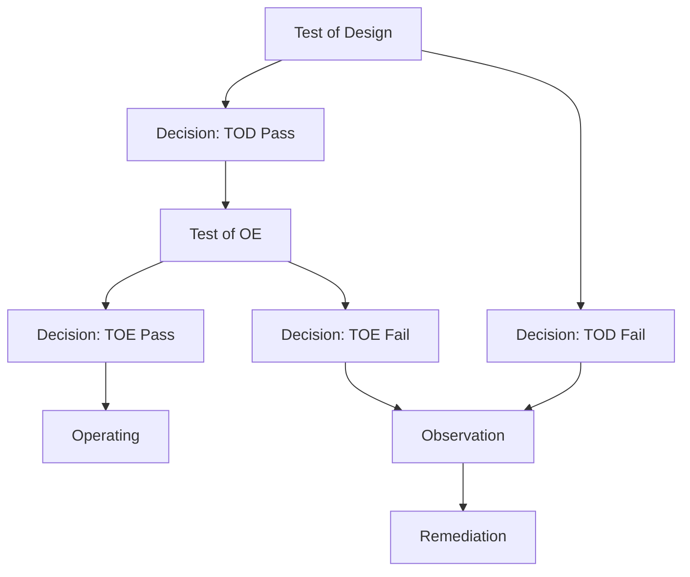



## プロセス概要

{: width="600px"}

## 目的

セキュリティコンプライアンスチームがコンプライアンスまたは規制上の理由で実装する必要のある新しいGitLabセキュリティコントロールが特定された場合、その実装を成功させるためにこれらのコントロールは確立されたプロセスに従います。

これらのライフサイクルフェーズは、GitLabのガバナンス、リスクおよびコンプライアンス（GRC）アプリケーションで管理されています。

## スコープ

このドキュメントは、セキュリティコンプライアンスチームによってアセスメントされるGitLabのセキュリティコントロールに適用されます。

## 役割と責任

| 役割 | 責任|
| ---- | ------ |
| GitLabチームメンバー | コントロールの要件に従う責任 |
| セキュリティコンプライアンスチーム | セキュリティコントロールテストの実行とこのハンドブックページの維持に対する責任 |
| セキュリティコンプライアンスマネジメント | このプロセスの監督、エスカレーション、例外承認に対する責任 |
| セキュリティアシュアランスマネジメント（コードオーナー） | この手順への重大な変更と例外を承認する責任 |

## 手順

### ライフサイクルフェーズの説明

#### 準備

新しい[GCFセキュリティコントロール](/handbook/security/security-assurance/security-compliance/sec-controls.md)が特定されると、まずGitLabという企業や該当するGitLabシステムの文脈に置き換える必要があります。コントロールライフサイクルの準備フェーズは、コントロールをテスト可能な状態にするために必要なこの初期作業をカバーします。

さらに、以前にテストされたが今後テストの更新要件があるGCFコントロールも、このフェーズに入り、コントロールプロセスへの変更が更新されたテスト活動でキャプチャされていることを調査・確認します。

#### テスト

テスト活動は3つの主要なコンポーネントで構成されます。

1. コントロールの設計と運用の有効性をアセスメントする
1. テスト中に確認された場合は観察事項をオブザベーションオーナーと検証する
1. これらの観察事項（あれば）を[セキュリティコンプライアンス観察事項管理プロセス](/handbook/security/security-assurance/observation-management-procedure/)に従って記録する
   - **注:** これらの観察事項は、観察事項が正確であり、セキュリティコントロールプロセスの重大な不備を表していることを確認するため、オブザベーションオーナーによる検証後にのみ記録できます

アセスメントと検証の後、GRCツールのステータスフィールドは以下のように更新する必要があります。

- 現在のコントロール実装がなくギャップが存在する場合、プレースホルダーコントロールを作成し、ステータスを「gap」とリストする
  - 「gap」ステータスのコントロールには、対応する観察Issueが必要です。
- コントロールが設計され、観察事項なしで効果的に運用されていた場合、コントロールIDとコントロール説明を作成し、適切なコントロールドメインにマッピングし、ステータスを「in existence」とリストする。

#### 修正

修正は、セキュリティコントロールの設計またはコントロール運用プロセスに対して必要な変更が行われるライフサイクルフェーズです。修正はオブザベーションオーナーによって実施されるか、または観察事項の修正が他のGitLabチームの作業によってブロックされている場合はオブザベーションオーナーによって追跡されます。セキュリティコンプライアンスチームは、すべての検証済み観察事項を追跡し、それらが追跡され、適切に優先順位付けされ、セキュリティコンプライアンスプログラムの目標を達成するために必要に応じてエスカレートされていることを確認するために、それらの観察事項について継続的にレポートする責任があります。

#### 運用

そのテスト活動中に観察事項なしでテストされたコントロールは、運用状態にあると判断されます。これは、このコントロールの設計と運用の有効性が、セキュリティコンプライアンスプログラムの現在のニーズを満たすために必要なレベルにあるか、それを上回っていることを示します。

運用状態のコントロールは、コントロールのリスクレーティングによって決定された通り、設計や運用の有効性に影響を与えるような実質的な変更が発生していないことを確認するために、引き続き再テストが必要です。

## 例外

この手順への例外は、[情報セキュリティポリシー例外管理プロセス](/handbook/security/controlled-document-procedure/#exceptions)に従って追跡されます。

## 参考資料

- [Controlled Document Procedure](/handbook/security/controlled-document-procedure/)

<a href="../security-compliance/" class="btn bg-primary text-white btn-lg">セキュリティコンプライアンスチームページに戻る</a>
