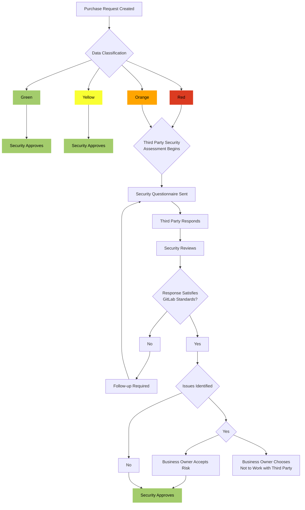



## GitLab の統合 Third-Party Risk Management プログラム

GitLab は、自動化、継続的なモニタリング、およびビジネス機能全体にわたる深い統合を活用して、外部関係者と共有される GitLab データのセキュリティを検証する、業界をリードする Third Party Risk Management (TPRM) Program を維持しています。

ベンダー調達フロー内に GitLab の TPRM プログラムを統合することで、Privacy、Legal、IT、People Operations 間の機能横断的な [コラボレーション](/handbook/values/#collaboration) を可能にし、[透明性のある](/handbook/values/#transparency) リスクベースの意思決定、ビジネスおよびステークホルダーに焦点を当てた [Results](/handbook/values/#results)、そして GitLab の規制および [Compliance Obligations](/handbook/security/security-assurance/security-compliance/certifications/) の遵守を促進します。このプログラムを通じて維持されるベンダー関係は、組織全体で効率を生み出すために活用されます。

## 範囲

この手順は、GitLab データにアクセス、保管、処理、または送信するすべてのサードパーティプロバイダーに適用されます。

## 目的

GitLab の Security Third Party Risk Management (TPRM) プログラムは、GitLab またはお客様のデータにアクセスできるサードパーティから引き起こされるセキュリティ脅威に対する保護を支援します。これらのリスクには、データ侵害、不正使用または開示、データの破損または喪失が含まれる可能性があります。適切な TPRM は、[セキュリティの懸念を軽減](https://internal.gitlab.com/handbook/leadership/mitigating-concerns/#security-breach) し、GitLab が契約上の義務を満たすことを可能にするベストプラクティスです。TPRM はまた、GitLab が ISO、SOX、GDPR、およびベンダー監視を必要とするその他の州法および連邦法に関連する規制要件と標準を満たすことを可能にします。

GitLab の Security TPRM プログラムは、[Procurement](/handbook/finance/procurement/) プロセスに統合された 3 つのコンポーネントを含んでいます。

1. サードパーティがデータプライバシーとセキュリティを実施する保護策を実装することを保証するためのデューデリジェンスの実施
    - この活動は、私たちの Security Assessment Process を通じて実行されます。私たちの TPRM Assessment Report テンプレートのオープンソース版は、[Open Source Security Hub](https://gitlab.com/gitlab-security-oss/risk-mgmt/tprm-templates) で見つけることができます。
1. これらの保護策を実装することをサードパーティに [契約上](/handbook/finance/procurement/#contracting) 義務付ける
1. サードパーティの保護策と契約された規定の遵守をモニタリングする
    - 高リスクの特定のサードパーティは年次でレビューされ、低リスクのものはこの文書内でさらに定義された間隔でレビューされます。

## 役割と責任

| 役割 | 責任 |
| ------ | ------ |
| Security Risk Team |  - TPRM 活動を取り込み、対応するメカニズムを維持する   - サードパーティの固有および残留セキュリティリスクを評価する   Business Owner に TPRM アセスメントの結果を伝達する |
| Business または System Owner |  - [サードパーティ関係の性質を説明する](/handbook/finance/procurement/#step-2-submit-your-zip-request)   - Security Risk チームと協力して、是正活動を含む TPRM レビューを促進する   - セキュリティレビュー要件の一部としてサードパーティの応答性を確保する |
| Security Assurance Management (Code Owners) | - この手順に対する重要な変更と例外を承認する責任を負います |

### オンコールローテーション

TPRM エンジニアは、ベンダーの取り込みと TPRM の問い合わせを管理するために週単位でオンコール業務に割り当てられます。チームメンバーは、緊急の問い合わせのために Slack または GitLab Issue 内でオンコールエンジニアをタグ付けすることをお勧めします。オンコールカレンダーは [こちら](https://calendar.google.com/calendar/u/0/embed?height=600&wkst=1&ctz=America/Chicago&title=TPRM+On-Call+Calendar&showPrint=0&showTabs=0&showCalendars=0&showTz=0&src=Y181ZGE3cHNtZXNycGxnYzFxZWkxbzh2aWE0MEBncm91cC5jYWxlbmRhci5nb29nbGUuY29t&color=%23039BE5) で見つけることができます。

### アフターアワーサポート

Security Risk チームのコア勤務時間は CST 8:00AM から 4:00PM です。これらの時間外に即時対応が必要な緊急の要求や TPRM の懸念事項については、Slack に記載されている電話番号で Ty Dilbeck に連絡してください。

## よくある質問

| 質問 | 回答 |
| -------- | ------ |
| *TPRM の目的は何ですか?* | 私たちの手順は、情報に基づくビジネス意思決定をサポートし、進化し続ける脅威ランドスケープへのエクスポージャーを軽減するために存在します。これは、お客様の信頼を維持し、不正なデータ暴露を防止するために重要です。|
| *私の役割は何ですか?* | リクエスターとしてのあなたの主な役割は、何が購入されているか、どのデータが共有されているかを私たちが理解するのを助けることです。これにより、あなたのニーズをサポートするために、効率的に正確なアセスメントを完了することができます。|
| *昨年彼らをレビューしたのに、なぜまた行うのですか?* | 私たちのアセスメントは 12 か月間有効です。その後、追加の要求を承認できるようになる前に新しいアセスメントが必要です。ベンダーのセキュリティ環境と私たちのコンプライアンス義務は変更される可能性があるため、進化するリスクと整合し続けるために継続的な監視が必要です。|
| *先に承認して、後でアセスメントすることはできますか?* | いいえ。レビュー前に新しいベンダーやシステムを導入すると、予期しないセキュリティリスクとコンプライアンスの問題にさらされる可能性があります。重要なビジネスや顧客のニーズに対応するためにリクエストが **必ず** 進む必要がある場合、私たちの [Security Notice プロセス](/handbook/security/security-assurance/security-risk/third-party-risk-management/#tprm-security-notice-process) を通じて承認が付与される可能性があります。|
| *これは迅速化できますか?*  | リクエストが重要で時間に敏感な場合、私たちのチームは合理的な範囲内でレビューを優先順位付けできますが、レビューを迅速化する **最良の** 方法は、ベンダーが私たちの問い合わせに迅速に応答するよう促すことです。緊急のリクエストは、#Procurement チャンネルで @Security-Risk にエスカレーションすべきです。|
| *レビューのステータスはどのように追跡できますか?* | 更新は Zip 要求内のコメントを通じて提供されます。ステータスの更新はそこ、または #Procurement チャンネル内で要求できます。|
| *彼らがレビューに失敗したらどうなりますか?* | [Security Notice](/handbook/security/security-assurance/security-risk/third-party-risk-management/#tprm-security-notice-process) がオープンされ、関連するステークホルダーに不備を伝達し、ビジネスニーズをサポートするための次のステップを判定します。私たちの TPRM レビューに失敗した新しいベンダーは、進む前に特定された不備に対処することが必要になる場合があります。既存のベンダーについては、不備の深刻度に応じて、是正計画またはオフボーディング計画が必要になる場合があります。|
|*何が TPRM Assessment をトリガーしますか?* | おかしなことに、それを聞いてくれてよかった...|

## 何が TPRM Assessment をトリガーしますか?

Security Risk は、コンプライアンスを維持し、適切な監視を確保するために、さまざまなインプットをモニタリングしています。TPRM アセスメントは、特に指定されない限り通常 12 か月間有効で、次のシナリオでトリガーされます。

- **新規ベンダーエンゲージメント:** [Orange または Red データ](https://internal.gitlab.com/handbook/security/policies_and_standards/standards/data_classification/) にアクセスする新しいベンダーまたはシステムは、承認前に TPRM レビューを必要とします。
- **ベンダーの更新:** 最新のアセスメントが期限切れの場合、ベンダーの更新は承認前に TPRM アセスメントを必要とする場合があります。
- **サービスの変更:** 既存ベンダーからの新しいサービスや機能は、以前のアセスメントでカバーされていないリスクを導入する可能性があります。
- **セキュリティインシデント:** ベンダーが GitLab データに影響する可能性のあるセキュリティインシデントを被った場合、[Technical Security Validation](/handbook/security/security-assurance/security-risk/third-party-risk-management/#technical-security-validations) と共にアセスメントがトリガーされる可能性があります。
- **システムの統合:** 新規または既存システム間の統合、特に高機密性データを処理するものは、アセスメントを必要とする場合があります。詳細については **[システムの統合](/handbook/security/security-assurance/security-risk/third-party-risk-management/#third-party-application-integrations)** を参照してください。
- **年次の高リスクレビュー:** コンプライアンステスト（SOC 2、SOX など）の対象範囲のベンダー、[GitLab Sub-Processors](https://about.gitlab.com/privacy/subprocessors/)、その他 Red データを処理するベンダーは、コンプライアンス義務を満たすために年次でレビューされます。

## ベンダー選定のためのセキュリティ考慮事項

セキュリティは GitLab のベンダー選定プロセスにおける最優先事項であり、GitLab は機密データの保護を優先し、堅牢なセキュリティ対策を維持するベンダーとパートナーシップを結ぶことに尽力しています。そのため、Security Risk は、業界標準への遵守、関連規制へのコンプライアンス、Bitsight セキュリティレーティングの健全性を含む、各ベンダーのセキュリティ慣行を徹底的に評価します。GitLab の目的は、GitLab のデータを保護し、ステークホルダーの信頼を維持するために、セキュリティの最高基準を維持することへのコミットメントを共有するベンダーとパートナーシップを確立することです。以下は、Security Risk がさまざまなタイプのベンダーをどのように評価するかの例と、購買決定を行う際にベンダーを審査するための推奨事項です。

Software as a Service (SaaS)

ビジネスニーズと目標に対処するための新しいソフトウェアを検討する際、ソフトウェアの能力を評価するために活用すべき高レベルの推奨事項について以下を参照してください。

- ベンダーは、チームメンバーが自分のネットワーク認証情報を使用して認証できるように、シングルサインオン (SSO) をサポートしていますか?
  - Security では、ソフトウェアが認証のために Okta と統合する能力を持つことが必要です。
- ベンダーは、業界標準とベストプラクティスへの遵守を示すために、彼らのセキュリティコントロールについて年次の独立した第三者監査を完了していますか?
  - Security では、ソフトウェアベンダーが彼らのセキュリティコントロールについて年次の独立した第三者監査を完了し、共有することが必要です。これらの例として、[SOC 2 または ISO 27001 認証](/handbook/security/security-assurance/security-risk/third-party-risk-management/#acceptable-third-party-attestations) があります。
- ベンダーは、ソフトウェア開発ライフサイクル全体に Secure by Design の原則を組み込んでいますか?
  - Security では、ソフトウェアベンダーがソフトウェアの設計および開発フェーズ中にデプロイ前の脅威モデリング、脆弱性スキャン、セキュアコーディング慣行を実施することが必要です。
- ベンダーは、脆弱性と弱点を特定および是正するために、彼らのシステムの独立した第三者ペネトレーションテストを必要としていますか?
  - Security では、ベンダーが彼らの SaaS ソリューションをサポートするすべてのシステムに対して年次の独立したペネトレーションテストを実施し、GitLab データに対する重大な脅威となる High または Critical の所見の是正または軽減を証明することが必要です。

*注: PoC（概念実証）やパイロットソフトウェアエンゲージメントは、機密性の高い GitLab データの交換を必要とする場合があり、新しいソフトウェアリクエストと同じベンダーのセキュリティ慣行の評価に従う必要があります。Security Risk は、機密性の高い GitLab データの匿名化と、契約言語が PoC またはパイロット完了後のデータセキュリティ、[プライバシー考慮事項](/handbook/legal/privacy/)、[データの削除](/handbook/finance/procurement/vendor-guidelines/vendor-agreement/#7-termination) に関する期待と要件を定義することを推奨します。*

Professional Services

GitLab には、Orange または Red データにアクセスするすべての個人が、GitLab 管理デバイスの発行、または、適切なエンドポイントセキュリティコントロールが整備されていることを保証するための TPRM レビューの実施のいずれかにより、十分なエンドポイントコントロールの対象となることを保証する義務があります。プロフェッショナルサービスファームは、彼らのセキュリティ環境について十分なドキュメンテーションを提供できることが多いため、十分な保証が得られたら、彼らのエンドポイントに依存することができます。十分に文書化されたエンドポイントコントロールを持たない独立した請負業者やファームには、IT によって GitLab 管理エンドポイントが提供されます。

プロフェッショナルサービスベンダーを評価する際に活用すべき高レベルの推奨事項については、以下を参照してください。

- GitLab のドキュメントがベンダーと共有されますか?
  - Security では、外部関係者と機密性の高いデータを共有するために GitLab の Google Drive を使用することを推奨します。
- プロフェッショナルサービスベンダーは、利用規約とデータ保護トレーニング、バックグラウンドスクリーニング、定期的なセキュリティ意識向上トレーニングを含む、厳格な人事セキュリティ慣行を遵守していますか?
  - GitLab は、プロフェッショナルサービスベンダーがバックグラウンドスクリーニングとセキュリティ意識向上トレーニングを行うことを必要としています。特定のバックグラウンドスクリーニングは、ベンダーの許可を得て [GitLab によって](/handbook/people-group/contracts-probation-periods/#background-screenings) 促進できます。さらに、ベンダーがセキュリティ意識向上トレーニングを欠いている場合、[無料のセキュリティ意識向上トレーニング](https://www.ncsc.gov.uk/training/v4/Top+tips/Web+package/content/index.html#/) を [UK の National Cyber Security Centre](https://www.ncsc.gov.uk/blog-post/ncsc-cyber-security-training-for-staff-now-available) から取り入れるよう提案してください。
- ベンダーは個人デバイスから作業を行いますか?
  - Security では、GitLab データが適切なエンドポイントセキュリティコントロールによって保護されることが必要です。

 

### TPRM Assessment Requirements {#tprm-assessment-requirements}

次の表は、異なる [GitLab データの分類](/handbook/security/policies_and_standards/data-classification-standard/) にアクセスまたは送信されるベンダーに対して TPRM エンジニアが従う手順を定義しています。以下の手順は、[Procurement](/handbook/finance/procurement/#--what-is-the-procurement-process-at-gitlab) プロセス中に開始され、該当するベンダーが以下に定義された承認ウィンドウ内でレビューされていない場合のすべてのインスタンスで従われます。**[TPRM の Minimum Security Standards](#third-party-minimum-security-standards) との不整合は、ベンダー要求の拒否や Security Notice の発行につながる可能性があります。** 前回のアセスメント時に Security Notice が文書化された場合、要求承認の前に、特定された不備の現在のステータスを判定するために問い合わせが行われます。不備の性質に応じて、新しい TPRM アセスメントが必要になる場合があります。更新は Security Notice Issue 内に文書化されます。

| データ 分類 | リクエスト | 補足 アンケート | Okta SSO? | 新規 BIA / Tech Stack エントリ? | Bitsight レビュー? | ペネトレーションテストの証拠 |
| ------ | ------ |------ |------ |------ |------ | ------ |
|Red     |3rd Party Attestation |     はい|          該当する場合|     はい|    該当する場合 | はい |
|Orange SaaS Systems または Locally Hosted/Installed Systems with Data Exchange| 3rd Party Attestation|     はい|          はい|     はい|     はい | はい |
| Orange Individual Use Software* | 3rd Party Attestation または [Self-Attestation](#standard-information-gathering-sig-questionnaire-for-vendor-self-attestation) | いいえ | いいえ | いいえ | はい | いいえ|
|Orange Professional Services | 3rd Party Attestation または [Prof Svcs SIG](https://docs.google.com/spreadsheets/d/1xiReZd5heUl5YVFCqPxEfXJIYlqtz_LS/edit?usp=drive_link&ouid=103289635706160914358&rtpof=true&sd=true)|          N/A|     N/A| N/A|   N/A | N/A|
|Yellow/Green     | N/A |  N/A |  N/A |     いいえ | N/A  | N/A  |

*GitLab の機密性の高いデータを収集および保管するために Web 対応のアプリケーションを利用するプロフェッショナルサービスベンダーは、一般的に Orange SaaS システムとして扱われます。*

## 手順

GitLab がデータを管理、所有、その他の責任を負う場合、以下の図は、サードパーティと共有されるデータの [Data Classification](/handbook/security/policies_and_standards/data-classification-standard/) に基づく TPRM 手順を示しています。

{}

{}

### ベンダーの固有および残留リスクの判定

TPRM 手順は、提供されるサービスと共有されるデータの性質に基づいて判定されるベンダーの固有および残留リスクレベルによって導かれます。これらのリスクの理解は、ベンダーを活用するための情報に基づくビジネス意思決定を行う上で重要です。

**固有リスク (Inherent Risk)** は、GitLab の Third Party Risk Management Program で要求される軽減コントロールを考慮する前のベンダーのベースラインリスクレベルです。GitLab は [ベンダーと交換されるデータの機密性](/handbook/security/policies_and_standards/data-classification-standard/#data-classification-levels) を使用してベースラインリスクレベルを確立し、これにより [TPRM アセスメント要件](/handbook/security/security-assurance/security-risk/third-party-risk-management/#tprm-assessment-requirements) を決定します。

|固有リスクレベル|データ分類|
|:---------:|:--------------:|
|Critical|Red|
|High|Orange SaaS1|
|Medium|Orange2|
|Low|Yellow / Green|

<ol>
  <li> <i> クラウドサービス（SaaS 提供など）を提供するベンダーエンゲージメントに関連するリスクの増加により、これらのタイプのサービスに関連する新たな脅威と脆弱性を考慮するために固有リスクレベルが引き上げられています。 </i> </li>
  <li><i>Orange Individual-Use Software は、これらのタイプのリクエストに関連するリスクの低減により、削減された範囲の下で中程度の固有リスクとしてアセスメントされます。詳細なガイダンスについては <a href="/handbook/security/security-assurance/security-risk/third-party-risk-management/#individual-use-software-requests">こちら</a> を参照してください。</i></li>
</ol>

**残留リスク (Residual Risk)** は、GitLab の Third Party Risk Management Program で要求される軽減コントロールを考慮した後に残るリスクのレベルです。ベンダーの残留リスクを効果的に管理するには、ベンダーのサービスや製品の重要性、関与するデータの機密性、そして GitLab のリスク許容度を考慮するバランスのとれたアプローチが必要です。

GitLab のセキュリティ要件を満たすベンダーは、以下のような残留リスクレベルを持ちます。

|固有リスクレベル| 残留リスクレベル|
|:---------:|:--------------:|
|Critical|High|
|High|Medium|
|Medium|Low|
|Low|Low|

GitLab の Third Party Risk Assessment 要件を満たさないベンダーは、固有リスクスコアと同等の残留リスクスコアを持ち、[Security Notice](#tprm-security-notice-process) が必要になる場合があります。

## Third Party Minimum Security Standards {#third-party-minimum-security-standards}

TPRM は、サードパーティをアセスメントする際にリスクベースのアプローチを利用しています。異なるベンダータイプ/リスクプロファイルをアセスメントするために使用される特定の手順は、上記の [TPRM Assessment Requirements](#tprm-assessment-requirements) セクションで確認できます。

Security Risk Team は、ベンダーと協力し、私たちのレビューを完了するために必要なドキュメンテーションを取得するために合理的なステップを踏みます。提供されるサービスと送信されるデータに応じて、これにはサードパーティセキュリティ証明とペネトレーションテストの概要などの他の関連ドキュメンテーションのリクエストが含まれる場合があります。ベンダーがこのドキュメンテーションを維持していない、または提供を拒否した場合、Security Risk チームはリクエストを拒否したり、承認前に [TPRM Security Notice](#tprm-security-notice-process) の完了を必要としたりする場合があります。

私たちの TPRM 手順中に一般的に特定される不備を以下にリストします。

1. ISO 27001、SOC 2 Type 2 などのサードパーティセキュリティ証明の欠如
1. 従業員と請負業者のバックグラウンドチェックの欠如
1. [Okta](/handbook/security/corporate/end-user-services/okta/#what-is-okta) との統合不可*（[GitLab の Password Standard](/handbook/security/policies_and_standards/password-standard/#application-authentication-requirements) との整合）
   - Okta 統合が整備されていない、または不可能な場合、ネイティブの多要素認証 (MFA) 機能が軽減コントロールになり得ます。これは、関連する要求を承認する前に、サインオフのために CorpSec にエスカレーションすべきです。
1. 最近のペネトレーションテストの証拠を欠いているシステム
1. 明らかな是正計画または予想される是正日のない、解決されていない High および/または Critical のペネトレーションテストの所見
   - ペネトレーションテストの所見は、不備の性質と GitLab への影響を理解するためにエンジニアによってレビューされます。GitLab への影響が無視できる、または既存の GitLab コントロールによって十分に軽減されている不備は、不利な結論にならない場合があります。

特定された不備は、ベンダーの広範なセキュリティ環境と送信されるデータの文脈の中でレビューされます。GitLab データに対する重大なリスクが特定された場合、これは [TPRM Security Notice Process](#tprm-security-notice-process) を通じて Business Owner に報告されます。

### 受け入れ可能なサードパーティ証明 {#acceptable-third-party-attestations}

GitLab は、サービスプロバイダーの内部統制環境の設計および運用上の有効性に対する保証を提供するために、サードパーティ証明を取得およびレビューします。これらの証明には、ISO 27001 認証や SOC (Service Organization Control) 2 Type 2 レポートが一般的に含まれますが、これらに限定されません。これらのより一般的なドキュメントがない場合、代替形式の証明を活用できますが、その証明がコントロール環境を十分にカバーしており、私たちのアセスメント基準と整合しているかどうかを判定する際にアセッサーによってデューデリジェンスが行われるべきです。

**ISO 27001:** ISO 27001 認証と、付随する [Information Security Management System (ISMS)](/handbook/security/isms/) の範囲、および [Statement of Applicability (SoA)](https://www.isms.online/iso-27001/iso27001-statement-applicability-simplified/) は、業界標準のセキュリティベストプラクティスへのコンプライアンスの証拠として活用できます。ISMS の範囲は、ベンダーから GitLab に提供されるサービスが ISO 監査によってカバーされていることを保証するのに役立ち、SoA は組織によって適用されているポリシーとコントロールへの可視性を提供します。該当するサービスをカバーする有効な ISO 27001 認証は、外部の認証機関が、経営チームの以下の継続的な実行に関連するコントロールの設計と運用上の有効性を検証するためにテストを実行したことを示します。

- 脅威、脆弱性、影響を考慮した、組織の情報セキュリティリスクの体系的な検査；
- 受け入れ不可能とみなされるリスクに対処するための、首尾一貫した包括的な情報セキュリティコントロールおよび/またはその他の形式のリスク治療（リスク回避やリスク移転など）の設計と実装；そして、
- 情報セキュリティコントロールが組織の情報セキュリティニーズを継続的に満たし続けることを保証するための、包括的な管理プロセスの採用。([Source](https://en.wikipedia.org/wiki/ISO/IEC_27001#:~:text=2020.%5B5%5D-,How%20the%20standard%20works,-%5Bedit%5D))

ベンダーが有効な ISO 27001 認証を提供しているが、SoA を提供できない場合、私たちのアセスメント基準を満たし、彼らのセキュリティ環境のより良い理解を得るために、SIG や CAIQ などの自己証明の完成を要求します。

*ISO 27001 認証には有効期限が含まれていることに注意してください。この日付を過ぎると、認証はもはや有効ではなく、私たちのアセスメントで活用すべきではありません。*

**SOC 2 Type 2:** SOC 2 Type 2 レポートは、サードパーティリスクをアセスメントする際に好まれる証明です。なぜなら、このレポートは組織の情報システムの設計と、さまざまな形式のリスクがどのように対処されているかを詳述するためです。このレポートは、組織内の整備されたコントロールを詳述するだけでなく、それらのコントロールのそれぞれが監査期間中に効果的に機能したかどうかの独立した検証も含まれています。このレポートは、以下を検証するためにレビューされるべきです。

- レポートが、GitLab に提供されているサービスをカバーしている；
- レポートが過去 12 か月以内に発行されている；
  - 最新のレポートが 12 か月以上古い場合、ブリッジレターを取得して、レポートの発行以来ベンダーのコントロール環境に重大な変更が発生していないことを保証する必要があります。
- レポートが、GitLab データのセキュリティに影響する条件付き意見や例外なしに発行されている。
  - 「条件付き」と指定されたレポートは、評価された 1 つ以上のコントロールが監査期間中に不十分に設計または実装されていることが判明したことを示します。条件付きの性質は、コントロールの失敗が GitLab データのセキュリティに影響を与える可能性があるかどうかを判定するためにレビューおよび理解されるべきであり、影響を与える場合は TPRM Security Notice を通じて Business Owner に報告されるべきです。
  - レポート内で、条件付き意見の発行につながらない例外が特定される場合がありますが、それらが GitLab データにリスクを呈する可能性があるかどうかを判定するために、いずれの例外も以下についてレビューされるべきです。
    - **例外の性質:** 関連するコントロールと例外自体は、GitLab がそのコントロールに依存して私たちのデータを保護しているかどうかを判定するためにレビューされるべきです。
    - **経営の対応:** 例外の理由とそれに対処および是正するためにとられたステップを扱うために、経営の対応がしばしば含まれます。これは、是正が成功したことを検証するために外部監査人によって実施される再テストを伴う場合があります。
  - これらの項目は、存在する場合、TPRM Assessment Report 内に記録されるべきです。条件付きまたは例外の性質が GitLab のセキュリティに影響することが判明し、経営の対応が是正ステップがとられたという十分な保証を提供しない場合、これは TPRM Security Notice Process を通じて Business Owner に報告されるべきです。

**SOC 2 Type 1:** SOC 2 Type 1 レポートは、SOC 2 Type 2「準備状況」プロセス中の予備的なアセスメントの一環としてしばしば公開されます。これは、サービスプロバイダーの環境内で整備されているコントロールの設計の限定的なスコープ、ある時点でのアセスメントであり、**コントロール運用上の有効性の検証は含まれません。そのため、Type 1 レポートは、Orange SaaS / Red システムに対する私たちのサードパーティ証明要件を扱うために単独で活用すべきではありません**。ただし、サービスプロバイダーの環境に対する保証を提供するために、ISO 27001 認証または同等の証明に追加して活用できます。

**PCI Attestation of Compliance:** [PCI Attestation of Compliance (AoC)](https://www.pcisecuritystandards.org/glossary/aoc/) は、サービスプロバイダーの PCI DSS フレームワークへのコンプライアンスを検証するために、[Security Compliance Team](/handbook/security/security-assurance/security-compliance/) によって活用されます。この証明は、付随する Responsibility Matrix と共に、GitLab インフラストラクチャをホスティングするベンダーに対して一般的に必要とされます。Security Risk チームは、Security Compliance のリクエストにより必要に応じてこのドキュメンテーションを収集します。PCI AoC は、Security Risk が [TPRM Assessment Requirements](/handbook/security/security-assurance/security-risk/third-party-risk-management/#tprm-assessment-requirements) を満たすために **活用されません**。

#### Complementary User Entity Controls (CUECs)

一部のベンダーのコントロール目的は、GitLab によるサポートコントロールの適切な設計と実装なしには達成できず、これらはベンダーの SOC 2 レポート内で Complementary User Entity Controls (CUEC) の形で指定されます。CUEC は、データセキュリティとサービスコミットメントをサポートするためにベンダーによって一般的に活用されており、データセキュリティをサポートし、不正なデータ開示を防止するためにこれらのコントロールに対処するのは GitLab の責任です。

Security Risk チームは、私たちのレビュー中にベンダーの SOC 2 レポートを取得し、CUEC が定義され、ベンダーによって依存されているかどうかを判定します。CUEC が定義されている場合、Business Owner は Zip 要求の承認時に通知され、CUEC をレビューし、それらに対処するためのコントロールが整備されていることを確認するように指示されます。コントロールがまだ整備されていない場合、Business Owner はこれらのコントロールの実装を調整する責任があります。これは Security Assurance チームと協力して完了することができます。私たちはあなたの主要な GitLab プロジェクトで `Application/Service Name CUEC Mapping` というタイトルの Epic を作成することを推奨します。アクションが必要な各 CUEC に対して Issue を作成すべきです。Issue は、必要に応じてコントロールが定期的に行われることを保証するメカニズムを含む、文書化された計画またはプロセスが整備されたら、理想的にはハンドブック内でクローズされるべきです。一般的な CUEC と各々のガイダンスは以下の表で確認できます。ベンダーの SOC レポートで定義された具体的な言語は以下の言語と異なる場合があり、修正された行動方針が必要になる場合があることに注意してください。

{}

| # | CUEC | ガイダンス | 関連する [GCF Control(s)](/handbook/security/security-assurance/security-compliance/sec-controls/#gitlab-control-framework-gcf) |
|---|:-----|:---------| -----------------------|
|1|ベンダーと共有するデータの正確性を確保する|あるシステムから別のシステムへデータを移動する際に発生する可能性のある [データ品質の問題](/handbook/enterprise-data/data-governance/data-quality/#types-of-data-quality-problems) のリスクを軽減すべきです。これは、ソースデータと宛先データを比較することで行うことができます。データを生成するために使用されるクエリは、不適切に除外されていないことを確認するためにレビューされるべきです。| SC-8 |
|2|アプリケーションへのアクセスの追加と削除|新しいアプリケーションについては、Tech Stack Add プロセスがアプリケーションを私たちの [access request](/handbook/security/corporate/end-user-services/access-requests/access-requests/) と [off-boarding](/handbook/business-technology/tech-stack-applications/#updating-the-offboarding-templates) のプロセスにオンボーディングすることを促進すべきです。既存のアプリケーションについては、上記のプロセスがあなたのアプリケーションに対して従われていることを確認してください。| AC-2|
|3|私たちのネットワークへのアクセスの管理|私たちは [従来のエンタープライズネットワーク](/handbook/security/product-security/security-platforms-architecture/security-architecture/zero-trust/#zero-trust) を持っていません。[Okta](/handbook/security/corporate/end-user-services/okta/#adding-new-applications-to-okta) と統合することは、アプリケーションへのアクセスが多要素認証の背後にゲートされ、Okta を通じてのみアクセス可能であることを保証するのに役立ちます。|AC-17|
|4|アプリケーションへのアクセスのレビュー|アクセスレビューは、私たちの [コンプライアンスおよび規制プログラム](/handbook/business-technology/tech-stack-applications/#compliance) の対象範囲である Tier 1 と Tier 2 のシステムに対して実行されます。私たちのコンプライアンスおよび規制プログラムの対象範囲ではない Tier 1/2/3 システムのシステムオーナーは、[このプロセス](/handbook/security/security-assurance/security-compliance/access-reviews/) をガイドとして使用して、所有しているシステムに対して年次の終了アクセスレビューを最低でも実行することが強く推奨されます。Tier 4 システムのアクセスレビューは必要ありません。アドホックなアクセスレビューを要求するには、[こちら](https://gitlab.com/gitlab-com/gl-security/security-assurance/team-commercial-compliance/user-access-review/-/issues/new?issuable_template=Ad-Hoc%20User%20Access%20Review%20Request) でリクエスト Issue を作成してください。定期的なレビューのリマインダーは、共有カレンダーで Google Calendar イベントとして設定するか、GitLab のスケジュールパイプラインで Issue を作成することができます。| AC-6 |
|5|タイムリーにベンダーに変更を通知する|ベンダーと協力して、どの変更が伝達される必要があるかを理解してください。一般的な例は、ベンダーの主要または副次連絡先と見なされた誰かが会社を辞めた場合や、セキュリティ侵害の場合です。これらのシナリオを文書化するプロセス、それらがどのように伝達されるか、そのための SLA を確立してください。| SR-8 |
|6|災害復旧手順の確立|私たちは、アプリケーションの停止に備えるべきです。停止のために利用できないデータを再現できるでしょうか? アプリケーションの停止にどのように対応するかについての手順を文書化してください。| CP-2 |

{}

CUEC に関する質問は、Slack の #sec-assurance チャンネルに直接送ることができます。

### Standard Information Gathering (SIG) Questionnaire for Vendor Self Attestation {#standard-information-gathering-sig-questionnaire-for-vendor-self-attestation}

[SIG questionnaire](https://sharedassessments.org/sig/) や CAIQ などの同等のドキュメントなどの自己証明は、個別利用ソフトウェアベンダーが有効な SOC 2 Type 2 レポートまたは ISO 27001 認証および Statement of Applicability を提供できない場合に必要です。Red ベンダーまたは Orange SaaS ベンダーは、上記で定義された Third-Party Attestation を提供する必要があります。SIG questionnaire は、サービス組織のセキュリティ環境の成熟度をアセスメントする際に、私たちの Security Questionnaire への回答と並行してレビューされます。

Security Risk は、評価される製品やサービスに応じて使用するための SIG questionnaire の複数のテンプレート版を維持しています。一部のベンダーは提供する SIG questionnaire や同等のものを持っていない場合があります。SIG テンプレートには、メインアンケートタブの列 D と E 内の Inquiry 回答のみが必要であるという指示が含まれており、SIG 内の追加の情報やドキュメンテーションのリクエストは一般的に必要ありません。専門的な裁量により、ベンダーの回答を補完するために追加のドキュメンテーションリクエストの必要性が指示される可能性のある潜在的なフリンジケースが存在する *可能性があります*。さらに、どのバージョンの SIG questionnaire が送信されるべきかを決定する際には、専門的な裁量を適用すべきです。レビューに必要なレベルが不明な場合、エンジニアは #Sec-Assurance-Team チャンネル内の @Security-Risk チームと相談し、提供されるサービス、交換されるデータ、以前のアセスメントの結果などの要因を考慮した上で意思決定を行うことが奨励されています。

{}

- [SIG Lite Plus](https://docs.google.com/spreadsheets/d/1wvpY3oF8sG_UbnQzzlbXs85ahsfLiDQp/edit?usp=drive_link&ouid=103289635706160914358&rtpof=true&sd=true)
  - SIG Lite Plus questionnaire は最も一般的に活用されており、すべての Red ベンダーと Orange SaaS システムに使用すべきです。私たちは、ドメイン「E. Human Resource Security と V. Cloud Services」のフルスコープの SIG questionnaire が含まれているため、SIG Lite を「SIG Lite Plus」と呼んでいます。他のすべてのドメインには標準の SIG Lite コンテンツが含まれています。私たちの目的は、クラウドセキュリティとパーソナルコンピューターの使用、従業員のバックグラウンドチェックに関連する追加情報を取得することです。
  - 以下の 20 のドメインが SIG Lite Plus questionnaire の範囲内に含まれています:
    - A. Enterprise Risk Management
    - B. Nth Party Management
    - C. Information Assurance
    - D. Asset and Info Management
    - E. Human Resources Security (Full SIG Content)
    - F. Physical and Environmental Security
    - G. IT Operations Management
    - H. Access Control
    - I. Application Management
    - J. Cybersecurity Incident Mgmt
    - K. Operational Resilience
    - L. Compliance Management
    - M. Endpoint Security
    - N. Network Security
    - O. Environmental, Social, Governance (ESG)
    - P. Privacy Management
    - R. Artificial Intelligence
    - S. Supply Chain Risk Mgmt
    - T. Threat Management
    - U. Server Security
    - V. Cloud Services (Full SIG Content)
{}

{}

- [SIG Professional Services](https://docs.google.com/spreadsheets/d/1xiReZd5heUl5YVFCqPxEfXJIYlqtz_LS/edit?usp=drive_link&ouid=103289635706160914358&rtpof=true&sd=true)
  - Professional Services SIG Lite Plus questionnaire は削減されたスコープを特徴としており、**Orange** ベンダーが契約サービスのみを提供している、または機密性の高い GitLab データを送信するシステムの導入につながらないサービスのみを提供しているシナリオで活用できます。これらの場合、フル SIG Lite questionnaire 内の多くのコントロールが該当しないか、GitLab データに対する重大なリスクを呈さないため、ベンダーのセキュリティ環境のフルスコープレビューを実行する必要がない場合があります。**このガイダンスは Orange プロフェッショナルサービスプロバイダーにのみ適用されることに注意してください。サービスの提供で Red データへのアクセスが許可されているサービスプロバイダーは、これらのプロバイダーとのデータセキュリティに対するより大きな義務のため、上記で定義された SIG Lite Plus questionnaire を使用してアセスメントされるべきです。**
  - 以下のドメインが Professional Services SIG Lite Plus questionnaire の範囲内に含まれています。
    - D. Asset and Info Management
    - E. Human Resources Security (Full SIG Content)
    - F. Physical and Environmental
    - H. Access Control
    - L. Compliance Management
    - M. Endpoint Device Security
    - N. Network Security
    - P. Privacy Management
    - T. Threat Management

{}

{}
SIG questionnaire 内に文書化されたベンダーの回答は、ベンダーが提供するサービスの文脈の中でレビューされるべきであり、より広いコントロール環境と特定のコントロールの不備が他の既存のコントロールによってどのように軽減される可能性があるかを理解するために注意を払うべきです。たとえば、サービスの提供で第三者サービスプロバイダーに依存していないベンダーは、Third Party Risk Management プログラムを維持する可能性が低く、提供されているサービスのより広い文脈の中で GitLab にリスクを呈する可能性は低いです。このような重要な逸脱は、レビュー中にフラグが立てられ、不備が GitLab データにリスクを呈さない理由の説明と共に SIG questionnaire 内に記録されるべきです。軽減コントロールが特定された場合、これらのノート内に定義されるべきです。エンジニアは、コントロールの不備が存在するかどうかを判定するために、必要に応じてベンダーとフォローアップ問い合わせを実行することが奨励されています。これらの問い合わせは、SIG ドキュメント内または TPRM Assessment Report 内にさらに記録されるべきです。

GitLab データに対する重大なリスクを呈する可能性のある特定された不備は、TPRM アセスメントレポート内に記録され、以下に詳述されている TPRM Security Notice Process を通じて Business Owner に提示されるべきです。

*GitLab 提供のテンプレートを利用 **しない** ベンダーから提供された SIG questionnaire（または同等のもの）は、私たちのデューデリジェンス基準を満たしていることを保証するためにレビューされるべきです。ベンダー提供の questionnaire によって十分に対処されていないドメインを特定し、すべての対象範囲のドメインに対する保証を得るために追加の問い合わせを実施すべきです。*
{}

### Bitsight の活用

Bitsight の使用は、Security Risk チームに GitLab のベンダーエコシステムの外部セキュリティポスチャーの包括的かつ継続的なビューを提供します。Bitsight は、Security Risk が私たちのベンダー全体にわたる潜在的なセキュリティリスクをリアルタイムで特定およびアセスメントすることを可能にし、私たちのリソースを優先順位付けし、GitLab に影響を与える可能性のある重大な脆弱性に対処することに焦点を当てることができます。GitLab は 2 つのサービスを活用しています。

- **Bitsight Total Risk Monitoring**

Bitsight の Total Risk Monitoring は、公開スキャンとピアベンチマーキングの使用により、ベンダーの外部からアクセス可能な環境のセキュリティに対する追加の保証を取得するために活用されます。ベンダーをアセスメントする際、彼らの Bitsight レポートはダウンロードされ、彼らのスコアリングが「Advanced」セキュリティレーティングによって証明されるように適切であるかどうかを判定するためにレビューされます。「Basic」または「Intermediate」の Bitsight レーティングは、低いレーティングの背後にある根拠と特定された不備が GitLab に対するリスクを示す可能性があるかどうかを理解するためにさらに詳細にレビューされます。Bitsight のスキャンの広い範囲のため、一部の不備は GitLab のベンダーサービスの使用に影響しない領域内に存在する可能性があり、したがってベンダーの残留リスクに寄与しません。GitLab に重大なリスクを呈する可能性のある不備が特定された場合、それらが解決されたかどうかを判定するためにベンダーとさらなる問い合わせが行われる可能性があります。解決されていない重大な不備は、TPRM Assessment Report 内に文書化され、以下に定義されている [TPRM Security Notice Process](#tprm-security-notice-process) を通じて Business Owner に報告されるべきです。

ベンダーがレビュー時に BitSight 内に存在しない場合、アセッサーは [Company Request を提出](https://help.bitsighttech.com/hc/en-us/articles/231344488-Company-) すべきです。

- **Bitsight Daily Alerting**

Bitsight の Daily Alerting は、潜在的なリスクと脆弱性を迅速に特定および対応するために、GitLab の最高重要性のベンダーのセキュリティポスチャーを継続的にモニタリングするシステムを確立するために活用されます。このサービスの使用は、Security Risk が GitLab の機密性の高いデータとインフラストラクチャを効果的に保護するのに役立つ 24 時間 365 日体制で運営される、サードパーティセキュリティ管理に対するプロアクティブなアプローチを維持することを可能にします。GitLab の Tier 1 ベンダーの環境内の変化は、深刻度と GitLab への影響に応じて、さらなるセキュリティ問い合わせと調査、新しいセキュリティレビュー、または TPRM Security Notice につながる可能性があります。

### TPRM 承認ウィンドウ {#tprm-approval-windows}

Security Risk チームは、私たちの TPRM アセスメントのライフサイクルと要求の承認における依存関係を決定する承認ウィンドウを確立しており、その後、GitLab の規制およびデューデリジェンス要件への継続的な遵守を確保するために、後続の要求の承認の前に新しいアセスメントを完了する必要があります。これらのウィンドウは、要求の性質、共有されるデータの機密性、Critical System Tier との整合で定義されています。

| Critical System Tier | アセスメント範囲 | 承認ウィンドウ |
| --- | --- | --- |
| Tier 1 ミッションクリティカル | フルスコープ | 12 か月 |
| Tier 2 ビジネスクリティカル | フルスコープ | 12 か月 |
| Tier 3 ビジネスオペレーショナル | フルスコープ | 24 か月 |
| Tier 4 アドミニストレーティブ | 削減されたスコープ | 24 か月 |

プロフェッショナルサービスプロバイダー、または **Red** データにアクセスするベンダーは、私たちの Tier 1 ミッションクリティカル要件と整合してアセスメントされます。**Orange** データへのアクセスを持つプロバイダーは、私たちの Tier 3 ビジネスオペレーショナル要件と整合してアセスメントされます。

要求は、ベンダーに送信されるデータに重大な変更を示す可能性のあるスコープ変更が以前のアセスメント以来発生したかどうかを判定するためにレビューされる必要があります。ガイダンスについては [Material Changes](#material-changes) セクションを参照してください。

#### 重大な変更 {#material-changes}

GitLab に提供されるサービスやベンダーのセキュリティ環境への重大な変更は、以前のレビュー時には存在しなかったリスクの増加を呈する可能性があります。そのため、以前のアセスメントの [**承認ウィンドウ**](#tprm-approval-windows) 内のベンダーに対する要求は、提供されるサービスに重大な変更が発生したかどうかを判定するために TPRM Engineer によってレビューされる必要があります。これらの変更の例には次のものが含まれます。

1. **データ分類の変更**、たとえば Yellow から Orange のデータ分類に変わる。
1. **以前のレビューの範囲にない新しいシステムの追加。** たとえば、ベンダー XYZ は **Billing** システムの調達のためにレビューされましたが、彼らの **Revenue** システムの購入のための新しいリクエストが入った。
1. **データが保管または送信される場所の変更**、たとえば GitLab がホストする環境からベンダーの SaaS ソリューションへのデータ移行。
1. **ベンダーのセキュリティコントロールの対象ではない新しい請負業者の追加**。
1. **新しい sub-processor の追加につながるシステム内の新しい AI 機能の導入**。

以前のレビューが新しいサービスやシステムに対する保証を提供しているかどうかを判定するために、以前に活用されたドキュメンテーションをカバレッジについてレビューするか、ベンダーに直接質問してください。十分な保証が存在しない場合、または変更が GitLab に追加リスクを導入すると考えられる場合、Security Risk チームは要求を承認する前に新しい TPRM レビューを完了する必要がある場合があります。

ベンダーは、新しい AI 機能や [subservice provider](https://www.schellman.com/blog/soc-examinations/subservice-organizations-vs-vendors-within-soc) の導入など、契約サイクル間に以前に特定されていなかったリスクを導入する可能性のある変更を実装することがあります。チームメンバーは、これらの変更が発生したときに [Security Risk チームに通知すべきです](/handbook/security/security-assurance/security-risk/#contact)。必要に応じて、新しいアセスメントが完了するまで、そのような機能を許可、利用、または有効にしないように指示される場合があります。そのような変更の通知時に、Security Risk チームは上記の手順に従って新しいレビューが必要かどうかを判定します。

**注:** 上記で定義されている以外の状況が、さらなるレビューを必要とする可能性があります。TPRM Engineer は、これらの状況を特定する際に専門的な裁量を使用し、必要に応じて追加のレビューや検証を実行すべきです。変更の重要性や適切な承認ウィンドウに関する質問や懸念事項は、#Sec-Assurance-Team チャンネル内の Security Risk チームにエスカレーションすべきです。

### TPRM Security Notice Process {#tprm-security-notice-process}

TPRM レビュー中に特定された不備は、GitLab 内の [TPRM Security Notice](https://gitlab.com/gitlab-com/gl-security/security-assurance/security-risk-team/third-party-vendor-security-management/-/issues/new?issuable_template=Security%20Notice%20%20Template) を通じて Business Owner に報告されます。この Issue には、(1) ベンダーまたは要求に関連する背景情報、(2) Security Risk チームによって実行された検証の説明、(3) ベンダーと共有される GitLab データに存在する可能性のあるセキュリティ不備と結果として生じるリスクの説明が含まれています。リスクから結果として生じるセキュリティインシデントの潜在的な実世界の影響を表現するために、「最悪の場合」のシナリオが含まれています。可能な場合、TPRM は特定されたリスクを軽減または回避するための推奨事項も含めます。システムのセキュリティコントロールの設計または運用上の有効性の失敗から生じる不備については、Security Notice 内でより大きな文脈を提供するために、ステークホルダーへの配信前に [Technical Security Validation](/handbook/security/security-assurance/security-risk/third-party-risk-management/#technical-security-validations) が要求される場合があります。これらの項目は、Business Owner と他の関連関係者による情報に基づく意思決定をサポートするために文書化されます。

#### 要求の拒否

TPRM は、ベンダーのセキュリティ環境に対する十分な保証を取得できない場合、または GitLab データやサービス提供に対する活発なリスクを呈する不備がある場合に、要求を拒否する場合があります。

私たちの最低セキュリティ要件を満たさない新しいベンダーは、Security によって拒否される可能性があります。見込みベンダーが私たちの要件を満たさない可能性があるという懸念がある場合は、Slack で @securityrisk に連絡してください。

私たちの最低セキュリティ標準を満たさない既存のベンダーは、要求の承認の前にオフボーディング計画またはベンダーと合意された是正計画の文書化を必要とする場合があります。Security Notice は以下に文書化されているように承認のためにルーティングされます。

TPRM は、彼らの環境が変化する可能性があり、私たちの要件を満たすように成熟する可能性があるため、拒否されたサードパーティのリストを維持していません。以前のアセスメント結果は文書化されており、リクエストに応じて利用可能です。

#### リスクの受け入れ

ビジネス要件によりベンダーと進む必要があるという状況が発生する場合があります。これらのシナリオでは、Business Owner と他の関連ステークホルダーは、**ビジネス運営に悪影響を与えないように、文書化されたリスクを受け入れることを選択する場合があります。** Security Risk は、利用可能な情報に基づいてこれが正当化されるかどうかについての意見を提供します。Business Owner が報告された不備に照らしてベンダーと進むことを決定した場合、彼らは以下の項目の完了に責任を負います。

1. StORM ハンドブックページの [Accept the Risk](/handbook/security/security-assurance/security-risk/storm-program/#accept-the-risk) セクションの **承認** とその内容の理解。
1. 特定された不備に照らしてベンダーと進む **正当化**。
1. 特定された不備に対処するための **是正計画**。これは時間制約付きで、セキュリティ所見を解決するために必要なすべてのステップを含む必要があります。次回の更新前に所見を是正できない場合、E-Group エスカレーションになる可能性があります。
1. リスクが是正されていない場合の **年次再認証**。これは、関連ステークホルダーからの関連承認とともに、ベンダーまたはシステムの新しいアセスメントをトリガーします。
1. Security Notice の **承認**。組織全体での透明性を促進するために、不備の認識される深刻度に基づいて Security Risk チームによって必要と判断された場合、Business Owner、彼らの VP、IT、適切な E-Group メンバーによる承認が必要となります。

一部の状況では、ビジネスはセキュリティレビューの完了前に要求の迅速な承認を必要とする場合があります。これらのシナリオでは、TPRM Security Notice が文書化され、Business Owner と彼らの VP に提示されます。承認後の合理的なタイムライン内に必要な資料を取得できない場合、E-Group へのリスクのエスカレーションになる可能性があります。

セキュリティコントロールの失敗が Business Owner に伝達されるべきプライバシーへの影響を持つシナリオが存在する可能性があります。そのため、関連する Security Notice の確定の前に Privacy チームに通知すべきです。

### Technical Security Validations {#technical-security-validations}

TPRM は GitLab の [Security Research チーム](/handbook/security/product-security/security-platforms-architecture/security-research/) と提携して、セキュリティコントロールの設計や運用に不備がある高リスクシステムなど、より高リスクのシステムの [Technical Security Validations (TSVs)](https://gitlab.com/gitlab-com/gl-security/security-assurance/technical-security-validation/-/issues/new?issue[title]=Technical%20Security%20Validation%20-%20%5BVendor%2FSoftware%20Name%5D&issuable_template=TSV%20Intake%20Template) を促進しています。これらの検証は、私たちの Security Notice プロセス中にトリガーされ、システムのセキュリティ構成と GitLab への影響をより深く調査することを含みます。TSV の必要性は、特定された不備の性質、送信されるデータの性質、システムの重要性に基づいて判定されます。TSV プロセス中に特定された懸念領域は、TSV Issue 内に文書化され、関連する Security Notice に統合されて、GitLab により大きな保証を提供し、ステークホルダーによる情報に基づく意思決定をサポートします。

TSV の完了は、特定された不備の深刻度、送信されるデータの機密性、システムの重要性などの要因に応じて、関連する要求の承認の前に TPRM の裁量で必要となる場合があります。このアプローチは、潜在的に安全でない環境内へのデータの導入や継続的な存在の前に、より情報に基づくビジネス意思決定を促進するために取られます。Business Owner はこのことを通知され、ビジネスの中断やベンダーへの支払いの遅延を引き起こす可能性がある場合は、遅延を控訴することができます。

### 新システムのオンボーディングと Post-Implementation Controls (PIC)

私たちの TPRM アセスメントのアウトプットとして、Security Risk チームは [Information Technology](/handbook/business-technology) と提携して、さまざまな GitLab 機能をサポートする新しいアプリケーションの使用、管理、統合をインベントリ化しています。このインベントリは [Tech Stack](https://helplab.gitlab.systems/esc?id=gitlab_cmdb_applications)、つまりビジネスをサポートするテクノロジーに関する GitLab の[信頼できる唯一の情報源（SSOT）](/handbook/values/#single-source-of-truth)内に存在します。要件は、各システムの Critical System Tier に合わせて定義されます。GitLab が Critical System Tiering (CST) をどのように活用しているかについての詳細は、[CST ハンドブックページ](/handbook/security/security-assurance/security-risk/storm-program/critical-systems/)で確認できます。

#### Post-Implementation Controls (PIC)

Post-Implementation Controls (PIC) プロセスは、go-live 後に新しいシステムが GitLab 環境内で効果的かつ安全に構成およびデプロイされていることを検証します。Security Risk は PIC Issue を開始し、Business Owner に割り当てます。Business Owner は、以下のコントロールドメインを完了し、証明する責任を負います。

- **CUECs** — ベンダーの SOC 2 レポートに含まれる Complementary User Entity Controls について、Security Risk が提供する GitLab 固有の翻訳を使用して確認する。
- **Access Security** — ローカル認証が無効化されていること、サービスアカウントがインベントリ化されていること、ユーザーアクセスが Okta SSO を通じてプロビジョニングされ、デプロビジョニングプロセスが整備されていることを確認する。
- **Infrastructure Security** — CST 1 および CST 2 システムについて、ベンダーログが SIEM に取り込まれ、モニタリングが実施されていることを確認する。
- **Business Continuity** — システムの RTO/RPO 要件が理解され、該当する場合はベンダーがインシデント対応ワークフローに組み込まれていることを確認する。
- **Application Integrations** — go-live 時に確立された API 接続を文書化し、API キーが GitLab ポリシーに従って管理されていることを確認する。
- **Compliance Scope** — システムに関連するコンプライアンス義務を確認する。

完了した PIC Issue は、ベンダーの [Tech Stack](https://helplab.gitlab.systems/esc?id=gitlab_cmdb_applications) レコードにリンクされます。質問は #security_help チャンネルの @security-risk に問い合わせることができます。

### その他のタイプのサードパーティアセスメント

#### 年次の高リスクベンダーアセスメント {#annual-high-risk-vendor-assessments}

GitLab は、Red データへのアクセスを持つか、コンプライアンス活動の対象範囲であるベンダーのサブセットに特に依存を置いています。これを念頭に置いて、Security Risk は、これらのベンダーに対する年次のアセスメントケイデンスに従って、継続的なカバレッジと潜在的なセキュリティリスクの特定を確保しています。これらのアセスメントは、各会計年度の Q4 中に行われます。

この活動のスコーピングは、以下の集団に基づいており、私たちのスコーピングの正確性を確保するために GitLab 内のさまざまなチームと連携して最終決定されます。

1. [GitLab の Third Party Sub-Processors](https://about.gitlab.com/privacy/subprocessors/#third-party-sub-processors)
1. [Red Professional Services Sub-Processors](https://about.gitlab.com/privacy/subprocessors/#professional-services-sub-processors)
1. SOC 2 対象範囲のアプリケーション
1. Red アプリケーション

上記の集団内のベンダーは、私たちの Red ベンダーアセスメント基準と整合してアセスメントされます。特定された不備は、私たちの TPRM Security Notice プロセスと整合して Business Owner に報告されます。

*年次のアセスメント手順に含めたいベンダーがありますか? #Sec-Assurance チャンネル内の @Security-Risk に連絡してください。*

#### 変更リクエスト

以前に承認された要求に関連する変更リクエストは、提供されるサービスの範囲や提供されるサービスのタイムフレームに [重大な変更](#material-changes) が要求されているかどうかを判定するためにオンコールエンジニアによってレビューされます。サービスのコストに固有の、セキュリティに影響を与える重大な変更を呈さない変更は、親要求からの承認の継承に基づいて承認できます。

*たとえば: Vendor X に対して 2021 年 12 月 31 日に完了した TPRM アセスメントを実施し、2022 年 12 月 31 日まで続く 12 か月のカバレッジ期間になりました。2023 年 1 月（カバレッジ期間外）に、2022 年 11 月（カバレッジ期間内）に提供されたサービスのオーバーチャージに関連して変更リクエストが作成されました。この例の変更リクエストは、新しい TPRM アセスメントなしで承認できます。*

エンジニアは、変更の範囲を判定する際に専門的な判断を使用するようアドバイスされており、追加リスクの導入の可能性がある場合は変更リクエストを承認する前に追加のレビューを実行することが奨励されています。ここで定義されていない、追加のレビューを正当化しない可能性のあるその他の重要でない調整については、エンジニアは進む前に Security Risk チームに ping するか、Security Risk Manager と相談して、GitLab のデューデリジェンス要件との整合を確保すべきです。Change Order の承認時には、[TPRM README](https://gitlab.com/gitlab-com/gl-security/security-assurance/security-risk-team/third-party-vendor-security-management/-/blob/master/Readme.md) の低リスク承認言語と整合して、根拠が文書化されるべきです。

#### サードパーティアプリケーション統合 {#third-party-application-integrations}

GitLab の環境内のシステム間の統合は、各システム間で送信されるデータのセキュリティに対する保証を取得するために、上記で定義された TPRM アセスメント手順の対象となります。Security Risk チームは、リクエストをレビューして、共有されているデータの理解を取得します。アプリケーション統合リクエストは、[こちら](https://gitlab.com/gitlab-com/gl-security/corp/issue-tracker/-/issues/new?issue%5Btitle%5D=%5BSystem%20Name%5D%20Integration%20Request&description_template=application_integration_request) にある App Integrations Issue テンプレートを使用してオープンできます。

アプリケーション統合リクエストプロセスは、GitLab をサポートするために相互に対話するシステムの可視性と監視を可能にする機能を持っています。このプロセスは、標準の Zip 調達プロセスの対象とならない既存のシステムを Security Risk チームが特定およびアセスメントするための「ソフトゲート」としても機能します。統合リクエスト内の各システムは、提案された統合の結果として送信されるデータの機密性に対処するためにアセスメントが以前に完了しているかどうかを判定するためにレビューされます。新しいシステム、または送信されるデータの機密性が増加する統合は、リクエストの承認の前に TPRM レビューが完了する必要があります。リクエスト内に記載されている各システムが新しい統合で共有されるデータと整合して任意の時点で以前にアセスメントされている場合、リクエストは追加のレビューの前に承認できます。

App Integration Requests は、TPRM レビューと契約更新との整合をサポートするために、24 か月の延長された承認ウィンドウの対象です。問題のいずれかのシステムのレビューが承認ウィンドウから期限切れになっている場合、いずれかのシステムの新しいレビューがその後に開始および完了される状態でリクエストを承認できます。これは、より低リスクと考えられる統合を遅らせないことにより、GitLab のイテレーションと結果の価値観をサポートすることを目的としています。私たちのレビュー基準が満たされているが、それ以外の懸念領域が特定されている場合、アセッサーは項目が解決されるか新しいアセスメントが完了するまで承認を遅らせる際に専門的な判断を使用することが奨励されています。アプリケーション統合リクエストの結果として特定された不備は、関連するシステムの Business Owner に報告されます。これは統合リクエストをオープンした個人と同じであるかどうかは関係ありません。

#### 個別利用ソフトウェアのリクエスト {#individual-use-software-requests}

個別利用ソフトウェアのリクエスト手順は [こちら](https://internal.gitlab.com/handbook/finance/procurement/pre-approved-individual-use-software/) で確認できます。これらのツールは、しばしば「4」の [Critical System Tier](/handbook/security/security-assurance/security-risk/storm-program/critical-systems) としてカテゴライズされており、集中化されたオーナーシップの欠如により、[Tech Stack](/handbook/business-technology/tech-stack-applications/) で表現される必要はありません。

Orange Individual-Use Software は、ベンダーリソースと GitLab 内での使用範囲の限定を考慮して、削減された範囲の下でアセスメントされます。これらのベンダーの要件の詳細については、上記の [TPRM Assessment Requirements](/handbook/security/security-assurance/security-risk/third-party-risk-management/#tprm-assessment-requirements) セクションを参照してください。アセッサーは、フルスコープのアセスメントが正当化されると感じる場合、それを実行することが奨励されています。Security Risk は、私たちのセキュリティ要件を満たさない個別利用ソフトウェアを許可しないか、承認を保留する権利を留保します。このプロセスへの例外はケースバイケースで検討され、TPRM Security Notice プロセスを通じて関連ステークホルダーに報告されます。詳細については、GitLab の [Internal Acceptable Use Policy](/handbook/people-group/acceptable-use-policy/) を参照してください。

#### ドキュメンテーションリクエスト

アクティブな GitLab ベンダーのコンプライアンスレポートをお探しですか? TPRM ワークスペース内で「Vendor Documentation Request」テンプレートを使用して [新しい Issue をオープン](https://gitlab.com/gitlab-com/gl-security/security-assurance/security-risk-team/third-party-vendor-security-management/-/issues/new) してください。喜んで追跡します。

### 人工知能 (AI) の使用

GitLab チームメンバーによる人工知能 (AI) サービスの使用は、独自のセキュリティ、プライバシー、法的影響を伴っており、[GitLab の Acceptable Use Policy](/handbook/legal/acceptable-use-policy/) によって統治されています。TPRM は AI 機能のセキュリティに対する保証を取得するための手順を統合していますが、私たちは一部のシナリオで、これらのサービスの使用が GitLab の AI Acceptable Use Policy と整合しているかどうかを判定できない場合があります。そのため、TPRM は、この機能の使用が追加のリスクをもたらす可能性があるかどうかを理解するために、要求の承認の前に Legal および CorpSec チームと連携する場合があります。これらのチームによる不利な発見は、TPRM Engineer による要求の拒否につながる可能性があります。

### TPRM プロセスへの例外

特定の状況で、TPRM レビューのパフォーマンスや内容の要件は、上記で定義された標準プロセスから異なる場合があります。

1. プライバシー駆動の TPRM レビューについては、GitLab がサードパーティから [Controller-to-Controller](/handbook/legal/privacy/#privacy-terms) 転送で個人データを **受信する** インスタンスは TPRM レビューを必要としません。Privacy チームは、調達プロセス中の Privacy アセスメントの一環として、関係の性質を分類します。
1. Law Firms、Accountants、Auditors は、[Controller-to-Controller relationship](/handbook/legal/privacy/#privacy-terms) で Red データを含むデータを受信する場合があります。これは、これらのタイプのエンティティが法律の下でデータを処理するための直接的な義務と標準を持っていることを意味します。そのため、これらのエンティティは Orange ベンダーとして扱われる可能性があります。
1. GitLab チームメンバーが第三者 [Data Controller](/handbook/legal/privacy/#privacy-terms) に自分のデータを提供するインスタンス（チームメンバーが個人的に第三者の利用規約を承認する）は、TPRM アセスメントを必要としない場合があります。例には、GitLab がサービスのみを資金提供しているがチームメンバーの代わりにデータを送受信せず、チームメンバーが自発的にプログラムに参加することを決定する、健康、コーチング、カウンセリングの福利厚生にサインアップすることが含まれる可能性があります。
1. Field Marketing イベントは、GL チームメンバーや見込み客の連絡先情報の収集が Field Marketing チームの通常の業務過程で標準と見なされるため、Security レビューの完了を必要としません。Field Marketing チームがその運営を促進するためにソフトウェアの使用を依頼している場合や、GitLab の代わりにデータを収集するためにベンダーを雇った場合、これらのベンダーは [Data Processor](/handbook/legal/privacy/#privacy-terms)（詳細については上記 1. を参照）と見なされる可能性があるため、TPRM レビューの対象となる場合があります。GitLab が他の主催者からイベントデータを受信したり、GitLab が他の独立した組織やスポンサーとイベントデータを共有したりすることは、TPRM アセスメントを必要としません。

## 参考文献

- [GCF Compliance Controls](/handbook/security/security-assurance/security-compliance/sec-controls/)
- [Data Classification Standard](/handbook/security/policies_and_standards/data-classification-standard/)
- [Current listing of controlled documents](https://gitlab.com/gitlab-com/gl-security/security-assurance/governance/security-governance/-/issues/42)
- [App Integrations (Team Member Enablement)](https://internal.gitlab.com/handbook/security/corporate/end-user-services/app-integrations/)
- [Observation Management Procedure](/handbook/security/security-assurance/observation-management-procedure/)
- [STORM](/handbook/security/security-assurance/security-risk/storm-program/)
- [Procurement Process](/handbook/finance/procurement/#how-to-start-the-procurement-process)
