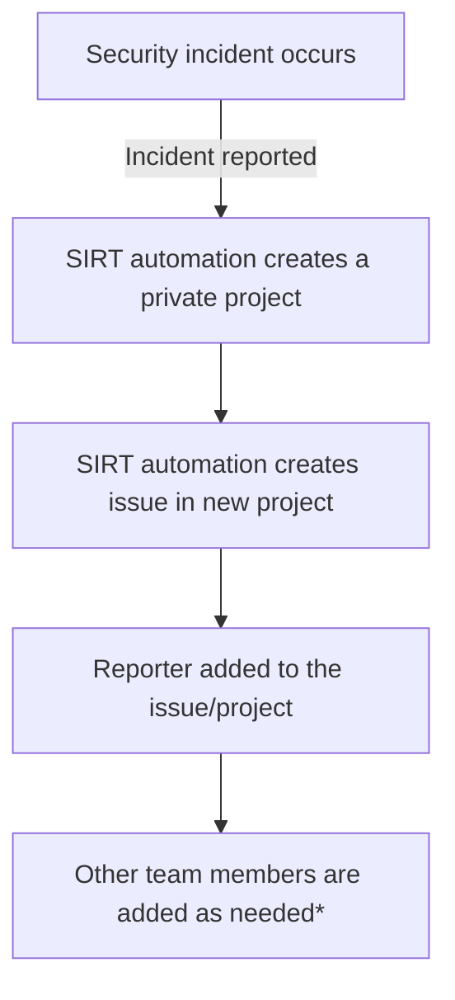

セキュリティインシデントレスポンスチーム (SIRT) は、GitLab.com および会社としての GitLab に影響を与えるセキュリティイベントの検知、対応、調査を専門に担当する GitLab のチームであり、ビジネス、プラットフォーム、そしてユーザーからの信頼を守ります。

## <i class="fas fa-rocket" id="biz-tech-icons"></i> 私たちのビジョン

GitLab、私たちのプラットフォーム、そしてユーザーを守る最初の防衛線かつ最後の防衛線となり、脅威が顕在化する前にプロアクティブに特定し、顕在化したときには断固とした対応を行うこと。

### 私たちのミッションステートメント

効果的なセキュリティインシデントレスポンス、フォレンジック解析、継続的な検知能力を提供することで、GitLab のビジネスとユーザーからの信頼を守ります。私たちは、迅速な封じ込め、徹底した調査、対応するすべてのインシデントから推進する運用改善を通じて、リスクを低減します。

## <i class="fas fa-users" id="biz-tech-icons"></i> チーム

### チームメンバー

| | |
|---|---|
|Mitra Jozenazemian|[Security Manager](/job-description-library/security/security-incident-response-team/#manager-security-incident-response-team)|
|Robbie Dickson|[Security Manager](/job-description-library/security/security-incident-response-team/#manager-security-incident-response-team)|

| | |
|---|---|
|Austin Bollinger|[Security Engineer](/job-description-library/security/security-incident-response-team/#security-incident-response-team-engineer-intermediate)|
|Bala Allam|[Senior Security Engineer](/job-description-library/security/security-incident-response-team/#senior-security-incident-response-team-engineer)|
|Chathura Kuruwita|[Senior Security Engineer](/job-description-library/security/security-incident-response-team/#senior-security-incident-response-team-engineer)|
|Ellis Coulson|[Security Engineer](/job-description-library/security/security-incident-response-team/#security-incident-response-team-engineer-intermediate)|
|Hasan Chawich|[Security Engineer](/job-description-library/security/security-incident-response-team/#security-incident-response-team-engineer-intermediate)|
|Janina Roppelt|[Senior Security Engineer](/job-description-library/security/security-incident-response-team/#senior-security-incident-response-team-engineer)|
|Jason Hawkins|[Senior Security Engineer](/job-description-library/security/security-incident-response-team/#senior-security-incident-response-team-engineer)|
|Laurens Van Dijk|[Staff Security Engineer](/job-description-library/security/security-incident-response-team/#staff-security-incident-response-team-engineer)|
|Leslie Anzures|[Security Engineer](/job-description-library/security/security-incident-response-team/#security-incident-response-team-engineer-intermediate)|
|Natalie Laundergan|[Security Engineer](/job-description-library/security/security-incident-response-team/#security-incident-response-team-engineer-intermediate)|
|Neil McDonald|[Senior Security Engineer](/job-description-library/security/security-incident-response-team/#senior-security-incident-response-team-engineer)|
|Saksham Anand|[Security Engineer](/job-description-library/security/security-incident-response-team/#security-incident-response-team-engineer-intermediate)|
|Dylan Stephenson|[Security Engineer](/job-description-library/security/security-incident-response-team/#security-incident-response-team-engineer-intermediate)|
|Joel Clarke|[Security Engineer](/job-description-library/security/security-incident-response-team/#security-incident-response-team-engineer-intermediate)|

## <i class="fas fa-stream" id="biz-tech-icons"></i> 提供しているサービス

1. リアクティブ - 進行中のインシデント対応に対応するように設計されたサービス。以下を含みますがこれらに限られません。
    - インシデント分析
    - インシデントレスポンスの支援と調整
    - インシデントレスポンスの解決
    - 検知およびレスポンスエンジニアリング
1. プロアクティブ - インシデントが発生または検知される前に GitLab のインフラストラクチャおよびセキュリティプロセスを改善するために設計されたサービス。主な目標は、インシデントを回避し、発生した場合の影響と範囲を縮小することです。
    - 脆弱性警告およびセキュリティアドバイザリのサイバー脅威分析
    - 将来の脅威を特定するための敵対者の活動および関連トレンドの監視
    - セキュリティツール、アプリケーション、インフラストラクチャの構成と保守
    - 検知およびレスポンスエンジニアリング
1. 管理 - GitLab の法務および人事部門からのリクエストに対応するように設計されたサービス。

## <i class="fas fa-bullseye" id="biz-tech-icons"></i> SIRT へのエンゲージ

SIRT は、あらゆるセキュリティインシデントの支援のために [24/7/365](/handbook/engineering/infrastructure-platforms/incident-management/on-call/#security-team-on-call-rotation) のオンコール体制を取っています。緊急のセキュリティインシデントが特定された場合、またはインシデントが発生した可能性があると思われる場合は、[セキュリティエンジニアオンコールへのエンゲージ](/handbook/security/security-operations/sirt/engaging-security-on-call/) を参照してください。

SIRT の責任とインシデントオーナーシップに関する情報は、[SIRT オンコールガイド](/handbook/security/security-operations/secops-oncall/) で確認できます。

## <i class="fas fa-receipt" id="biz-tech-icons"></i> インシデント管理とレビュー

インシデント管理とレビューのプロセスの一環として、SIRT は毎週月曜日に行う定例ミーティングを実施しています。このミーティングでは、前週のすべてのインシデント、および現在オープンのすべてのインシデントがレビューされます。レビュープロセスでは、インシデントの範囲、影響、軽減と是正のために実施した作業、次のステップ、ブロッカー、現在のステータスを取り上げます。これらのミーティングは、対応に問題のあったインシデントやプロセス改善について議論する機会でもあります。

## アクセス制限

セキュリティインシデントや調査に関する情報は [限定アクセス](/handbook/communication/confidentiality-levels/#limited-access) として扱われ、デフォルトではすべてのチームメンバーには共有されません。セキュリティインシデントは、潜在的に機密情報を保護し、運用上のセキュリティを維持するため、適切な機密保持プロトコルにより取り扱われます。

セキュリティインシデント対応のワークフローは次のとおりです。

\*事前に定義されたチームメンバーのリストは、インシデントが `~severity::1` の場合に自動的に追加されます。
