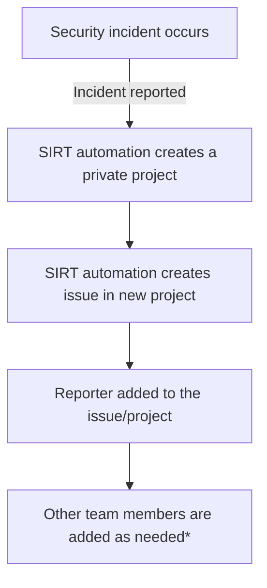

セキュリティインシデントレスポンスチーム (SIRT) は、GitLab.com および会社としての GitLab に影響を与えるセキュリティイベントの検知・対応・調査を専門に行う GitLab 専属のチームであり、事業、プラットフォーム、そしてユーザーからの信頼を守ります。

## <i class="fas fa-rocket" id="biz-tech-icons"></i> 私たちのビジョン

GitLab、私たちのプラットフォーム、そしてユーザーを守る最初で最後の防衛線となり、脅威が顕在化する前にプロアクティブに特定し、顕在化した際には断固として対応します。

### ミッションステートメント

効果的なセキュリティインシデントレスポンス、フォレンジック分析、そして継続的な検知能力を提供することで、GitLab の事業とユーザーからの信頼を守ります。私たちは、迅速な封じ込め、徹底した調査、そして対応するすべてのインシデントから推進する運用改善を通じて、リスクを低減します。

## <i class="fas fa-users" id="biz-tech-icons"></i> チーム

### チームメンバー

| | |
|---|---|
|Manny Mulatu|[Director SIRT](/job-description-library/security/security-leadership/#director-security)|
|Mitra Jozenazemian|[Security Manager - APAC](/job-description-library/security/security-incident-response-team/#manager-security-incident-response-team)|
|Laurens Van Dijk|[Security Manager - EMEA](/job-description-library/security/security-incident-response-team/#manager-security-incident-response-team)|

| | |
|---|---|
|Austin Bollinger|[Security Engineer](/job-description-library/security/security-incident-response-team/#security-incident-response-team-engineer-intermediate)|
|Bala Allam|[Senior Security Engineer](/job-description-library/security/security-incident-response-team/#senior-security-incident-response-team-engineer)|
|Chathura Kuruwita|[Senior Security Engineer](/job-description-library/security/security-incident-response-team/#senior-security-incident-response-team-engineer)|
|Ellis Coulson|[Security Engineer](/job-description-library/security/security-incident-response-team/#security-incident-response-team-engineer-intermediate)|
|Hasan Chawich|[Security Engineer](/job-description-library/security/security-incident-response-team/#security-incident-response-team-engineer-intermediate)|
|Janina Roppelt|[Senior Security Engineer](/job-description-library/security/security-incident-response-team/#senior-security-incident-response-team-engineer)|
|Leslie Anzures|[Security Engineer](/job-description-library/security/security-incident-response-team/#security-incident-response-team-engineer-intermediate)|
|Natalie Laundergan|[Security Engineer](/job-description-library/security/security-incident-response-team/#security-incident-response-team-engineer-intermediate)|
|Neil McDonald|[Senior Security Engineer](/job-description-library/security/security-incident-response-team/#senior-security-incident-response-team-engineer)|
|Saksham Anand|[Security Engineer](/job-description-library/security/security-incident-response-team/#security-incident-response-team-engineer-intermediate)|
|Dylan Stephenson|[Security Engineer](/job-description-library/security/security-incident-response-team/#security-incident-response-team-engineer-intermediate)|
|Joel Clarke|[Security Engineer](/job-description-library/security/security-incident-response-team/#security-incident-response-team-engineer-intermediate)|
|Josh Boyce|Principal Incident Commander|

## <i class="fas fa-stream" id="biz-tech-icons"></i> 私たちが提供するサービス

1. リアクティブ - 進行中のインシデント対応に応じるよう設計されたサービス。次のものを含みますが、これらに限りません。
    - インシデント分析
    - インシデントレスポンスのサポートと調整
    - インシデントレスポンスの解決
    - 検知・対応エンジニアリング
1. プロアクティブ - インシデントが発生または検知される前に GitLab のインフラとセキュリティプロセスを改善するよう設計されたサービス。主な目的は、インシデントを回避すること、そしてインシデントが発生した際にはその影響と範囲を低減することです。
    - 脆弱性警告やセキュリティアドバイザリのサイバー脅威分析
    - 将来の脅威を特定するための、敵対者の活動および関連トレンドの監視
    - セキュリティツール、アプリケーション、インフラの構成と保守
    - 検知・対応エンジニアリング
1. アドミニストレーティブ - GitLab の Legal 部門および HR 部門からの依頼を支援するよう設計されたサービス。

## <i class="fas fa-bullseye" id="biz-tech-icons"></i> SIRT への連絡

SIRT は、あらゆるセキュリティインシデントに対応するため [24/7/365](/handbook/engineering/infrastructure-platforms/incident-management/on-call/#security-team-on-call-rotation) でオンコール体制を取っています。緊急のセキュリティインシデントが特定された場合、またはインシデントが発生した疑いがある場合は、[Engaging the Security Engineer On-Call](/handbook/security/security-operations/sirt/engaging-security-on-call/)を参照してください。

SIRT の責任範囲とインシデントのオーナーシップに関する情報は、[SIRT On-Call Guide](/handbook/security/security-operations/secops-oncall/)で確認できます。

## <i class="fas fa-receipt" id="biz-tech-icons"></i> インシデント管理とレビュー

インシデント管理およびレビュープロセスの一環として、SIRT は毎週月曜日に定例ミーティングを実施しています。このミーティングでは、前週のすべてのインシデント、および現在オープンになっているインシデントをレビューします。レビュープロセスでは、インシデントの範囲、影響、緩和・修復のために行われた作業、次のステップ、ブロッカー、現在のステータスを扱います。これらのミーティングは、適切に対処されなかったインシデントやプロセス改善について議論する機会でもあります。

## 限定アクセス

セキュリティインシデントや調査に関する情報は[限定アクセス](/handbook/communication/confidentiality-levels/#limited-access)とみなされ、デフォルトではすべてのチームメンバーに共有されません。セキュリティインシデントは、機密性の高い可能性のある情報を保護し運用上のセキュリティを維持するため、適切な機密保持プロトコルに従って対処されます。

セキュリティインシデント対応のワークフローは次のとおりです。

\*インシデントが `~severity::1` の場合、あらかじめ定義されたチームメンバーのリストが自動的に追加されます。
