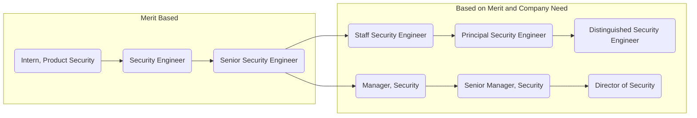

## セキュリティ部門の採用

セキュリティ部門の人員数を会社全体の人員数の約5%にマッピングするという全社的な方針には、十分な裏付けがあります。セキュリティ部門の成長人員数を会社全体の人員数の5%に紐付けることで、以下の事項に対する適切な人員サポートが確保されます（以下はセキュリティ部門の責任範囲のハイライトであり、すべての責任を網羅したものではありません）。

- セキュリティリリース。GitLabでは、クリティカルおよび非クリティカルなセキュリティリリースについてセキュリティ部門がDRIです。
- セキュリティインシデントの検知と対応。これはGitLab.comの利用者が増加するにつれて増加します。
- 上場企業になるための準備。
- GitLab公開バグバウンティプログラムの運営。
- 自社製品のドッグフーディングと貢献。
- GitLab.comおよび関連サービスのセキュリティの向上と維持。

## GitLabにおけるキャリア開発と機会

GitLabにおけるキャリアの機会、個人の成長、開発は重要なものであり、奨励されています。セキュリティチームのメンバーとマネージャーは、キャリアの成長を促進、ガイド、支援するために [個別開発計画 (Individual Development Plan)](/handbook/security/individual-development-plan/) を活用することが推奨されています。

GitLabチームメンバーが利用できる成長と開発の福利厚生に関する情報は [一般・エンティティ別福利厚生](/handbook/total-rewards/benefits/general-and-entity-benefits/#growth-and-development-fund) ページで確認できます。一般的な予算戦略、払い戻し要件、授業料の予算例外に関する具体的な情報は、同ページの [Growth and Development Benefit セクション](/handbook/total-rewards/benefits/general-and-entity-benefits/#growth-and-development-fund) にあります。成長と開発の福利厚生の [適格性に関する情報](/handbook/people-group/learning-and-development/growth-and-development/#growth-and-development-fund-eligibility) と [申請方法](/handbook/people-group/learning-and-development/growth-and-development/#how-to-apply-for-growth-and-development-benefits) は、[Growth and Development Benefit](/handbook/people-group/learning-and-development/growth-and-development/) ページで確認できます。支払いを進める前に [1,000ドルを超える成長と開発費用の管理プロセス](/handbook/people-group/learning-and-development/growth-and-development/#administration-of-growth-and-development-reimbursements-over-1000) を必ず確認してください。[払い戻しプロセス](/handbook/people-group/learning-and-development/growth-and-development/#types-of-growth-and-development-reimbursements) とそのタイミングは、カテゴリーによって異なります。

### 個人貢献者 (IC) とマネジメント

## セキュリティインターンシップ

セキュリティインターンシップに関する情報は、[インターンシップページ](internship/) を参照してください。

## セキュリティシャドウプログラム

セキュリティ組織では、各サブ組織やチーム間で完全に没入型の実地クロストレーニングプログラムをパイロット運用しています。参加者は、セキュリティ組織が日々お客様やチームメンバーをどのように保護、防御、保証しているかを実際に裏側から見ることができます。

詳細は [セキュリティシャドウプログラム](/handbook/security/security-shadow/) ページを参照してください。

## セキュリティのギアリング比率

セキュリティ部門に関連するギアリング比率は [別ページ](/handbook/security/gearing-ratios/) に移動しました。
