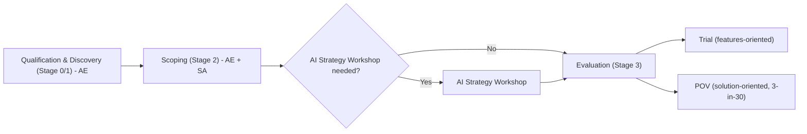
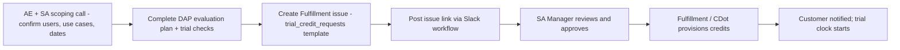

## 1\. DAP トライアル {#dap-customer-trial}

DAP トライアルは、**使用量を考慮した POV の取り組み**です。標準的な機能トライアルよりも、適格性の確認、準備、活用支援、クレジットのガバナンス、使用量の監視、トライアル後の意思決定の管理を綿密に行う必要があります。

DAP の「トライアル」と DAP の「POV」は、営業ステージのフローと同じように区別します。適格性の確認とディスカバリー（Stage 0/1、AE 主導でビジネスケースを探る）→ スコープの設定（Stage 2、AE \+ SA が協力してソリューションのディスカバリー、成功基準、初期の Customer Success Plan に取り組む）→ 評価（Stage 3）と進み、評価でトライアル（機能重視、3-in-30 は不要）または POV（ソリューション重視、3-in-30 を適用）に分かれます。スコープ設定と評価の間に AI Strategy Workshop を行うかどうかは任意ですが、顧客のユースケース、規模、成功基準がまだ明確でない場合は実施を推奨します。

### 1.1 DAP トライアルの利用資格と開始条件 {#11-dap-trial-eligibility-and-entry-criteria}

| 顧客の種類 | トライアルの申請方法 | 主な制約 |
| :---- | :---- | :---- |
| 見込み顧客、無料 SaaS  | セルフサービストライアル  | 上限 100 ユーザー、30 日間、クレジットを自動付与 |
| 見込み顧客、無料セルフマネージド  | セルフサービストライアル  | GitLab 18.9+、ユーザー数の上限なし、クレジットを自動付与 |
| 既存の有料 Premium/Ultimate  | SA 支援付きの Fulfillment 申請  | 1 回限りのクレジット割り当て。オンデマンド課金が有効になっていないこと。クラウドライセンスが必要 |
| Dedicated | SA 支援付きの Fulfillment 申請 | GitLab 18.8.4+ が必要 |
| エアギャップ / オフライン  | クレジットの対象外  | 代わりに Deal Desk の $0 注文を使用したシートベースの評価 |
| OSS / Education / Startup プログラム | 対象外 |  |
| Dedicated for Government | 対象外 |  |
| GitLab Duo with Amazon Q | 対象外 |  |

### 1.2 DAP トライアルの開始条件 {#12-dap-trial-entry-criteria}

評価クレジットを申請する前に、AE と SA は次を確認する必要があります。

* 顧客に有効な有料 Premium または Ultimate サブスクリプションがあり、そのサブスクリプション識別子を申請に記載すること。
* 評価と商業上の成果を追跡する進行中の商談があること。
* SA によるスコープ設定の話し合いを実施済みであること。
* 顧客が評価者、チーム、責任者、意思決定者を明確にしていること。
* 顧客が明確なユースケースと成功指標を選定していること。
* 顧客がトライアル期間内に実行できる状態であること。
* 評価計画を顧客フォルダーに保存し、申請からリンクしていること。
* デプロイモデルとバージョンが対象要件を満たしていること。
* 評価クレジットのみを使用量の充当元とする予定の場合、それと競合する月額コミットメントや、有効になっているオンデマンド課金がないこと。
* Self-Managed の顧客が、現在のバージョン、クラウドライセンス、接続性、Runner、DAP の前提条件を満たしていること。
* セルフホストまたはオフラインの DAP について、別途アーキテクチャ、モデル、ライセンス、ネットワーク、サポートの計画があること。

既存のクレジット、または準備が整っていると検証済みの方法で、顧客が代表的な DAP フローを少なくとも 1 つ正常に実行できるようになるまで、DAP の評価期間を開始しないでください。

### 1.3 AE と営業担当者による DAP トライアルの申請方法 {#13-how-aes-and-reps-request-a-dap-trial}

AE / 営業担当者は申請に責任を持ち、SA は技術計画に責任を持ちます。

1. 顧客と SA によるスコープ設定の話し合いを完了します。
2. 顧客固有の目標、ユースケース、参加者、日付、前提条件、成功基準を盛り込んだ DAP 評価計画を作成または更新します。汎用テンプレートを変更せずに顧客向けの計画として送付しないでください。
3. 次を検証します。有効な有料 Ultimate/Premium サブスクリプション（A-S\#\#\#\#\#\# ID）、月額コミットメント SKU や有効なオンデマンド課金がないこと、クラウドライセンスの確認済み（セルフマネージド）、バージョンが 18.9+（セルフマネージド）または 18.8.4+（Dedicated）であること。
4. 現行の Fulfillment テンプレートを使用してトライアルクレジット申請を作成します。
5. `gitlab-org/fulfillment/meta` の `trial_credit_requests` テンプレートから GitLab の Issue を作成し、タイトルを `[A-XXXXXX] [Subscription Name], [Customer Name], [Total Credits Requested], [Date Requested For]` として、次を含めます。
   * サブスクリプション名と ID、顧客名、AE と SA、Salesforce の Account へのリンク、Salesforce の DAP の Opportunity へのリンク、販売先担当者のメールアドレス、サブスクリプションの種類、合計シート数、申請クレジット総数、オフラインフラグ、顧客固有の評価文書。
   * 再トライアルまたは延長の場合: 前回のトライアル Issue へのリンク、理由コード、残りのクレジット、妥当性を検証した SA の氏名。
   * ユーザー、ユースケース、期間、デプロイモデル、GitLab のバージョン、前提条件、成功基準、開始 / 終了日、申請クレジット数で十分な理由。
6. 現行のトライアル申請ワークフローに申請を提出し、指定の Slack チャンネルにリンクを投稿します：**`#dap-trial-request`。**
7. 承認のエビデンスを申請に添付または記録します。
8. 承認とクレジット付与の状況が確認されるまで、開始日を約束しないでください。

### 1.5 SA manager による評価と承認のガイドライン {#15-sa-manager-evaluation-and-approval-guidelines}

クレジットまたは延長を処理する前に、SA Leadership の承認が必要です。すべてを確認するか、適切な承認者が例外を明示的に文書化する必要があります。

* サブスクリプションが有効な有料の Premium または Ultimate であり、競合するオンデマンド課金が有効になっていないこと。
* セルフマネージドの顧客はクラウドライセンスを使用し、Dedicated の顧客は 18.8.4+ を使用していること。
* SA が評価計画（ユースケースと成功基準）を顧客の Drive フォルダーに保存し、その実行を確約していること。
* AE と SA が、提出前にユーザー数を 50 ユーザー未満に設定していること。
* オフライン / エアギャップの顧客は、クレジット申請ではなく $0 注文のために Deal Desk に案内していること。

再トライアルまたは延長では、クレジット数にかかわらず SA Manager（または SA Director/VP）の承認が必要です。承認前に、SA は、DAP のバグ、障害、顧客側の阻害要因、評価時間の不足といった正当な理由を検証し、前回のトライアルの評価後アンケートとフィードバックフォームが完了していることを確認する必要があります。

SA manager は、単に無料利用を求める申請ではなく、信頼でき、実行可能な評価を表す申請のみを承認してください。**以下の必須行はすべて Yes であるか、例外が明示的に文書化され、適切なリーダーの承認を受けている必要があります。**

#### 1.5.1 SA manager の承認チェックリスト {#151-sa-manager-approval-checklist}

| カテゴリ | チェック項目 | 是正アクション / エビデンス |
| :---- | :---- | :---- |
| Salesforce | \[ \] Salesforce の DAP 商談に POV オブジェクトを作成している。 | SA が POV オブジェクトを作成して商談に関連付け、申請にレコードへのリンクを含めます。 |
| Salesforce | \[ \] 正しいサブスクリプションを申請に含め、POV オブジェクトに関連付けている。 | 有効な Premium または Ultimate のサブスクリプション ID を追加し、クレジットを受け取るサブスクリプションであることを確認します。 |
| Salesforce | \[ \] 進行中の DAP 商談と信頼できる契約への道筋を記録しており、商談は更新のみではない。 | Salesforce の Account と DAP の Opportunity へのリンク、購買担当者 / 承認者、推進者、意思決定日、商業上の次のステップを追加します。 |
| 評価計画 | \[ \] 評価計画は顧客固有のものであり、DAP テンプレートの汎用的なコピーではない。 | 顧客の目標、ステークホルダー、リスク、スコープ、スケジュール、ユースケース、前提条件、エビデンスを追加します。申請から計画にリンクし、顧客フォルダーに保存します。 |
| 評価計画 | \[ \] トライアルのユーザー数が明記され、50 ユーザー未満である。 | 提出前に参加者一覧とユーザー数を修正します。トライアルごとの上限は 50 ユーザーです。 |
| 評価計画 | \[ \] 申請クレジット数がトライアルのユーザー数に対応している。 | `number of trial users × 40 credits per user` を使用し、期間、ユースケース、活動の想定、例外を文書化します。 |
| 評価計画 | \[ \] 成功指標が定義され、顧客と合意している。 | 実証する価値を示し、すべての指標を明確かつ測定可能にして、意思決定に結び付けます。 |
| 評価計画 | \[ \] 基準値を記録している。 | 所要時間、マージリクエスト数、パイプライン修正時間、脆弱性解決時間など、関連する開始時点の指標を記録します。 |
| 評価計画 | \[ \] ユースケースを文書化し、エビデンスを収集できる状態にしている。 | ワークフロー、責任者、前提条件、手順、成功の兆候、期待するエビデンスを明記します。 |
| 評価計画 | \[ \] 顧客側責任者、評価者、技術責任者、意思決定者、必要なアクセスが確保されている。 | 参加者一覧、責任者、対応可能な時間、環境、プロジェクト、管理者の支援を追加します。 |
| 4 回の週次定例 | \[ \] 4 週間にわたり参加するという顧客の確約を文書化している。 | 顧客のメール、Slack での確認、または同等のエビデンスを記録し、ステークホルダーを明記して定例を設定します。申請にエビデンスを添付します。 |
| 4 回の週次定例 | \[ \] キックオフ、定期的な進捗確認、中間確認、最終アンケート、報告の日付を予定に設定している。 | カレンダー招待を追加し、顧客向け計画、評価文書、Salesforce の日付を揃えます。 |
| 実行準備 | \[ \] キックオフ日が設定され、付与日がそのキックオフに間に合う。 | 承認と付与を確認するまで開始日を約束しないでください。顧客が実行できるときにのみ DAP の評価期間を開始します。 |
| 実行準備 | \[ \] 環境と設定を検証している。 | デプロイモデル、対象バージョン、該当する場合のクラウドライセンス、接続性、Runner、名前空間 / グループ、ロール、インテグレーションを確認します。 |
| 実行準備 | \[ \] スモークテストが完了している。 | 代表的な DAP フローを少なくとも 1 つ実証するか、評価期間の開始前に完了する日付入りの準備計画を記録します。 |
| 実行準備 | \[ \] 付与の要件を確認している。 | サブスクリプションの利用資格、競合する月額コミットメントや有効なオンデマンド課金がないこと、申請対象者、有効期限、承認経路を検証します。 |
| 実行準備 | \[ \] 測定と記録の場所が用意されている。 | POV オブジェクト、評価計画、コラボレーションプロジェクト、POV レポート、申請 Issue、ダッシュボード、アンケート、正式な記録システムのフィールドをリンクします。 |
| 再トライアルまたは延長 | \[ \] 前回のトライアルの評価後の確認が完了している。 | 承認前に、アンケートを送付済みで、評価レポートを作成済みで、DAP のフィードバックを提出済みであることを確認します。 |
| 再トライアルまたは延長 | \[ \] 正当な問題が適切な評価を妨げたことを SA が検証している。 | DAP のバグ、障害、顧客側の阻害要因、評価時間の不足、その他の承認された理由から選択し、文書化します。何が変わったかを説明します。 |
| 再トライアルまたは延長 | \[ \] 申請の種類が明確である。 | クレジットの追加、または日数のみの延長を選択します。日数のみの延長では 7、14、30 日のいずれかを指定し、クレジットを追加しないでください。 |
| 再トライアルまたは延長 | \[ \] 必要なリーダーシップの承認を記録している。 | 数量にかかわらず SA Manager、SA Director、または VP of Solutions Architecture が承認します。承認のエビデンスを Issue に添付します。 |
| リスクと例外 | \[ \] 管理されていないセキュリティ、法務、データ、オフライン、運用上のリスクが残っていない。 | 申請を差し戻す、オフライン / エアギャップの顧客を Deal Desk の $0 注文の経路に案内する、または承認された例外と責任者を文書化します。 |

申請が、汎用デモ、ディスカバリーの代替、更新のみの取り組み、適格性未確認の評価、コピーしたテンプレート、サポート対象外の環境、重複申請、正当化されていないクレジット数、顧客の確約の欠如、合意した計画を実行しなかったことだけを理由とする延長に該当する場合は、差し戻してください。

承認経路については、2,000 クレジット以下の初回申請と、その後の再トライアルを含む 5,000 クレジット以下の申請では、SA Manager、SA Director、または VP of Solutions Architecture の承認を使用します。5,000 クレジットを超える申請には CPMO の承認が必要です。100,000 を超える申請には、Fulfillment テンプレートで定義された CEO/CFO/CPMO レベルの承認が必要です。再トライアルと延長には、数量にかかわらず SA Leadership の承認が必要です。

次の場合は差し戻しまたは却下します。

* 申請が汎用的なデモ、ディスカバリーの代替、更新、または適格性未確認の初期段階の評価である。
* POV オブジェクト、信頼できる意思決定への道筋、明確な顧客側責任者、推進者、意思決定者、意思決定日のいずれかが欠けている。
* 評価文書が未変更のテンプレートである、またはユースケースや成功基準が欠けているか、測定できない。
* 顧客が、実行に必要として記載したユーザー、環境、プロジェクト、時間、アクセス、管理者の支援を用意できない。
* 申請が重複している、正当な再トライアルの理由がない、またはチームが合意した計画を実行しなかったために延長を求めている。
* ユーザー数、計画、期間、申請対象となる利用者によってクレジット数を正当化できない。
* トライアルにより、管理されていないセキュリティ、法務、データ、オフライン、運用上のリスクが生じる。

再トライアルと延長では、SA リーダーシップの承認と、正当な DAP の問題、障害、顧客側の阻害要因、評価時間の不足が適切な評価を妨げたことを検証した文書を必須とします。再トライアルの承認前に、前回の評価後の確認を必須とします。

### 1.6 クレジット付与のガイドライン {#16-credit-provisioning-guidelines}

#### 1.6.1 承認のしきい値とトライアル規模の設定 {#161-approval-thresholds-and-trial-sizing}

承認経路については、2,000 クレジット以下の初回申請と、その後の再トライアルを含む 5,000 クレジット以下の申請では、SA Manager、SA Director、または VP of Solutions Architecture の承認を使用します。5,000 クレジットを超える申請には CPMO の承認が必要です。100,000 を超える申請には、Fulfillment テンプレートで定義された CEO/CFO/CPMO レベルの承認が必要です。再トライアルと延長には、数量にかかわらず SA Leadership の承認が必要です。

##### クレジット数の算定と付与 {#credit-sizing-and-provisioning}

| 管理項目 | 規則 |
| :---- | :---- |
| 初回申請 | SA Manager、SA Director、または VP of Solutions Architecture の承認により、初回付与は 2,000 クレジット以下 |
| 合計の上限 | SA Leadership の承認により、初回付与とその後の再トライアル / 延長の合計は 5,000 クレジット以下 |
| 5,000 を超える場合のエスカレーション | CPMO の承認が必要 |
| 100,000 を超える場合のエスカレーション | Fulfillment テンプレートで定義された CEO/CFO/CPMO レベルの承認が必要 |
| ユーザー | トライアルごとに最大 50 ユーザー |
| 標準の算定式 | `number of trial users × 40 credits per user` |
| クレジットの追加 | 新しいクレジットを追加すると、現在の付与ワークフローに従って、有効期限内のクレジットの有効期限が自動的に延長されます |
| 日数のみの延長 | CustomersDot Admin を使用して既存のクレジットを 7、14、30 日のいずれか延長します。クレジットは追加しません。引き続き SA Leadership の承認が必要です |
| 例外 | ユーザー数、期間、ユースケース、活動の想定、算定式から逸脱する場合の理由を記録します |
| 使用量の管理 | 定義した顧客範囲と評価期間に対してのみクレジットを使用します。顧客が商業上の負担を明示的に了承しない限り、オンデマンド課金は無効のままにします |
| 検証 | キックオフ前にサブスクリプションの利用資格、残高、有効期限、対象となる利用者を確認します。評価グループ、可能な場合はユーザー、機能ごとに使用量を毎週監視します |
| 終了処理 | 承認とクレジット付与のエビデンスを POV オブジェクトに記録します。再トライアルを申請する前に、トライアル後アンケート、評価レポート、DAP のフィードバックを完了します |

### 1.7 トライアルクレジット付与のための CustomersDot アクセス {#17-customersdot-access-for-trial-credit-provisioning}

クレジット付与を許可されたマネージャーには、sales ロールを持つ CustomersDot Admin へのアクセスと、Okta グループ `okta-cdot-prod-sales-admins` のメンバーシップが必要です。

アクセスの手順:

1. 標準のアクセス申請プロセスで、必要な Okta グループのメンバーシップを申請または確認します。
2. Okta で CustomersDot Admin にサインインします。
3. **Bonus trial wallets** を使用して、クレジットを追加するか有効なクレジットを延長します。
4. サブスクリプション名、承認 Issue のリンク、クレジット数または延長日数、有効期限の選択、メモを入力します。
5. 成功メッセージ、ウォレットのレコード、顧客への通知、監査イベントを確認します。

ハンドブックでは、管理者専用の実装の詳細を重複して記載するのではなく、正式なアクセス申請と CustomersDot のランブックにリンクしてください。マネージャーに必要なロールがない場合は、クレジット付与を許可された担当者または承認済みの Fulfillment ワークフローを通して申請してください。

### 1.8 DAP の準備状況チェックリスト {#18-dap-readiness-checklist}

30 日間の評価期間が始まる前に、次を確認します。

* **サブスクリプションとクレジット:** 有効な Premium または Ultimate サブスクリプション、対象となるクレジットプール、正しい日付と残高、意図しないオンデマンド課金がないこと。
* **デプロイ:** GitLab.com、Self-Managed オンライン、Self-Hosted、Offline のいずれかの方法を選択済みであり、サポート対象のバージョンとパッチレベルを確認済みであること。
* **ネームスペースとアクセス:** 専用の評価グループまたは同等のものがあり、パイロットのユーザーとプロジェクトを特定済みで、ロールとアクセスを検証済みであり、AI ネイティブの機能が意図した場所でのみ有効になっていること。
* **実行:** Runner がオンラインで DAP フロー用の適切なタグが付いており、ネットワークとイメージへのアクセスが機能し、代表的な DAP フローが少なくとも 1 つ完了すること。
* **ユースケース:** 3 〜 5 つのユースケースを選択済みで、顧客固有のプレイブックを作成済みであり、前提条件とエビデンスを定義済みであること。
* **測定:** 基準値と目標値を定義済みで、使用量と価値のダッシュボードを特定済みであり、中間・最終アンケートを予定に設定済みであること。
* **サポート:** カスタマーサポート窓口、アカウントチームへの連絡経路、Request for Help のエスカレーション経路について合意済みであること。
* **ガバナンス:** コラボレーションプロジェクトが存在し、POV レコードを関連付けており、キックオフ、定例のやり取り、最終報告がカレンダーに登録されていること。

### 1.9 DAP 実行チェックリスト — 申請からスコープ設定、終了まで {#19-dap-execution-checklist--from-request-to-scope-and-through-close}

次の表は、評価計画のチェックリストの順序を保持し、標準的な POV ガバナンスのフィールドを追加したものです。SA は、次の通過条件に進む前に各行を完了済みとしてマークしてください。顧客向けの計画でも、同じ日付と確約事項を使用してください。

| カウントダウン | タスク | 参加者 | 完了？ |
| :---- | :---- | :---- | :---- |
| T \- 14 日 | DAP 評価の申請 | 顧客 | ☐ |
| T \- 12 日 | DAP ワークショップを計画 | SA、AE、顧客 | ☐ |
| T \- 10 日 | DAP ワークショップを完了 | SA、AE | ☐ |
| T \- 8 日 | AI Strategy Workshop が必要か判断 | SA、AE、顧客 | ☐ |
| T \- 8 日 | 顧客と DAP 評価のスコープを設定（DAP テンプレートをコピーするだけではいけません）。目標 / 上位 5 つのユースケース、スケジュール、ステークホルダー / 役割、関与する人数、リスク、対象内 / 対象外を決定。 | SA、AE、顧客 | ☐ |
| T \- 6 日 | POV 計画のスライドを提示し、ユースケースについて顧客の合意を得る | SA、AE、顧客 | ☐ |
| T \- 4 日 | AI Strategy Workshop を予定に設定して完了（任意） | SA、AE、顧客 | ☐ |
| T \- 4 日 | 1\. DAP ユースケースのプレイブックを作成。2\. POV ユースケースの予行演習を予定に設定 / クレジット数を決定。 | SA、AE、顧客 | ☐ |
| T \- 4 日 | POV キックオフ、設定、週次の定例のやり取り、報告日を予定に設定 | SA、AE、顧客 | ☐ |
| T \- 2 日 | 1\. Issue と Issue ボードを記録する POV コラボレーションプロジェクトを作成。2\. SA が SalesForce に POV オブジェクトを作成 \- Success Criteria にコラボレーションプロジェクト（任意）を追加し、General Notes に DAP 評価文書を追加。3\. 更新した DAP ユースケースのプレイブックと DAP スコープ計画を送付。4\. Slack または Teams のコミュニケーションチャンネルを設定。5\. DAP 評価計画へのリンクを付けて DAP トライアルクレジット申請を作成し、フォローアップ。6\. DAP トライアルクレジットについて、目標、ユースケース、アンケートのリンクを含むメールを送信。 | SA、AE | ☐ |
| T \+ 0 日 | POV キックオフの通話 / DAP 活用支援チェックリストに従い、顧客のインスタンスに DAP を設定 | SA、AE、顧客 | ☐ |
| 毎日 | 顧客からの Slack または Teams の連絡を確認 | SA、AE、顧客 | ☐ |
| 週 2 回 | 1\. 週次の定例のやり取りを実施。2\. Gong のメモを会議メモにコピー。3\. フィードバックに基づき、コメントに顧客を含めて Issue を作成または更新。4\. POV ユースケースレポートを更新 \- すべての Issue とフィードバックをコラボレーションプロジェクトまたは DAP 評価計画に追加。5\. POV の進捗について、アカウントチームと顧客に週次メールを送信。 | SA、AE、顧客 | ☐ |
| 週 1 回 | DAP セッションを 4 回実施（30 〜 45 分） | SA、AE、顧客 | ☐ |
| T \+ 15 日 | 中間アンケートを実施 | SA、AE、顧客 | ☐ |
| T \+ 30 日 | 最終アンケートを実施 | SA、AE | ☐ |
| T \+ 30 日 | POV 報告の通話を実施 | SA、AE、顧客 | ☐ |
| 購買決定権を持つ経営幹部への週次メール更新 | POV の進捗について、アカウントチームと顧客に週次メールを送信。各ユースケースに次を含める：ステータス \- X% 完了、完了したタスク、未完了のタスク、課題。 | SA、AE | ☐ |
| 終了 | 技術的な結果、商業上の次のステップ、フィードバック、クレジット使用量、製品 / RFH に関する Issue を、POV オブジェクト、商談、コラボレーションプロジェクト、評価計画に記録。 | SA、AE | ☐ |

### 1.10 DAP の責任分担 {#110-dap-responsibilities}

| 役割 | トライアル前 | トライアル中 | 終了処理 |
| :---- | :---- | :---- | :---- |
| AE / Rep | 商談の適格性を確認し、商業上の意思決定について認識を合わせ、申請を調整し、アカウントとサブスクリプションの詳細を提供し、顧客の確約を得る | 経営幹部との合意と商業面の認識を維持し、アカウントの阻害要因を除去し、商談と意思決定日を最新に保ち、**以下の週次更新テンプレートを使用して、トライアルの進捗を購買決定権を持つ経営幹部にメールまたは Slack で毎週報告する** | 商業上の次のステップ、調達、拡大、または失注処理を主導 |
| SA | 技術的適合性を確認し、ユースケースと成功基準を定義し、準備状況を検証し、計画を作成し、クレジット数と実行モードを推奨 | キックオフ / 定例のやり取りを実施し、ユースケースの実行を支援・案内し、エビデンス、問題、使用量、リスクを追跡し、阻害要因をエスカレーション | 技術報告を行い、勝利 / 敗北 / 結論不明を判定し、フィードバックを提出して POV レコードを更新 |
| SA manager | 適格性、スコープ、リスク、対応能力、クレジット申請をレビューし、申請を承認または差し戻し、ガバナンスを確保 | 進捗、使用量、阻害要因、リソースの負荷を確認し、例外と再トライアルを承認し、アカウントチームを指導 | 結果の記録・管理、契約への転換、フィードバックの質、再現性を確認 |
| 顧客側責任者 / 推進者 | 参加者、アクセス、時間、データ、プロジェクト、意思決定プロセスを確約 | 評価者を調整し、ワークフローを実行し、エビデンスとフィードバックを収集し、定例のやり取りに参加 | 結果、意思決定、展開計画、残るギャップを確認 |
| 顧客の管理者 / プラットフォーム責任者 | バージョン、ライセンス、グループ、権限、Runner、ネットワーク、DAP 設定を検証 | アクセスと環境を維持し、クレジットと技術的な健全性を監視 | 設定と運用責任を本番 / 有料利用へ移行 |
| 関与する場合はパートナー / PS | 提供範囲、役割、引き継ぎを定義 | 合意した導入または活用支援の作業を実行し、受け入れを追跡 | 導入、サービス、サポート、商業上の範囲を引き継ぎ |

#### 1.11 購買決定権を持つ経営幹部への週次メールまたは Slack 更新テンプレート {#111-weekly-executive-buyer-email-or-slack-update-template}

トライアル期間中にこの更新を毎週送信する責任は AE/Rep が持ちます。SA と顧客側の推進者が技術的な内容を提供しますが、購買決定権を持つ経営幹部とのコミュニケーションに説明責任を負うのは AE/Rep です。メールと Slack で同じ構成を使用し、内容を簡潔かつ事実に基づくものにし、合意した POV 計画に結び付けます。

| 更新フィールド | テンプレートの内容 |
| :---- | :---- |
| 件名 / 見出し | `POV Weekly Update — <Customer> — <Week of Date> — <Overall Status>` |
| 全体のステータス | `Overall status: <Green / Yellow / Red> — <one-sentence summary of progress against the decision and success criteria>.` |
| ユースケースのステータス | 各ユースケースについて：`Status — X% Complete; Tasks Completed; Still to Complete; Any Challenges.` |
| 完了したタスク | 今週完了した重要なワークフロー、設定、活用支援セッション、エビデンス、マイルストーンを列挙します。 |
| 未完了のタスク | 評価を完了するために必要な残りのタスク、責任者、期限を列挙します。 |
| 課題とリスク | 阻害要因、バグ、必要な機能強化、セキュリティまたはアクセスの問題、サポートのニーズ、軽減策またはエスカレーションの責任者を記載します。 |
| フィードバックと Issue | アンケートまたは顧客のフィードバックを要約し、POV レポート、評価文書、コラボレーションプロジェクトに記録した新しい Issue にリンクします。各項目が Product Management、Engineering、Customer Support のいずれに振り分けられたかを示します。 |
| 経営幹部への依頼 | 購買決定権を持つ経営幹部に求める意思決定、リソース、アクセス、スケジュール、エスカレーションを明記します。 |
| 次のマイルストーン | 次の定例のやり取り、中間確認、報告、または意思決定のマイルストーンとその日付を明記します。 |
