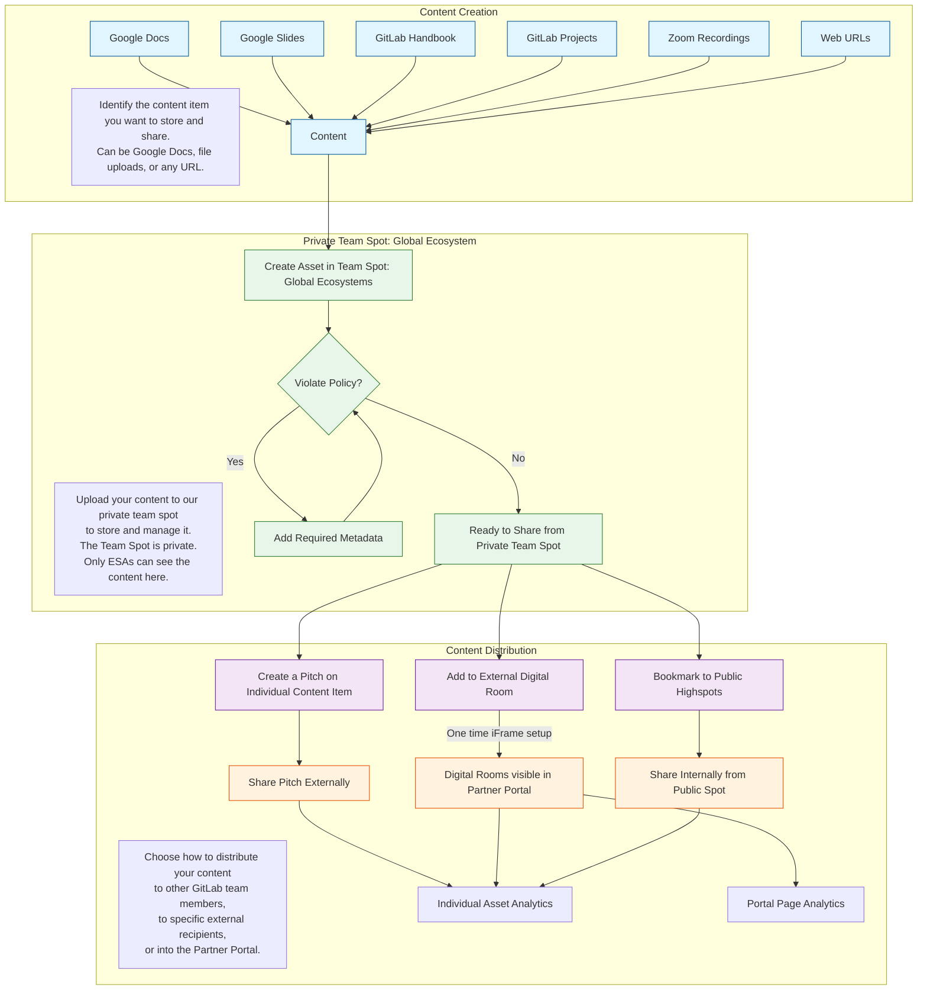

ESA からの支援を依頼するには、社内の **#ecosystem-solutions-architects** Slack チャンネルでチームに連絡してください。任意のチームメンバーをメンションして 1:1 のスレッドを開始しましょう。この単一の作業キューを使うことで、チームが互いをカバーしあい、追跡用 Issue がチャンネルから作成できるようになります。ダイレクトメッセージ (DM) はこのパブリックチャンネルに移動される場合があります。

Issue については、ESA チームは次のラベルを活用します: \~Partner-SA、\~Partner Region-AMER|APAC|EMEA、Partner-Acct-。

ほとんどの Opportunity ベースのエンゲージメントは Ecosystem Sales Manager (ESM) から始めるべきで、ESM が関与すべき適切な ESA を特定する必要があります。すべてのアカウントの ESM は Salesforce (SFDC) のお客様アカウントレコードで確認できます。パートナーアカウントの ESA は SFDC パートナーアカウントレコードに記載されています。ESA がリストされていない場合は、ESM にアシスタンスを依頼してください。Ecosystem SA をエンゲージする方法の詳細は、Ecosystem Solutions Architect Engagement Model ハンドブックページで確認できます。

Ecosystem SA チームはグローバルです。Ecosystem SA は、チームメンバーの経験と地域のニーズに基づいて、あらゆるタイプのグローバルおよび地域パートナーと整合しています。

## Ecosystem ソリューションアーキテクト: 役割と責任

ESA のビジョンと戦略は、収益へのパートナー貢献の増加、サービス能力の価値の向上、GitLab への投資コミットメントの育成にフォーカスしています。これは、以前の「Partner Capability Journey」を、GitLab、パートナー、お客様にとって有益な測定可能な成果にフォーカスするように改良した「Partner Activation」を通じて達成されます。

主要な activation の柱は以下のとおりです:

* Contribution Activation: GitLab のユースケースの qualification、価値提案とデモのピッチ、ROI 計算の表現。これにより、パートナー関係を qualified なパイプラインとクローズした収益に変換します。
* Commitment Activation: 差別化されたサービスオファリング、ジョイント Go-To-Market (GTM) 資料とイベント、共創貢献の作成。これにより、技術的知識を、パートナーが GitLab に投資していることを示す成果物に変換します。
* Capability Activation: GitLab Professional Services のスケーリング、お客様ユースケースの採用促進、垂直マーケットへのサービス提供。これにより、パートナーサービス能力を高め、成功するお客様実装を提供します。

Activation の方法には、セルフサーブリソース、テクニカルセリングワークショップ、ジョイントアカウントプランニング、パートナー主導のデモ、Champions プログラム、サービスとソリューションの開発、認定、ハンズオンラボなどがあります。健全性は、deal registration、勝率、収益成長、生成された技術成果物の数、サービスアタッチ登録、お客様ヘルススコア、拡張率などのメトリクスで監視されます。

ESA 主導の Partner Activation Plan (PAP) は、Ecosystem Sales Manager (ESM) が所有する全体ビジネスプランの重要な要素です。このプランは、技術パートナーシップのサマリ、現在および将来の能力状態、パートナー組織構造、activation 戦略、タイムラインを概説します。

全体として、Ecosystem SA は、パートナーを受動的な認知から能動的な参加へ、最終的にはパートナー由来の収益、deal registration、ソリューション開発などの高価値アクティビティのリードへと移行させることを目指します。成功は、イネーブルメントセッションへの出席のような低価値アクティビティから、サードパーティ統合の開発や GitLab へのコード貢献のような高価値アクティビティまで、エンゲージメント成果によって定義されます。

**Strategic Alliance Partner と作業する際**、Ecosystem SA は GitLab の影響力ある技術代表者として活動します。これにはプリセールスアクティビティ、パートナーソリューションの推進、ジョイント GTM イニシアチブが含まれます。主要な責任には、市場需要の特定、提案開発のためのビジネスリーダーとのエンゲージ、ジョイントソリューションとイネーブルメントを開発するためのパートナー横断作業のような Partner GTM アクティビティが含まれます。彼らは Subject Matter Expert として活動し、ソフトスキルとハンズオンの技術的深さの両方を備えています。彼らはパートナーテクノロジー、サクセスストーリー、市場トレンドの社内外のエヴァンジェリズムに関与します。彼らはビジネスおよび技術的観点の両方で GitLab 戦略策定に貢献します。彼らはまた、Partner Enablement チームとともにコンテンツキュレーションを支援します。

## ESA Opportunity 責任

GitLab Sourced Opportunity (直接アカウントチームによってソースされた新しい Opportunity でパートナーが関与する場合) では、直接アカウント SA が技術的責任を所有します。ESA は、整合したパートナーアカウントチームが GitLab SA と技術的に協働できるようにすることで商談の進行を支援するために存在します。

Partner Sourced Opportunity (パートナーが新しい Opportunity をソースする場合) では、Ecosystem SA は、Opportunity を進行させるためにパートナーが支援を必要とする場合、見込み顧客に直接話しかけて Discovery および Demo プラクティスでパートナーをイネーブルすることまで含めて、パートナーをイネーブルする責任を取ります。Ecosystem チームはパートナーに Deal Registration の提出を促します。Ecosystem SA は、パートナーが営業サイクルでサポートを必要とし、パートナーのアカウントチームが GitLab 営業チームを巻き込む準備ができていない場合に、直接の顧客エンゲージメントに参加します。

ESA はすべてのお客様とのやり取りを文書化し、可能な限り早い営業サイクルの段階で、パートナーアラインの Opportunity を Field SA に素早く引き継ぎ、パートナーとお客様で Opportunity を進めようと努めます。ESA は、Global Ecosystem SA Manager および Regional SA Manager の両方によって承認されない限り、GitLab 商談ステージ 2 を超えて主要な Opportunity 責任を保持しません。このハンドオフプロセスは Field SA チームとの統合の重要なポイントです。ESA は、パートナーアラインの Opportunity をサポートするために Field SA コミュニティのバックアップを提供することもできます。

## パートナーアクティベーション

### パートナーアクティベーションプランニング

GitLab を効果的にピッチおよびデモできるようにパートナーチームメンバーをアクティベートするために、チームが活用する主要なコンテンツは [Partner Onboarding Workflow & Enablement Resource (POWER) ガイド](/handbook/resellers/partner-enablement/power/)です。

パートナーオンボーディング向けの 30-60-90 日プランは、この [Onboarding Blueprint](https://content.gitlab.com/viewer/c6d3f8818abe58bb3ee4bba266c4e6c4) で開発中です。これは、上記の POWER ガイドのコンテンツを取り込むための簡潔なアプローチを提供します。

### Champions プログラムの DRIVE

GitLab Partner Champions プログラムは、[専用のハンドブックページ](/handbook/resellers/partner-champions-program/)に記述されており、プログラムの全体ビジョンと新しい Champion のオンボーディングプロセスが含まれています。コラボレーショングループとプロジェクトは[こちらのパブリックグループ](https://gitlab.com/gitlab-partners-public/gitlab-champions/champions)に確立されています。

一般的に、長期にわたってプログラムを維持するために以下を目指します:

* Champions のコール責任を分散
* アクティブな Champions 参加者を合理化
* Champions への期待値を実装
* GitLab に対するプログラムの価値を検証
* Champions のコラボレーションとコールセッションのトピックをイネーブル

## ESA プロセス

### Ecosystem SA の運用リズム

ESA の役割に関する実用的なガイダンスとして、私たちは[週次の運用リズム](ecosystem-sa/esa-operating-rhythm.md)を伝えるためにこのガイドを開発しました。

**整合性が第一であり、固定化ではない。** これを使って、週次のアクティビティが私たちの 3 つの FY27 ESA 戦略の柱を明確にサポートしているか確認してください:  

* **スケーラブルなエコシステムアクティベーションエンジンを構築する (「force multiplier」)。**  
* **パートナー収益成長戦略をオペレーション化する。**  
* **パートナーを GitLab デリバリーとサクセスのデフォルトの拡張にする。**

これらは、Ecosystem の「big rocks」、すなわち **AI / DAP (Duo/DAP)、MSPs、エンドツーエンドのイネーブルメント、サービス主導の採用** を動かす方法です。

**地域とパートナーの柔軟性。** AMER の MSP 中心の作業は、APJ の新興市場の再販モーションとは異なって見えます。すべての例を毎週行うことは期待されていません。  

**健全なミックスを選ぶ。** 典型的な週にわたって、あなたの時間は自然に以下を含むべきです:

* **ESM とパートナー** とともにパイプラインを作成/維持し、特に Partner Sourced 収益を作成。Co-sell も重要です。NetARR (成長収益) が主要メトリクスです。
* 採用と更新をサポートする **パートナーサービスと SCOPE カタログエントリ** の形成。
* Champions を通じて地域で新しいスキルをアクティベート。
* 将来の週を楽にする **スキル、Duo/DAP パターン、再利用可能なコンテンツ** への投資。  

**定性的なガイダンス。GitLab にとっての測定可能な価値。** あなたの週が、私たちの Partner Ecosystem が GitLab のために生成している価値について **明確で測定可能な物語** を伝えていることを最も重視します:  

* パートナーが Opportunity を作成または進行させるのにどう貢献したか。  
* パートナーの能力 (プリセールス、サービス、Duo/DAP) をどう改善したか。  
* **SCOPE**、**サービスソリューションカタログ**、**SA 運用モデル** にどう貢献したか。

### The Streamlined Portal for ESA Authored Content (SPEAC)

Highspot は GitLab で使用されているコンテンツ管理システムです。GitLab の各主要チームは 2 つのスポットへのアクセスを持っています。Global Ecosystems チームでは、「Team Spot: Global Ecosystems」と「Global Ecosystems」をコントロールしています。Global Ecosystems スポットは GitLab で内部に公開されているスポットで、Partner Enablement と他のリーダーシップによってキュレーション・維持されています。Team Spot Global Ecosystems は、Ecosystem SA チームが活用できるスポットです。

Highspot へのコンテンツ追加に関する動画ウォークスルーは、[この短い 7.5 分の動画をご覧ください](https://gitlab.highspot.com/items/67f00eaa1e91c735f53e920b?lfrm=shp.0)。

プラットフォームとしての Highspot の強みは、コンテンツが将来いつでもリミックスできる点です。また、私たちはチームとして Partner Portal を通じて何を共有するかを決定できます。

そのため、コンテンツ作品の最初のアップロードは GitLab 社内専用 (Global Ecosystem Spot ページにブックマーク) かもしれませんが、Mermaid のワークフローをそのコンテンツに再適用することで、後にそのコンテンツをより広いオーディエンス向けに再検討できます。

私たちは Partner Enablement チームとともに Highspot 内に Digital Rooms を作成しており、追加のセキュリティのために Partner Portal を通じて共有されています:

* GitLab Duo DAP
* GitLab Dedicated
* Partner Enablement
* Building Pipelines Webinar
* Champions Program
* GitLab Platform (Free から Premium、Ultimate への価値メッセージングのホストを推奨)

### GitLab アクティビティプランニング (レポートとコラボレーション)

1. GitLab にログインして https://gitlab.com/gitlab-com/partners に移動
2. いくつかのサブグループとプロジェクトに気づきます

   1. Ecosystem SA Team サブグループ - これは私たちのチーム用です。プロジェクト https://gitlab.com/gitlab-com/partners/ecosystem-sa-team/esa-team は、私たちのチームのみに関連する MBO や Issue を置く場所です
   2. Org - 気にしないでください... 削除するかもしれません
   3. Ecosystem Programs サブグループ - このサブグループは Ed Cepulis のプログラムチーム用です
   4. Channel サブグループ - 歴史的に、チャネルパートナー (リセラーとサービス) のプロジェクトは各 Geo の下にここで作成されてきました。これにより、そのパートナーに関連する Issue 用の社内コラボレーションプロジェクトを提供します
   5. Alliance サブグループ - Channel と同じコラボレーション階層ですが、AWS や Google のような Alliance パートナーです。Channel と Alliance という用語は歴史的なものです。私たちは 1 つの大きな Ecosystem ですが、一部の人は Cloud と Services と参照する場合があります
   6. Partner Management プロジェクト - これは、パートナーとアクティビティを一般的に管理することに関連する任意の Issue を置くために利用可能なトップレベルプロジェクトです

3. 念のため、これらのいずれかにプランニング Issue を作成したいかどうかは私は気にしません
4. EMEA SA は partners/channel/emea/emea-internal プロジェクトに Issue を作成する傾向があります
5. Scott はトップレベルの partners/partner-management を使用する傾向があります
6. GitLab の階層的な性質により、すべてのレポートが partners/ トップレベルで発生し、適切にラベル付けされたすべての下位がキャプチャされます

### Rattle と Gong によるアクティビティログ記録 (アカウンティング)

#### Rattle 統合

Ecosystem SA は GitLab の他のすべての SA と同様に、毎週 Rattle を使用してパートナーおよびお客様向けアクティビティを記録します。[こちらがメインのランディングページ](/handbook/solutions-architects/processes/activity-capture/activity-logging)で、Ecosystem SA Activities までスクロールしてアクティビティタイプとツールの使用に関する全体ガイダンスを確認してください。[動画補足](https://gitlab.highspot.com/items/67be46c991e055ef7c36de79?lfrm=shp.0)も利用可能です。

1. Okta に移動し、そこから SFDC にログインしてブラウザで開いた状態にします
2. 新しいタブを開いて https://app.gorattle.com/integrations に移動し、SFDC の横にある青色の Integrate ボタンをクリック
3. 2 つを統合するプロセスを通った後、Rattle の SFDC 統合に rattle@gitlab.com ではなく自分のメールがリストされていることを検証してください

#### Gong 統合

Gong は外部コールを録音するために使用するツールです。AI が組み込まれており、コールを分析して営業効果、サマリ、アクションなどを提供します。以下のレポート分析にパートナーへのメールも含めるように Gong を設定してください。

1. Okta に移動し、そこから Gong にログイン
2. Gong で右上のイニシャルをクリックし、`User Settings` を選択
3. 約 5 番目のセクションに `Emails` が表示され、おそらく赤い「x」が表示されています。CRM コンタクトから送信したメールがインポートされるエントリの横にある `Connect` をクリック
4. 必要に応じて GitLab 認証情報で認証し、権限を承諾
5. メール統合の横に緑の「チェック」があることを確認してください。Gong での compose emails をオンにする必要はありません。
