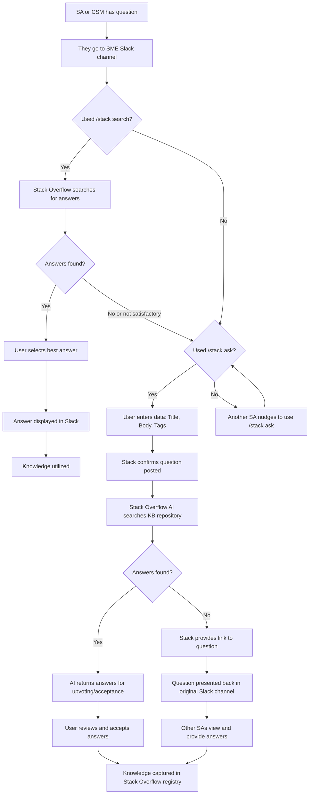

ここでは、質問する、回答する、ナレッジ記事／How-to ガイドを書く、Stack Overflow のコンテンツから GitLab Docs を改善する、といったプロセスを説明します。

## 質問する

Stack Overflow のトレーニングを参照してください。

- [Slack and Stack Overflow](https://fast.wistia.com/embed/channel/0dp7wdz6v5?wchannelid=0dp7wdz6v5&wmediaid=8enr7931re)
- [Questions and Answers](https://fast.wistia.com/embed/channel/0dp7wdz6v5?wchannelid=0dp7wdz6v5&wmediaid=9am7itotlg)
- [Overflow AI- Auto Answer in Slack](https://fast.wistia.com/embed/channel/0dp7wdz6v5?wchannelid=0dp7wdz6v5&wmediaid=4g33s9kaw2)
- [General User Enablement (Stack)](https://fast.wistia.com/embed/channel/0dp7wdz6v5?wchannelid=0dp7wdz6v5&wmediaid=susdknl5lj)

---

1. 質問のある人は[SME (Subject Matter Expert) Slack チャネル](/handbook/solutions-architects/sa-practices/subject-matter-experts/sme-operations/#sme-channels)のいずれかで質問してください。
1. 質問するには `/stack ask` プロンプトを使用します。
1. プロンプト `/slack ask` なしで質問された場合、別の SA や CSM が Slack で質問するように促すか、Slack 上のコンテンツを選択して Stack Overflow アプリで質問として作成できます。
   - TBD: 質問されたタイミングで Slack ボットを実行し、`/slack search` を起動して Stack の回答を Slack スレッドで提供することが可能です。
1. Stack Overflow が SA または CSM に必要なデータ (Title、Body、Tags) の入力を促します。
1. Stack が質問が投稿されたことを確認します。
1. Stack Overflow AI は Stack Overflow KB リポジトリを検索し、SA がアップボートまたは受諾するための回答を、元の質問のスレッドとして Slack に 1 つ以上返します。
1. SA または CSM が回答を受諾すると、元の質問のスレッドとして Slack に表示されます。
1. 回答が見つからなかった場合、Stack Overflow は Slack チャネルにリンクと元の質問を提示します。
1. 他の SA はリンクを確認し、StackOverflow で追加の回答を提供できます。
1. ナレッジは最終的に Stack Overflow レジストリにキャプチャされます。

---

## 回答を提供する

## 回答にアップボートする

## ナレッジ記事／How-to ガイド／ベストプラクティスを書く {#best-practices-guide}

Stack Overflow のトレーニングを参照してください。

- [Articles](https://fast.wistia.com/embed/channel/0dp7wdz6v5?wchannelid=0dp7wdz6v5&wmediaid=47gvmszf3o)

---

[SME プログラム](/handbook/solutions-architects/sa-practices/subject-matter-experts/)のゴールの 1 つは、アーキテクチャブループリント、ベストプラクティス、ナレッジガイドの提供と作成によって、SA と CSM の専門性を高めることです。

アーキテクチャブループリントとベストプラクティスには 2 種類の考慮事項があり (StackOverflow KB のフォーカスは 1 種類のみ):

1. **プラットフォームチーム／プロデューサー採用の考慮事項**: 通常、Professional Services や Support Engineer のフォーカスです。これには次が含まれます。

   - 大規模なデプロイメントアーキテクチャ／統合
   - 大規模な構成
   - デプロイメント／マイグレーション
   - 大規模な継続的マネジメント／管理
   - モニタリング、アラート、監査

   大規模デプロイメント（設定、マイグレーション、管理、モニタリング、ブレイクフィックス）に関するベストプラクティスは、Support Engineer によってまたは Support Engineer のために書かれることが多く、[Zendesk KB](/handbook/support/knowledge-base/#implementation) に存在します。

1. **コンシューマー採用／成熟度の考慮事項**: 通常、Customer Success、Solutions Architect、Professional Services のフォーカスです。これには次が含まれます。

   - 概念アーキテクチャ／設計／データフロー
   - サイジングおよびデプロイメント推奨への影響
   - 大規模な新規ユーザー、ビジネスユニット、Infra、App のオンボーディング
   - 大規模な採用管理
   - Infra、App、Platform のデコミッション
   - ユーザーオフボーディング
   - 価値メトリクス
   - モニタリング、オブザーバビリティ

   SME、CSE、PSE などには、特に Stack Overflow 上での大規模採用に関して、上記についてのベストプラクティスを作成することを推奨します。

## コレクションを作成する

Stack Overflow のトレーニングを参照してください。

- [Collections](https://fast.wistia.com/embed/channel/0dp7wdz6v5?wchannelid=0dp7wdz6v5&wmediaid=5iwkghxben)
- [Onboarding via Collections](https://fast.wistia.com/embed/channel/0dp7wdz6v5?wchannelid=0dp7wdz6v5&wmediaid=asfwdr24im)

---

コレクションは複数のタグにまたがるフォルダのようなものだと考えてください。

TBD: SME を様々な SME 領域にオンボーディングするためにコレクションを使いたいと考えています。

(適切なタグに基づいた) 推奨コレクションは以下の周辺になります。

- 各 SME 領域: AI、Dedicated、App Sec、Agile Planning、CICD、Metrics & Observation
- 各バーティカル: Financials、Embedded DevOps、Telecommunications

## 実践コミュニティ (Communities of Practices)

Stack Overflow のトレーニングを参照してください。

- [Communities)](https://fast.wistia.com/embed/channel/0dp7wdz6v5?wchannelid=0dp7wdz6v5&wmediaid=uufpib80x7)

---

(適切なタグに基づいた) 推奨される実践コミュニティは、以下のような製品フォーカスに沿ったものとするべきです。

- モダナイゼーション＆アナリティクス
- AI
- コア DevOps ワークフロー
- セキュリティ＆コンプライアンス
- プラットフォーム
- 競合
- 内部開発プラットフォーム
- プラットフォームエンジニアリング
